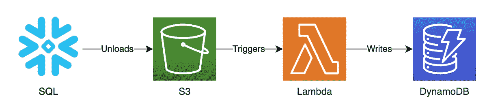
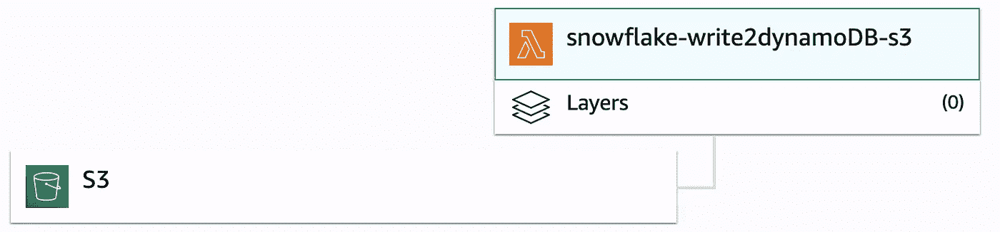

# 将数据从雪花同步到 DynamoDB

> 原文：<https://towardsdatascience.com/syncing-data-from-snowflake-to-dynamodb-e28363b6432?source=collection_archive---------40----------------------->

## 关于如何同步 DynamoDB 并用来自雪花的数据填充 dynamo db 以供实时应用程序使用的指南

图片来源: [TanteTati](https://pixabay.com/users/TanteTati-77004/) 来自 pixabay

在实现移动和 web 应用程序时，使用 NoSQL 服务作为数据存储是显而易见的。这是因为它能够以低延迟处理操作，并且对开发人员来说很直观。在众多 NoSQL 数据库中，完全托管的 AWS DynamoDB(键值)是最常用的高可伸缩性数据库之一。

在本文中，我将带您了解如何将 DynamoDB 与 Snowflake 的性能增强功能相集成，以弥合低延迟数据存储和繁重复杂的数据计算之间的差距。

# 为什么要连接 DynamoDB 和雪花

如果您以前使用过 NoSQL 数据存储，您会知道它的主要用途是存储和接收数据，而不是运行分析计算。然而，在数据驱动的应用程序中，总是有分析的元素。

给定一个*“省钱”*类型应用程序的典型场景，当客户本月的非公用事业支出比过去 12 个月的平均支出多 20%时，您可能想要提醒客户。要执行此操作，您可能需要:

1.  合计本月非公用事业项目的支出
2.  计算过去 12 个月的非公用事业支出，并取平均值
3.  找出这个月的花费和过去 12 个月的平均花费之间的百分比差异
4.  比较客户本月消费百分比差异是否大于 20%

从这里，你将需要客户，他们在过去 12 个月的支出，支出分类器，和一堆计算。这都是 DynamoDB 不擅长的事情，但雪花却非常擅长。

# 集成雪花和 DynamoDB

有一些集成或 EL 工具可以让您将 DynamoDB 加载到 Snowflake，但没有多少其他方法可以让您使用分析来驱动前端应用程序。

我想给你看一些我整理的东西，这些东西对我正在做的一个项目非常有用。最棒的是，它是一种无服务器和事件驱动的方法。

1.  雪花将数据卸载到 S3，无论是手动卸载、使用编排工具还是创建雪花任务。
2.  一旦数据放到 S3 上，就会触发一个 Lambda 来读取文件并放入 DynamoDB。

## 从雪花到 S3 卸货

出于演示的目的，我已经将 2020 年 5 月的墨尔本停车场传感器数据加载到 Snowflake 上，以显示摄取量。

我将所有停车传感器数据卸载到 snowflake-drop2dynamodb S3 桶中，该桶包含大约 170 万行数据。请注意，我为 DynamoDB 表的“id”字段创建了一个散列，因为我没有惟一的标识符。COPY INTO 语句将创建文件块，最大大小为 10mb。对于每个数据块，Lambda 将被调用以接收到 DynamoDB 中(不保证顺序)。

## 使用 Lambda 将雪花提取物插入 DynamoDB

一旦 Snowfload 中的 CSV 文件被卸载到 S3 存储桶中，执行超时为 1 分钟的 Lambda 就开始将文件加载到 DynamoDB 表上。它的建立受到了 AWS 演示的启发。python 函数不会将任何数据加载到内存中，到目前为止，这显示了有希望的结果。

# 结论

通过使用支持触发器的 S3 和 Lambda，您可以轻松地在 Snowflake 和 DynamoDB 之间构建一个集成管道。这允许您按需或按计划将 DynamoDB 与来自雪花的数据同步。这样，您可以添加或更新属性，同步 DynamoDB 的在线 ML 要素存储和性能批处理计算。

由于我面临的一些挑战，我想实施一些改进，包括:

1.  能够将失败放在一边重新处理，并将完成的文件移动到另一个文件夹/桶。
2.  即使 S3 保证至少一次交付，我还是想在上面建立一个审计表，由雪花函数提供支持。
3.  采用事件驱动的编排方法来提高可靠性和持久性。

希望这篇文章对你有用！

# 关于我

> 我一直在帮助企业在生产 AI/ML、数据工程、无服务器和容器领域构建可扩展的云和数据解决方案，并且对前端开发越来越感兴趣。你可以在 [LinkedIn](https://www.linkedin.com/in/cyamma/) 上和我联系聊天——只要告诉我你来自 Medium。