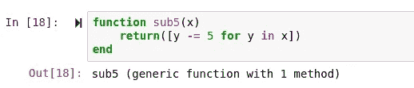
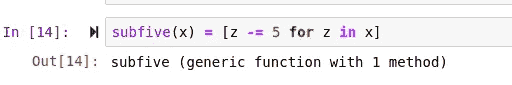
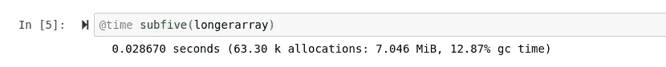
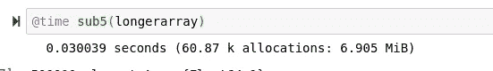
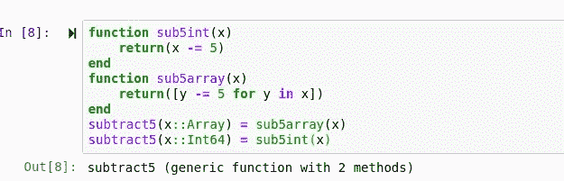
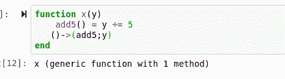
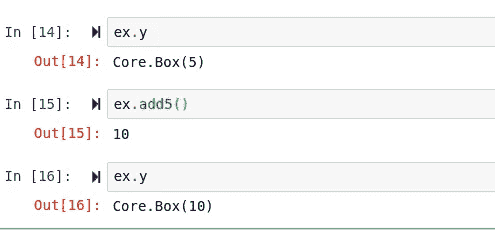
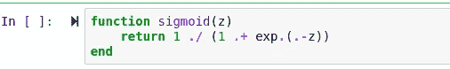
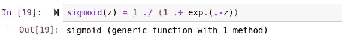

# 语法表达超赞！

> 原文：<https://towardsdatascience.com/syntactical-expressions-are-awesome-dc9ba5f25911?source=collection_archive---------42----------------------->

## 利用朱莉娅语法的力量来断言任何事情。

在 Julia 中，你可以用许多不同的方法来解决任何你想用语法解决的问题。虽然大多数语言可能会限制你做某些事情的方式，但 Julia 倾向于给程序员一个玩具盒，并说

> “玩得开心！”

这使得 Julia 内部有了一些非常有趣的表达式，对于内联编程非常有用。在这些有趣的表达式中包含了调度行和鸭子打字，这在我之前的[文章](/turn-julia-into-python-and-duck-type-in-a-statically-typed-language-119f708936ff)中已经讨论过了。然而，我想提醒你，Julia 程序员还有另外一个很棒的工具:

> 语法表达。

尽管它们的名字可能有点误导，听起来也相对标准，但它们绝对不是。Julia 中的语法表达式是这种语言的基本方法的一部分，它使这种语言更容易输入，特别是在 Julia 中所有的东西都放在一个方法中。你可能会惊讶地发现，Julia 的调度和面向对象编程技巧都是语法表达式的极致。

# 第一部分:断言

Julia 中的语法表达式使用断言操作数，更好的说法是等号。在 Julia 中，这个操作数变得更加有用，因为它可以与函数、逻辑和变量配对。考虑一下我写的这个减去 5 的函数:

虽然这个函数相对简洁，但我们可以在任何时候使用语法表达式来应用逻辑，而不是在一行而不是三行中使用函数，根本不必正确定义函数。正如我简单提到的，在断言操作数的另一端，我们也可以放置逻辑，这将为我们定义一个新的函数。

第二个例子不仅在编写方式上更胜一筹，而且在性能上也有所提升！

虽然最小性能提升可能在误差范围内，但它似乎是相对一致的。在三分之一的行中使用相同的逻辑无疑是可读性的一大进步。然而，正如我所说的；这仅仅是我们在语法表达方面的一长串能力的开始。

# 第二部分:用途

所有 Julia 程序员可能知道的第一个也是最明显的用途是使用语法表达式将 Julia 类型分派给不同的函数。我们可以将该系统应用于我们的减五函数，例如:

现在我们有一个函数来处理从一个整数中减去 5，以及从一个数组中减去 5。多亏了语法表达式，我们可以根据通过该方法传递的变量类型，在同一个方法下分派这两种类型。这是语法表达式的一个非常实用的用法，在 Julia 语言中非常常用。

然而，在 Julia 语言中不常用的是鸭子打字。使用语法表达式，我们实际上可以操纵 Julia 语言，通过创建语法方法，然后将它们断言为类型的子类型，使其更像面向对象的编程语言。

我们可以像在类似的面向对象编程语言中一样使用这些方法:

但用途不止于此。让我们暂时回想一下我们的根源，并思考这如何应用于机器学习。当然，经常有内嵌的统计可以做，但我认为将这个概念实际应用到模型的一个很好的例子是 sigmoid 或 relu。考虑这个 sigmoid 函数:

虽然这个函数确实很好，而且足够简洁，可以让你得到这份工作，但我认为，如果再用一个语法表达式来描述它，会比常规函数更让雇主着迷:

# 结论

语法表达式无疑是 Julian 编程中最重要的特性之一。他们不仅使语言变得难以置信的有表现力和简单明了，他们还通过对一个操作数的一些额外使用完全形成了他们自己的方法，这在我看来很酷。语法表达式是 Julia 多范例灵活性背后的驱动力，并为该语言提供了几个有时甚至不通用的关键概念。总的来说，这种语法无疑是我在 Julia 编程语言中的一大优势。