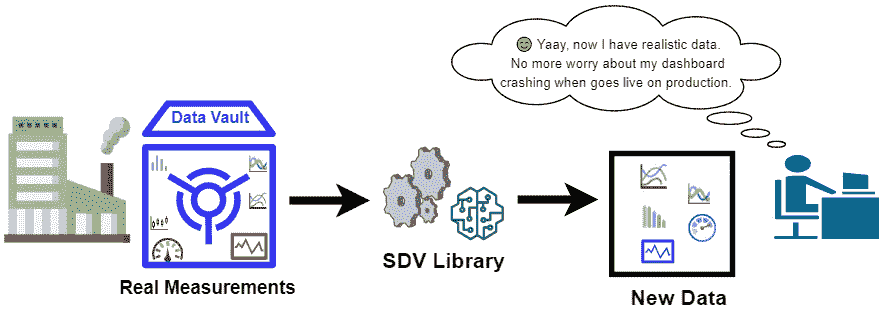

# 合成数据仓库(SDV):用于数据集建模的 Python 库

> 原文：<https://towardsdatascience.com/synthetic-data-vault-sdv-a-python-library-for-dataset-modeling-b48c406e7398?source=collection_archive---------12----------------------->

## Python 库

## 使用统计和机器学习模型生成复杂数据集的工具

作者图片

在数据科学中，你通常需要一个真实的数据集来测试你的概念证明。创建捕捉实际数据行为的假数据有时可能是一项相当棘手的任务。几个 python 包试图完成这项任务。很少流行的 python 包是[**Faker**](https://github.com/joke2k/faker/)[**拟态**](https://github.com/lk-geimfari/mimesis) 。然而，主要是生成简单的数据，如生成姓名、地址、电子邮件、*等*。

要创建捕捉复杂数据集属性的数据，比如以某种方式捕捉实际数据的统计属性的时间序列，我们将需要一个使用不同方法生成数据的工具。[Synthetic Data Vault(SDV)](https://sdv.dev/)python 库是一个使用统计和机器学习模型对复杂数据集进行建模的工具。这个工具可以成为任何从事数据和建模工作的人的工具箱中的一个很好的新工具。

# 为什么是这个图书馆？

我对这个工具感兴趣的主要原因是为了*系统测试*:拥有从相同的实际底层过程生成的数据集要好得多。这样我们可以在现实的场景中测试我们的工作/模型，而不是有不现实的案例。我们需要合成数据还有其他原因，如*数据理解、数据压缩、数据扩充*和*数据隐私*【1】。

在论文“ [The Synthetic data vault](https://dai.lids.mit.edu/wp-content/uploads/2018/03/SDV.pdf) ”中首次介绍了[Synthetic Data Vault(SDV)】](https://sdv.dev/)，然后在 Neha Patki 的硕士论文“[The Synthetic Data Vault:Generative Modeling for Relational Databases](https://dspace.mit.edu/handle/1721.1/109616)”中将其用于生成建模的上下文中。最后，SDV 图书馆是作为 Andrew Montanez 的硕士论文“ [SDV:用于合成数据生成的开源图书馆](https://dai.lids.mit.edu/wp-content/uploads/2018/12/Andrew_MEng.pdf)”的一部分开发的。另一篇给 SDV 增加新功能的硕士论文是由徐磊完成的([使用条件 GAN](https://dai.lids.mit.edu/wp-content/uploads/2020/02/Lei_SMThesis_neo.pdf) 合成表格数据)。

所有这些工作和研究都是在麻省理工学院信息与决策系统实验室(LIDS，MIT)首席研究科学家 Kalyan Veeramachaneni 的监督下在麻省理工学院数据到人工智能实验室完成的。

我带来 SDV 历史的原因是为了欣赏这座图书馆背后的大量工作和研究。一篇关于使用这个工具的潜力的有趣文章，特别是在数据隐私方面，可以在[这里](https://news.mit.edu/2020/real-promise-synthetic-data-1016)找到。

# SDV 图书馆

该库的工作流程如下所示。用户提供数据和模式，然后使模型适合数据。最后，从拟合的模型中获得新的合成数据[2]。此外，SDV 图书馆允许用户保存适合的模型(`model.save("model.pkl")`)以备将来使用。

SDV 工作流程(转载自[2])

# 基于 PAR 的时间序列数据建模

概率自回归(PAR)模型用于对多类型多元时间序列数据建模。SDV 图书馆在`PAR`类中实现了这个模型(来自时序模块)。

让我们设计一个例子来解释`PAR`类的不同论点。我们将研究多个城市的温度时间序列。数据集将有以下几列:*日期*，*城市*，*测量装置*，*地点，噪音*。

在`PAR`中，数据集中考虑了四种类型的列。

1.  **序列索引**:这是具有行相关性的数据列(应该像日期时间或数值那样排序)。在时间序列中，这通常是时间轴。在我们的例子中，序列索引将是日期*列。*
2.  **实体列**:这些列是形成测量组的抽象实体，其中每个组是一个时间序列(因此每个组中的行应该被排序)。但是，不同实体的行是相互独立的。在我们的示例中，实体列将只是城市列。顺便说一下，我们可以有更多的列，因为参数类型应该是一个列表。
3.  **上下文栏**:这些栏提供关于时间序列实体的信息，不会随时间而改变。换句话说，上下文列在组中应该是恒定的。在我们的示例中，*测量设备*和*，其中*是上下文列。
4.  **数据列**:不属于上述类别的任何其他列都将被视为数据列。PAR 类没有用于分配数据列的参数。因此，未列在前面三个类别中的其余列将自动被视为数据列。在我们的例子中，*噪声*列是数据列。

# 示例代码

## 示例 1:单一时间序列(一个实体)

时序的 PAR 模型在`sdv.timeseries`模块的`PAR()`类中实现。如果我们想要对单个时间序列数据建模，那么我们只需要将`PAR()`类的`sequence_index`参数设置为 datetime 列(说明时间序列顺序的列)。神奇发生在第 8-16 行！

## 示例 2:具有多个实体的时间序列

SDV 能够拥有多个实体，即多个时间序列。在我们的例子中，我们有多个城市的温度测量值。换句话说，每个城市都有一组将被独立处理的测量值。

使用 PAR 模型的时间序列建模的详细示例可在[这里](https://sdv.dev/SDV/user_guides/timeseries/par.html)找到。

# 关系数据

在您使用`sdv.Metadata()`指定数据模式之后，SDV 可以通过生成数据来对关系数据集建模。此外，您可以使用库内置函数绘制[实体关系(er)图](https://www.guru99.com/er-diagram-tutorial-dbms.html)。元数据准备就绪后，可以使用分层建模算法生成新数据。你可以在这里找到更多信息。

# 单表数据

SDV 还可以对单个表数据集进行建模。它使用的统计和深度学习模型是:

*   一个[高斯连接函数](https://sdv.dev/SDV/user_guides/single_table/gaussian_copula.html#gaussian-copula)用于模拟多元分布，以及
*   生成式对抗网络(GAN)对表格数据进行建模(基于论文[“使用条件 GAN 对表格数据进行建模”](https://arxiv.org/abs/1907.00503)更多信息请参见[此处](https://sdv.dev/SDV/user_guides/single_table/index.html)。

# 基准数据

SDV 库提供了使用 [SDGym 库](https://github.com/sdv-dev/SDGym)对合成数据发生器进行基准测试的能力，以评估合成器的性能。你可以在这里找到更多[的信息。](https://sdv.dev/SDV/user_guides/benchmarking/single_table.html)

# 结论

在这篇文章中，我们回顾了 SDV 图书馆的主要功能，以及它在基于真实数据生成匿名数据集方面的作用。主要特点是建模单表数据，时间序列，关系数据集，以及数据基准。这里要提到的一点是，您需要为 SDV 模型提供一个大型数据集来进行训练。这样，模型可以生成一个有意义的数据集，真正捕捉真实的过程。试试这个库，让我知道你的想法。

*你可以在这里* *找到这篇文章的笔记本* [*。*](https://github.com/e-alizadeh/medium/blob/master/notebooks/SDV/SDV.ipynb)

感谢阅读！

*如果你喜欢这个帖子，你可以* [*在这里加入我的邮件列表*](https://www.ealizadeh.com/subscribe/) *来接收更多关于数据科学、机器学习、统计以及有趣的 Python 库和技巧&技巧的帖子。也可以在我的* [*网站*](https://ealizadeh.com/) *、* [*中*](https://medium.com/@ealizadeh) *，或者*[*LinkedIn*](https://www.linkedin.com/in/alizadehesmaeil/)*关注我。*

# 参考

[1]徐磊，[利用条件 GAN 综合表格数据](https://dai.lids.mit.edu/wp-content/uploads/2020/02/Lei_SMThesis_neo.pdf)，(2020)，麻省理工学院硕士论文

[2] N. Patki *等人*，[合成数据仓库](https://dai.lids.mit.edu/wp-content/uploads/2018/03/SDV.pdf) (2016)，数据科学和高级分析国际会议(DSAA-16)

[3]麻省理工学院新闻，[合成数据的真正前景](https://news.mit.edu/2020/real-promise-synthetic-data-1016) (Ocotber 16，2020)

*最初发表于*[*https://www.ealizadeh.com*](https://www.ealizadeh.com/blog/sdv-library-for-modeling-datasets/)