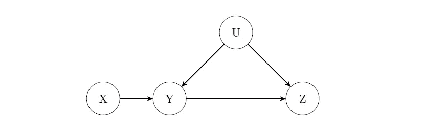
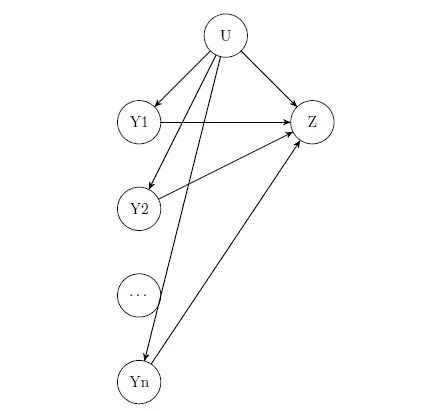
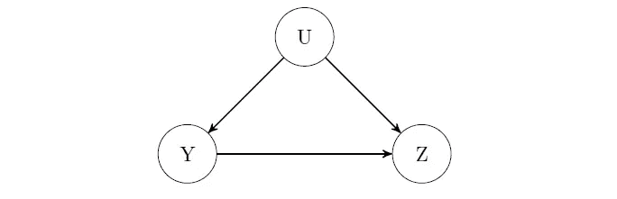
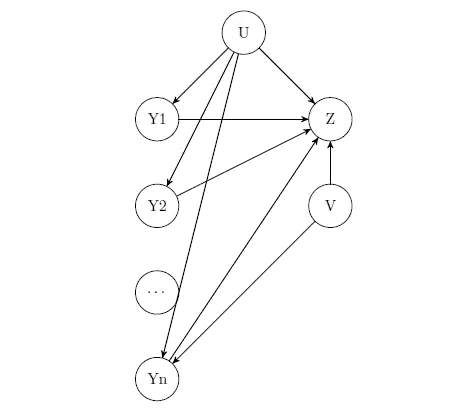
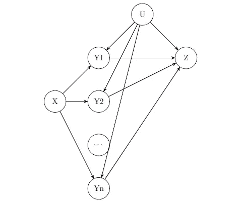

# 合成工具变量

> 原文：<https://towardsdatascience.com/synthetic-instrumental-variables-968b12f68772?source=collection_archive---------35----------------------->

## 具有不可测混杂因素的因果推断

我喜欢能让你走的报纸”这在事后看来是显而易见的。为什么以前没人尝试过？”一些 NLP 的人对变形金刚做了这样的评论(“[注意力是你所需要的全部](https://arxiv.org/pdf/1706.03762.pdf)”)。对我来说，“[多重原因的祝福](https://arxiv.org/pdf/1805.06826.pdf)”唤起了类似的感觉:为什么人们没有创造合成乐器？

# 先决条件

本文假设对因果 Dag 和因果推理有基本的了解。如果你对这些术语不熟悉，请阅读[我之前关于因果关系的文章](/beyond-a-b-testing-primer-on-causal-inference-d8e462d90a0b)的后三分之一，以获得简要概述。

此外，虽然有许多方法可以创建合成工具，但本文使用概率 PCA，因为它是最通用的方法之一。如果你对 PCA 不太了解，建议看一下这篇[精彩直观的讲解](https://stats.stackexchange.com/questions/2691/making-sense-of-principal-component-analysis-eigenvectors-eigenvalues)。

# 什么是乐器？

[工具变量](https://en.wikipedia.org/wiki/Instrumental_variables_estimation)由来已久，可以说是计量经济学的中坚力量之一。我们关心的是这个 DAG:

u 是一个未观察到的混杂因素。我们要估计 Y 对 Z 的因果作用，Y → Z，通过这个 DAG，我们可以估计 X → Y 和 X → Z，假设线性，我们有 X → Z = (X → Y) (Y → Z)，我们可以代数求解 Y → Z。

在这个设置中，我们称 X 为工具变量，如果:

*   x 与 Y 强相关(强第一阶段)
*   x 仅通过 Y 影响 Z(排除限制)

在实践中，找到一种工具是困难的。如果 X 与 Y 仅弱相关，那么因果效应估计可能会严重偏差。第二个条件无法测试或验证，所以我们只能争论假设的合理性，比如“蛋黄酱是一种工具吗？”

图片由[玛丽亚·波尔娜](https://pxhere.com/en/photo/1620864)

创新要求我们重新思考现有的方法。聪明之处在于:

> 如果寻找乐器很难，为什么不创造乐器呢？

# 问题设置

原论文标题为“[多重因缘的祝福](https://arxiv.org/pdf/1805.06826.pdf)”，因为多重因缘是创造我们自己的工具的必要条件。DAG 看起来有点像:

我们希望在存在共享的未观察到的混杂因素 u 的情况下，推断每个 Y 对 Z 的因果影响。可以将 Y 视为回归模型中的列名和预测值。我们假设没有干扰，没有互动——这当然过于简单，但很实用。

这个 DAG 看起来是限制性的，但是对于许多现实世界的过程来说，它是足够合理的(参考本文中的例子)。更重要的是，与直觉相反，这个问题比单一案例要简单得多:

这个“更简单”的 DAG 是不可能求解的。我们无法对因果关系做出无偏见的估计。

此外，这个问题假设没有未被观察到的单一原因混杂因素。未观察到的 V 的存在会打乱我们的估计:

然而，正如论文指出的，假设不存在这样的 V 是一个比不可忽略更令人舒服的假设。大多数使用协变量调整的因果分析假设我们根本没有不可测量的混杂因素。这里我们假设*一些*不可测量的常见混杂因素，只是没有不可测量的单一原因混杂因素。

# 创建工具

现在我们将看到为什么多重因果关系是必要的。我们希望创建一个通用的仪器 X。这个 X 是一个局部变量，即每个观测值都有一个唯一的 X 向量(稍后将详细介绍)。

例如，我们可以拟合 PCA 并选择前几个主成分作为我们的 x。通过构造，排除限制得到满足，因为 PCA 不使用 z。我们不必为这一假设争论不休。

然而，如果使用整个数据集来训练 PCA，我们不知道 X 是否是好的工具。我们可以从随机噪声中获得主要成分，但 X 不能很好地预测 Y。此外，重新使用 Y 来估计仪器和因果效应在哲学上是有问题的，并将导致过度拟合。

一种思路是将数据集一分为二，在一半上使用 PCA，在另一半上执行推理。这导致了一个死胡同。对于看不见的数据(后半部分)，我们对每个观察值的最佳猜测是 X =零向量，这简化为 OLS 回归。找出新方法的全部意义在于，我们知道 OLS 是行不通的。

本文通过删除每个观察值的随机 Y 来解决这个问题(比如说，一半)。经典 PCA 不能处理缺失值。概率主成分分析(PPCA)，它的贝叶斯对应物，可以很好地处理缺失值。

PCA 使用 y = Wx 对每个观察值的 y 向量进行建模，其中 W 是权重矩阵，x 是潜在变量的向量。PPCA 假设存在高斯误差项ε，使得 y = Wx + ε。生成模型:

当σ → 0 时，我们得到 PCA。如果我们用允许对角线值变化的对角矩阵代替σ I，我们得到[因子分析](https://en.wikipedia.org/wiki/Factor_analysis)。

所以:

*   我们可以使用 y 的一半来估计每个观测值的潜在向量 X。通过构造，X 满足排除限制。
*   我们可以用删除的一半来评估 X 的预测性能。换句话说，给定观察到的一半，我们能预测删除的一半吗？我们可以测试一个强大的第一阶段。

如果 X 具有良好的预测性能，那么我们有一个从 Y 综合创建的**有效的**工具(具体来说，在 PPCA 的情况下，残差是工具)。或者，由于 X 的概率性质，我们可以使用[广义倾向得分](https://www.math.mcgill.ca/dstephens/SISCER2020/Articles/HIrano-Imbens-2004.pdf)来拟合潜在的结果模型，并获得因果效应估计。

# 结束语

这听起来好得难以置信吗？也许吧。但是合成控制也有代价:偏差-方差权衡[。](https://en.wikipedia.org/wiki/Bias%E2%80%93variance_tradeoff)

创建合成仪器的贝叶斯模型具有其自身的估计不确定性，因此在消除偏差的同时增加了方差。作者建议遵循[奥卡姆剃刀](https://en.wikipedia.org/wiki/Occam%27s_razor)。在 PPCA 的情况下，每个额外的主成分都会增加方差，因此我们希望保留最少数量的成分，但仍能产生“良好”的预测性能。

虽然本文使用了 PPCA，但是只要潜在变量模型能够处理缺失值，它们通常就能工作。例如，PPCA 不适用于计数数据，因为它假设高斯误差。