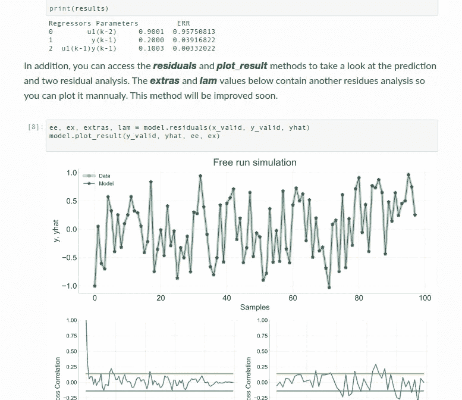

# SysIdentPy:一个用于非线性动态数据建模的 Python 包

> 原文：<https://towardsdatascience.com/sysidentpy-a-python-package-for-modeling-nonlinear-dynamical-data-f21fa3445a3c?source=collection_archive---------33----------------------->

## SysIdentPy 是一个用 Python 构建 NARMAX 模型的工具

数学模型在科学和工程中起着关键作用。我们看到研究人员和数据驱动的专业人士使用许多不同的模型来分析和预测负荷需求、现金需求、股票交易数据、生物医学数据、化学过程等等。

当数据是动力系统的结果时，自回归模型通常是进一步检验的安全选择。在这方面，ARMAX(具有移动平均和外生输入的自回归模型)模型及其变体(ARX、ARMA、ARIMA 等。)是使用最多的模型类之一。然而，前述模型对于线性数据工作良好，因为它们是线性模型。这就是 **SysIdentPy** 的用武之地:一个用于非线性动力系统的 python 包。

# 动机

系统本质上是非线性的。有人可能会说，在大多数情况下，线性近似效果很好，你不需要非线性模型…我非常同意。但是，如果想要获得一个动态的非线性模型呢？嗯，你可以用**系统识别**来做！

# 系统识别

**SysIdentPy** 是一个使用 NARMAX 模型(具有移动平均和外生输入的非线性自回归模型)进行系统识别的开源软件包，由我与我的朋友 [Luan Pascoal](https://www.linkedin.com/in/luan-pascoal-74527412b) 、Samuel Oliveira 和 [Samir Martins](https://www.linkedin.com/in/samir-martins-685b62198) 合作开发。

NARMAX 模型是 ARMAX 族的推广。然而，NARMAX 模型不是 ARMAX 模型的简单扩展，它能够描述许多不同的复杂非线性系统。

目标是成为一个友好的用户和强大的工具。只需几行代码，您就可以构建一个 NARMAX 模型。下面的代码显示了如何使用该库的一个简单示例:加载样本数据、设置模型参数、拟合和预测模型、显示模型细节以及绘制两个残差测试的结果。很简单，对吧？

```
**from** sysidentpy.polynomial_basis **import** PolynomialNarmax
**from** sysidentpy.metrics **import** root_relative_squared_error
**from** sysidentpy.utils.generate_data **import** get_miso_data, get_siso_datax_train, x_valid, y_train, y_valid **=** get_siso_data(n**=**1000,
                                                   colored_noise**=False**,
                                                   sigma**=**0.001,
                                                   train_percentage**=**90)model **=** PolynomialNarmax(non_degree**=**2,
                         order_selection**=True**,
                         n_info_values**=**10,
                         extended_least_squares**=False**,
                         ylag**=**2, xlag**=**2,
                         info_criteria**=**'aic',
                         estimator**=**'least_squares',
                         )model**.**fit(x_train, y_train)
yhat **=** model**.**predict(x_valid, y_valid)
rrse **=** root_relative_squared_error(y_valid, yhat)
print(rrse)
results **=** pd**.**DataFrame(model**.**results(err_precision**=**8,
                                     dtype**=**'dec'),
                       columns**=**['Regressors', 'Parameters', 'ERR'])

print(results)ee, ex, extras, lam **=** model**.**residuals(x_valid, y_valid, yhat)
model**.**plot_result(y_valid, yhat, ee, ex)
```



系统标识的默认输出

您可以使用以下命令安装 SysIdentPy

```
pip install sysidentpy
```

到目前为止，我们已经实现了几个关于 NARMAX 模型的传统算法。下面列出了其中的一些方法:

*   正向回归正交最小二乘法
*   误差减少率
*   户主反映
*   扩展最小二乘法
*   普通最小二乘法
*   总体最小二乘法
*   递归最小二乘法
*   最小均方误差(和许多变体)
*   赤池信息标准
*   贝叶斯信息标准
*   最终预测误差
*   更多

读者可参考官方文档和知识库了解更多详情:

 [## 欢迎使用 sysidentpy 的文档！-系统识别

### 该项目是由威尔逊 R. L .朱尼尔，栾帕斯科尔 c .安德拉德和萨米尔 A. M .马丁斯在 1995 年开始的，作为一个项目…

wilsonrljr.github.io](https://wilsonrljr.github.io/sysidentpy/index.html) [](https://github.com/wilsonrljr/sysidentpy) [## wilsonrljr/系统识别

### sysidentpy 是一个 Python 模块，使用构建在 numpy 之上的 NARMAX 模型进行系统识别，并且是分布式的…

github.com](https://github.com/wilsonrljr/sysidentpy) 

许多附加功能已经在开发中。很高兴能与你们所有人合作，使图书馆越来越完整。

欢迎在 Linkedin 或 Discord (wilsonrljr#3777)上联系我。此外，我们有一个 Discord 服务器来讨论 SysIdentpy(问题、贡献等等)。你可以在这里加入我们的不和谐。