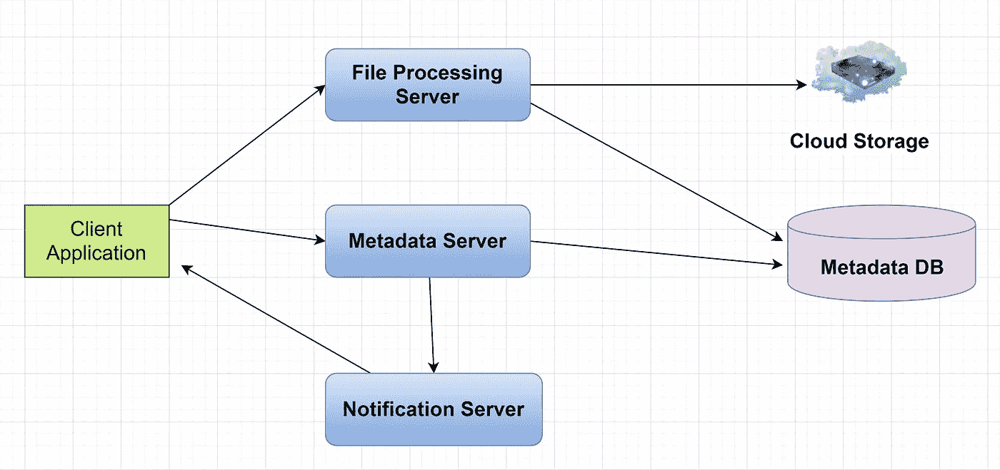

# 系统设计 101

> 原文：<https://towardsdatascience.com/system-design-101-b8f15162ef7c?source=collection_archive---------2----------------------->

## [入门](https://towardsdatascience.com/tagged/getting-started)

## 设计系统的逐步指南

照片由[乔纳森·辛格](https://unsplash.com/@jbsinger1970?utm_source=medium&utm_medium=referral)在 [Unsplash](https://unsplash.com?utm_source=medium&utm_medium=referral) 上拍摄

现在，系统设计面试是顶级科技公司流程的一部分。许多人害怕系统设计面试，因为没有一定的模式来准备。此外，系统设计问题是开放式的，没有标准的对错答案，这使得准备过程更加困难。

系统设计是软件工程中 ***最重要也是最令人畏惧的*** 方面。一个主要原因是每个人似乎都有不同的方法；没有明确的循序渐进的指导方针。

软件工程师与系统设计的斗争可以分为两个部分:

*   系统设计过程本质上是非结构化的；没有合适的答案来说二元对错。
*   软件开发人员缺乏开发复杂和大规模系统的经验。

在这篇文章中，我们将逐步解决一个设计问题。这个指南可以帮助你设计一个系统。这个是根据我学习建筑课程的经验。

## ★第一步:需求澄清

我们需要明确系统的目标。 ***系统设计就是这样一个浩瀚的话题；如果不把它缩小到一个具体的目标，设计系统就会变得复杂，尤其是对于新手。*** 有时候约束对系统是有好处的。这有助于将注意力集中在你试图设计的主要特征上。它澄清了关于系统功能的模糊之处。*我们可以将这些需求分为两部分:*

*   **功能需求:**

这是系统必须交付的需求。我们可以说它是系统的主要目标。在这里，功能被描述为输出和输入之间的行为规范。什么是系统输入，什么是输出，这些要求中应该明确。

*   **非功能性需求:**

现在是需要分析的更重要的需求。如果我们不满足这个要求，它将对项目的商业计划有害。这些需求通过不同的系统质量来限制系统设计。

性能、可修改性、可用性、可伸缩性、可靠性等。是系统设计中重要的质量要求。这些‘能力’是我们分析一个系统并确定我们的系统设计是否恰当所需要的。

## ★第二步:重要零件的估算

系统设计的重点之一是了解系统的规模。当你在设计一个系统时，规模实际上意味着什么？文章浏览量，每秒生成时间轴的次数等。可以测量系统的规模。如果系统的测量值非常大，那么它们就是大规模系统。

另一个重要的估计是关于存储。我们需要知道系统需要多少存储，比如说 5 年。只能增加，但是你需要有一个估计。它将给出数据存储的方向。

在 URL 缩短服务的系统设计中，您可能会看到这样的计算:

> 让我们假设，系统将所有的 URL 缩短请求和它们的缩短链接存储了 5 年。由于我们预计每个月会有 5 亿个新的 URL，我们预计存储的对象总数将是 500 M * (5 * 12)个月= 30 B。现在让我们假设每个存储的对象大约为 100 字节。我们将需要 300 亿* 100 字节= 3 TB 的总存储容量。

因此，您知道需要多少存储空间。你开始向一个方向流动。

**网络带宽使用率也是一个重要因素。**在分布式系统中，带宽使用管理至关重要。例如，如果您想要有效地处理文件传输，您可能需要将文件分成多个块。

图:只传输更新的块(图片由[作者](https://medium.com/@ashchk)提供)

如果我们在每次更新时都传输整个文件，如果文件大小为 100MB，我们可能需要每次传输 100MB 的文件。例如，我们将文件划分为 2MB 的块，并且只传输文件中修改过的部分，如图所示。这将减少用户的带宽消耗和云存储。

## ★第三步:数据流

我们需要定义系统的数据模型，以及数据如何在不同的系统组件之间流动。我们需要弄清楚系统的实体和数据管理的不同方面。

*对于系统设计新手，请记住，“如果你对系统设计从哪里开始感到困惑，请尝试从数据流开始。”*

以下是类似于 [Medium](https://medium.com/u/504c7870fdb6?source=post_page-----b8f15162ef7c--------------------------------) 的服务的一些实体:

> **用户:**用户名，姓名，邮箱等。
> 
> **文章:**文章 ID，文章内容，时间戳，圈数等。
> 
> **用户跟随:**用户标识 1，用户标识 2
> 
> **关注者:**用户标识 3，用户标识 4

数据库系统选择是本节的一部分。NoSQL 或 SQL 数据库选择是一个常见的场景。另一方面，我们可能需要决定为照片和视频选择哪种存储方式。

## ★第四步:高层组件设计

如果我们试图一步到位地设计系统，这是一项艰巨的任务。所以，还是把它们当做高级组件来破比较好。然后，将这些组件分解成详细的设计。

试着画一个框图，用 5-6 个部分代表我们系统的核心组件。如果系统太大，它可以更多。对于我们可以将系统分成多少个部分，没有确定的规则。请记住，我们需要识别足够的组件来帮助解决系统的实际问题。

这里有一个设计文件存储和同步服务的高级图，比如 Google Drive。

图:Google Drive 的高层设计(图片由作者提供)

文件处理服务器将管理文件处理工作流。元数据服务器将处理文件信息、块大小和用户信息。通知服务器将让客户端应用程序知道将文件更新到客户端登录的所有其他设备。云存储将保存文件。

然后，我们可以根据系统需求分解这些组件，进行进一步的详细设计。

## ★第五步:详细设计

对于最后一步，我们需要更深入地挖掘对实现系统质量需求很重要的主要组件。

在这一步，我们可以分析解决问题的不同方法、它们的优缺点，并解释为什么我们更喜欢一种方法。权衡分析是这一部分的重要部分。这里可能有一些例子:

由于我们需要存储大量的数据，我们可能需要对数据进行分区，以分布到多个数据库。可能会有一个名人资料的问题，我们将如何处理这样的用户有很多追随者。

我们需要缓存多少数据来加快系统响应时间。我们应该在哪里使用负载均衡器，等等。？

下面是一个像 Google drive 这样的云文件存储服务的详细设计的例子。

图:[Google drive](/system-design-analysis-of-google-drive-ca3408f22ed3?source=friends_link&sk=44e2954bb58af4164b3eabcbf9e5f274)的系统设计(图片由[作者](https://medium.com/@ashchk))

## ★第六步:识别瓶颈并解决它们

现在，我们有了系统的详细设计。我们必须找到系统的瓶颈，并找到不同的方法来缓解它们。例如:

*   如果我们的系统中有任何**单点故障**，我们需要移除它们。这可能会导致[可用性](/availability-in-distributed-systems-adb43df78b9a?source=friends_link&sk=773392e4be39c667162ba9a757cf8fd1)问题，这是一个很大的问题。

作者图片

*   我们需要有足够的数据副本，以便在我们失去几台服务器时仍能为我们的用户服务。如果没有数据的副本，并且由于某种原因，数据丢失，则系统没有该数据。该系统将有可靠性问题。
*   类似地，我们需要运行足够多的不同服务的副本，以便少数故障不会导致系统完全关闭。

## 结论:

上面提到的步骤并不是设计系统的唯一方法。这是给刚接触系统设计的初学者的简化指南。为新手设计一个系统是非常困难的。本指南让您保持正确的方向，不要迷失在系统设计的潜在问题和解决方案的海洋中。

系统设计是一个如此广阔的话题；如果没有设定具体的目标，那么设计系统就会变得很有挑战性，尤其是对于新手来说。

尽量详细说明系统的要求。然后，找到数据模型和数据流。并且在一个高层次的设计之后，如果需要的话，不要犹豫添加组件。最重要的是，试着关注解决方案的权衡分析。祝你好运！！

感谢您阅读文章。**祝你今天愉快**🙂

> *本文是初学者系统设计系列的一部分。下面给出了一些文章链接:*
> 
> [**设计限速器**](/designing-a-rate-limiter-6351bd8762c6)
> 
> [**系统设计基础:缓存入门**](/system-design-basics-getting-started-with-caching-c2c3e934064a?sk=dd4e6d96a768481d68e3b0bd80227f1f)
> 
> [**系统设计基础:客户端-服务器架构**](/system-design-basics-getting-started-with-the-client-server-architecture-b02f9c9daae8?sk=d186470a4df5355b9f405010e8c4150e)
> 
> [**系统设计基础知识:负载平衡器 101**](https://codeburst.io/system-design-basics-load-balancer-101-adc4f602d08f)
> 
> [**谷歌自动建议服务的系统设计**](https://codeburst.io/system-design-analysis-for-auto-suggestion-service-d28bf1701658)
> 
> [**谷歌驱动**](/system-design-analysis-of-google-drive-ca3408f22ed3) 系统设计分析
> 
> [**TinyURL**系统设计分析](/system-design-of-url-shortening-service-b325b18c8f88)
> 
> [**分布式系统中的可用性**](/availability-in-distributed-systems-adb43df78b9a)