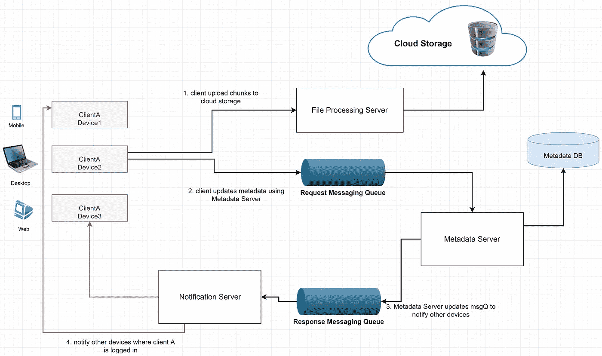

# Google Drive 系统设计分析

> 原文：<https://towardsdatascience.com/system-design-analysis-of-google-drive-ca3408f22ed3?source=collection_archive---------1----------------------->

## 如何设计一个像 Google Drive 这样的系统？

[Elle Cartier](https://unsplash.com/@ellecartier?utm_source=medium&utm_medium=referral) 在 [Unsplash](https://unsplash.com?utm_source=medium&utm_medium=referral) 上拍摄的照片

系统设计是 ***软件工程中最重要也是最令人畏惧的*** 方面。这个观点来自于我自己在一个建筑助理课程中的学习经历。当我开始我的助理架构课程时，我很难理解设计一个系统的想法。

一个主要原因是软件架构书籍中使用的术语一开始很难理解，并且没有清晰的逐步指南。每个人似乎都有不同的方法。当然，还有一个心理障碍，就是这些话题可能很难理解。

于是，我根据自己学习建筑课程的经验，着手设计一个系统。第一个是关于谷歌自动建议。对于这一个，让我们设计一个类似 Google drive 的云文件存储服务。这是一个文件存储和同步服务，使用户能够将他们的数据存储在远程服务器上。

图片作者[作者](https://medium.com/@ashchk)

现在那些已经使用 Google drive 的人知道，我们可以从任何设备上传任何大小的文件，并且可以在我们的手机、笔记本电脑、个人电脑等上找到它。我们很多人都想知道系统如何处理如此大量的文件。在本文中，我们将设计一个 google drive 服务！！

这绝不是一个全面的指南，而是对系统设计的介绍，是开始成为软件架构师之旅的好地方。

## ★系统的定义

我们需要明确系统的目标。系统设计是一个如此广阔的话题；如果我们不把它缩小到一个特定的目的，那么设计系统就会变得复杂，尤其是对于新手来说。

> 用户应该能够从任何设备上传和下载文件/照片。*文件将在用户登录的所有设备中同步。*

如果我们考虑 1000 万用户，每天 1 亿次服务请求，那么写和读操作的数量将是巨大的。为了简化，我们只是设计 Google Drive 存储。换句话说，用户可以上传和下载文件，这有效地将它们存储在云中。

## ★系统的要求

在这一部分，我们决定系统的特性。**我们可以将这些需求分为两部分:**

*   **功能需求:**

> 用户应该能够从任何设备上传和下载文件。并且文件将在用户登录的所有设备中同步。

这些是系统的主要目标。这是系统必须交付的需求。

*   **非功能性需求:**

现在是需要分析的更关键的需求。如果我们不满足这个要求，它可能对项目的商业计划有害。那么，让我们定义一下我们的 nfr:

> 用户可以从任何设备上传和下载文件。该服务应该支持存储单个最大 1 GB 的大文件。服务应该在设备之间自动同步；如果从设备上传一个文件，该文件应该在用户登录的所有设备上同步。

## ★服务器端组件设计

***对于系统设计新手来说，请记住，“如果你对系统设计从哪里开始感到困惑，请尝试从数据流开始。”***

我们的用户在这个系统中可以上传和下载文件。用户从客户端应用程序/浏览器上传文件，服务器将存储这些文件。用户可以从服务器下载更新的文件。那么，让我们看看我们如何为如此大量的用户处理文件的上传和下载。

## 上传/下载文件:

从图中我们可以看到，如果我们上传完整大小的文件，它将花费我们的存储和带宽。此外，完成上传或下载的延迟也会增加。

图:完整的文件传输需要更多的时间、存储和带宽。(图片由[作者](https://medium.com/@ashchk)提供)

## 高效处理文件传输:

我们可以将每个文件分成更小的块。然后，我们可以只修改数据发生变化的小部分，而不是整个文件。在数据上传失败的情况下，这种策略也会有所帮助。我们需要将每个文件分成一个固定的大小，比如 2 MB。

图:将文件分成更小的块以优化存储利用率和带宽(图片由[作者](https://medium.com/@ashchk)提供)

我们的块大小需要更小。这将有助于优化空间利用，网络带宽是另一个考虑因素，而作出决定。元数据应该包括每个文件块信息的记录。

因为我们有这篇文章作为练习，所以我们可以假设文件需要存储在 2 MB 的小块中。如果一个进程失败，对于文件 的较小片段，在重试操作 ***的情况下，我们也会受益。*如果文件未上传，则仅重试失败的块。****

减少客户端和云存储之间的数据传输量将有助于我们缩短响应时间。我们可以只发送修改过的文件块，而不是传输整个文件。

图:只传输更新的块(图片由[作者](https://medium.com/@ashchk)提供)

在这种情况下，文件的更新部分将被传输。我们将把文件分成 2MB 的块，只传输修改过的文件部分，如图所示。

*从上图中，你可以看到，我们可以只更新修改后的 2MB 文件，而不是更新整个 10 MB 文件。这将减少用户的带宽消耗和云存储。最重要的是，响应时间会更快。*

## 客户端离线会怎么样？

*客户端组件 Watcher 将观察客户端文件夹。如果用户发生任何改变，它将通知索引控制器(另一个客户端组件)关于用户的动作。它还将监控其他客户端(设备)上是否发生任何变化，这些变化由通知服务器广播。*

*当元数据服务收到更新/上传请求时，它需要检查元数据数据库的一致性，然后继续更新。之后，将向所有订阅的设备发送通知，以报告文件更新。*

## 元数据数据库:

我们需要一个负责保存文件、用户等信息的数据库。它可以是类似 MySQL 的关系数据库，也可以是类似 MongoDB 的 NoSQL。我们需要保存数据，如块、文件、用户信息等。在数据库里。

众所周知，我们必须在 SQL 或 NoSQL 这两种类型的数据库之间做出选择。无论我们选择什么，我们都需要确保数据的一致性。
*使用 SQL 数据库可能给我们带来实现同步的好处，因为它们支持 ACID 属性。*

*NoSQL 数据库不支持 ACID 属性。但是它们提供了对可伸缩性和性能的支持。因此，我们需要在元数据服务器的逻辑中为这种类型的数据库提供对 ACID 属性的编程支持。*

## 同步:

现在，客户端从设备更新文件；需要有一个组件来处理更新并将更改应用到其他设备。它需要同步客户端的本地数据库和远程元数据数据库。元数据服务器可以执行管理元数据和同步用户文件的工作。

## 消息队列:

现在想想吧；如此庞大的用户量同时上传文件，服务器如何处理如此大量的请求。为了能够处理如此大量的请求，我们可以在客户机和服务器之间使用消息队列。

*图:消息队列提供可伸缩的请求队列和更改通知，以支持大量使用拉或推策略的客户端。*(图片由[作者](https://medium.com/@ashchk))

当目标程序繁忙或未连接时，消息队列提供临时消息存储。它提供了一个**异步通信协议。** It 是一个将消息放入队列，不需要立即响应就能继续处理的系统。RabbitMQ，阿帕奇卡夫卡等。是消息队列的一些示例。

在消息队列的情况下，一旦客户端接收到消息，消息将从队列中删除。因此，我们需要为客户机的每个订阅设备创建几个响应队列。

图:每个设备类型的响应消息队列(图片由[作者](https://medium.com/@ashchk)提供)

对于大量的用户，我们需要一个可伸缩的消息队列来支持客户端和同步服务之间基于消息的异步通信。该服务应该能够在一个高度可用、可靠和可伸缩的队列中高效地存储任意数量的消息。例子:阿帕奇卡夫卡，rabbitMQ 等。

## 云存储:

如今，有许多平台和操作系统，如智能手机、笔记本电脑、个人电脑等。他们提供随时随地的移动访问。

*如果你将文件保存在笔记本电脑的本地存储中，并且你要外出，但想在手机上使用它，如何获取数据？这就是为什么我们需要云存储作为解决方案。*

它存储用户上传的文件(块)。客户端可以通过**文件处理服务器**与存储器交互，从存储器发送和接收对象。它只保存文件；元数据 DB 保存文件的块大小和编号的数据。

## 文件处理工作流程:

*客户端 A 上传 chunk 到云存储。客户端 A 使用元数据服务器更新元数据并提交 MetadataDB 中的更改。客户端得到确认，通知被发送到同一用户的其他设备。其他设备接收元数据更改，并从云存储中下载更新的块。*

图:客户端 A 的文件处理工作流程(图片由[作者](https://medium.com/@ashchk)提供)

## ★可扩展性

我们需要对元数据数据库进行分区，这样我们就可以存储大约 100 万个用户和数十亿个文件/块的信息。我们可以对数据进行分区，将读写请求分布在服务器上。

## 元数据分区:

***i)*** 我们可以基于文件路径的第一个字母在分区中存储文件块。例如，我们将所有以字母“A”开头的文件放在一个分区中，而将那些以字母“B”开头的文件放在另一个分区中，依此类推。这被称为基于范围的划分。像“Z”或“Y”这样出现频率较低的字母，我们可以将它们组合成一个分区。

*主要问题是有些字母在开头字母的情况下比较常见。例如，如果我们将所有以字母“A”开头的文件放入一个 DB 分区，并且我们有太多以字母“A”开头的文件，以至于我们不能将它们放入一个 DB 分区。在这种情况下，这种方法有一个缺点。*

***ii)*** 我们也可以根据文件的‘fileId’散列来分区。我们的散列函数将随机生成一个服务器号，并将文件存储在该服务器中。但是我们可能需要要求所有的服务器找到一个建议的列表，并将它们合并在一起以得到结果。因此，响应时间延迟可能会增加。

如果我们使用这种方法，仍然会导致分区过载，这可以通过使用一致散列来解决。

## 缓存:

众所周知，**缓存是一种提高性能的常用技术。这对于降低延迟非常有帮助。服务器可以在命中数据库之前检查高速缓存服务器，以查看搜索列表是否已经在高速缓存中。我们不能将所有数据都放在缓存中；太费钱了。**

当缓存已满，我们需要用新的块替换一个块时。最近最少使用(LRU)可用于此系统。在这种方法中，首先从缓存中删除最近最少使用的块。

## ★安全性:

在文件共享服务中，用户数据的隐私和安全至关重要。为了解决这个问题，我们可以将每个文件的权限存储在元数据数据库中，以便让 perm 知道哪个用户可以看到或修改哪些文件。

## ★客户端:

客户端应用程序(web 或移动)传输用户上传到云存储中的所有文件。该应用程序将上传、下载或修改文件到云存储。客户端可以更新元数据，如重命名文件名、编辑文件等。

**客户端 app 功能包括上传、下载文件。如上所述，我们将把每个文件分成 2MB 的小块，这样我们只传输修改过的块，而不是整个文件。**

**如果因为用户离线状态产生任何冲突，app 需要处理。** *现在，我们可以在客户端保存元数据的本地副本，以便进行离线更新。*

**客户端应用程序需要检测客户端文件夹中是否有文件被更改。我们可能有一个组件，观察者。它将检查客户端上是否发生了任何文件更改。**

## ★客户如何知道云存储中发生了变化？

客户端可以定期检查服务器是否有任何变化，这是一种手动策略。但是如果客户端频繁地检查服务器的变化，就会对服务器造成压力，使服务器保持忙碌。

我们可以使用 HTTP [长轮询](https://en.wikipedia.org/wiki/Push_technology#Long_polling)技术来代替。在这种技术中，服务器不会立即响应客户端请求。服务器保持请求打开，而不是发送空响应。一旦新信息准备就绪，服务器就向客户机发送响应。

图:客户端应用程序向元数据服务器请求更新元数据信息(图片由[作者](https://medium.com/@ashchk)提供)

我们可以将客户端应用程序分为以下几个部分:

本地数据库将跟踪所有文件、块、目录路径等。在客户端系统中。

块控制器会将文件分割成更小的部分。它还将执行从块中重建整个文件的任务。这部分将有助于仅确定文件的最近修改的块。并且只有修改过的文件块将被发送到服务器，这将节省带宽和服务器计算时间。

*观察器将观察客户端文件夹，如果用户发生任何变化，它将通知索引控制器用户的操作。它还将监视同步服务广播的其他客户端(设备)上是否正在发生任何变化。*

索引控制器将处理从观察器收到的事件，并更新本地数据库中已修改的文件块信息。它将与元数据服务通信，将更改传输到其他设备并更新元数据数据库。该请求将通过消息请求队列发送到元数据服务。

以下是该系统的完整示意图:

图:Google drive 的系统设计(图片由[作者](https://medium.com/@ashchk)提供)

## ★结论:

在这个系统中，我们没有考虑 UI 部分。系统中也没有考虑更新和离线编辑的历史。*手机客户端可以按需同步，节省用户的带宽和空间。这里我们没有使用另一台服务器进行同步。元数据服务器正在执行该任务。
我们决定将文件分成更小的块，以节省存储和带宽使用，同时减少延迟。*我们添加了负载平衡器，以便在后端服务器之间平均分配传入的请求。如果一个服务器死了，LB 将停止向它发送任何请求。

在云架构中，用户数据的隐私和安全至关重要。我们可以将每个文件的权限存储在元数据数据库中，以检查哪个用户可以看到或修改哪些文件。

这个系列的第一部分是关于[谷歌汽车建议](https://codeburst.io/system-design-analysis-for-auto-suggestion-service-d28bf1701658?source=friends_link&sk=875e5f07973048faf0ebb265be44daac)。如需了解系统设计步骤，请点击以下链接:

 [## 系统设计 101

### 设计系统的逐步指南

towardsdatascience.com](/system-design-101-b8f15162ef7c) 

> 参考:钻研系统设计课程。对于视频参考，您可以查看此[链接](https://www.youtube.com/watch?v=U0xTu6E2CT8&t=1241s)。感谢您阅读文章。**过得愉快**🙂