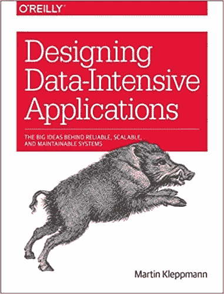

# 系统设计面试准备:你应该把数据放在缓存中吗？

> 原文：<https://towardsdatascience.com/system-design-interview-prep-should-you-put-the-data-in-cache-56936697ee54?source=collection_archive---------32----------------------->

约书亚·索蒂诺在 [Unsplash](https://unsplash.com?utm_source=medium&utm_medium=referral) 上拍摄的照片

(这个帖子也在[我的博客](https://kylelix7.github.io/)里)

缓存是一种以相对较快的速度提供数据的数据存储。有硬件和软件缓存。在系统设计面试中，我们将主要关注软件缓存。在许多情况下，缓存是存储数据的内存块。由于访问内存的速度比磁盘和网络等 IO 快得多，应用程序可以将数据放在内存中以避免访问 IO。因此，吞吐量可以增加，延迟可以减少。

# 并非所有数据都适合缓存

缓存存储在内存中，它通常比持久性存储(如磁盘)小得多。因此，如果您的应用程序需要处理大量数据，将所有内容都存储在缓存中是不现实的。只有一小部分数据应该放在缓存中。当数据可以在缓存中找到时，它被称为缓存命中。如果没有，则称为缓存未命中。

对于系统设计人员来说，找出哪些数据需要放在缓存中是至关重要的。不难发现，只有经常被请求的热数据才应该留在缓存中。以设计脸书为例，帖子必须比用户简介更热门。而那些名人的帖子，一定比那些普通用户要火得多。所以，你应该在面试中优先考虑这个问题。

# 并非所有应用程序都应该有缓存

重要的是要知道，在所有类型的系统中，高速缓存都不会增加吞吐量。在某些情况下，它会对系统产生负面影响。例如，如果您的系统需要频繁更新或写入数据，缓存中的数据也需要不断变化。这会导致缓存大量失效。因此，应用程序需要将缓存中的数据标记为无效。此外，它还需要将更新后的数据写入其对应的持久性数据存储。在这个例子中，高速缓存的失效成为一个开销。因此，缓存只对那些读取量大而写入量小的应用程序有益。

# 缓存写入策略

当应用程序需要更新数据时，它需要:

1.  更新持久数据存储中的数据。
2.  无效或更新缓存中的数据。有几种类型的缓存写入策略。

**直写**:将新数据同步写入缓存和后台数据存储。

优点是数据在后备和缓存上都是一致的。即使停电，数据更新也不会丢失。

缺点是花费在写入上的时间要长得多，因为它不需要写入非常慢的持久数据存储。

**回写:**先写入缓存。在数据被替换之前，它不会写入后备数据存储。

优点是写更快，因为不需要更新后备数据存储。

缺点是它可能会丢失更新。此外，实现更加复杂，因为它需要跟踪哪个缓存块在缓存中被更新，但尚未写入磁盘。这种类型的缓存块称为脏块。

# 缓存替换策略

因为缓存很小，只保存一小部分热数据，所以它可能会超出限制。在这种情况下，当一个新请求到来时，如果出现缓存未命中，我们将需要为新数据逐出一个块。这个过程就是呼叫替换。有许多算法用于高速缓存替换，以找到要驱逐的高速缓存块。最佳策略取决于应用程序的用途。我在这里介绍两个著名的政策。

**最近最少使用，LRU** ，它丢弃最近最少使用的数据。在这个策略中，需要跟踪“何时”。

**最不常用，LFU，**丢弃最不常用的数据。使用计数被跟踪。

# 摘要

缓存是优化读取密集型应用程序的一种方式。它通过将相对少量的热数据放入内存来提高吞吐量并减少延迟，以便数据访问可以避免命中磁盘。根据您的应用程序，您可能需要相应地选择写策略和缓存替换策略，以获得最佳性能。要了解有关系统设计的更多信息，您可以在[探索系统设计](https://www.educative.io/courses/grokking-the-system-design-interview?aff=VEzk)和[设计数据密集型应用](https://amzn.to/3w3KfLK)中找到更多信息。

我的其他帖子

[系统设计面试:如何设计一个系统来处理长时间运行的作业](https://blog.usejournal.com/system-design-interview-prep-how-to-handle-long-running-job-asynchronously-with-long-polling-34d8b2a890e1)

[FAANG Ace 系统设计面试](/ace-system-design-interview-in-faang-d9e479e25bf0?source=your_stories_page---------------------------)

[我如何获得 6 个月的代码并获得 FAANG offer](/how-i-leetcode-for-6-months-and-land-a-job-at-amazon-b76bdfc79abb?source=your_stories_page---------------------------)

[这些都是帮我找到方工作的资源](/these-are-all-the-resources-that-help-me-land-a-fang-job-452341dd6bed?source=your_stories_page---------------------------)

[系统设计面试准备:如何用长轮询、发布订阅和队列异步处理长时间运行的作业](https://medium.com/@fin.techology/system-design-interview-prep-how-to-handle-long-running-job-asynchronously-with-long-polling-34d8b2a890e1)

[系统设计面试的成功步骤](/steps-to-ace-the-system-design-interview-1908ffb77b9b?source=your_stories_page---------------------------)

[SQL(关系数据库)还是 NoSQL？the FAANG 系统设计面试](/sql-relational-database-or-nosql-ace-the-faang-system-design-interview-2d17439ecb3b?source=your_stories_page---------------------------)

[利用 Scipy 实现最小风险的投资组合优化—有效边界解释](/efficient-frontier-optimize-portfolio-with-scipy-57456428323e?source=your_stories_page---------------------------)

[交易策略:Python TA-Lib 技术分析](/trading-strategy-technical-analysis-with-python-ta-lib-3ce9d6ce5614?source=your_stories_page---------------------------)

[交易策略:与反向交易者进行反向测试](/trading-strategy-back-testing-with-backtrader-6c173f29e37f?source=your_stories_page---------------------------)

[千禧一代对 Robinhood 的投资选择 vs. Motley Fool 股票顾问](/how-is-millennials-investment-choice-compared-to-motley-fool-stock-advisor-6bfe6dbf9cc1?source=your_stories_page---------------------------)

[组合风险股票投资，降低风险](/reducing-risk-by-building-portfolio-8772d1ce0f21?source=your_stories_page---------------------------)

[交易:用熊猫计算技术分析指标🐼](/trading-technical-analysis-with-pandas-43e737a17861?source=your_stories_page---------------------------)

[用熊猫库获取交易数据🐼](/collect-trading-data-with-pandas-library-8904659f2122?source=your_stories_page---------------------------)

[在加拿大各大银行找工作？银行求职俱乐部给你洞察热门 IT 技能那里](/looking-for-jobs-in-canada-major-banks-bank-job-club-give-you-insight-hot-it-skills-there-3ded1b24426d?source=your_stories_page---------------------------)

[从 CRUD web 应用开发到语音助手中的 SDE——我正在进行的机器学习之旅](https://medium.com/@fin.techology/from-crud-app-dev-to-sde-in-voice-assistant-my-ongoing-journey-to-ml-4ea11ec4966e)

[全栈开发教程:将 AWS Lambda 无服务器服务集成到 Angular SPA 中](/full-stack-development-tutorial-integrate-aws-lambda-serverless-service-into-angular-spa-abb70bcf417f)

[全栈开发教程:用运行在 AWS Lambda 上的无服务器 REST API 提供交易数据](/full-stack-development-tutorial-serverless-rest-api-running-on-aws-lambda-a9a501f54405)

[全栈开发教程:在 Angular SPA 上可视化交易数据](/full-stack-development-tutorial-visualize-trading-data-on-angular-spa-7ec2a5749a38)

[强化学习:Q 学习简介](https://medium.com/@kyle.jinhai.li/reinforcement-learning-introduction-to-q-learning-444c951e292c)