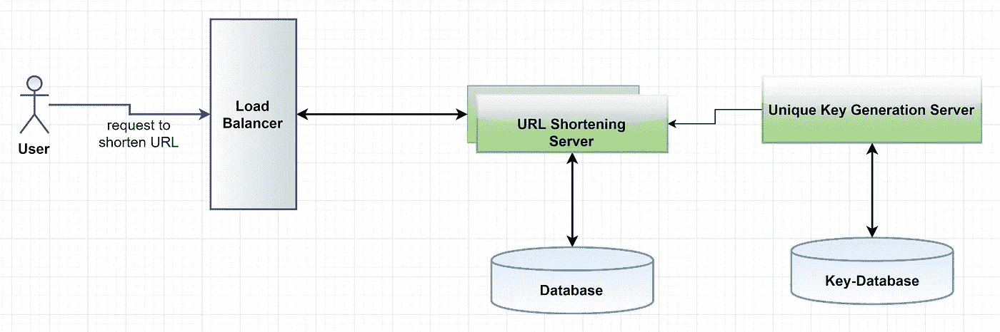

# URL 缩短服务的系统设计

> 原文：<https://towardsdatascience.com/system-design-of-url-shortening-service-b325b18c8f88?source=collection_archive---------2----------------------->

## 提供缩短 URL 的 web 服务的系统设计分析

照片由 [**马库斯·斯皮斯克**](https://www.pexels.com/@markusspiske?utm_content=attributionCopyText&utm_medium=referral&utm_source=pexels) 发自 [**佩克斯**](https://www.pexels.com/photo/working-pattern-internet-abstract-1089438/?utm_content=attributionCopyText&utm_medium=referral&utm_source=pexels)

系统设计是软件工程中 ***最重要也是最令人畏惧的*** 方面。这个观点来自于我自己在一个建筑助理课程中的学习经历。当我开始我的助理架构课程时，我很难理解设计一个系统的想法。

一个主要原因是软件架构书籍中使用的术语一开始很难理解，并且没有清晰的逐步指南。每个人似乎都有不同的方法。

所以，我根据我学习建筑课程的经验着手[设计一个系统](/system-design-101-b8f15162ef7c?source=friends_link&sk=be3d26de1f9d1671b4abe379aae814f8)。这是初学者系统设计系列的一部分(下面给出了链接)。对于这一个，让我们设计 URL 缩短服务。

在[中](https://medium.com/u/504c7870fdb6?source=post_page-----b325b18c8f88--------------------------------)，我们可以看到网址相当大，尤其是好友链接；当分享一篇文章时，我们倾向于缩短 URL。一些已知的 URL 缩短服务有 TinyURL、bit.ly、goo.gl、rb.gy 等。我们将设计这样一个网址缩短服务。

## ★系统的定义:

我们需要明确系统的目标。*系统设计是一个如此庞大的话题；如果我们不把它缩小到一个特定的目的，那么设计系统就会变得复杂，尤其是对于新手来说。URL 缩短服务为长 URL 提供较短的别名。当用户点击缩短的链接时，他们将被重定向到原来的网址。*

作者图片

## ★系统要求:

在这一部分，我们决定系统的功能。我们需要关注的需求是什么？**我们可以将系统需求分为两部分:**

*   **功能需求:**

用户给出一个 URL 作为输入；我们的服务应该为该 URL 生成一个更短且唯一的别名。当用户点击较短的链接时，我们的系统应该将他们重定向到原来的链接。链接可能会在一段时间后过期。用户可以指定到期时间。*我们这里不考虑用户自定义链接。*

这是系统必须提供的一个需求。这是系统的主要目标。

*   **非功能性需求:**

现在是需要分析的更关键的需求。如果我们不满足这个要求，它可能对项目的商业计划有害。那么，让我们定义一下我们的 nfr:

> 系统应该是高度可用的。如果服务关闭，所有 URL 重定向都将失败。URL 重定向应该实时发生。没有人应该能够预测缩短的链接。

**性能、可修改性、可用性、可伸缩性、可靠性等。是系统设计中一些重要的质量要求。这些‘能力’是我们分析一个系统并确定我们的系统设计是否恰当所需要的。**

在这个系统中，可用性是主要的质量属性。安全性是另一个重要的属性。通常，可用性和可伸缩性是系统设计的重要特征。默认情况下，性能是重要的，没有人希望构建一个性能更差的系统，对吗？！

## ★系统需要处理多少请求？

让我们假设，一个用户可能请求一个新的 URL，并使用它 100 次进行重定向。因此，写和读的比率应该是 1:100。所以系统的读取量很大。

我们需要在服务中处理多少 URL 请求？假设我们可能每秒收到 200 个 URL 请求。所以，一个月的计算，我们可以有 30 天* 24 小时* 3600 秒*200 =~ 500 M 的请求。

因此，每月会有近 5 亿个新的 URL 缩短请求。那么，重定向请求将是 500M * 100 = 50 亿。

要计算年份，你必须将这个数乘以 12。

## ★我们需要多少储物空间？

让我们假设，系统将所有的 URL 缩短请求和它们的缩短链接存储了 5 年。由于我们预计每个月会有 5 亿个新的 URL，我们预计存储的对象总数将是 500 M * (5 * 12)个月= 30 B。

现在让我们假设每个存储的对象大约有 100 个字节。我们将需要 300 亿* 100 字节= 3 TB 的总存储容量。

如果我们想要缓存一些经常被访问的流行 URL，如果我们遵循 80–20 规则，这意味着我们从缓存中保留 20%的请求。

因为我们每秒有 20K 个请求，我们将得到

***20K * 60 秒* 60 分钟* 24 小时=每天~ 17 亿***

如果我们计划缓存 20%的请求，我们将需要

***0.2 * 17 亿* 100 字节= 34GB 内存。***

## ★数据流:

***对于系统设计的新手，请记住，“如果你对系统设计从哪里开始感到困惑，请尝试从数据流开始。”***

现在，服务器端组件的主要任务之一是为输入 URL 生成唯一的键。在这里，我们的输入数据只是一个 URL。因此，我们需要将它们存储为一个字符串。输出是 URL 的另一个缩短版本。如果有人点击这个缩短的网址，它会重定向到原来的网址。现在，每个输出 URL 需要是唯一的。

## ★为给定的 URL 生成一个简短的唯一键

*例如，我们可以取一个随机缩短的网址“*【rb.gy/ln9zeb】*”。最后几个字符应该构成一个唯一的键。所以，我们的输入是用户给的一个长 URL。*

我们需要计算输入 URL 的唯一散列。如果我们使用 base64 编码，6 个字符长的密钥将给我们 64 个^(6)= ~ 687 亿个可能的字符串，这对于我们的系统应该足够了。

**问题:**如果多个用户输入同一个网址，系统应该不会提供相同的缩短网址。如果一些字符串是重复的，系统会有什么行为？

**解决方案:**我们可以将带有递增序列号的输入 URL 附加到每个请求 URL。它应该使网址唯一。但是，序列号的溢出可能是一个问题。假设 user-id 是惟一的，我们可以将 user-id 附加到输入 URL。

## ★唯一密钥生成:

在系统中，user-id 应该是唯一的，这样我们就可以计算唯一的散列。我们可以有一个独立的唯一密钥生成服务(UGS)，它预先生成随机 id 并将它们存储在数据库中。

图:UGS 唯一密钥生成服务(图片由作者提供)

每当我们需要一个新的密钥时，我们可以从已经生成的 id 中选择一个。这种方法可以使事情变得更快，因为当一个新的请求到来时，我们不需要创建一个 ID，确保它的唯一性，等等。UGS 将确保所有的 id 都是唯一的，它们可以存储在数据库中，这样就不需要每次都生成 id。

因为我们需要一个字节来存储一个字符，所以我们可以将所有这些键存储在:

6(字符)* 68.7B(唯一键)~= 412 GB。

## ★可用性和可靠性:

如果我们只保留 UGS 的一份拷贝，那就是单点故障。所以，我们需要做一个 UGS 的复制品。如果主服务器死了，备用服务器可以处理用户的请求。

**每个 UGS 服务器都可以缓存 key-DB 中的一些密钥。它可以加快速度。但是，我们必须小心；如果一个服务器在使用完所有密钥之前就死掉了，我们就会丢失那些密钥。但是，我们可以假设，这是可以接受的，因为我们有将近 68B 个唯一的六字母键。**

为了确保可用性，我们需要确保消除系统中的单点故障。数据复制将消除单点故障并提供备份。我们可以保留多个副本，以确保数据库服务器的可靠性。此外，为了实现不间断服务，其他服务器也需要副本。

## ★数据存储:

在这个系统中，我们需要存储数十亿条记录。我们保存的每个对象可能小于 1 KB。一个 URL 数据与另一个不相关。因此，我们可以使用 NoSQL 数据库，如 Cassandra、DynamoDB 等。NoSQL 选择将更容易扩展，这是我们的要求之一。

## ★可扩展性:

为了支持数十亿个 URL，我们需要对数据库进行分区，以便将数据存储到不同的数据库服务器中。

I)我们可以根据哈希键的第一个字母对数据库进行分区。我们可以将以“A”开头的密钥放在一台服务器上，将“B”放在另一台服务器上。这被称为**基于范围的分区。**

这种方法的问题是它会导致不平衡的分区。例如，另一方面，以“z”开头的单词很少；我们可能有太多以字母“e”开头的 URL。

我们可以将不经常出现的字母组合到一个数据库分区中。

ii)我们还可以基于我们存储的对象的散列进行分区。我们可以采用关键字的散列来确定可以存储数据对象的分区。哈希函数将生成一个服务器号，我们将密钥存储在该服务器中。这个过程可以使分布更加随机。这就是**基于散列的分区。**

如果这种方法仍然导致分区过载，我们需要使用[一致散列法](https://en.wikipedia.org/wiki/Consistent_hashing)。

## ★缓存:

我们可以缓存用户经常访问的 URL。在查询数据库之前，UGS 服务器可以检查缓存是否具有所需的 URL。那么它不需要再次进行查询。

缓存满了会怎么样？我们可能会用新的或流行的 URL 替换旧的未使用的链接。我们可以为我们的系统选择最近最少使用的(LRU)缓存回收策略。在此策略中，我们首先删除最近最少使用的 URL。

## ★负载平衡器:

我们可以在系统的不同位置添加一个负载平衡层，在 URL 缩短服务器、数据库和缓存服务器之前。

我们可以使用简单的循环法来分配请求。在这种方法中，LB 在后端服务器之间平均分配传入的请求。这种 LB 方法实现起来很简单。如果一个服务器死了，LB 将停止向它发送任何流量。

问题:如果一个服务器过载，LB 不会停止向这个服务器发送新的请求。我们以后可能需要一个智能 LB。

## ★一段时间后链接过期:

如果到了 URL 的到期时间，链接会发生什么？

我们可以在数据存储中搜索并删除它们。这里的问题是，如果我们选择搜索过期的链接，将它们从我们的数据存储中删除，这会给我们的数据库带来很大的压力。

我们可以用另一种方法。我们可以定期慢慢删除过期的链接。即使一些死链接存在的时间更长，它也不应该返回给用户。

如果用户试图访问过期的链接，我们可以删除该链接并向用户返回一个错误。定期清理过程可以运行，从我们的数据库中删除过期的链接。随着存储越来越便宜，一些链接可能会留在那里，即使我们在清理时错过了。

移除链接后，我们可以将它放回数据库以供重用。

## ★安全性:

我们可以将每个 URL 的访问类型(公共/私有)存储在数据库中。如果用户试图访问他没有权限的 URL，系统会发回一个错误(HTTP 401)。

图:URL 缩短服务的最终设计(图片由作者提供)

## 结论:

在这个系统中，我们没有考虑 UI 部分。因为这是一个 web 服务，所以也不讨论客户端部分。唯一密钥生成是该系统的重要部分。因此，我们添加了一个额外的服务来创建和存储 URL 的唯一键。为了确保服务的可用性，我们使用了服务器复制，这样，如果一台服务器出现故障，其他服务器仍然可以提供服务。数据库也被复制以确保数据的可靠性。缓存服务器用于存储一些流行的查询，以加快延迟。并且添加了负载平衡器，以便在后端服务器之间平均分配传入的请求。

来源:钻研系统设计面试课程。

*感谢您阅读本文。* ***过得愉快😃***

> 本文是面向初学者的系统设计系列文章的一部分。这里是[链接](https://medium.com/@ashchk/all-the-article-links-in-one-place-85c8526ead70?source=friends_link&sk=7e6ee3a65895cc893a32f97d5496bed4)。