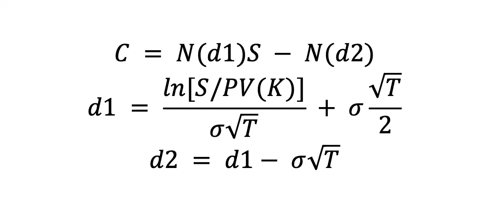
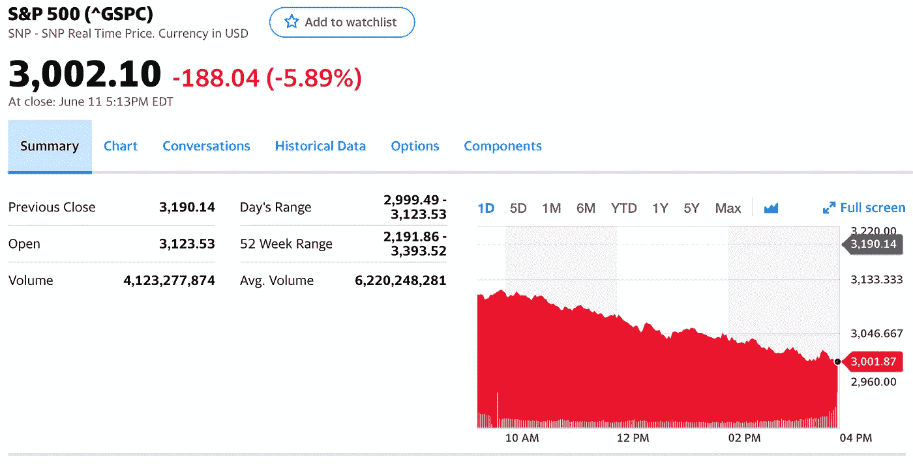
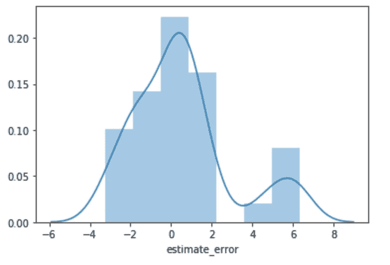
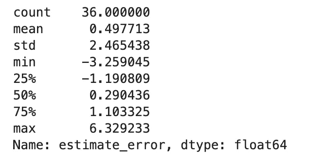
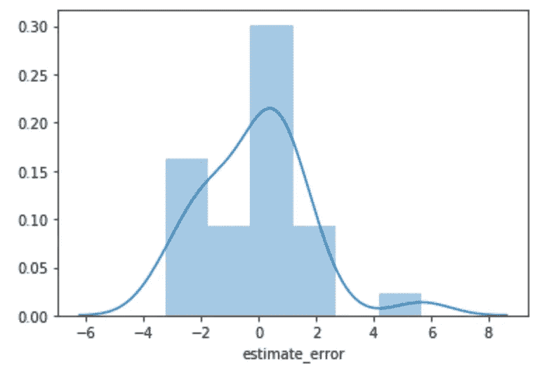
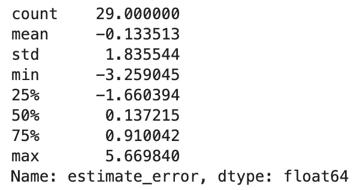
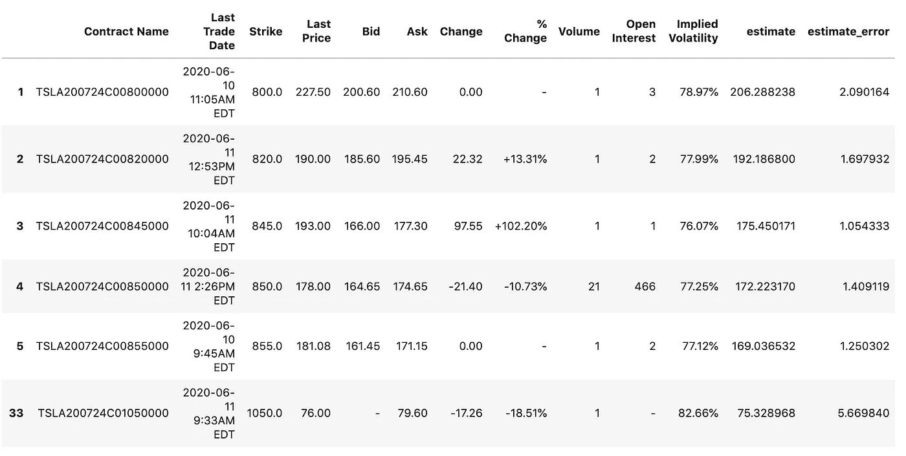

# 用 Black Scholes 对金融期权进行系统定价

> 原文：<https://towardsdatascience.com/systematically-pricing-financial-options-with-black-scholes-4998c591ccbd?source=collection_archive---------21----------------------->

## 疫情唯一没有破坏的模型？


[M. B. M.](https://unsplash.com/@m_b_m?utm_source=medium&utm_medium=referral) 在 [Unsplash](https://unsplash.com?utm_source=medium&utm_medium=referral) 上拍摄的照片

## 欧式与美式期权

金融市场上交易的普通金融期权有两种:美式期权——你可以在行权日之前的任何时候行使期权——以及欧式期权——你必须等到行权日才能行使期权。

“*美国*”和“*欧洲*”这两个名字实际上与期权的交易地点或公司的国籍无关。如果股票支付股息，并且行权日之前的时间包括除息日，那么这两种期权的估值将会有很大的不同——此时购买股票将不再授予你获得股息的权利。

Black-Scholes 假设了欧式期权，但它也可以用于不支付股息的美式期权。

## 布莱克·斯科尔斯公式

获得诺贝尔奖的原始 Black-Scholes 公式指出，看涨期权的价格取决于股票现货价格 S 的函数的累积正态分布(此处用 *N、*表示)、以 K 值(等于执行价格)交易的无风险债券的现值、股票年化回报的波动率以及从今天到行权日的时间除以一个财政年度的天数(此处用 t 表示)



布伦娜·托里诺

如果你想知道更多关于公式推导的信息，[这里有一个非常好的资源。](https://medium.com/cantors-paradise/the-black-scholes-formula-explained-9e05b7865d8a)在本文中，我将更多地关注公式的系统应用。

## 数据

为了计算我们从期权中的潜在收益，我们需要一年(在本例中，2018 年 6 月 12 日至 2019 年 6 月 12 日)股票价格的历史数据和期权当前交易价格水平的数据，以便我们可以比较我们的结果。

历史数据可以从雅虎财经获取:进入*历史数据*下载一年的数据集。



首先，我们需要计算输入布莱克-斯科尔斯模型的波动率。传统上，我们使用股票年回报率的波动率，计算如下:

最后一行将检索股票行权日期为 7 月 24 日的看涨期权数据表。

## Python 中的 Black-Scholes 公式

下面是本文开头描述的相同的 Black Scholes 公式，但是现在用一个名为 black_scholes 的 Python 函数表示。请注意，无风险债券的现值公式就是债券价格 K 除以(1 +无风险利率)的时间分数的幂 *T，*，我们使用 Python 函数 cdf 来计算变量 d1 和 d2 的累积分布函数值。

## 布莱克-斯科尔斯算法

计算出波动率(金融市场天数的平方根乘以年化回报的标准差)后，我们可以对我们目前拥有的所有执行价格进行估计。在特斯拉的案例中，我们有 35 种不同的看涨期权执行价格。

对于每个执行价格，我们输入股票的现货价格(目前为 972.84)，循环遍历数据框 *r，*中的执行价格，我使用的无风险利率是 10 年期美国国债收益率，目前为 0.69%。

我们输出数据框 *df_estimate* ，我们可以用它来计算 Black Scholes 模型的估计值与期权在市场上的实际交易价格有多接近:

> 布莱克·斯科尔斯正确预测了期权的市场价值吗？



我们的平均估计误差为 0.49%，标准差为 2.46 个百分点。我们的中位数更有希望达到 0.29%左右。我们的标准差似乎仍然有点高，但仔细观察数据集，我们可以看到有几个合约今天根本没有交易，这扭曲了数据集，因为这些价格没有高度更新。

如果我们只包括今天至少交易过一次的合约:

```
df1 = df_estimate[(df_estimate.Volume != '-')]
```

对于估计误差，我们实际上可以产生更好的结果:



这里，我们有一个-0.13%的平均估计误差，这意味着与我们的估计相比，期权价格平均低估期权 0.13%，我们的标准差减少到只有 1.8 个百分点。

出于好奇，让我们分析一下布莱克·斯科尔斯误差超过 1%的几份合同:

```
df1[df1['estimate_error'] > 1]
```



大多数合约的交易量都很小，在股市交易日只交易一次。然而，4 号合约具有 1.4%的估计误差，具有 21 个合约和 466 个未平仓权益的高容量。执行价格在 850，这意味着如果股票价格高于 850+174.65 = 1021.65 美元，它将获利，而目前股票交易价格为 972.84 美元。在大约 31 个股市交易日中，这只上涨了 5.325%，这对特斯拉来说并不是一个困难的壮举。

我们的估计略低，但差异的一个原因可能是这些期权的*非常*大的价差，做市商以 6%的无风险利润退出。这表明，目前 7 月 24 日特斯拉期权的风险要高得多，考虑到这些交易的低交易量和行权日期的临近，这是有道理的。

## 隐含波动率

雅虎金融期权数据的一个重要壮举是，它向我们展示了期权价格的隐含波动率，这可以通过从期权交易价格开始反向求解波动率的布莱克-斯科尔斯方程来计算。对于这个分析，我没有使用隐含波动率作为输入，因为我想比较市场参与者如何对期权定价与布莱克-斯科尔斯模型的估计。

隐含波动率是*前瞻性*，意思是它可以给我们一个感觉，交易者目前在期权中定价了多少未来波动率，**T5，如果交易者是理性的** 。当谈到隐含波动率时，最后一个假设很重要，因为其他因素，如行为经济学(由于这种信念，特斯拉是市场上最被做空的股票)，当前疫情期间的非理性避险情绪，以及其他外部因素，都可以在期权定价中发挥作用，但不一定反映股票的预期波动率。