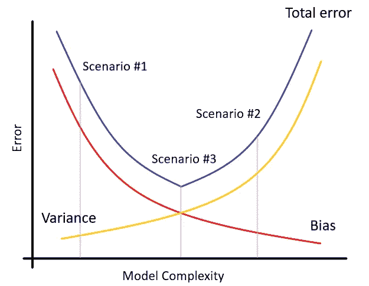

# 你的神经网络应该有多少个神经元？

> 原文：<https://towardsdatascience.com/systematically-tuning-your-model-by-looking-at-bias-and-variance-4986662315b2?source=collection_archive---------48----------------------->

## **通过观察偏差和方差来系统地调整你的模型**

作为数据科学家，我们在建立一个模型的时候经常会面临很多决策，比如**用哪个模型**、**它应该有多大**、**需要多少数据**、**增加多少特征**或者**使用还是不使用正则化**。虽然一些决策可以相对快速地进行评估，但其他决策(如收集更多数据)可能需要几个月的时间，然后才发现没有帮助。

在这篇文章中，我将实际演示一种基于观察偏差和差异做出这些**决策的方法，这种方法改变了我在几乎每个项目中进行的方式。**


由 [Valentin Salja](https://unsplash.com/@valentinsalja?utm_source=medium&utm_medium=referral) 在 [Unsplash](https://unsplash.com?utm_source=medium&utm_medium=referral) 上拍摄的照片

## 实践中的偏差和差异

许多人在调整他们的模型时犯的错误是，他们只关注他们的验证错误。虽然这最终是最重要的数字(除了测试误差)，但同时观察训练误差可能会给你几个**提示，告诉你该如何使用你的模型**。

偏差和方差可能有不同的更正式的定义，但实际上是这样的:

> **偏差**是训练集的错误率(1-训练精度)
> 
> **方差**是验证集上的模型与训练集相比差多少的比率(训练精度-验证精度)

我将用一个实际的例子来说明这些概念的重要性。

## 创建数据集

让我们首先创建一个数据集，我们将使用它来训练和评估我们的模型。

我将使用 sklearn 的 [make_classification](https://scikit-learn.org/stable/modules/generated/sklearn.datasets.make_classification.html#sklearn.datasets.make_classification) 来完成这项工作，然后将数据集分成训练集和验证集。

## 场景#1:高偏差，低方差

接下来，我们将开始使用 [Keras](https://keras.io/) 创建一个相对较小的神经网络，并在我们的数据集上训练它。

经过训练的模型得到以下结果:

```
Training accuracy: 62.83%
Validation accuracy: 60.12%

Bias: 37.17%
Variance: 2.71%
```

我们可以看到，我们的模型有一个非常高的偏差，同时有一个相对较小的方差。这种状态俗称**欠配合**。

有几种**方法可以减少偏差**，让我们脱离这种状态:

> 增加模型的尺寸
> 
> 添加更多功能
> 
> 减少正则化

## 场景#2:低偏差，高方差

让我们试试增加模型大小来减少偏差的方法，看看会发生什么。

为了做到这一点，我增加了每个隐藏层中神经元的数量。

我们更大的模型得到以下结果:

```
Training accuracy: 100.0%
Validation accuracy: 89.82%

Bias: 0.0%
Variance: 10.18%
```

正如你所看到的，我们已经成功地减少了模型的偏差。事实上，我们已经完全消除了它，但是，现在方差增加了。这种状态俗称**过拟合**。

减少模型方差的**方法有:**

> 减小模型的尺寸
> 
> 减少功能数量
> 
> 添加正则化
> 
> 添加更多数据

## 场景#3:低偏差、低方差

让我们这次尝试通过引入一些正则化来减少方差。

我以 Dropout(训练时随机忽略一组神经元)的形式将正则化添加到每一层。

我们新模型的结果是:

```
Training accuracy: 98.62%
Validation accuracy: 95.16%

Bias: 1.38%
Variance: 3.46%
```

完美！我们现在非常接近一个**最优状态**，具有相对较低的偏差和相对较低的方差，这正是我们的目标。如果我们现在看看我们的验证误差(1-验证准确性或偏差+方差)，这是迄今为止最低的。

也许你已经注意到，在最后一个场景中，与场景#2 相比，偏差又增加了一点。你也可以看到减少偏差和减少方差的方法是完全相反的。这种特性称为**偏差-方差权衡**，如下图所示:



偏差-方差权衡|作者图片

> 基本上，我们试图找到偏差和方差之间的平衡，即**最小化总误差**。

## 结论

我们经历了基于偏差和方差调整模型的 3 种不同场景，以及可以采取的相应步骤。

可能存在第四种情况，即**高偏置**和**高方差**，这还没有被涵盖。然而，这通常意味着你的数据有问题(训练和验证分布不匹配，噪音数据等。)，因此，很难给你一个确切的指导方针。

我希望这种方法能帮助你在项目中区分任务的优先级，并最终为你节省一些时间。

我用的所有代码都可以在 [GitHub](https://github.com/sebastianpoliak/Bias-and-Variance-Medium-Post) 上找到。

灵感来自吴恩达对机器学习的向往。

[](/how-much-time-can-you-save-with-active-learning-b4886f5da462) [## 主动学习能节省多少时间？

### 在 NLP 数据集上的动手实验。

towardsdatascience.com](/how-much-time-can-you-save-with-active-learning-b4886f5da462) [](/zero-shot-learning-the-alphabetic-characters-an-experiment-with-code-d1a0f23f4b4c) [## 零射击学习字母字符(代码实验)

### 是否有可能识别培训中未提供的字母字符？

towardsdatascience.com](/zero-shot-learning-the-alphabetic-characters-an-experiment-with-code-d1a0f23f4b4c)