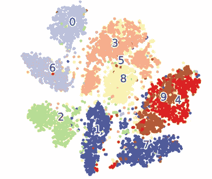
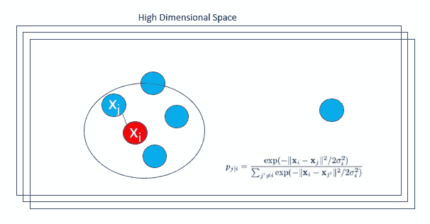
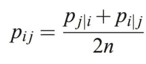
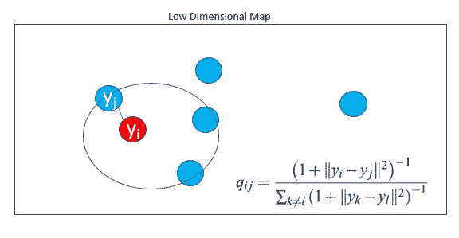
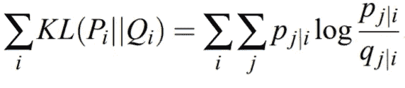
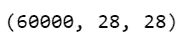
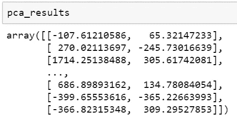
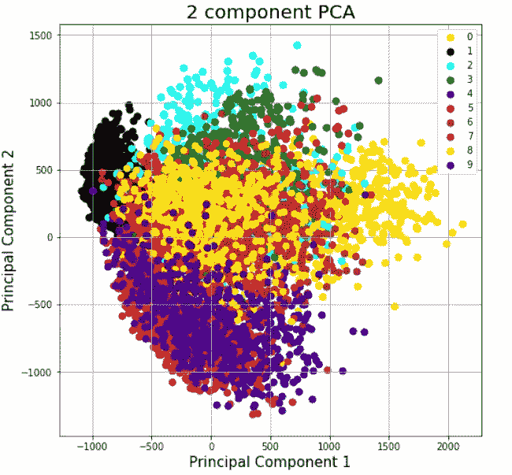
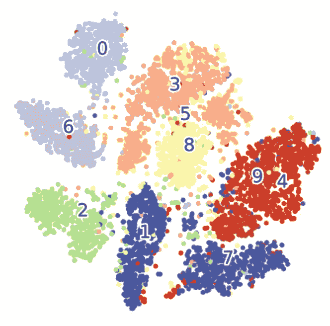
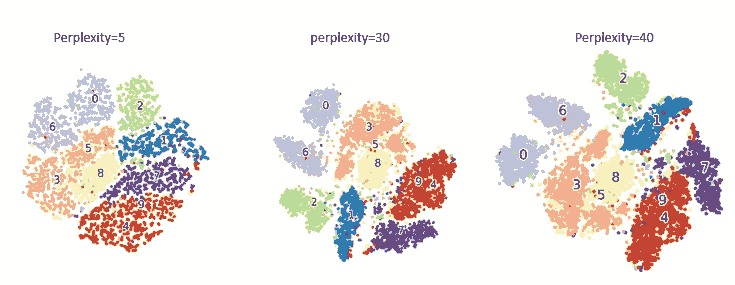

# t 分布随机邻居嵌入(t-SNE)

> 原文：<https://towardsdatascience.com/t-distributed-stochastic-neighbor-embedding-t-sne-bb60ff109561?source=collection_archive---------7----------------------->

## 了解 t- SNE 的基础知识，它与主成分分析的区别，以及如何在 MNIST 数据集上应用 t-SNE

在本文中，您将了解到:

*   t-SNE 和 PCA(主成分分析)的区别
*   简单易懂的解释 SNE 霸王龙是如何工作的
*   了解可用于 t-SNE 的不同参数
*   t-SNE 和主成分分析在 MNIST 的应用



***如果一个数据集中有数百个特征或数据点，并且希望在二维或三维空间中表示它们，该怎么办？***

两种常见的**技术在保留数据集中大部分信息的同时降低了数据集的维度**是

*   [**主成分分析**](https://medium.com/datadriveninvestor/principal-component-analysis-pca-a0c5715bc9a2)
*   **t 分布随机邻居嵌入(t-SNE)**

## 降低数据维度的目标

*   **在低维表示中尽可能多地保留高维数据中存在的数据的重要结构或信息。**
*   **提高低维数据的可解释性**
*   **最小化因降维导致的数据信息损失**

***什么是 PCA 和 t-SNE，两者有什么区别或相似之处？***

**PCA 和 t-SNE 都是无监督的降维技术。这两种技术**都用于将高维数据可视化到低维空间。

## 主成分分析

*   **用于特征提取和可视化的无监督确定性算法**
*   应用**线性降维技术**，其中**的重点是在低维空间**中保持不同点之间的距离。
*   **通过使用特征值**保留数据中的方差，将原始数据转换为新数据。
*   **离群值影响 PCA。**

## t-分布随机邻域嵌入(t-SNE)

*   一种**无监督的随机化算法，仅用于可视化**
*   应用一种非线性降维技术，重点是在低维空间中保持非常相似的数据点接近在一起。
*   **使用学生 t 分布**来计算低维空间中两点之间的相似性，从而保留数据的局部结构。
*   t-SNE 使用**重尾 Student-t 分布来计算低维空间**中两点之间的相似性，而不是高斯分布，这有助于**解决拥挤和优化问题**。
*   **异常值不会影响 t-SNE**

[**T-分布式随机邻居嵌入(t-SNE)**](https://jmlr.csail.mit.edu/papers/volume9/vandermaaten08a/vandermaaten08a.pdf) 是由 [Laurens van der Maaten](https://en.wikipedia.org/w/index.php?title=Laurens_van_der_Maaten&action=edit&redlink=1) 和 [Geoffrey Hinton](https://en.wikipedia.org/wiki/Geoffrey_Hinton) 开发的一种用于可视化的无监督机器学习算法。

t-SNE 是如何工作的？

**第一步:在高维空间中寻找相邻点之间的成对相似性。**

t-SNE 将数据点 xᵢ和 xⱼ之间的高维欧几里德距离转换成条件概率 P(j|i)。



[D](http://www.jmlr.org/papers/volume9/vandermaaten08a/vandermaaten08a.pdf) 高维空间中的数据(图片由作者提供)

xᵢ会根据以 xᵢ.点为中心的高斯分布下 xⱼ的概率密度比例来选择它作为邻居

σᵢ是以数据点 xᵢ为中心的高斯方差

**一对点的概率密度与其相似度成正比。对于附近的数据点，p(j|i)将相对较高，而对于相距较远的点，p(j|i)将非常小。**

将高维空间中的条件概率对称化，得到高维空间中的最终相似度。

条件概率通过对两个概率进行平均来对称化，如下所示。



对称化条件概率

**步骤 2:基于高维空间中的点的成对相似性，将高维空间中的每个点映射到低维映射。**

低维图将是二维或三维图



[D](http://www.jmlr.org/papers/volume9/vandermaaten08a/vandermaaten08a.pdf) 低维空间中的数据(图片由作者提供)

yᵢ和 yⱼ是高维数据点 xᵢ和 xⱼ.的低维对应物

我们计算条件概率 q(j|i ),类似于以点 yᵢ为中心的高斯分布下的 p(j[I ],然后对称化该概率。

**步骤 3:使用基于 Kullback-Leibler 散度(KL 散度)的梯度下降，找到最小化 Pᵢⱼ和 qᵢⱼ之间不匹配的低维数据表示**



**Pᵢ** 代表点 xᵢ.在所有其他数据点上的条件概率分布 Q **ᵢ** 表示给定地图点 yᵢ的所有其他地图点上的条件概率分布

t-SNE 使用梯度下降优化低维空间中的点。

***为什么用 KL 发散？***

**当我们最小化 KL 散度时，它使得 qᵢⱼ在物理上等同于 Pᵢⱼ，因此高维空间中的数据结构将类似于低维空间中的数据结构。**

基于 KL 散度方程，

*   **如果 Pᵢⱼ较大，那么我们需要一个较大的 qᵢⱼ值来表示相似性较高的局部点。**
*   **如果 Pᵢⱼ很小，那么我们需要一个更小的 qᵢⱼ值来表示相距很远的局部点。**

**第四步:使用 Student-t 分布计算低维空间中两点之间的相似度。**

t-SNE 使用一个自由度的**重尾 Student-t 分布来计算低维空间**中两点之间的相似性，而不是高斯分布。

t 分布在低维空间中创建点的概率分布，这有助于减少拥挤问题。

如何在数据集上应用 t-SNE？

在我们用 python 写代码之前，让我们了解一些我们可以使用的 TSNE 的关键参数

***n _ components****:***嵌入空间的维度，这是我们希望高维数据转换成**的较低维度。二维空间的**默认值为 2** 。

**困惑度:**困惑度与 t-SNE 算法中使用的最近邻的数量有关。较大的数据集通常需要较大的困惑度。困惑度的值可以在 5 到 50 之间。 **默认值为 30。**

**n_iter:优化的最大迭代次数**。**至少应为 250，默认值为 1000**

**learning _ rate:t-SNE 的学习率通常在[10.0，1000.0]范围内，默认值为 200.0。**

## 在 MNIST 数据集上实现主成分分析和 t-SNE

我们将使用 sklearn.decomposition.PCA 应用 PCA，并在 MNIST 数据集上使用 [sklearn.manifold.TSNE](https://scikit-learn.org/stable/modules/generated/sklearn.manifold.TSNE.html) 实现 t-SNE。

**加载 MNIST 数据**

导入所需的库

```
import time
import numpy as np
import pandas as pd
```

获取 MNIST 训练和测试数据，并检查训练数据的形状

```
**(X_train, y_train) , (X_test, y_test) = mnist.load_data()** X_train.shape
```



创建一个包含大量图像和图像中像素计数的数组，并将 X_train 数据复制到 X

```
**X = np.zeros((X_train.shape[0], 784))
for i in range(X_train.shape[0]):
    X[i] = X_train[i].flatten()**
```

混洗数据集，取 10%的 MNIST 训练数据并将其存储在数据框中。

```
**X = pd.DataFrame(X)
Y = pd.DataFrame(y_train)
X = X.sample(frac=0.1, random_state=10).reset_index(drop=True)
Y = Y.sample(frac=0.1, random_state=10).reset_index(drop=True)
df = X**
```

在数据准备好之后，我们可以应用主成分分析和 t-SNE。

## 在 MNIST 数据集上应用主成分分析

使用来自***sk learn . decomposition .***的 PCA 库应用 PCA

```
**from sklearn.decomposition import PCA**
time_start = time.time()
**pca = PCA(n_components=2)
pca_results = pca.fit_transform(df.values)**print ('PCA done! Time elapsed: {} seconds'.format(time.time()-time_start))
```



PCA 生成两个维度，主成分 1 和主成分 2。将两个 PCA 成分连同标签一起添加到数据框中。

```
**pca_df = pd.DataFrame(data = pca_results
             , columns = ['pca_1', 'pca_2'])
pca_df['label'] = Y**
```

只有可视化时才需要标签。

绘制 PCA 结果

```
**fig = plt.figure(figsize = (8,8))
ax = fig.add_subplot(1,1,1) 
ax.set_xlabel('Principal Component 1', fontsize = 15)
ax.set_ylabel('Principal Component 2', fontsize = 15)
ax.set_title('2 component PCA', fontsize = 20)
targets = [0,1,2,3,4,5,6,7,8,9]
colors=['yellow', 'black', 'cyan', 'green', 'blue', 'red', 'brown','crimson', 'gold', 'indigo']****for target, color in zip(targets,colors):
    indicesToKeep = pca_df['label'] == target
    ax.scatter(pca_df.loc[indicesToKeep, 'pca_1']
               , pca_df.loc[indicesToKeep, 'pca_2']
               , c = color
               , s = 50)****ax.legend(targets)
ax.grid()**
```



## 在 MNIST 数据集上应用 t-SNE

导入 t-SNE 和可视化所需的库

```
**import time
from sklearn.manifold import TSNE
import matplotlib.pyplot as plt
from mpl_toolkits.mplot3d import Axes3D
import seaborn as sns
import matplotlib.patheffects as PathEffects**
**%matplotlib inline**
```

首先使用默认参数创建一个 TSNE 实例，然后将高维图像输入数据放入嵌入空间，并使用 fit_transform 返回转换后的输出。

图像数据的维数应该是(***n _ 样本，n _ 特征)*** 的形状

```
time_start = time.time()
**tsne = TSNE(random=0)
tsne_results = tsne.fit_transform(df.values)**print ('t-SNE done! Time elapsed: {} seconds'.format(time.time()-time_start))
```

将标注添加到数据框中，这将仅在绘制时使用，以便为聚类添加可视化标注。

```
**df['label'] = Y**
```

函数来可视化数据

```
**def plot_scatter(x, colors):**
    # choose a color palette with seaborn.
   ** num_classes = len(np.unique(colors))
    palette = np.array(sns.color_palette("hls", num_classes))
    print(palette)**

    # create a scatter plot.
  **  f = plt.figure(figsize=(8, 8))
    ax = plt.subplot(aspect='equal')
    sc = ax.scatter(x[:,0], x[:,1],  c=palette[colors.astype(np.int)], cmap=plt.cm.get_cmap('Paired'))
    plt.xlim(-25, 25)
    plt.ylim(-25, 25)
    ax.axis('off')
    ax.axis('tight')**# add the labels for each digit corresponding to the label
  **  txts = []****for i in range(num_classes):**# Position of each label at median of data points.**xtext, ytext = np.median(x[colors == i, :], axis=0)
        txt = ax.text(xtext, ytext, str(i), fontsize=24)
        txt.set_path_effects([
            PathEffects.Stroke(linewidth=5, foreground="w"),
            PathEffects.Normal()])
        txts.append(txt)****return f, ax, sc, txts**
```

可视化 MNIST 数据集的 SNE 结果

```
**plot_scatter( tsne_results, df['label'])**
```



尝试不同的参数值并观察不同的图

**不同困惑值的可视化**



**n _ ITER 不同值的可视化**


我们可以看到，从 t-SNE 图生成的聚类比使用 PCA 生成的聚类更加明确。

*   PCA 是确定性的，而 t-SNE 不是确定性的，而是随机的。
*   t-SNE 试图只映射局部邻居，而 PCA 只是我们初始协方差矩阵的对角旋转，特征向量代表并保持全局属性

代码在[这里](https://github.com/arshren/TSNE)可用

## 结论:

主成分分析和 t-SNE 是两种常见的降维方法，它们使用不同的技术将高维数据降维为可以可视化的低维数据。

## 参考资料:

[](https://scikit-learn.org/stable/modules/generated/sklearn.manifold.TSNE.html) [## sk learn . manifold . tsne—sci kit-learn 0 . 23 . 2 文档

### t 分布随机邻居嵌入。t-SNE [1]是一个可视化高维数据的工具。它转换…

scikit-learn.org](https://scikit-learn.org/stable/modules/generated/sklearn.manifold.TSNE.html) 

[由](https://jmlr.csail.mit.edu/papers/volume9/vandermaaten08a/vandermaaten08a.pdf)[劳伦斯·范·德·马滕](https://en.wikipedia.org/w/index.php?title=Laurens_van_der_Maaten&action=edit&redlink=1)和[杰弗里·辛顿](https://en.wikipedia.org/wiki/Geoffrey_Hinton)使用 t-SNE 可视化数据。

[](https://lvdmaaten.github.io/tsne/) [## t-SNE

### t 分布随机近邻嵌入(t-SNE)是一种降维技术，特别适用于

lvd maten . github . io](https://lvdmaaten.github.io/tsne/)