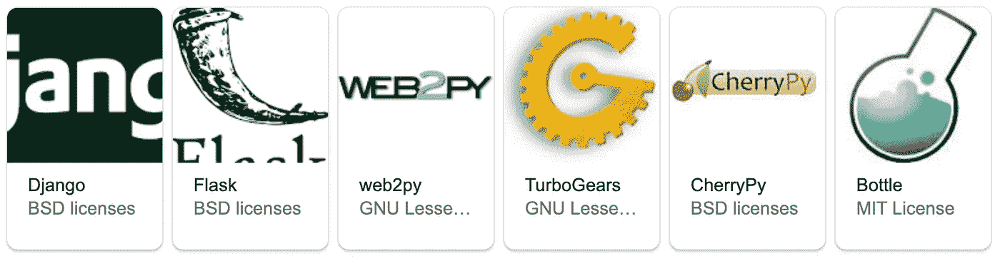

# 面向端到端数据科学家的 2020 年 t 型技能构建指南

> 原文：<https://towardsdatascience.com/t-shaped-skills-builder-guide-in-2020-for-end-to-end-data-scientist-33d2652511b0?source=collection_archive---------20----------------------->

## 该行业需要更多有能力根据这些大量信息进行总结、分析和决策的人。


由[我](https://medium.com/@chauvinhloi)设计

我父亲过去常说，如果一个人专攻一个领域，他就会很富有。对他这一代人来说，成为某个特定领域的专家将保证事业成功。几十年前，当我们还生活在信息时代，互联网还没有像今天这样普及时，信息是珍贵的，人们试图在非常有限的资源内逐个收集知识。那时，只有当他们频繁接触工作时，他们才能获得更多的信息和经验，因为他们几乎找不到可以快速学习的额外信息来源。这些专家因此成为公司的宝贵财富，没有人可以取代他们的角色。专注于一件事是他们独特的价值观，因此这有助于确保他们的工作以及确保事业蒸蒸日上。二十年前很难找到一个 Java 开发者，那时大学还在学士课程中教授 Pascal 或 C 语言，Coursera、Udemy 或 YouTube 还没有成立。这些开发人员经常获得极高的薪水，他们构建了我们现在所说的传统系统。每当我接触这些系统，我真的很尊重制造商。

如今，信息随处可见，不再是一个秘密，公司不再那么依赖拥有高度专业技能的员工。相反，该行业需要更多有能力根据这些大量信息进行总结、分析和决策的人。我们现在生活在概念时代，我们不仅拥有比以往更多的数据，而且面临更复杂的问题，需要综合技能和多学科来提供完整的端到端解决方案。这种趋势目前正在包括数据科学在内的所有行业迅速采用，这就是为什么公司现在需要更多独角兽或 T 型数据科学家来解决他们复杂的业务问题。换句话说，数据科学家应该在 T 形的横条(宽度)上拥有多样化的技能，同时在竖条(深度)上成为特定领域的专家。

基于我作为一名数据科学家非常有限的经验，我想为那些想成为数据科学领域 T 型人的人分享一个基本的构建者指南。

# 建筑指南

> 专家

成为某一方面的专家并不意味着你必须深入了解某一特定领域，事实上，你不应该太深入。时间是有限的资源，每个人每天都有同样的 24 小时。当你太专注于学习一项技能时，你将没有足够的时间去探索行业所需的各种技能。你能做的是建立一个核心知识，并在此基础上发展其他技能。

## 核心知识

作为一名数据科学家，你应该知道关于统计和数学的基础知识(代数是必须的，可能还会有一点微积分)。统计学将为假设检验和理解数据特征提供工具，而微积分是分析数据变化或趋势的工具。没有统计学和微积分的相关知识，你将无法理解你的预测的置信区间和神经网络的消失梯度。

除了统计学和数学，尝试让自己熟悉一些机器学习模型，如分类、聚类和回归。他们将介绍机器学习的不同分支的概述，以便您可以为您的特定业务问题选择合适的模型类型。此外，您还可以了解一些高级的 ML 模型，如 Random Forest 和 XGBoost，因为它们是可解释的模型，非常准确，广泛用于大多数使用 ML 的常见问题。

深度学习将是一个加号。然而，由于最近没有关于神经网络架构的破坏性探索，并且每个网络结构的用例已经建立了多年，所以你应该认为自己是一名在应用这些模型解决实际业务问题方面经验丰富的人工智能从业者。此外，关于人工智能及其应用的信息现在在互联网上无处不在，因此你可以快速找到要使用的模型。有些甚至提供了代码和微调说明，假设你已经有了基本的知识。这里的问题是，当你坐在大学里时，你不会有足够的时间掌握所有这些领域。因此，你需要第二个核心技能:研究。

## 研究技能

大多数数据科学家团队都是根据业务需求组建的，以解决业务问题为导向。他们必须为每种类型的问题提供非常具体的解决方案，因此团队必须拥有具备不同技能的人员来处理公司分配的任何任务。然而，他们通常不知道业务问题，因此也不知道需要事先学习的技能。换句话说，它必须在飞机上学习。在这种情况下，研究技能变得极其重要，因为它会帮助你快速、准确地了解事情，足以解决问题。例如，如果由于对变量类型的严格要求，项目要求您用 Typescript 编写代码，那么您将不得不学习 Typescript，即使您对 Python 更有信心。或者，如果企业主要求您构建一个 web 应用程序来为用户提供您的推荐模型，那么您将不得不学习 ReactJS 或 Angular，尽管您对前端开发的了解有限。

当然，你不可能在一两周内成为打字稿或前端开发的专家。然而，你可以交付一个完整的端到端解决方案，带来商业价值，而不是一个高度精确的模型，但没有人可以使用。

学习“如何学习”是最难的科目，没有人能教你。尽管流行的研究方法有一些共同的做法，但每个人的思维路径都是独特的，因为他们有不同的能力，生活条件，教育甚至习惯都会影响他们的思维方式。因此，人们以许多不同的方式学习，找到学习事物的最佳方式是你自己的冒险。这项技能将有助于拓展你在 T 型单杠上的技能组合，最终有助于你事业的成功。

> 多面手

随着核心知识的积累，你在机器学习和研究方法方面已经足够专业，然后你可以开始扩展技能集，成为多面手。你可以把 T 字横线上的这些技能想象成用来连接充电器和设备的不同类型的电缆。你有越多类型的连接器(微型 USB、USB-C 或 Lightning)，你就有越多类型的设备可以充电。换句话说，作为多面手，你掌握的技能越多，你能涉足的行业就越多。以下是对在生产中使用数据的数据科学家有用的一些基本技能。

## 云平台

虽然“快速失败，经常失败”是数据科学中敏捷开发的关键概念，但如何从失败中立即恢复是团队应用敏捷所需要的。毕竟，您不希望您的应用程序经常失败，并且在事件发生后需要几个小时才能恢复。尽管自 1957 年初以来就出现了迭代和增量开发，但敏捷如今如此受欢迎的原因之一是，它现在得到了多种技术的支持，如容器、微服务、Kubernetes、持续集成/持续部署(CI/CD)和云计算。这些技术使系统更健壮，更容易出错，这样团队就可以从崩溃整个应用程序的恐惧中解放出来。本地系统几乎无法实现这些功能，并且通常需要昂贵复杂的硬件和软件配置。当公司无法快速扩展其系统并在团队中共享计算资源时，计算性能是另一个问题。

我曾经有机会在一个使用本地服务器的数据分析团队中工作，我可以确认这些难题是真实存在的。我的前半个工作日通常花在运行数据库查询和等待结果返回上。直到我把所有的数据转储到我的工作空间，我才能开始处理和分析它。有时，我的队友运行计算密集型查询和代码，使服务器挂起几个小时。然后，他们必须联系 DBA 来终止查询，并在下班后服务器不忙时运行查询。在这种情况下，如何快速测试您的假设并迭代数据科学流程？幸运的是，团队中的人都很聪明，他们都有办法以这样或那样的方式克服问题，完成工作。然而，这真的让他们慢了下来。


谷歌云平台(图片来源:[博客。谷歌](https://blog.google/products/google-cloud/cloud-covered-what-was-new-with-google-cloud-in-august-19/)

云环境是解决上述所有问题的良方，因为它具有高可用性和可扩展性。该环境也是可复制的，因此即使整个系统崩溃，您也可以用最少的努力来重新创建它。此外，containers orchestration 解决方案将持续检查每个服务器(微服务)的健康状况，如果一个服务器出现故障，它将在几秒钟内自动启动一个新的服务器。您可以放心地测试您的代码和想法，而不必担心会导致应用程序崩溃的未知错误。如果您需要更多的计算能力，云计算实例也将自动扩展。

信不信由你，大多数公司都在努力寻找他们在云上的家，特别是当人们到处都在谈论数字化转型时，当前的疫情甚至增加了企业领导者将他们的公司转型为几乎百分之百数字化或数字化双胞胎的压力。因此，强烈建议拥有一两个云平台的一些经验。

## 后端 API

你有一个非常精确的模型。现在怎么办？你不能仅仅使用 Jupyter Notebook，通过手动将看不见的观察结果输入笔记本并重新运行来服务数百个用户。相反，您应该将您的 ML 模型公开为一个服务，或者换句话说，一个 API。这里的意思是，您有一个服务器正在运行并接受预测请求。你所要做的就是发送一个带有未知数据的 HTTP 请求，服务器会自动返回一个预测值。

下面是一些流行的 Python web 框架，可以用来构建后端。



顶级 Python Web 框架(从 Google 搜索中获取)

你也可以在这里 *(要学习的 10 大 Python Web 框架)*阅读更多关于这些框架的内容。

请记住，这个列表中有两种类型的 web 框架:全栈和非全栈。如果你决定用微服务架构来构建你的应用，那么我会推荐你使用非全栈框架，比如 Flask，因为它灵活、轻量、容器友好。

## 前端框架

有了后端之后，你的模型现在变成了一个活的服务。但是，您不希望用户输入一个很长的请求 URL 来获得预测结果。

```
# A long request URL
http://mymodel.com/api/predict?sepal-length=2.3&sepal-width=1.1&petal-length=3.4&petal-width=2.5
```

你需要一个用户界面。


照片由[哈尔·盖特伍德](https://unsplash.com/@halgatewood?utm_source=unsplash&utm_medium=referral&utm_content=creditCopyText)在 [Unsplash](https://unsplash.com/s/photos/web-ui?utm_source=unsplash&utm_medium=referral&utm_content=creditCopyText) 上拍摄

您应该知道一个前端框架来帮助您构建与后端通信的 UI。例如，如果您正在构建一个 web 应用程序来预测鸢尾花的种类，那么 UI 可能有四个输入框来获取萼片长度、萼片宽度、花瓣长度、花瓣宽度的用户输入，并有一个提交按钮来获取预测结果。在用户点击提交按钮后，前端将使用给定的参数构造请求 URL，并将其发送到模型服务的后端。之后，后端将回应预测的花卉品种，然后可以在前端显示。

React、Vue.js 和 Angular 是我写这篇文章时最流行的三个框架，你应该选择其中一个来学习。


React，Vue.js 和 Angular(图片来源: [Hackernoon](https://hackernoon.com/angular-vs-react-vs-vue-which-is-the-best-choice-for-2019-16ce0deb3847) )

## 集装箱化和流程编排


Docker-Kubernetes 在一起(由来自 [Docker 博客](https://www.docker.com/blog/top-questions-docker-kubernetes-competitors-or-together/docker-kubernetes-together/)的[大卫·弗里德兰德](https://www.docker.com/blog/author/david-friedlander/)插图)

在其他机器或云平台上运行您的代码时，环境依赖性是一个常见的问题，在软件工程中，容器被广泛用于解决这个问题。具体来说，代码和运行代码所需的必要组件都装在一个叫做容器的封闭盒子里。然后，可以将该容器部署到任何地方运行，而不用担心依赖性问题。

每个容器都可以被看作是一个微服务，执行一个更大架构的简单功能，如果一个服务被关闭，它不应该在系统中产生大的中断，恢复时间应该是最小的。考虑到这一点，熟悉 Docker 容器是你应该放在简历上的一项基本技能。

容器编排管理容器的生命周期，并确保平台上运行的每个服务的可用性。例如，您可能希望三个模型同时在线(副本),这样，如果一个模型出现故障，另外两个模型仍然可以为用户服务。它还可以执行其他任务，如负载平衡，以帮助利用所有可用的副本并提高平台性能。对于容器编排，您应该将 Kubernetes 添加到您希望学习的技能列表中。

## CI/CD 管道


图片来源: [Katalon 博客](https://www.katalon.com/resources-center/blog/ci-cd-pipeline/)

如果一个模型被重新训练或更新以包含一个新的特性，它应该在后端被更新，这个任务应该被自动完成以避免人为错误并缩短更新周期以获得一个真正的敏捷体验。为了使其无缝，并在为容器推出较新的机器学习模型时减少人力，建议使用 CI/CD(持续集成和持续部署)管道。

可以建立 CI/CD 管道来执行以下任务:重新训练模型，将较新的模型提交到 Git repo 中，自动测试和部署 ML 模型，等等。一些流行的 CI/CD 解决方案有 Travis CI、Jenkins 和 Gitlab CI，我个人更喜欢最后一种，因为它在一个平台中包括 Git repo 和 CI/CD 管道。

## 统计思维

最后，作为一名数据科学家，你应该始终保持开放的心态，不要陷入偏见的陷阱，不让自己探索更有价值的见解。换句话说，不要轻易接受结果，轻易下结论。

让我们以著名的亚伯拉罕·瓦尔德和《琼斯母亲》中缺失的弹孔来结束这个故事。

> 回到第二次世界大战期间，英国皇家空军在德国防空炮火下损失了很多飞机。所以他们决定给他们穿上盔甲。但是盔甲放在哪里呢？显而易见的答案是观察执行完任务返回的飞机，统计各个地方的所有弹孔，然后在吸引最多火力的地方增加装甲。
> 
> 显而易见却是错误的。正如匈牙利出生的数学家亚伯拉罕·瓦尔德当时解释的那样，如果一架飞机安全返回，即使它的机翼上有很多弹孔，这意味着机翼上的弹孔不是很危险。你真正想做的是武装那些平均来说*没有任何弹孔的区域。*


照片来自[琼斯妈妈——违反直觉的世界](https://www.motherjones.com/kevin-drum/2010/09/counterintuitive-world/)

> 为什么？因为那些地方有弹孔的飞机再也回不来了。这就是为什么你在返回的子弹上看不到任何弹孔。聪明！
> 
> (来自[琼斯妈妈](https://www.motherjones.com/kevin-drum/2010/09/counterintuitive-world/))

特色图像中使用的图标的属性

*   来自 www.flaticon.com[的](https://www.flaticon.com/)[dinosoftlab](https://www.flaticon.com/authors/dinosoftlabs)
*   来自 www.flaticon.com[的](https://www.flaticon.com/)[美女](https://www.flaticon.com/authors/prettycons)
*   [来自 www.flaticon.com](https://www.flaticon.com/authors/monkik)[的蒙克](https://www.flaticon.com/)
*   [来自](https://www.flaticon.com/authors/prosymbols)[www.flaticon.com](https://www.flaticon.com/)的原符号
*   来自 www.flaticon.com[的](https://www.flaticon.com/)
*   [桉树](https://www.flaticon.com/authors/eucalyp)来自[www.flaticon.com](https://www.flaticon.com/)
*   来自 www.flaticon.com[的](https://www.flaticon.com/) [Smashicons](https://www.flaticon.com/authors/smashicons)