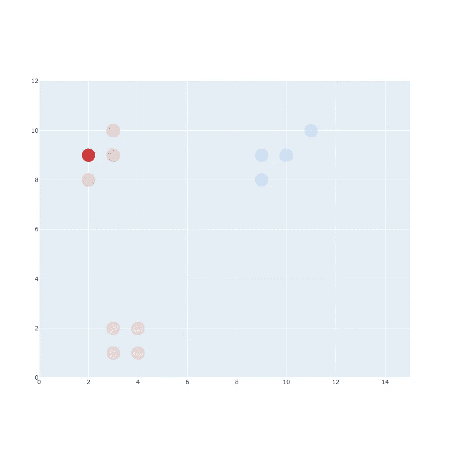
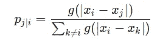
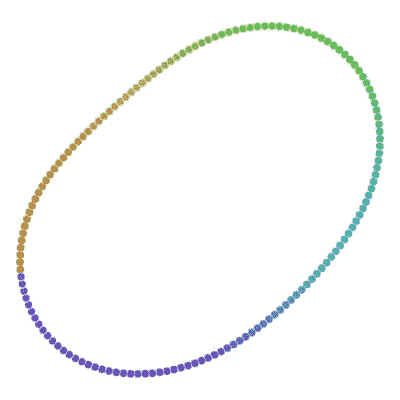

# t-SNE 清楚地解释道

> 原文：<https://towardsdatascience.com/t-sne-clearly-explained-d84c537f53a?source=collection_archive---------1----------------------->

## 理解 ML

## t-SNE 算法的直观解释以及它在实践中如此有用的原因。

资料来源:K. Movahedi，Y. Saeys，[http://www.brainimmuneatlas.org/tsne-cp-irf8.php](http://www.brainimmuneatlas.org/tsne-cp-irf8.php)

# 什么是 SNE 霸王龙？

你们很多人已经听说过像 **PCA** 这样的降维算法。其中一种算法叫做**t-SNE**(t-分布式随机邻居嵌入)。它是由劳伦斯·范德·马滕和杰弗里·辛顿在 2008 年开发的。你可能会问“我为什么要在乎？我已经知道 PCA 了！”这将是一个很好的问题。t-SNE 是一种叫做**非线性降维**的东西。这意味着这个算法允许我们分离不能被任何直线分离的数据，让我给你看一个例子:

*线性不可分数据，来源:*[*https://distill.pub/2016/misread-tsne/*](https://distill.pub/2016/misread-tsne/)*CC-BY 2.0*

*线性不可分数据，来源:*[*https://distill.pub/2016/misread-tsne/*](https://distill.pub/2016/misread-tsne/)CC-BY 2.0

如果你想玩这些例子，去访问[蒸馏](https://distill.pub/2016/misread-tsne/)。

可以想象，当通过 PCA 解析时，这些例子不会返回任何合理的结果(忽略将 2D 解析为 2D 的事实)。这就是为什么至少知道一种处理线性不可分数据的算法是很重要的。

你需要记住，t-SNE 是迭代的，所以与主成分分析不同，你不能将它应用于另一个数据集。PCA 使用全局协方差矩阵来减少数据。您可以获得该矩阵，并将其应用于一组新数据，得到相同的结果。当您需要尝试减少您的特征列表并重用从训练数据创建的矩阵时，这很有帮助。t-SNE 主要用于理解高维数据，并将其投影到低维空间(如 2D 或 3D)。这使得它在处理 CNN 网络时非常有用。

# SNE 霸王龙是如何工作的？

## 概率分布

让我们从 t-SNE 的 SNE 部分开始。我更擅长直观地解释事物，所以这将是我们的数据集:

它有 3 个不同的类别，你可以很容易地将它们区分开来。该算法的第一部分是创建一个表示邻居之间相似性的**概率分布**。什么是“相似”？[原文](http://www.jmlr.org/papers/volume9/vandermaaten08a/vandermaaten08a.pdf)陈述“**数据点** xⱼ **到数据点** xᵢ **的相似度是条件概率** p_{j|i} **，即** xᵢ **会选择** xⱼ **作为其邻居**”。

我们从数据集中挑选了一个点。现在，我们必须选择另一个点，并计算它们之间的欧几里得距离|xᵢ-xⱼ|

原始论文的下一部分指出，在以 xᵢ.为中心的高斯分布下，它必须**与概率密度成比例因此，我们必须生成在 xᵢ *、*处具有平均值的高斯分布，并将我们的距离放在 x 轴上。**

现在你可能想知道 *σ* (方差)，这是一件好事。但是让我们暂时忽略它，假设我已经决定了它应该是什么。计算完第一个点后，我们必须对每一个点做同样的事情。

你可能会想，我们已经完成了这一部分。但这只是开始。

## 分散聚类和方差

在这一点上，我们的集群被紧紧地束缚在它的组内。如果我们有一个这样的新集群会怎么样:

我们应该能够应用与以前相同的过程，不是吗？

我们还没完。您可以区分相似点和非相似点，但是概率的绝对值比第一个示例中的要小得多(比较 Y 轴值)。

我们可以通过将当前投影值除以投影总和来解决这个问题。

如果你应用于第一个例子，看起来会像这样:

对于第二个例子:

这会缩放所有值，使其总和等于 1。这里很好的提一下，p_{i|i}设置为等于 0，而不是 1。

## 处理不同的距离

如果我们取两个点并试图计算它们之间的条件概率，那么 p_{i|j}和 p_{j|i}的值将是不同的:

这是因为它们来自两个不同的发行版。那么我们应该选择哪一个来计算呢？

其中 *N* 是维数。

## 谎言:)

现在，当我们将所有东西都缩放到 1(是的，所有的总和等于 1)时，我可以告诉你，我对你的过程并不完全诚实:)计算所有这些对算法来说将是非常痛苦的，这并不是 t-SNE 论文中的确切内容。

这是一个计算 p_{j|i}的原始公式。我为什么要骗你？首先，因为更容易对它的工作原理有一个直觉。第二，因为无论如何我都要向你展示低谷。

## 困惑

如果你看看这个公式。你可以发现我们的

是

如果我直接向您展示这一点，将很难解释 *σ* 的来源以及它与我们的集群之间的依赖关系。现在你知道方差取决于高斯和围绕它中心的点数。这就是**困惑**值来的地方。困惑或多或少是我们中心点的目标邻居数。基本上，困惑度越高，方差的值就越高。我们的“红色”组彼此靠近，如果我们将困惑度设置为 4，它会搜索合适的值来“适应”我们的 4 个邻居。如果你想更具体一些，你可以引用原文:

> *SNE 对西格玛的值进行二分搜索法，产生具有用户指定的固定困惑度的概率分布*

在哪里

就是**香农熵**。但是，除非您想自己实现 t-SNE，否则您唯一需要知道的是，您选择的困惑与\mu_i *μi* 的值正相关，并且对于相同的困惑，您将有多个不同的\mu_i *μi* ，基于距离。典型的困惑值范围在 5 到 50 之间。

## 原始公式解释

当你看这个公式的时候，你可能会注意到我们的高斯转换成

让我给你看看这是什么样子:

如果你玩一会儿 *σ* ，你会注意到蓝色曲线保持固定在点 *x* =0。只有当 *σ* 增加时，它才会拉伸。

这有助于区分邻居的概率，因为你已经理解了整个过程，你应该能够调整它到新的值。

## 创造低维空间

t-SNE 的下一步是用与原始空间相同数量的点创建低维空间。点应该随机分布在一个新的空间。该算法的目标是在低维空间中寻找相似的概率分布。对于新分布，最明显的选择是再次使用高斯分布。不幸的是，这不是最好的主意。高斯的特性之一是它有一个“短尾巴”，正因为如此，它产生了一个**拥挤问题**。为了解决这个问题，我们将使用单自由度的**学生 t 分布**。关于如何选择这种分布以及为什么高斯分布不是最佳方案的更多信息，你可以在[的论文](http://www.jmlr.org/papers/volume9/vandermaaten08a/vandermaaten08a.pdf)中找到。我决定不在这上面花太多时间，让你在合理的时间内阅读这篇文章。所以现在我们的新公式看起来像:

而不是:

如果你是更“视觉化”的人，这可能会有帮助(X 轴上的值是随机分布的):

使用学生分布正是我们所需要的。它“下落”很快，而且有一条“长尾”，所以各个点不会被挤成一个点。这次我们不用为 *σ* 费心了，因为 q_{ij}公式里没有。我不会生成计算 q_{ij}的整个过程，因为它的工作原理和 p_{ij}完全一样。相反，只留下这两个公式，直接跳到更重要的事情上:

# 梯度下降

为了优化这种分布，t-SNE 使用条件概率 p_{j|i}和 q_{j|i}之间的 Kullback-Leibler 散度

我在这里不讨论数学，因为它不重要。我们需要的是的导数(它在[原文](http://www.jmlr.org/papers/volume9/vandermaaten08a/vandermaaten08a.pdf)内的**附录 A** 中推导)。

你可以把这个梯度看作点与点之间的排斥和吸引。为每个点计算一个梯度，并描述它应该被拉动的“力度”以及它应该选择的方向。如果我们从随机 1D 平面开始，对之前的分布进行梯度计算，结果应该是这样的。

Ofc。这是一种夸张。SNE 霸王龙跑得没那么快。我跳过了很多步骤来加快速度。除此之外，这里的值并不完全正确，但足以向您展示这个过程。

## t-SNE 为提高性能所做的技巧(优化)

t-SNE 表现不错，但也有一些改进，让它做得更好。

## 早期压缩

为了防止早期聚类，t-SNE 在早期阶段将 L2 惩罚添加到成本函数中。你可以把它当作标准的正则化，因为它允许算法不关注局部组。

## 早期夸张

这个技巧允许移动更多的(q_{ij})簇。这次我们在早期乘以 p_{ij}。因为集群不会妨碍彼此。

# 例子

如果你还记得文章顶部的例子，现在是时候向你展示 SNE 霸王龙是如何解决这些问题的了。

*来源:***CC-BY 2.0**

**

**困惑 5、来源:*[*https://distill.pub/2016/misread-tsne/*](https://distill.pub/2016/misread-tsne/)*CC-BY 2.0**

**

**来源:*[*https://distill.pub/2016/misread-tsne/*](https://distill.pub/2016/misread-tsne/)CC-BY 2.0*

**

**困惑 5、来源:*[*https://distill.pub/2016/misread-tsne/*](https://distill.pub/2016/misread-tsne/)*CC-BY 2.0**

**

**困惑 5、来源:*[*https://distill.pub/2016/misread-tsne/*](https://distill.pub/2016/misread-tsne/)*CC-BY 2.0**

*所有运行执行 5000 次迭代。*

## *CNN 应用*

*t-SNE 在处理 [CNN](https://en.wikipedia.org/wiki/Convolutional_neural_network) 特色地图时也很有用。你可能知道，深度 CNN 网络基本上是黑匣子。没有办法真正解释网络中更深层次的内容。一个常见的解释是，更深层次包含关于更复杂对象的信息。但这并不完全正确，你可以这样解释，但数据本身对人类来说只是高维噪音。但是，在 t-SNE 的帮助下，您可以创建地图来显示网络中哪些输入数据看起来“相似”。*

*其中一个翻译是由安德烈·卡帕西和 https://cs.stanford.edu/people/karpathy/cnnembed/cnn[6k.jpg](https://cs.stanford.edu/people/karpathy/cnnembed/cnn_embed_6k.jpg)共同完成的。*

*卡帕西做了什么？他从 [LSVRC 2014](http://www.image-net.org/challenges/LSVRC/2014/) 中取了 50k 张图片，提取了一张 4096 维的 CNN 特征图(更准确的说是 4096 图来自 fc7 层)。*

**

**CNN 网络，来源:* [*使用整体视觉描述符在不同光照下拓扑模型中的分层定位*](https://ieeexplore.ieee.org/abstract/document/8688396)*

*在得到每一张图像的矩阵后，他用 t-SNE 计算了 2D 嵌入。最后，他只是用 2D 海图上的原始图像生成了那张地图。对于特定的 CNN 网络，您可以很容易地找出哪些图像彼此“相似”。*

# *结论*

*t-SNE 是理解高维数据集的一个很好的工具。当您想要为 ML 训练执行维度缩减时，它可能不太有用(不能以相同的方式重新应用)。它不是确定性的和迭代的，所以每次运行时，它都可能产生不同的结果。但是即使有这些缺点，它仍然是该领域中最流行方法之一。*

# *参考资料:*

*   *长度辛顿·马滕。使用 t-SNE 可视化数据，2008 年*
*   *Cristobal Parra，Sergio Cebollada，Luis Payá，Mathew Holloway，Oscar Reinoso，“使用 RGB-D 点云估计地下环境中移动机器人位置的新方法”， *Access IEEE* ，第 8 卷，第 9084–9101 页，2020 年。*

**最初发布于*[*https://erdem . pl*](https://erdem.pl/2020/04/t-sne-clearly-explained)*。**