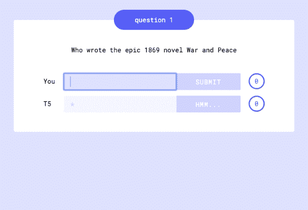
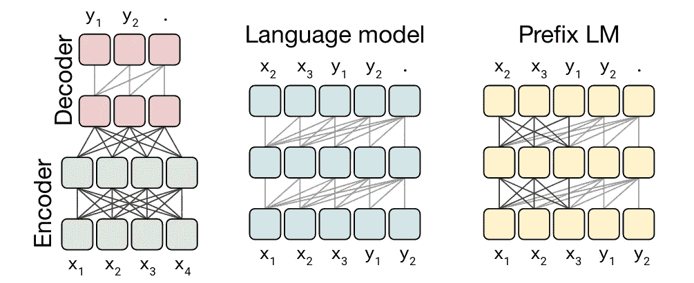
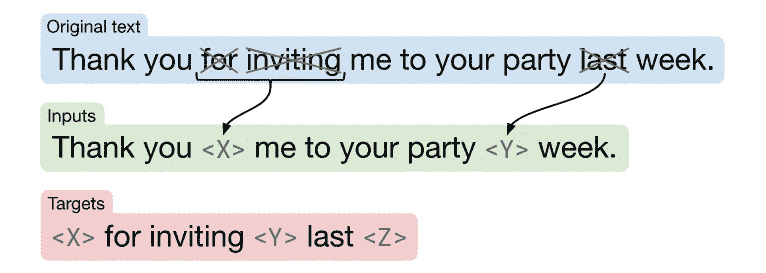
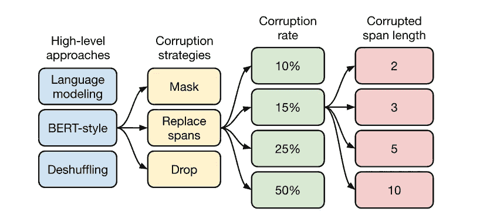
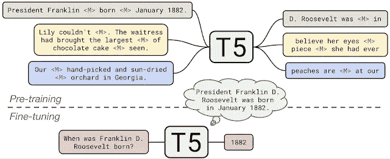

# T5:文本到文本转换转换器

> 原文：<https://towardsdatascience.com/t5-text-to-text-transfer-transformer-643f89e8905e?source=collection_archive---------4----------------------->

## 了解基于变压器的自监督架构

通过[谷歌人工智能博客](https://ai.googleblog.com/2020/02/exploring-transfer-learning-with-t5.html)为 QnA 提供 T5

随着[迁移学习](https://en.wikipedia.org/wiki/Transfer_learning)的蓬勃发展，深度学习已经取得了许多奇迹。更确切地说，在 NLP 中，随着 Transformer 的兴起( [Vaswani 等人。艾尔。](https://arxiv.org/abs/1706.03762))，出现了各种“语言建模”的方法，其中我们通过为一个非常通用的任务预先训练模型，然后针对特定的下游问题对其进行微调，来利用迁移学习。

在这篇文章中，我们将讨论 Google 的最新技术，**T5**—**T**ext-**T**o-**T**ext**T**Transfer**T**Transformer 模型，该模型是今年早些时候在论文中提出的，“用统一的文本到文本转换器探索迁移学习的极限”。本文本质上是对语言理解中使用的现代迁移学习技术的综述，因此提出了一个统一的框架，试图将所有的语言问题结合到一个文本到文本的格式中。我们将在接下来的章节中更详细地讨论这种方法。此外，作者还开源了一个新的数据集(为了方便他们的工作)，名为**C4**—**C**olossal**C**lean**C**rawled**C**or pus。

# T5—文本到文本转换转换器

如前所述，T5 试图将所有下游任务组合成文本到文本的格式。

## 文本到文本的框架

通过[谷歌人工智能博客](https://ai.googleblog.com/2020/02/exploring-transfer-learning-with-t5.html)为所有下游任务提供统一框架

考虑 BERT 风格架构的示例，该架构针对屏蔽 LM 和下一句预测目标进行预训练，然后针对下游任务进行微调(例如预测分类中的类别标签或 QnA 中的输入跨度)。这里，我们在不同的下游任务上分别微调预训练模型的不同实例。

相反，文本到文本框架建议在所有 NLP 任务上使用相同的模型、相同的损失函数和相同的超参数。在这种方法中，输入以这样一种方式建模，即模型应该识别任务，而输出只是预期结果的“文本”版本。参考上面的动画可以更清楚地看到这一点。

> 有趣的事实:我们甚至可以通过训练 T5 来输出预期输出的字符串表示，从而将 T5 应用于回归任务。

## C4——庞大干净的爬行语料库

在巨大的未标记数据集上预先训练语言模型是一种刻板印象。通用爬虫就是这样的数据集之一。它是通过抓取网页并忽略 HTML 中的标记而获得的。它每月产生大约 20TB 的废弃数据。然而，普通爬行包含大量的像菜单或错误信息，或重复文本的乱码文本。此外，对于我们的任务来说，还有相当数量的无用文本，比如攻击性的词语、占位符文本或源代码。

对于 C4，作者从 2019 年 4 月开始使用普通抓取，并对其应用了一些清理过滤器:

1.  保留仅以有效的结尾标点符号(句号、感叹号、问号或结束引号)结尾的句子。
2.  移除任何包含出现在“[肮脏、淘气、淫秽或其他不良词语列表](https://github.com/LDNOOBW/List-of-Dirty-Naughty-Obscene-and-Otherwise-Bad-Words)中的攻击性词语的页面。
3.  “必须启用 JavaScript”类型警告通过过滤掉任何包含单词 JavaScript 的行来移除。
4.  带有占位符文本(如“lorem ipsum ”)的页面将被移除。
5.  通过移除任何包含花括号“{”的页面来移除源代码(因为花括号出现在许多众所周知的编程语言中)。
6.  为了消除重复，考虑三句话的跨度。相同的 3 个句子的任何重复出现被过滤掉。
7.  最后，由于下游任务多为英语语言， [langdetect](https://pypi.org/project/langdetect/) 用于过滤掉任何概率至少为 0.99 的未归类为英语的页面。

这产生了 750GB 的数据集，不仅比大多数预训练数据集合理地大，而且包含相对非常干净的文本。

## 输入和输出表示

这是 T5 的主要关注点之一，因为这使得统一的文本到文本的方法成为可能。为了使所有下游任务使用相同的模型，将特定于任务的文本前缀添加到提供给模型的原始输入中。这个文本前缀也被认为是超参数。

> 例如，要求模型翻译句子“那很好”从英语到德语，模型将被输入序列“**将英语翻译成德语:很好。**“并将被训练输出” **Das ist gut。**
> 
> — [T5 纸](https://arxiv.org/abs/1910.10683)

类似地，对于分类任务，模型预测对应于目标标签的单个单词。

> 例如，在 MNLI 基准上，目标是预测一个前提是否暗示("**蕴涵**")、矛盾("**矛盾**")，或者都不是("**中性**")一个假设。经过我们的预处理，输入序列变成了" **mnli 前提:我讨厌鸽子。假设:我对鸽子充满了敌意。**"与对应的目标词**"蕴涵。**
> 
> **— [T5 纸](https://arxiv.org/abs/1910.10683)**

**这里有一个问题。如果预测的单词是其他的东西，即不是“蕴涵”、“矛盾”或“中性”的，该怎么办？嗯，在这种情况下，模型被训练成认为所有其他单词都是错误的。**

## **模型**

**所提出的模型本质上是一个编码器-解码器变换器。艾尔。)进行了一些架构上的改变(如在子块之前应用层归一化，然后将初始输入添加到子块输出；也称为预规范)。而且，模型配置类似于 BERT base ( [Devlin et。艾尔。](https://arxiv.org/abs/1810.04805))。**

**我们将跳过这些架构，因为它们超出了本文的范围。如果您特别想了解这些型号的规格，我已经在下面的文章中介绍了它们:**

1.  **变形金刚:[https://towards data science . com/transformers-explained-65454 c0 F3 fa 7](/transformers-explained-65454c0f3fa7)**
2.  **变形金刚实现:[https://medium . com/swlh/abstract ive-text-summary-using-transformers-3e 774 cc 42453](https://medium.com/swlh/abstractive-text-summarization-using-transformers-3e774cc42453)**
3.  **BERT:[https://medium . com/swlh/BERT-pre-training-of-transformers-for-language-understanding-5214 FBA 4a 9 af](https://medium.com/swlh/bert-pre-training-of-transformers-for-language-understanding-5214fba4a9af)**

## **培训方法**

****

**模型结构来自[论文](https://arxiv.org/abs/1910.10683)**

**在架构层面上，选择训练方法有几种选择:本文是对许多现代语言理解方法的详尽调查。因此，已经研究和比较了许多架构规范。**

1.  ****编码器-解码器(左):**这是标准的编码器-解码器，seq2seq 架构，其中编码器以伯特风格、**完全可见**的方式训练(即，每个标记都有助于序列中每个其他标记的注意力计算)，解码器以 GPT 风格**因果**的方式训练(即，序列中出现在它之前的所有标记都参与每个标记)。**
2.  ****语言模型(中):**这本质上就是前面讨论过的因果注意机制。这是一种自回归建模方法。**
3.  ****前缀 LM(右):**这是 BERT 风格和语言模型方法的组合。例如，将英语翻译成德语的任务可以具有伯特式的注意力:“将英语翻译成德语:很好。目标:“。然后翻译成“这是直觉”将自回归出席。**

**通过实验，编码器-解码器方法获得了最佳结果。**

## **无监督目标**

****

**从[到](https://arxiv.org/abs/1910.10683)纸张的损坏跨度**

**关于培训前的目标，作者也在实践中探索了一些方法:**

1.  ****语言建模:**这种方法主要包括因果预测任务，即考虑该单词之前的所有单词来预测句子中的下一个单词。**
2.  ****去混洗:**将一个句子中的所有单词进行混洗，并训练模型来预测原文。**
3.  ****Corrupting Spans:** 屏蔽句子中的单词序列，并训练模型预测这些屏蔽的单词，如上图所示。它也被称为去噪目标。**

**经过探索，去噪目标具有最有希望的结果。**

****

**从[论文中探索无监督目标](https://arxiv.org/abs/1910.10683)**

# **结果**

**首先，T5 已经在许多粘合、强力胶任务以及翻译和摘要基准测试中达到了最先进的水平。**

> **T5 惊人地擅长这项任务。完整的 110 亿参数模型在 [TriviaQA](https://nlp.cs.washington.edu/triviaqa/) 、[网络提问](https://worksheets.codalab.org/worksheets/0xba659fe363cb46e7a505c5b6a774dc8a)和[自然问题](https://ai.googleblog.com/2019/01/natural-questions-new-corpus-and.html)上分别有 50.1%、37.4%和 34.5%的时间产生答案的精确文本。**
> 
> **— [谷歌人工智能博客](https://ai.googleblog.com/2020/02/exploring-transfer-learning-with-t5.html)**

**为了生成真实的文本，T5 依赖于填空类型的任务，由于预先训练，T5 对填空类型的任务很熟悉。因此，作者创建了一个新的下游任务，称为**大小的填空**。例如，给定句子“*我喜欢吃花生酱和 _4_ 三明治，【T11”)，模型将被训练来预测空白的大约 4 个单词。***

> ****有趣的事实:该模型还根据所需的缺失文本大小来调整其预测。****

**以上的演示，参考[官博](https://ai.googleblog.com/2020/02/exploring-transfer-learning-with-t5.html)。**

# **把所有的放在一起**

****

**通过[谷歌人工智能博客](https://ai.googleblog.com/2020/02/exploring-transfer-learning-with-t5.html)对 T5 进行预训练和微调**

*   **T5 首先在 C4 数据集上被预训练，用于利用编码器-解码器架构的去噪、破坏跨度目标。**
*   **然后在下游任务上使用监督目标进行微调，并为文本到文本设置建立适当的输入模型。**

# **结论**

**在这篇文章中，我们深入研究了 Google 的 T5 模型，它是语言理解领域最先进的模型之一。我们看到了新的数据集:C4。这篇文章的主要收获是 T5 作者获得的关于训练方法、模型架构和数据集的实证结果。此外，还可以观察到，DL 越来越接近实现人类质量理解——在这种情况下，概括为许多 NLP 任务的一个模型。**

**github repo:[https://github . com/Google-research/text-to-text-transfer-transformer](https://github.com/google-research/text-to-text-transfer-transformer)**

**huggingface 用于模型架构和预训练权重的 API:[https://huggingface.co/transformers/model_doc/t5.html](https://huggingface.co/transformers/model_doc/t5.html)**

**https://www.tensorflow.org/datasets/catalog/c4 C4 张量流数据集:**

# **参考**

**T5 论文:【https://arxiv.org/abs/1910.10683 **

** [## 用 T5 探索迁移学习:文本到文本的迁移转换器

### 在过去的几年里，迁移学习在自然语言领域引发了一波新的前沿成果…

ai.googleblog.com](https://ai.googleblog.com/2020/02/exploring-transfer-learning-with-t5.html)  [## 变形金刚解释

### 对谷歌 Transformer 模型的详尽解释；从理论到实施

towardsdatascience.com](/transformers-explained-65454c0f3fa7)  [## 伯特:语言理解变形金刚的前期训练

### 了解基于变压器的自监督架构

medium.com](https://medium.com/swlh/bert-pre-training-of-transformers-for-language-understanding-5214fba4a9af)**