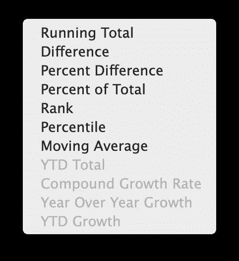
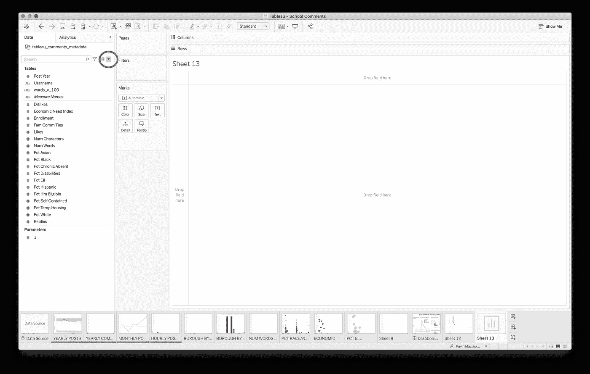
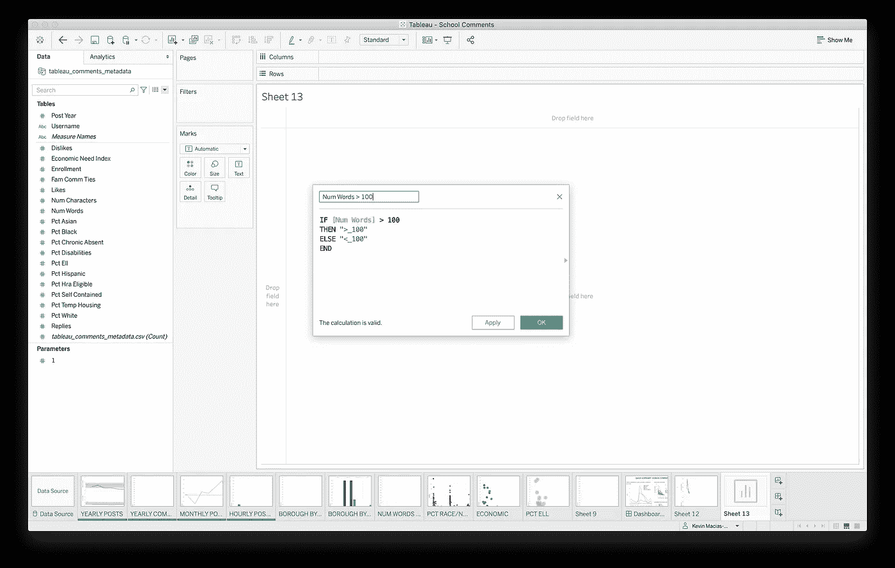
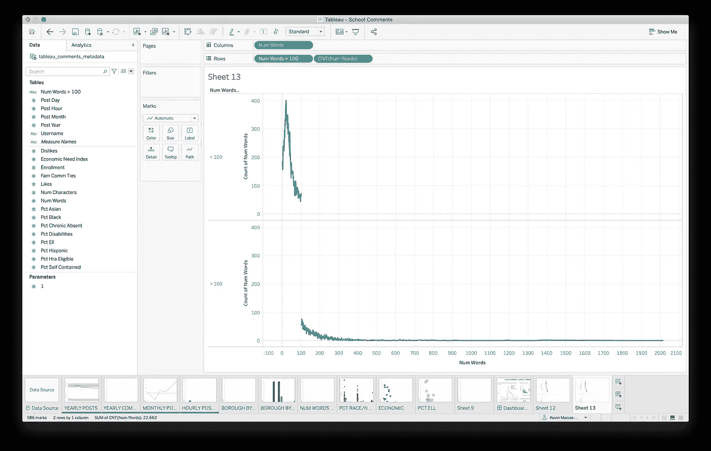
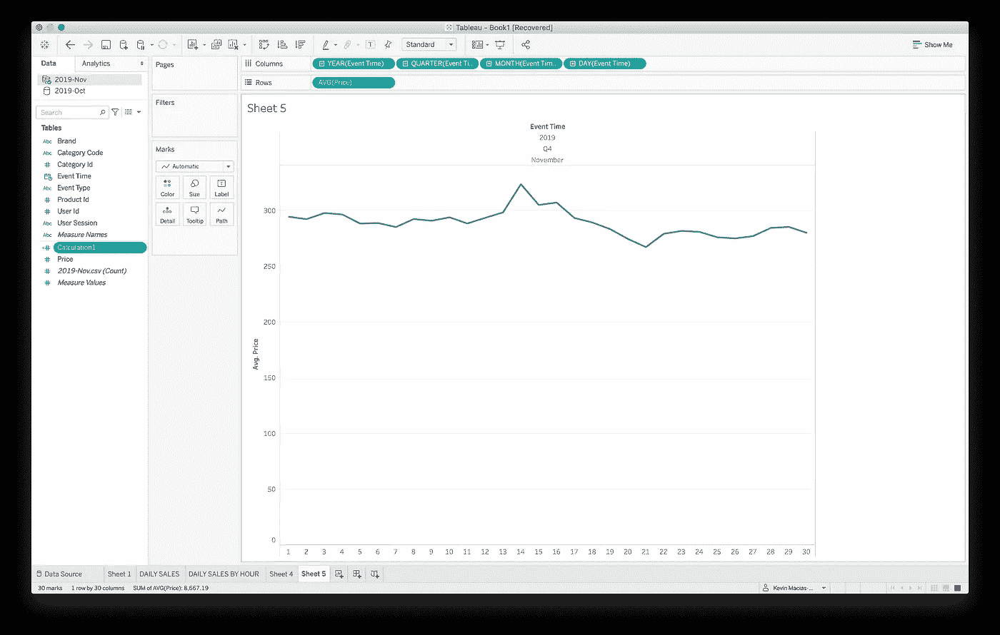
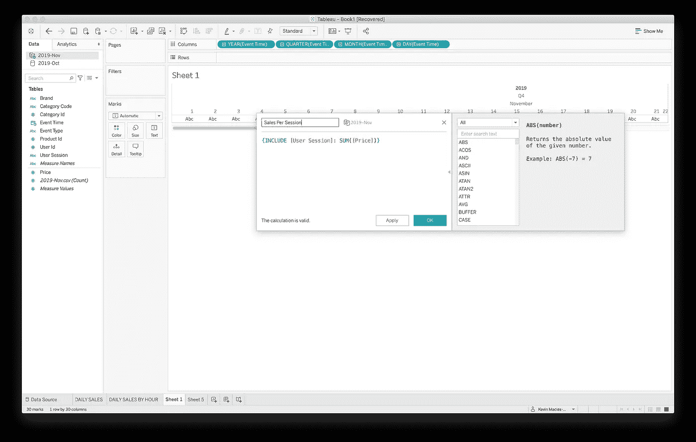
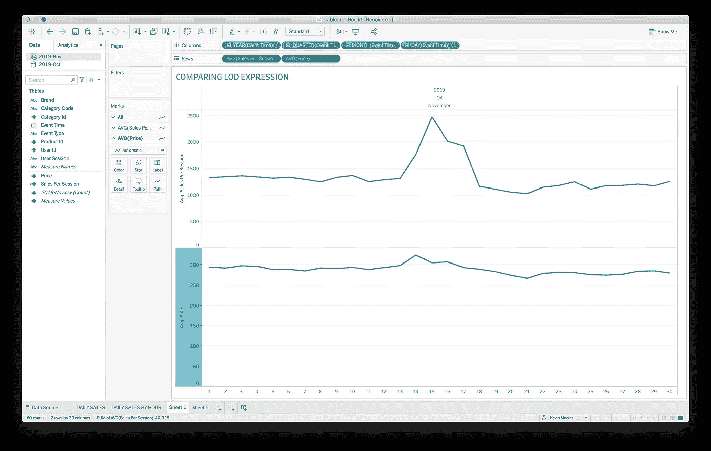

# 表格计算—简介

> 原文：<https://towardsdatascience.com/tableau-calculations-an-intro-9e89f92a3f68?source=collection_archive---------42----------------------->

照片由 [**奥列格马尼**发自](https://www.pexels.com/@oleg-magni?utm_content=attributionCopyText&utm_medium=referral&utm_source=pexels)[Pexels](https://www.pexels.com/photo/person-resting-their-hand-on-table-2058147/?utm_content=attributionCopyText&utm_medium=referral&utm_source=pexels)

这篇博客是我正在进行的“教学场景”博客的第三篇文章。在之前的文章中，我展示了如何从头到尾创建一个基本的仪表板，以及如何使用过滤器。本周的教程将复习“计算”。什么是计算？看起来很简单，但是 Tableau 对计算有三个定义。计算可以作为对数据源进行的查询的一部分写入，也可以在查询之后写入。这一秒钟后会更有意义。有基本计算、细节层次表达式(LOD)和表格计算。基本计算可以是聚合计算，如对整个数据集进行求和或求平均值，也可以通过计算单个行对数据源进行操作。基本计算是查询的一部分。LOD 表达式也是 Tableau 查询的一部分。Tableau 表示，它们允许我们“计算不在视图细节级别的聚合”。通过使用 EXCLUDE、INCLUDE 和 FIXED 函数，LOD 表达式可以在更详细的级别上工作。表计算写在查询之后，这意味着它们对作为查询结果计算的值进行操作。

虽然我们绝对有能力写出冗长复杂的计算，但有时简单的就足够了。如果我们点击一个药丸，并选择“快速表格计算”，有现成的表格计算供我们选择。

这种数据分析的蝙蝠侠工具带应该永远是你的首选。如果这些还不够，那么我们需要发挥脑力，进行更详细的计算。该字段可能不会显示，因为药丸可能只能使用基本计算。请记住，基本计算是在数据源上进行的，而表计算是根据查询结果在本地进行的。当我们有一个包含各种字段的可视化时，我们称之为“字段集”。例如，你可能有各种可以被分解的类别。我们可以把钢琴、吉他和贝司作为我们的“类别”。这些类别可以细分为“细分”，如声学和电气，其中包含总销售额等值，我们称之为“数量”。可以应用表格计算，但我们需要记住，当我们添加和删除字段时，表格计算也会相应地调整。

我们如何进行计算？首先，单击下面显示的下拉菜单，选择“创建计算字段”。

这将把你带到计算屏幕。在顶部字段中为您的计算命名。在这个例子中，我们希望看到所有超过 100 个单词的评论。对于这样的计算，基本的计算功能就可以了。其语法如下:**IF<expr>THEN<THEN>【else IF<expr 2>THEN<THEN 2>。。。】【ELSE<ELSE>END**。使用这种语法，我们将在计算字段中键入:**IF[Num Words]>100 THEN ">100 " ELSE "<100 " END**，如下图所示。

Tableau 会在你输入的时候自动填充建议，所以如果你忘记了你的选项，这是一个很好的提醒。如果你真的不知道有哪些选项可用，你可以点击计算字段右边的三角形，在那里会出现另一个包含所有聚合函数的窗口供你浏览。花些时间浏览选项是熟悉可用工具的好方法，因为每个功能都有精彩的摘要。现在我们有了我们的计算，我们可以点击 OK，这将添加一个药丸到左边的数据窗格与我们的标题。现在，我们所要做的就是将适当的药丸添加到行和列部分，并构建我们的计算图表。

添加我们计算的药丸将我们的图表分割成一个图表，所有评论少于 100 个单词。另一种快速计算方法是双击列或行部分的字段，这将允许您直接输入计算结果。在这里，你甚至可以将药丸从数据窗格拖到字段中，这样你就不必把它们打出来。

让我们看一个 LOD 表达式的例子。对于这个例子，我将使用来自 Kaggle.com 的电子商务数据集。你可以在这里找到:[链接](https://www.kaggle.com/mkechinov/ecommerce-behavior-data-from-multi-category-store?select=2019-Oct.csv)假设我们想要一个月中每天的平均销售额。我们的图表看起来像这样:

如果我们仔细观察数据，我们可以看到，对于每个会话，用户可能会购买同一商品的多个实例或几个不同的商品。如果我们想找到每个会话的平均销售额，看看一个普通用户在某一天花了多少钱。为此，我们可以执行一个 LOD 表达式。首先，我们调出表格计算菜单。在输入字段中，我们可以写入以下表达式**{ INCLUDE[User Session]:SUM([Price])}**

这将给我们一个新的药丸，我们可以移动到行部分，并建立我们的图表。现在，我们需要做的就是从药丸的 Measures 下拉菜单中将聚合函数更改为 AVG。我们可以看到下面对比的表格。

语法以花括号开始和结束。LOD 表达式可以使用 INCLUDE、EXCLUDE 和 FIXED。我们在这里使用 include 是因为我们希望计算考虑视图中的日维度。FIXED 和 EXCLUDE 的区别在于，FIXED 是在维度筛选之前计算的，而 EXCLUDE 是在维度筛选之后计算的。它们不会像 INCLUDE 那样考虑视图中的尺寸。

我希望这个关于表格计算的基本概述能激起你对一些数字运算的兴趣。这些计算会变得相当复杂，所以花时间练习是绝对必要的。我也想给 Pris Lam 的博客一些关于 LOD 表达式的信息。在这里查看他的一些作品:[链接](https://www.thedataschool.com.au/category/pris-lam/)。