# 使用形状文件进行数据可视化的公共 Tableau

> 原文：<https://towardsdatascience.com/tableau-public-for-data-visualization-using-shape-files-1782c9930f9?source=collection_archive---------40----------------------->

## 分析行人交通量——墨尔本群组

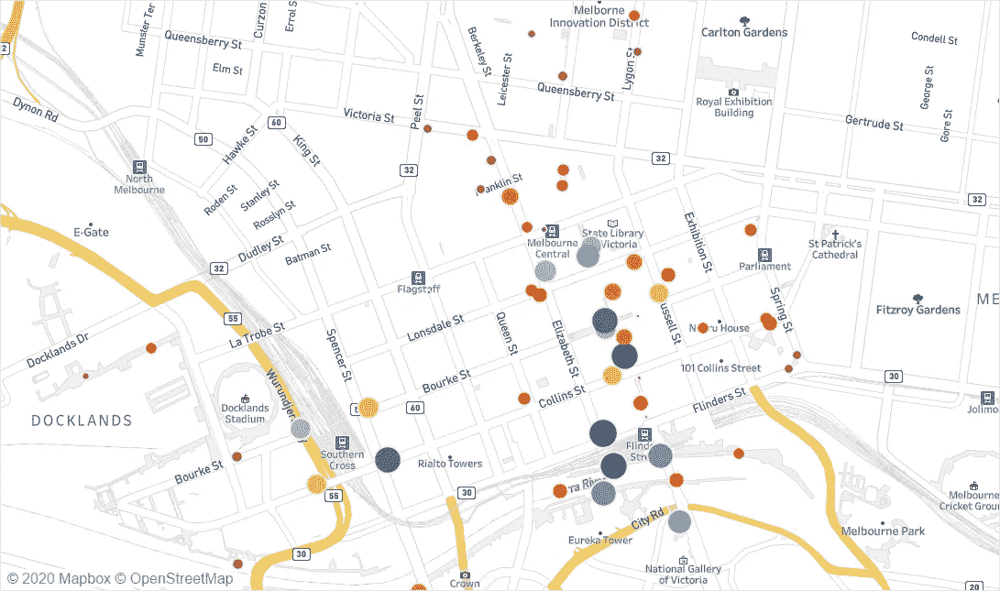

图片致谢—由作者使用 Tableau 开发

# 问题背景

行人活动在任何国家都是生气勃勃和充满活力的象征。正如人们常说的，“步行对一个城市很重要”，步行活动是一个城市经济繁荣、安全和人们生活便利的标志。墨尔本市开发的自动行人计数系统实现了信息库的开发，该信息库可用于分析城市不同部分居民的活动。安装在城市不同位置的行人计数传感器将数据传输到中央服务器，然后可以用于更好的决策和未来规划。该项目旨在深入研究使用这些传感器收集的数据，以解决两个关键问题:

1.  墨尔本不同地区的行人交通量如何变化？
2.  星期几和时间如何影响整体行人交通量？

# 分析方法

从数据收集、属性综合、数据争论、假设生成和数据可视化开始的五步迭代过程被用于获得关于手头问题的关键发现和见解。下面的图 1 概述了相同的详细过程。

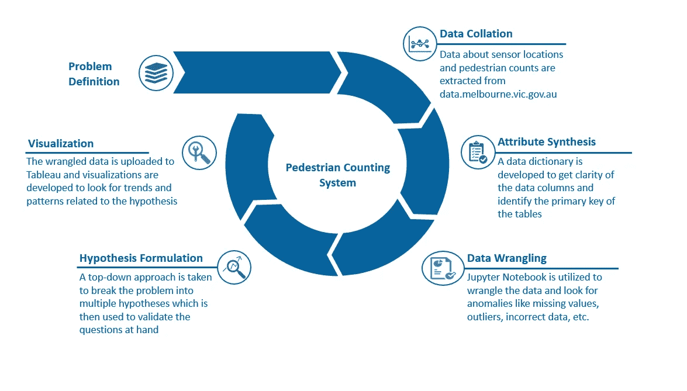

图一。说明了回答分析问题上下文所遵循的分析过程。请注意，用于此问题内容的数据已经过整理，并已提前提供。图片致谢—由作者使用 Power Point 开发

# 数据整理和属性综合

用于此分析的两个独立数据集概述如下:

1.  行人计数系统-传感器位置:这包含位于墨尔本市周围的行人传感器设备的空间坐标，从 data.melbourne.vic.gov.au 提取
2.  行人计数系统-2019:这包含 2019 年期间每个传感器的每小时行人计数，从 data.melbourne.vic.gov.au 提取

*数据字典*，即关于不同数据属性的信息包含在 Jupyter 笔记本中，也可以在[这里](https://github.com/angeleastbengal/ML-Projects/blob/master/Data%20Visualization%20-%20Tableau%20Assignment.ipynb)找到。行人计数系统-传感器位置数据集位于传感器 ID 级别(主键)，而行人计数系统-2019 数据集位于传感器 ID、日期-时间级别(主键)。

# 数据争论

数据争论被定义为将数据结构化、清理并转换为一种格式的过程，这种格式有助于在更短的周转时间内做出更好的决策。数据是以表格形式获得的，因此不需要重组。然而，一个 [Jupyter 笔记本](https://github.com/angeleastbengal/ML-Projects/blob/master/Data%20Visualization%20-%20Tableau%20Assignment.ipynb)被开发来寻找数据异常、缺失值、异常值和其他数据问题。争论的结果概述如下:

## 缺失值和异常值

行人计数系统传感器位置 csv 文件包含 66 个不同传感器 id 的信息，其中四个传感器的方向信息缺失。在进一步的深潜中，发现这些传感器要么被移除，要么不起作用。关于这些传感器的信息可以在下面的图 2 中看到。“注释”栏中缺少大多数传感器的值。

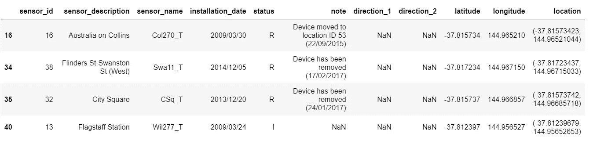

图二。direction_1 和 direction_2 列缺少信息的传感器快照。图片来源——由作者使用 Jupyter 笔记本开发

speedman _ Counting _ System _ 2019 . CSV 数据集中没有任何列缺少值。数字列的快速描述/汇总统计表明这些数字在范围内。“每小时计数”栏表示行人计数的显著偏斜。记录的行人数量的第 75 百分位和最大值明显不同，这可归因于事件、假期、季节趋势等。异常值至少为-7%的传感器静态汇总如下图 3 所示。

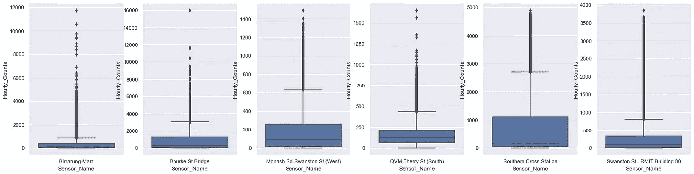

方框图——图片来源——作者使用 Jupyter 笔记本开发

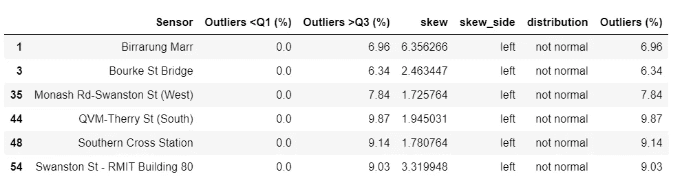

图 3。异常值为 7%的传感器的汇总统计数据和箱线图。注:为简单起见，7%被认为是一个阈值。由于行人数量会因时间、季节、事件和其他因素而有所不同，因此我们不会在本次分析中处理异常值。图片来源——由作者使用 Jupyter 笔记本开发

## 传感器 ID —不匹配

在进一步深入研究中，获得了 8 个传感器 id，它们是行人 _ 计数 _ 系统 _-_ 传感器 _ 位置. csv 数据集的一部分，但是它们在行人 _ 计数 _ 系统 _2019.csv 数据集中不存在。调查结果如下:

1.  最初被识别为已移除或未激活的传感器 IDs 16、38、32 和 13 在行人 _ 计数 _ 系统 _2019.csv 数据集中没有行人计数信息
2.  传感器 IDs 63、64、65 和 66 安装于 2020 年，因此没有 2019 年的行人计数信息，因此在行人计数系统 2019.csv 数据集中缺失
3.  传感器 IDs 15(州图书馆)和 33(弗林德斯街-斯普林街(西))标记为 R(已移除)和 I(未激活)，但从 2019 年起具有行人量。假设这些传感器最近被移除，则保留这些传感器

# 假设公式

自上而下的方法用于将问题分解为多个因素(假设)。然后根据数据可用性，使用 Tableau 中的可视化工具分析这些因素，以确定关键发现或趋势。假设综合的树形图可以在[这里](https://app.lucidchart.com/invitations/accept/b68839a1-e413-4007-862e-dde34b667b08)找到。

# Tableau 中的数据浏览

使用可视化方法在 Tableau 中研究数据，以检查数据异常。图 4 示出了由传感器收集的行人交通量向左倾斜，并且箱线图还示出了异常值的存在。如前所述，异常值不会被视为多个因素，如季节性、事件、时间和一周中的某一天会影响记录的行人流量。图 5 显示，一些传感器没有记录行人流量，例如传感器 32、63-66 等。如下面的条形图所示。由于大多数分析是基于地区和日期时间的行人流量，这些传感器没有被丢弃。

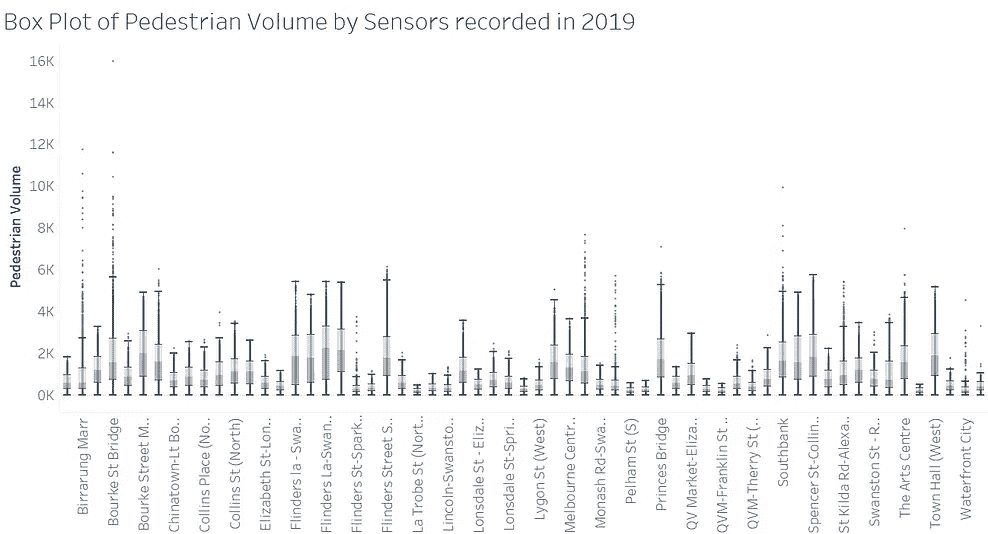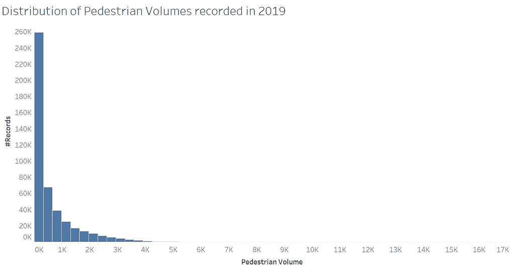

图 4。记录的行人流量直方图和箱线图。大多数数据向左倾斜，表明存在异常值。任何超出 Q1-1.5 倍和 Q3+1.5 倍的都被视为异常值。Q1 和 Q3 是四分位数，IQR 表示四分位数范围。图片致谢—由作者使用 Tableau 开发

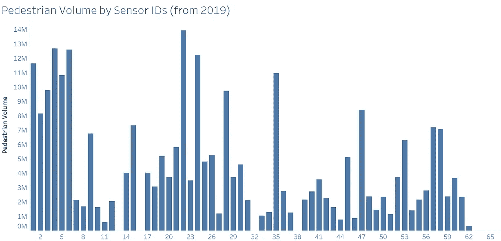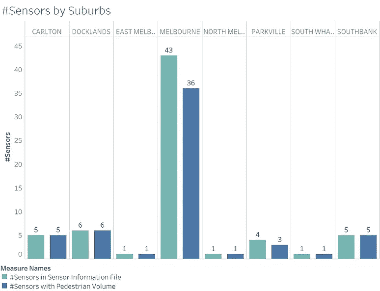

图 5。郊区的传感器数量(#表示计数)和传感器 id 的行人数量。图片致谢—由作者使用 Tableau 开发

# 数据可视化

# 人口统计学对行人交通量的影响

处理后的数据与两个 shapefiles 一起上传到 Tableau，以了解人口统计、郊区和感兴趣的区域对 2019 年行人计数的影响。使用下面的图 6、7 和 8 来表示可视化效果。

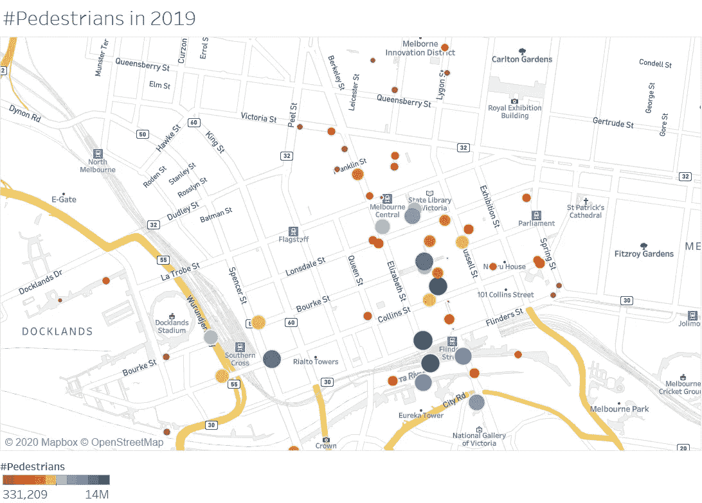

图 6。说明了 2019 年墨尔本各地传感器记录的行人数量。密度代表 2019 年的总行人量。图片致谢—由作者使用 Tableau 开发

**调查结果:**

1.  数据集中仅显示了 58 个传感器的行人交通量，这些传感器大部分位于 CBD 及其周围

*2。土地用途可以大致分为娱乐、交通、农业、住宅和商业。*与其他区域相比，商业和娱乐区域的客流量更大。与上图 6 所示的其他区域相比，2019 年记录的 CBD 及其周边地区的行人密度要高得多。拉筹伯街和尤里卡塔之间的地区是几家跨国公司和娱乐场所的所在地，2019 年的行人数量高于周边地区

3.与其他传感器点相比，靠近地铁站(如南十字车站和墨尔本中心车站)的传感器具有更高的行人计数

4.活动中心区(ACZ)是指导和促进活动中心土地使用规划的首选工具。下图 7 显示了分析区域周围的活动中心。内地铁和内东南区域有更多的活动中心，并在 2019 年观察到更高的行人流量，这是由这些区域及其周围的传感器捕捉到的

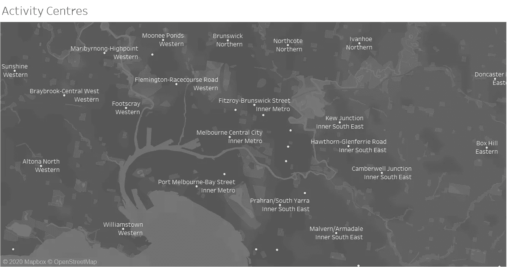

图 7。活动中心位于放置传感器的区域及其周围。使用 shapefile(澳大利亚政府，未注明)绘制活动中心。图片致谢—由作者使用 Tableau 开发

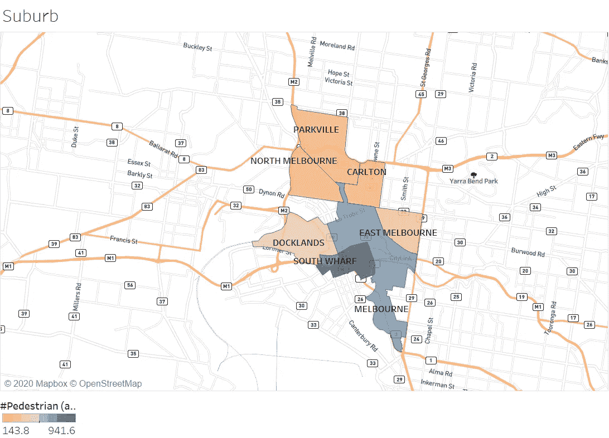

图 8。展示了传感器记录的郊区平均行人数量。由于不同的郊区安装了不同数量的传感器，因此考虑使用平均值来确保苹果与苹果之间的比较。调查结果与我们之前讨论的一致，与所有郊区相比，墨尔本郊区(墨尔本市)和 South Wharf 的平均行人流量更高。与帕克维尔、北墨尔本、卡尔顿和东墨尔本相比，码头区的客流量稍高。图片致谢—由作者使用 Tableau 开发

# 星期几和时间对行人交通量的影响

下面的图 9 和图 10 分析了一周中不同时间的行人流量变化。基于通常的预期量，一天中的时间被分类为不同的时段。

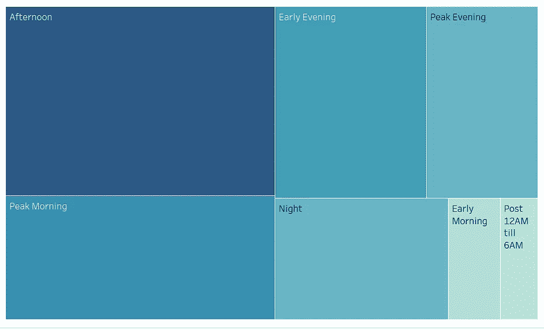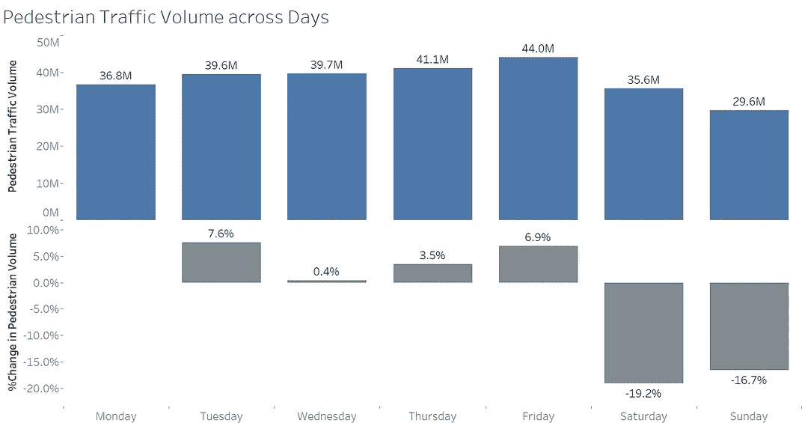

图 9。条形图和树形图分别说明了 2019 年不同日期和时间的行人流量变化。图片致谢—由作者使用 Tableau 开发

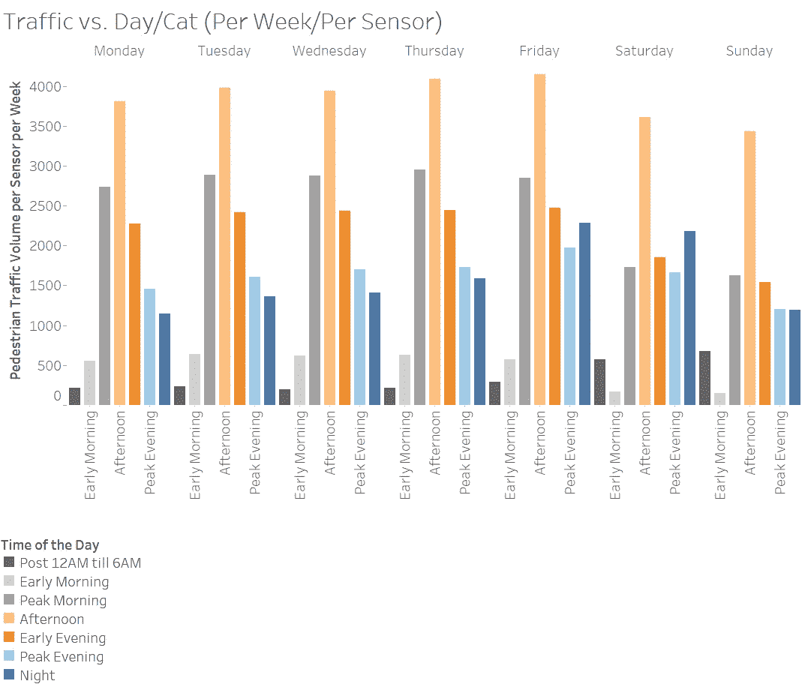

图 10。说明了 2019 年每个传感器捕捉的一天不同时间的平均行人流量。“一天中的时间”的定义如下。此外，请注意，该图通过使用周数和所考虑的传感器数量对平均行人交通量进行归一化，从而对其进行比较。图片致谢—由作者使用 Tableau 开发

一天中的时间:0-6:从中午 12 点到早上 6 点，6-8:清晨，8-12:高峰上午，12-16:下午，16-18:傍晚，18-20:高峰晚上，20-24:晚上。

**调查结果:**

1.  与周末相比，工作日的行人交通量更高(参见图 10)
2.  与其他时段相比，下午、早高峰和晚上(早高峰和晚高峰)的行人流量更高(参见图 10)
3.  高峰早上和晚上的人流量预计会更高，但是由于数据是在一周的所有日子中进行整理的，然而由于周末由于娱乐和其他活动而在下午经历人流量，行人的总流量在下午时段会更高
4.  有趣的是，与一周中的其他日子相比，周五和周六晚上的行人流量要高得多(参见图 11)
5.  行人流量的增加可归因于周末的娱乐活动，尤其是周五和周六晚上
6.  在工作日，不同时段的行人流量趋势保持不变(分别针对不同时段)，例如，周一至周五早上高峰时段的行人流量保持不变
7.  周六和周日“12 点后至 6 点”的行人流量明显较高，表明周末墨尔本夜生活的受欢迎程度(参见图 11)

# 参考

1.澳大利亚政府(未标明)。搜索。[在线]data.gov.au。可从以下网址获得:[https://data . gov . au/dataset/ds-DGA-af 33 DD 8c-0534-4e 18-9245-fc 64440 f 742 e/details](https://data.gov.au/dataset/ds-dga-af33dd8c-0534-4e18-9245-fc64440f742e/details)

2.环境部，法律(未注明)。空间数据。【www.planmelbourne.vic.gov.au 在线】[。](http://www.planmelbourne.vic.gov.au.)地点:【https://www.planmelbourne.vic.gov.au/maps/spatial-data】T4

*关于作者:高级分析专家和管理顾问，帮助公司通过对组织数据的商业、技术和数学的组合找到各种问题的解决方案。一个数据科学爱好者，在这里分享、学习、贡献；可以和我在* [*上联系*](https://www.linkedin.com/in/angel-das-9532bb12a/) *和* [*推特*](https://twitter.com/dasangel07_andy)*；*