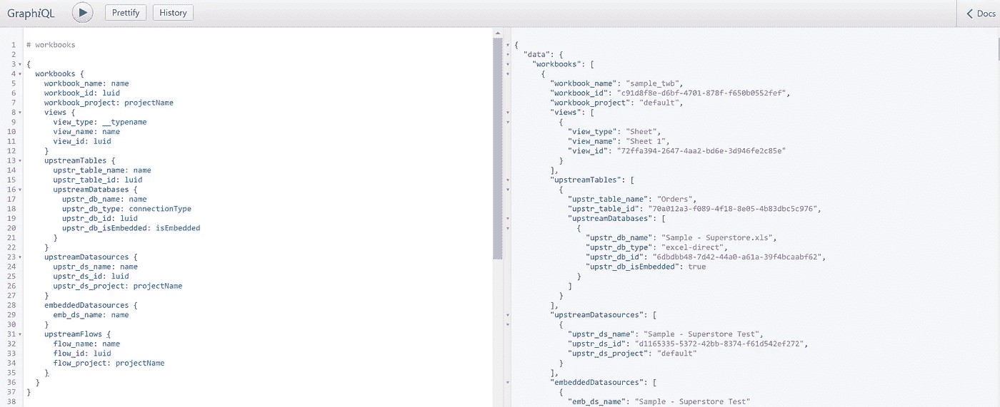
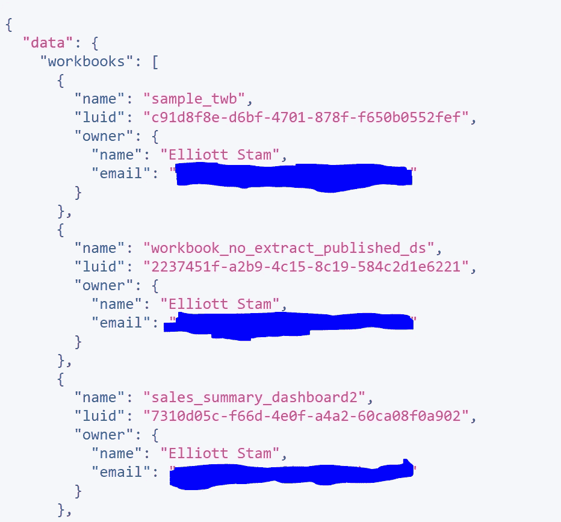
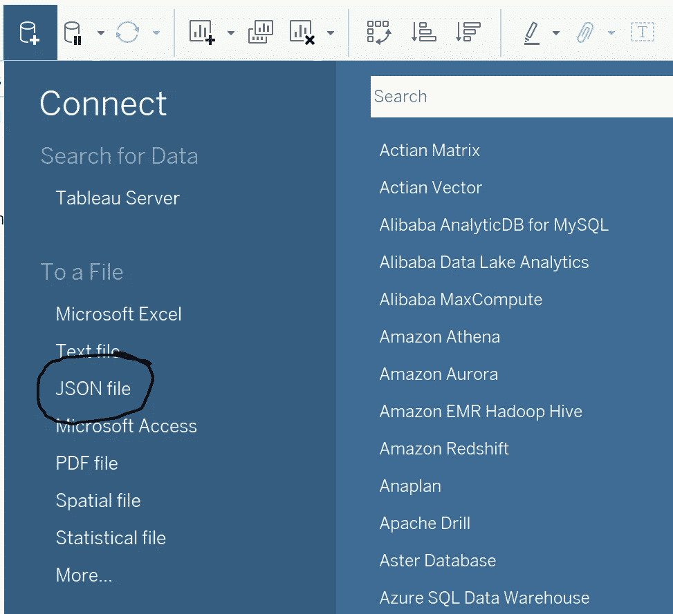
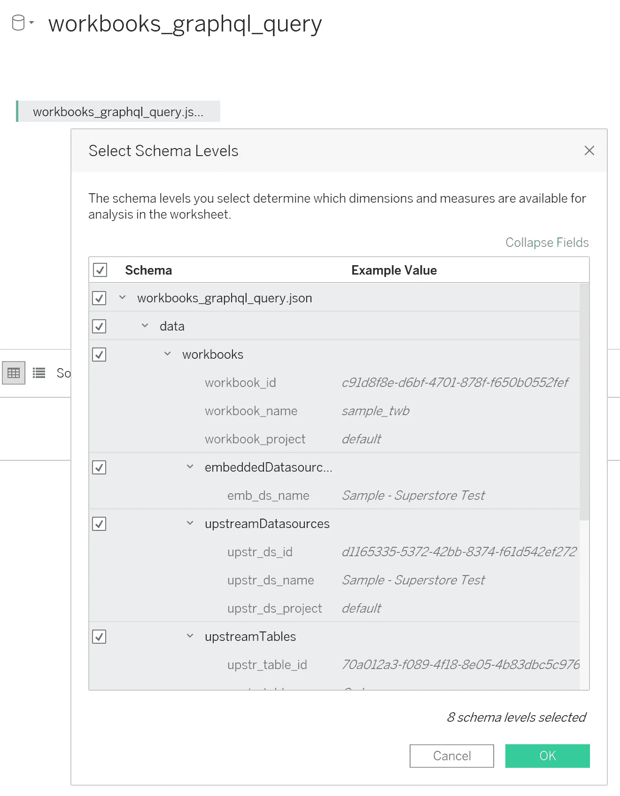
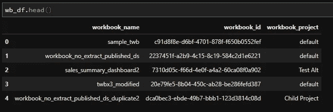
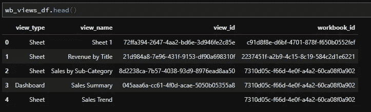
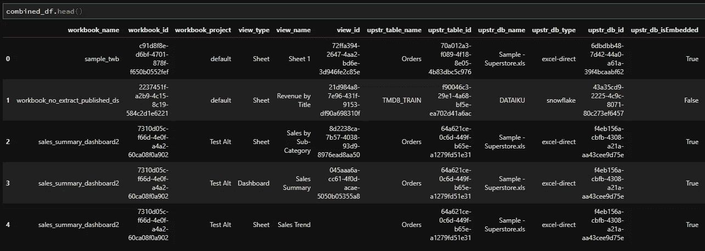
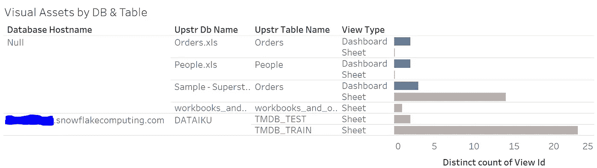

# Tableau 服务器影响分析报告:访问元数据

> 原文：<https://towardsdatascience.com/tableau-server-impact-analysis-reports-accessing-metadata-9e08e5fb5633?source=collection_archive---------44----------------------->

## TABLEAU REST API: TABLEAU-API-LIB 教程

## 一个关注使用交互式可视化工具跟踪数据传承来提高团队生产力的系列


元数据可以帮助你跟踪你的场景环境(图片由 [Aron Visuals](https://unsplash.com/@aronvisuals?utm_source=medium&utm_medium=referral) 在 [Unsplash](https://unsplash.com?utm_source=medium&utm_medium=referral) 上拍摄)

所有好的冒险都始于第一步。在本教程中，我们为 Tableau Server 构建影响分析报告的第一步是收集有关工作簿、视觉效果和底层数据库资产之间关系的信息。

如果你不知道我在说什么，花几分钟看看[的介绍文章](/building-tableau-server-impact-analysis-reports-why-and-how-191be0ce5015)，这是一系列教程的开始，展示了我们如何为 Tableau 构建影响分析报告。

总而言之，我们的目标是提取存在于每个 Tableau 生态系统中的有价值的元数据，并为如何将这些数据转化为洞察力提供一个大纲。这一切都是为了提高我们的数据团队的生产力，并提供关于我们的数据谱系的定制的可视化信息，任何能够点击鼠标的人都可以轻松地与之交互。

所以让我们开始吧！

## 我们在本教程中完成了什么

我想尽快进入*如何进入*，但是解释*什么是*很重要。我们的第一步要求我们获得一些关键信息，以便回答这些类型的问题:

1.  如果特定的数据库资产出现故障，我们有多少视觉效果会受到影响？我们如何才能确切地知道什么数据进入了我们的 Tableau 服务器环境？
2.  受影响的视觉效果是仪表板还是工作表？它们有什么类型的连接，这些连接是嵌入在单个工作簿中还是发布的？
3.  为了更好的可伸缩性和治理，我们是否有许多可以整合到已发布的数据源中的重复连接？
4.  考虑到我们使用的所有数据库连接，哪些特定的表是最关键的？有多少 Tableau 工作簿引用了这些表？

我们可以继续，但我想你明白了。这些问题的重复主题是:工作簿、数据源和数据库表。

让我们深入本教程的任务:从元数据 API 中提取数据，并将其塑造成能让我们更接近回答上述问题的东西。

## 有不止一种方法来修饰…元数据

俗话说，“剥猫皮的方法不止一种。”我一直喜欢猫，所以一直不爱这个词组。我提出这个问题的原因是，它非常适合我们使用 Tableau 的元数据 API 的情况。

对于初学者来说，你可以采用无代码的方法，或者你可以反过来用代码做所有的事情。是的，每个人都有适合自己的东西。

我们将从无代码方法开始。您可以使用它来快速证明概念，或者依赖它作为您的首选数据收集方法，如果它提供了您所需要的，并且您不介意一点手工劳动的话。

在介绍了无代码方法之后，我们将扩展我们的 Python 肌肉，为您将元数据 API 集成到自动化工作流中铺平道路。走 Python 这条路还可以让我们做一些漂亮的事情，比如用其他来源的上下文信息丰富我们的元数据。

无论您选择哪种方法，您都需要安装 Tableau Server 2019.3 或更高版本才能使用元数据 API。如果你使用 Tableau Online，你就可以了。你知道你可以通过加入他们的[开发者社区](https://www.tableau.com/developer)来申请一个免费的 Tableau 在线沙盒网站吗？现在你知道了。

这涵盖了本教程的范围，尽管我想我会在最后加入一两个基本的画面来证明我们提取的数据是真实的，并强调隐藏在其中的价值。

在未来的教程中，Python 将继续作为一个熔炉出现，成为我们查询元数据、存储库数据库和创建。超提取物为我们最终的影响分析仪表板提供燃料。

## 获取元数据的无代码方法

无需编写脚本来验证 Tableau 服务器环境并获取信息，您可以访问以下 URL 来访问您的元数据:

```
https://<your-tableau-server>.com/metadata/graphiql
```

您将被提示像往常一样使用您的用户名和密码进行验证，但是您将看到内置的 GraphQL 界面，而不是通常的界面。顺便说一下，这不是上面的样本链接中的错别字。它是“graphiql ”,里面有一个“I”。



欢迎使用 GraphQL 元数据 API 沙箱

从这里开始，您可以自由构建一些基本的 GraphQL 查询。我之前说过没有代码吗？别担心，你会没事的。请随意复制并粘贴这些示例查询。如果你是喜欢冒险的类型，去[的元数据 API 文档](https://help.tableau.com/current/api/metadata_api/en-us/index.html)去掌握所有的东西。

例如，运行这个基本查询将获取您站点上的所有工作簿名称、工作簿 id 和工作簿所有者:

```
{
  workbooks {
    name
    luid
    owner {
      name
      email
    }
  }
}
```

响应将以 JSON 格式出现在 GraphQL 界面的右半部分。我的输出如下所示:



可怕的蓝色是我屏蔽了我的超级秘密邮件地址。

你知道你可以直接连接 Tableau 桌面到 JSON 文件吗？是的，将元数据放入仪表板就是这么简单。只需复制 JSON 输出并将其粘贴到文本文件中。用. json 扩展名保存文件，就可以了。

下面你会发现整个过程在运行，用一个更高级的查询代替上面提供的玩具例子。该查询可以在 [this Github Gist](https://gist.github.com/divinorum-webb/a5b4e5d77fef954d95fbafca494a3445) 中找到:

使用这个查询来跟进。

将生成的 json 数据存储到. JSON 文件后，打开 Tableau Desktop 并连接到该文件。



创建一个新的数据连接，并选择 JSON 文件选项

选择中所有可用的模式。json 文件，然后单击“确定”。



只需这么多，数据就在您的手中！

## 使用 Python 的另一种(更好的)方法

手动做事并不适合每个人，包括我自己。让我们来看看如何使用代码获得与上面相同的结果。当我们展望未来的教程时，这将为我们设置几乎无限的定制，所以我强烈建议投入时间到 Python 路线中。

在我的 tableau 服务器自动化工作流中，我广泛使用了 [tableau-api-lib](https://github.com/divinorum-webb/tableau-api-lib) 和 pandas Python 包，所以如果您正在跟进，那么您会希望在命令行中运行这个命令:

```
pip install --upgrade tableau-api-lib
pip install --upgrade pandas
```

与本节相关的完整 Python 脚本可以在[GitHub Gist](https://gist.github.com/divinorum-webb/c457916327f1d72ad2750aacdf717d5a)中找到:

不熟悉 Python？下载它，开始新的生活。

简要总结一下 Python 代码中发生的事情，我们将建立一个到 Tableau 服务器(或 Tableau Online)站点的连接，并针对元数据 API 运行 GraphQL 查询。本教程中的查询以工作簿、视图及其底层数据库资产为目标。您当然可以扩展这些查询，我鼓励您这样做。我们肯定会在后面的教程中重新讨论这个问题，并在这里所涵盖的基础上进行构建。



这里我们有一个熊猫数据框，里面有关于我们练习册的信息

GraphQL 查询返回 JSON 数据。虽然我们可以直接将其输入 Tableau，但让我们提前计划我们这个项目的未来里程碑，我们希望将我们的元数据与其他数据来源结合起来，例如存储库数据库，它将提供各种上下文，包括上次有人与我们的视觉效果进行交互的时间。



这里我们有一个熊猫的数据框架，包含了我们的观点

为了将来的成功做好准备，有必要花时间将我们的 JSON 数据整理成多个规范化的表，然后将它们合并成一个“非规范化”的表。这将与其他一次性元数据 API 查询和我们将在后续教程中使用的各种 PostgreSQL 查询配合得非常好。



最后，我们将 JSON 数据像煎饼一样展平，准备好迎接来自不同来源的其他数据。

现在，让我们来看看这些数据能为我们做些什么。

## 如果我们没有加入至少一个视觉元素，就不会有这样的场景

为了感受这些数据在创建影响分析报告方面可以为我们提供的价值，我们已经有了很多制作有用的东西所需的原材料。



显示:每个底层数据库资产的视觉效果的不同计数

通过三十秒的拖放操作，我们已经创建了如上所示的工作表！我们可以使用底层数据来构建定制的数据沿袭审计，让我们最不喜欢的业务部门因使用更多工作表而不是仪表板而感到羞愧，等等。

我们现在已经能够回答本教程前面提出的问题了。我们制作了一个手电筒，可以照亮我们的 Tableau 生态系统中最黑暗的角落。

## 包装它

这是我们在 Tableau 中构建详细的交互式影响分析报告的第一个里程碑。我们已经接入了 Tableau 的元数据 API，并提取了足够的数据来构建视觉效果，描述为我们的 Tableau 视觉效果提供信息的底层数据库资产。我们演示了两种收集数据的方法:通过内置的‘metadata/graphisql’接口手动收集，或者使用 Python 脚本等可重复的过程收集。

我希望这个教程能让你比刚开始的时候过得更好！收听下一个教程，我们将把重点转移到存储库数据库(内部 PostgreSQL 数据库)上，从中提取一些真正有用的信息，包括用户访问内容的次数以及每个工作簿或视图的最近交互日期。

我们收集的数据已经很有价值，但将它与 PostgreSQL 数据库的输出结合起来，将使我们能够更完整地描绘出 Tableau 生态系统中正在发生的事情。

我们的最终用户最常访问哪些视图和数据库？是否有任何内容过时且未被使用？放弃 John 四年前构建的旧数据库表安全吗？我们将在下一个教程中做的工作将帮助我们回答这些问题！

## 即将到来的里程碑

里程碑 2 (ETA 是 4/29/2020):在里程碑 1 的基础上，使用来自 Tableau 服务器存储库的补充数据，提供与每个工作簿(视图和仪表板)、数据源和流程相关联的交互数量。

里程碑 3 (ETA 为 5/6/2020):使用 hyper API 将里程碑 1 和 2 的组合输出转换为. Hyper 提取，并将内容发布到 Tableau 服务器(或 Tableau Online)。

里程碑 4 (ETA 是 5/13/2020):使用里程碑 3 中发布的数据源构建我们的第一个影响分析仪表板。

*里程碑 5 (TBD)*