# Tableau 服务器影响分析报告:构建定制的交互式视觉效果

> 原文：<https://towardsdatascience.com/tableau-server-impact-analysis-reports-building-customized-interactive-visuals-85ce4798dead?source=collection_archive---------60----------------------->

## TABLEAU REST API: TABLEAU-API-LIB 教程

## 一个关注使用交互式视觉跟踪数据传承来提高团队生产力的系列

更好地了解你的场景环境(照片由[乔丹·麦克唐纳](https://unsplash.com/@jordanmcdonald?utm_source=medium&utm_medium=referral)在 [Unsplash](https://unsplash.com?utm_source=medium&utm_medium=referral) 上拍摄)

在本文中，我们从前面的影响分析里程碑中停下来的地方开始，基于我们之前的工作生成的数据来构建交互式视觉效果。

作为更新，以前的里程碑将来自 Tableau 的元数据 API 和内部 PostgreSQL 存储库数据库的数据结合起来，将这些数据转换成 Tableau 超级摘录，并将这些数据发布到 Tableau 服务器。

如果这是您第一次关注这个系列，为了方便起见，下面是以前的里程碑:

1.  [构建 Tableau 服务器影响分析报告:为什么和如何](/building-tableau-server-impact-analysis-reports-why-and-how-191be0ce5015)
2.  [Tableau 服务器影响分析报告:访问元数据](/tableau-server-impact-analysis-reports-accessing-metadata-9e08e5fb5633)(里程碑 1)
3.  [Tableau 服务器影响分析报告:将元数据与 PostgreSQL 结合](/tableau-server-impact-analysis-reports-combine-metadata-with-postgresql-47447b830513)(里程碑 2)
4.  [构建一个 Tableau Hyper extract 并将其发布为数据源(里程碑 3)](/tableau-server-impact-analysis-reports-metadata-publishing-and-using-apis-54b203fdd183)

## 我们在本教程中完成了什么(里程碑 4)

这个里程碑是关于使用 Tableau Desktop(同类中最好的该死的数据 viz 工具)将我们的原始数据转化为有意义的东西。

这听起来可能很奇怪，但在某些方面，构建数据可视化就像做饭一样。你做的东西很大程度上取决于你现有的原材料。变质的肉不会成为任何获奖的菜肴，变质的数据也不会让你在 Tableau 用户中赢得多少人气。类似地，就像你用盐和香料给你的食物添加味道一样，你可以通过格式化和仔细的展示来放大你的数据可视化的价值。

既然我们已经把这个类比放在你面前，我想澄清一下我们在这篇文章中在做什么。这不是选美比赛。我们不是在烹饪一些异国情调的顶级厨师菜肴，我们也不是在构建性感和疯狂的实验数据可视化。虽然设计和制作漂亮的视觉效果是很有价值的技能，但这个系列本质上主要是功能性的，在本文中，我们将构建满足我们需求的交互式视觉效果。

我在这里的目标是向您介绍我能够非常快速地构建的报告，这些报告展示了 Tableau 的核心*交互*元素，以便您看到在我们之前的里程碑基础上构建仪表板，为您的运营团队增加巨大价值是多么容易。在未来的教程中，我们可能会更多地关注视觉效果的流行，但今天我们将重点放在构建一个工具，为我们提供所需的信息，以便我们继续我们的生活。

说到这里，让我们开始吧！

## 重要的事情先来

在我们构建任何东西之前，我们需要连接到我们在前一个里程碑中发布的 Hyper extract。

我们可以通过打开 Tableau Desktop 并建立到我们的 extract 的数据连接来做到这一点。在我的例子中，摘录位于 Tableau 服务器上，所以我将在那里查找:

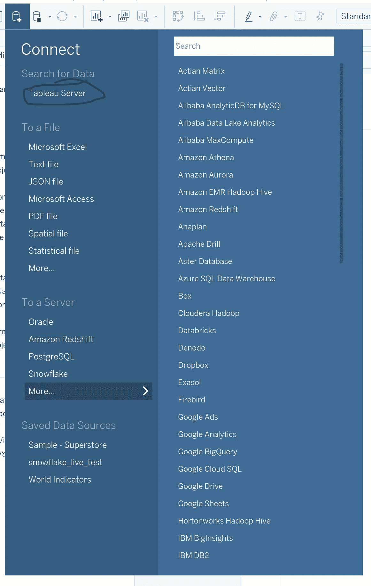

没错，我们使用 Tableau 来构建我们对 Tableau 的影响分析。

这是我的数据窗格在连接后的样子。虽然这是另一个教程的主题，但我认为最好的做法是按文件夹组织我的计算字段，而不是让数据窗格成为一个混乱的噩梦(是的，我在这里充满了意见)。

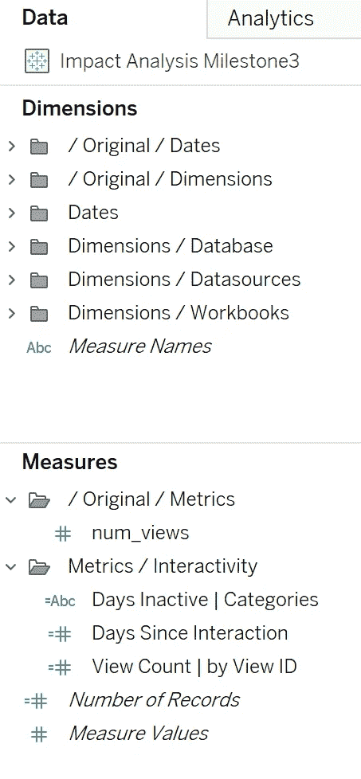

作为我如何组织我的数据面板的速成班，我喜欢把我所有的原始字段放入名为“/ Original / <description>”的文件夹中。</description>

我通常从不使用任何原始字段。在 Tableau 领域进行了多年的大量咨询之后，您学会了如何保护自己免受数据源交换或者将数据源从一个表指向一个视图之类的事情的影响。我喜欢为自己省去修复损坏的数据源字段引用的麻烦，所以我倾向于从不在我的视觉效果中使用原始字段。相反，我创建了引用这些字段的其他计算，这样我所有更高级的计算都不会与原始的“原始”字段引用结合在一起。

如果这令人困惑，让我们继续前进吧！您可以随时获取更多信息。

**床单是我们的建筑材料**

每一个画面仪表板都是建立在巨人的肩膀上。床单是无名英雄，让我们为他们唱首快歌。

让我们把一些简单的表放在一起，即使它们不是仪表板的一部分，也是有用的。一旦我们构建了这些表，我们可以将它们组合在一个仪表板中，Tableau 对交互式视觉效果的本地支持将使它们更加有用。

## 数据库表的高级影响

我的测试环境没有超级多样的数据库表，但是我们有一些。即使您的 Tableau 环境中有数百或数千个表，同样的视觉效果也可以快速地为您提供关于表影响了多少资产的信息。

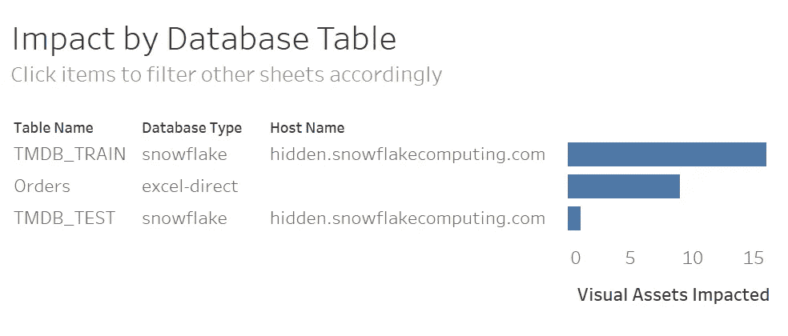

那不是我真正的雪花主机名！

在我的测试环境中，看起来 TMDB 火车雪花表提供了大约 15 个视觉效果。就视觉效果的数量而言，这显然是最有影响力的数据库表。

然而，查看浏览量只是故事的一个方面。我们可以将用户的查看次数添加到 marks 卡上的“颜色”中，以便从不同的角度观察事物，例如用户查看与这些数据库表相关的资产的次数。

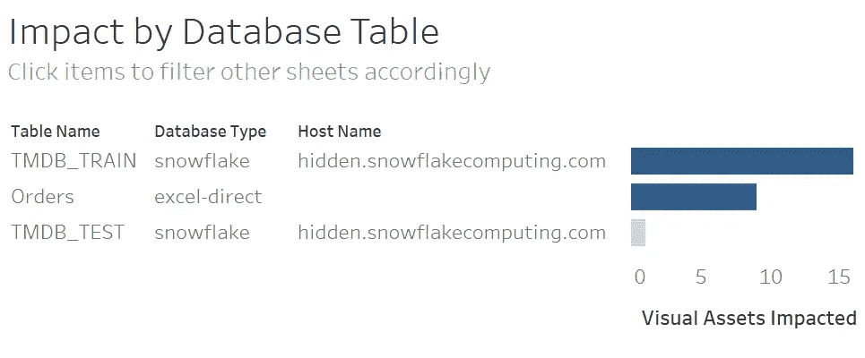

在此图中，用户交互决定了每个条形的颜色渐变。

对于该特定视觉，用户视图与视觉资产的数量一致。对于其他视觉效果，我们将看到情况并非总是如此。

## Tableau 项目的影响

让我们构建一个单独的工作表，显示我们的可视化资产是如何分布在我们的各种 Tableau 项目中的。

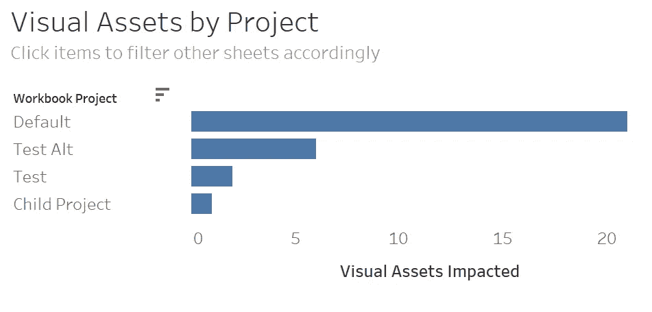

“默认”项目包含了最多的视觉效果。如果我们添加用户交互(视图)作为颜色渐变的驱动力，这种视觉效果会发生变化吗？

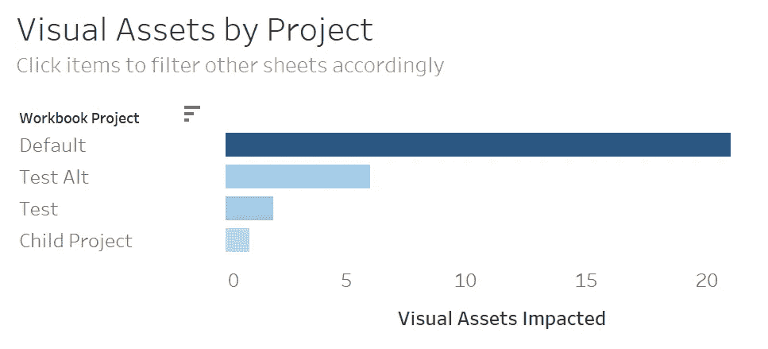

这很微妙，但仔细观察就会发现,“测试”项目比“测试替代”项目有更少的视觉效果和更多的用户互动。

让我们构建几个更基本的视觉效果，这样我们就可以将它们一起放到一个仪表板中。

## Tableau 数据源的影响

这是视觉效果的普通版本。

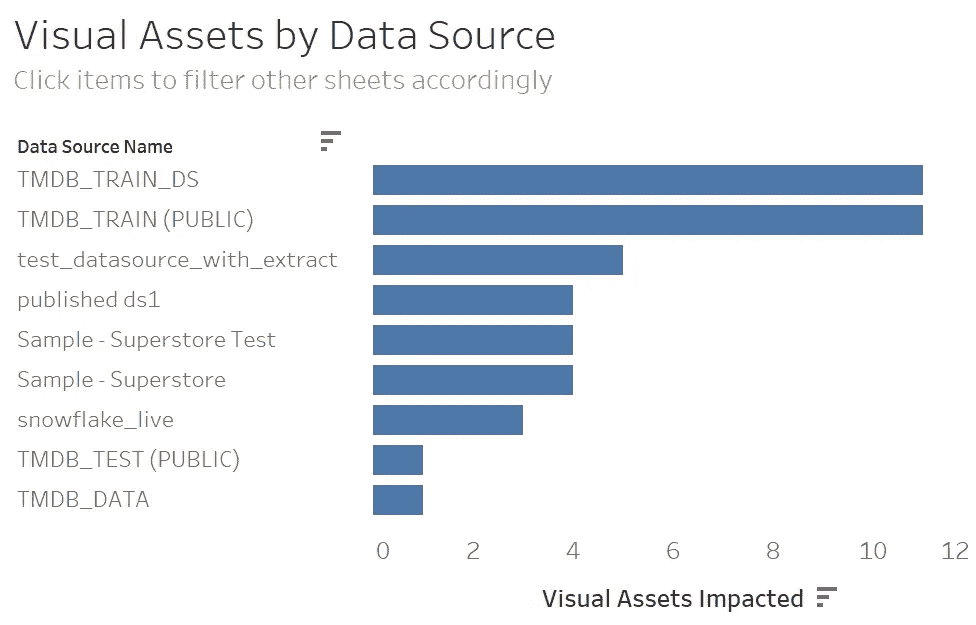

下面我们看到的是用户交互(视图)决定颜色渐变的版本。我知道我在这一点上犹豫不决，但我觉得这很重要。尤其是一旦我们在交互式仪表盘中整合视觉效果，引入微妙的视觉元素可以完全改变你的仪表盘讲述的故事，在不增加不必要的混乱的情况下完成这一点更像是一门艺术而不是科学。

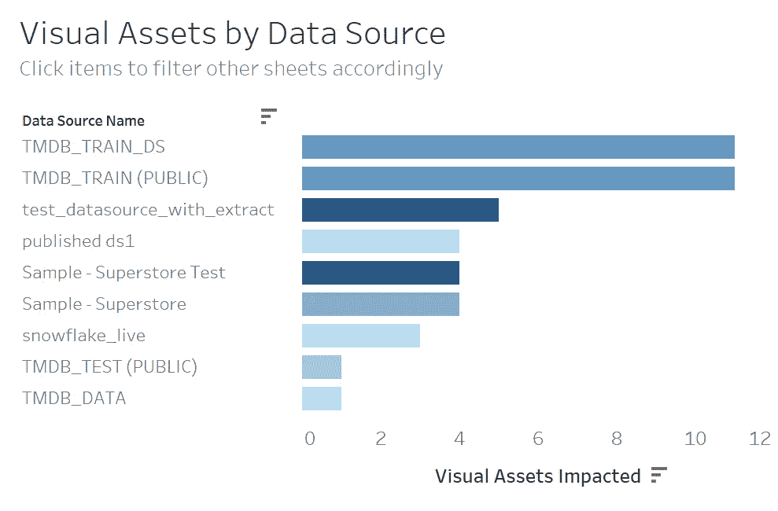

现在，虽然这个视觉结构与没有颜色渐变的视觉结构相同，但这个新的视角告诉我们一些我们无法从原始视角获得的东西:仅仅因为一些东西与*更多*视觉相关，并不一定意味着它*更*重要。您可能有 100 个工作簿受到一个后端表的影响，但是如果这 100 个工作簿只有 5 个用户交互会怎么样呢？这 100 个工作簿比一个有 894 个视图的工作簿更重要还是更不重要？

上图向我们展示了一些数据源产生了相对较少的视觉资产，但这些资产有时会带来相对较高的用户流量。

就这样，我将停止关于聪明使用颜色渐变的争论。我在野外经常遇到并且不推荐的一件事是用指示条的大小的相同度量来着色。例如，下面的视觉效果没有添加任何新信息，颜色渐变只是分散注意力，而不是增加价值:

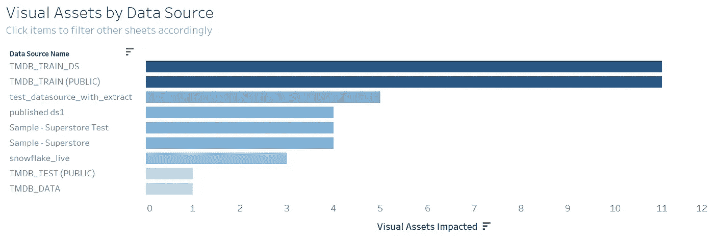

不添加任何值的颜色渐变示例。这真的只是一道不令人兴奋的彩虹。

这种视觉现在是丰富多彩的，但毫无意义。作为一个在我多年咨询生涯中的某个时刻违反了所有视觉最佳实践的人，请从我的错误中吸取教训。

不要因为工具可用就随意从数据可视化工具箱中抓取工具。对你使用的工具要明智，我的建议是你总是尽量做到简约。不要成为有 1000 个切片的饼状图，没有人能读懂。成为条形图，立即告诉人们他们需要知道什么。

## 按视图的用户交互

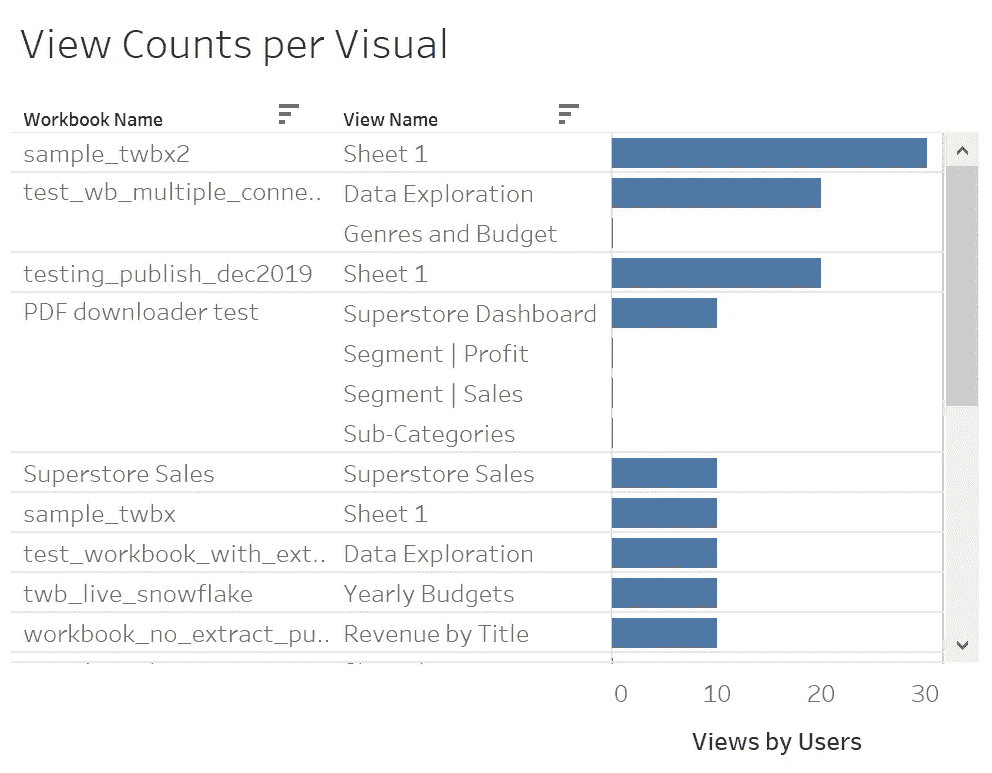

另一个香草视觉，但香草是一个经典！

这里没有什么新的东西，但是有了这个可视化，我们现在有了四个表，它们一起将为我们提供一个关于后端数据资产如何影响我们的 Tableau 可视化的相当全面的理解！

## 把拼图拼在一起

在构建仪表板时，我非常喜欢 z 模式。也就是说，将用户应该首先交互的内容放在仪表板的左上方，然后以 z 模式(左上->右上->左下->右下)跟踪他们的交互，这样他们的最终交互就在仪表板的右下方。

在这个简单的影响分析报告中，我将根据我所称的信息层次来确定工作表放置的优先级。我希望最高级别的信息(层次结构的顶部)在左上角，最细粒度的信息(层次结构的底部)在右下角。

考虑到这一点，我决定将我的数据库表列表放在左上角，将我的 Tableau 项目列表放在右上角，将我的数据源列表放在左下角，最后将我的工作簿和视图列表放在右下角。

它看起来是这样的:

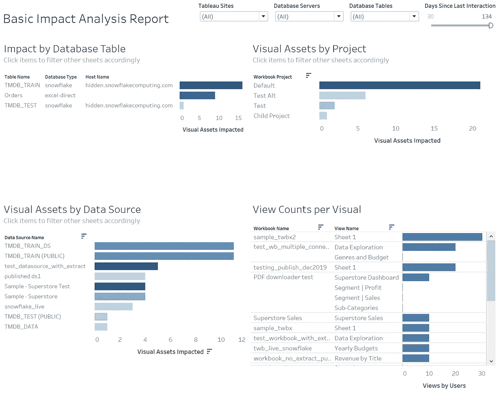

就像我之前说的，这个仪表板没有赢得任何设计比赛。但是如果它没有告诉我我需要知道的东西，我会被诅咒的，特别是在增加了一些交互性之后！

这也是在不到一个小时的时间内完成的，所以总要考虑权衡。我确信，如果我们花一个月的时间美化它，我们可以使这个仪表板适合一个美术博物馆，但是这种果汁值得榨吗？随着经验的增长，我发现自己更喜欢实用性而不是外表。但那是个人喜好。出于类似的原因，我也开丰田车。

## 添加仪表板操作

我已经教授了数百门 Tableau 培训课程，我总是在开始的几分钟内在观众面前建立一个交互式仪表板，展示在 Tableau 中建立一些动态的东西来回答你的问题是多么容易，甚至可能引发你没有考虑过的更重要的问题。

在 Tableau 中，你的工具箱中最好的交互工具之一是[动作过滤器](https://help.tableau.com/current/pro/desktop/en-us/actions_filter.htm)(技术上来说是‘过滤动作’，但我认识的每个人都说‘动作过滤器’)。

这些为什么这么棒？它们允许你点击一个工作表中的一个条目，然后 Tableau 自动地过滤其他工作表来反映与你点击的条目相关的数据。

添加动作过滤器有多简单:

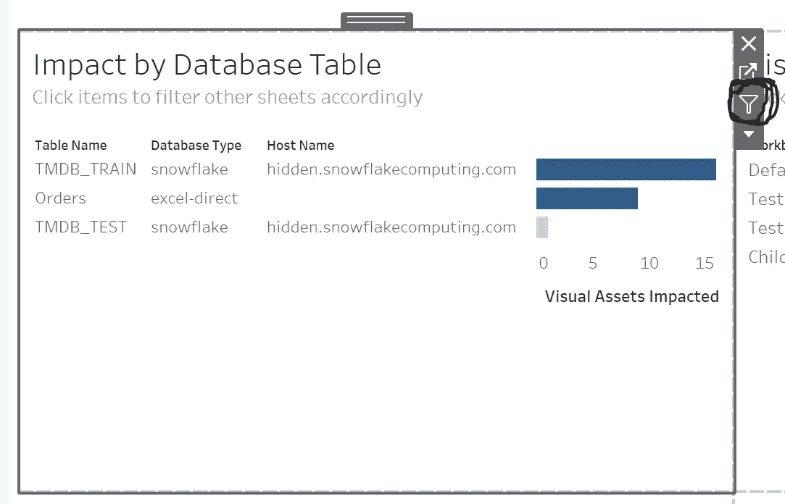

看到我在右上角画的那个可怕的圆圈了吗？单击该按钮。

一次点击，宝贝。您只需点击一下鼠标，就能让您的仪表板完全互动。

单击该按钮后，让我们看看当我们单击该工作表中的某个内容时会发生什么:

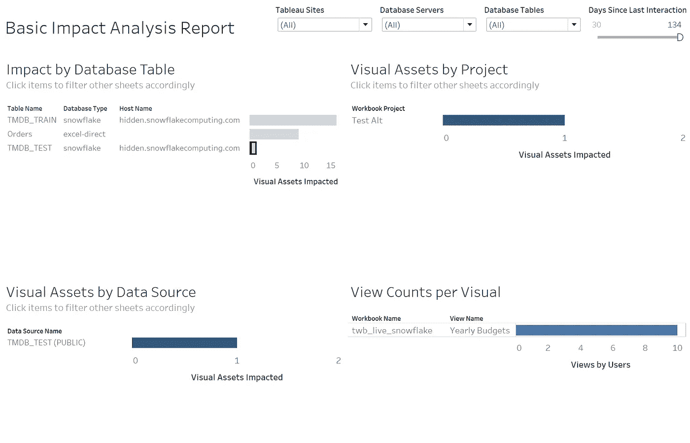

这就缩小了范围。

现在我们知道了如果从我们的数据生态系统中删除 TMDB 测试表会发生什么。就 Tableau 而言，这将影响(a)我们的“测试替代”项目，(b)我们的“twb _ 测试(公共)”数据源，以及(c)我们的“twb _ live _ 雪花”工作簿。

看起来最多有 10 个用户会为此心碎，但在你我之间…我是唯一使用我的测试网站的人，所有 10 个用户都是我。

因此，这是您的速成课程，学习如何使用我们在之前的里程碑中构建的内容来整合交互式影响分析！在今天结束之前，让我们仔细看看我们创建的动作过滤器。

## 动作过滤器的神秘秘密(队列戏剧音乐)

听着，动作过滤器并不复杂。不要让任何人告诉你他们是。我们点击一个按钮，一个动作过滤器就出现了。如果您想对您的动作过滤器做什么、过滤哪些字段或过滤哪些工作表有更多的控制，那么这一部分正好适合您。

即使我们点击了一个按钮来自动生成我们的动作过滤器，我们也可以从头开始构建它。

在我们的 Tableau 仪表板上，我们可以点击“仪表板”，然后点击“操作…”来查看幕后为我们构建了什么(或者我们自己从头构建)。

这里没有魔法，只是一个简单的东西，你可以学会为自己所用！

这是为我们生成的内容:“过滤器 1(已生成)”

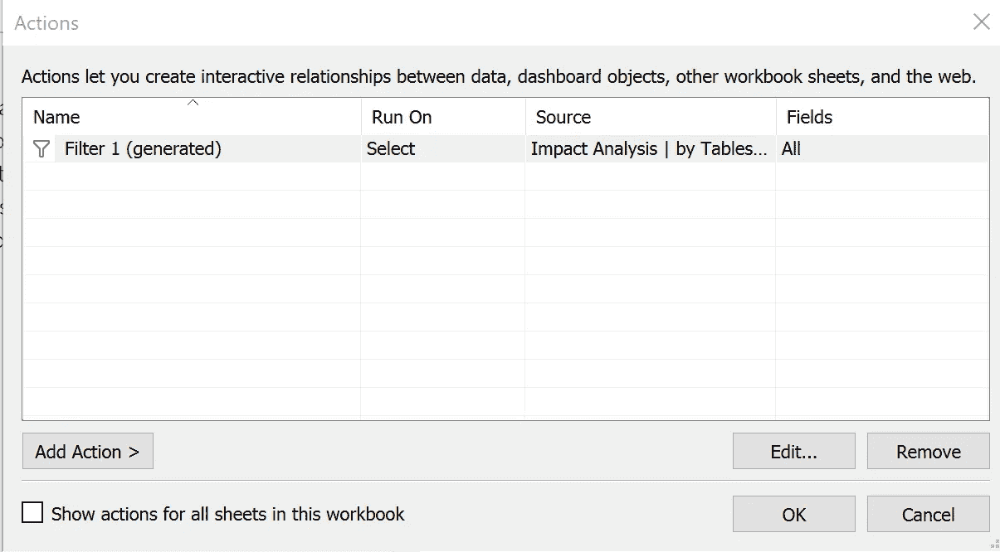

如果我们点击“编辑”查看一下内部，我们会发现一些关于此过滤器行为的详细信息。

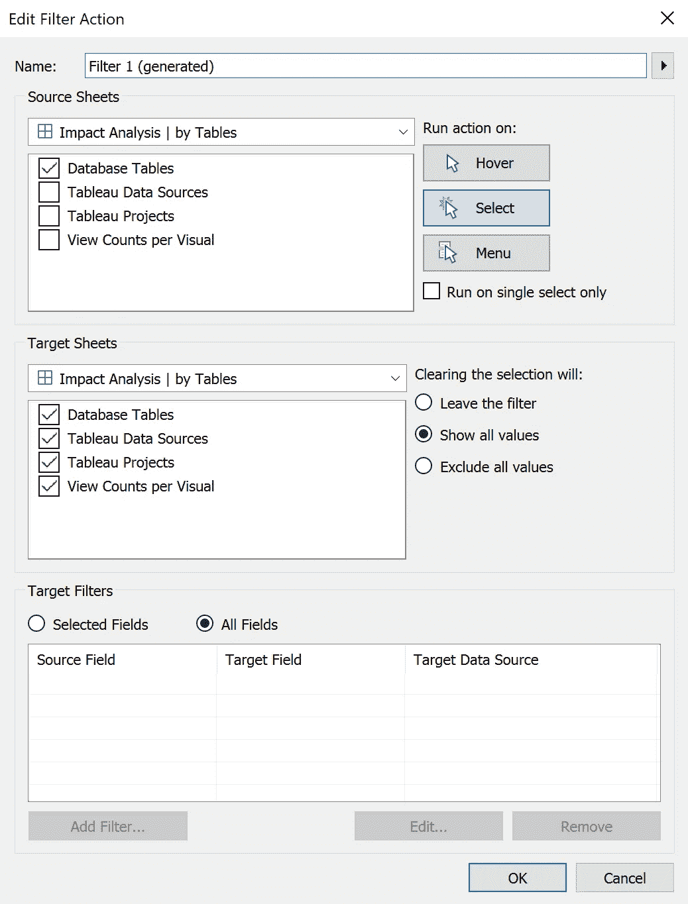

因此，我们可以看到过滤器的源(触发器)是“数据库表”表，过滤器的目标是仪表板上的所有内容。该过滤器通过在相关源表上的“选择”动作(点击)来执行。

差不多就是这么多了。如果你想自定义你的工作表如何互相过滤，只需在这里编辑这些关系！您可以构建几个操作过滤器(咳咳，过滤操作)并为每个过滤器指定不同的规则。

## 走之前最后看一眼

为了证明我不是一个只会构建条形图的机器人，让我们来演示一下我创建的另一个可视化工具。我喜欢这个，因为它让您能够看到最近与哪些视觉资产进行了交互。

影响分析过程的一部分是确定什么受到影响，但这最终会变成受影响的资产是否重要的问题。重要性的一个代表是:这个东西在过去的一个月里被使用过吗？过去的半年怎么样？怎么样…永远？

这里有一种方法可以回答这些问题:

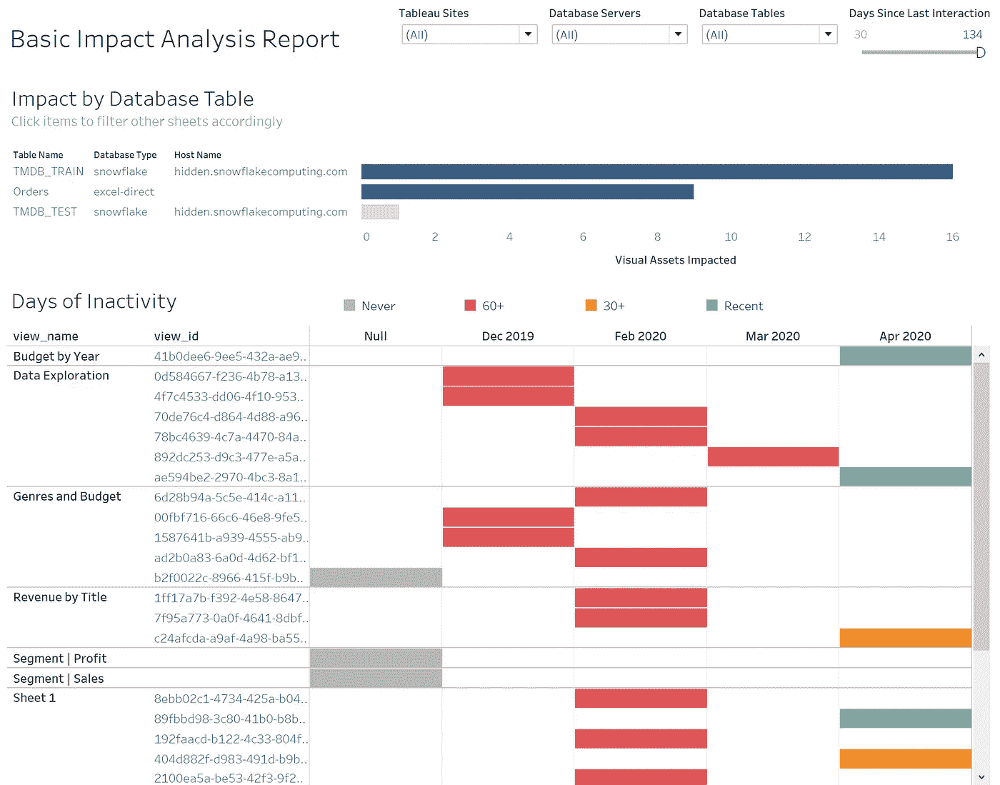

呀，这么多红色。

哎哟。看起来我创造了很多我珍爱的用户(我)从未使用过的内容。我把它归咎于冬天！

## 包装它

在本文中，我们利用了我们在以前的里程碑中生成的数据，并开始构建交互式数据可视化，以帮助回答各种假设场景。

如果那张桌子倒了怎么办？有多少视觉资产会受到影响？哪些项目？哪些数据来源？这些受影响的视图有多受欢迎？这些视觉效果还在使用吗，或者它们是来自一个失落文明的古老遗迹？

这绝不是一个停止点。这是对你的一个启发，让你把你所看到的应用到你自己的环境中。我坚信任何公司的影响分析报告都不应该是相同的。每个团队都有独特的环境和独特的工作流程，他们用来做决策的工具应该反映这一点。

感谢收听！下次见。

## 即将到来的里程碑

里程碑 5 (ETA 是 5/20/2020):演示如何从所有站点提取元数据。在里程碑 1 中，我们从元数据 API 中提取数据。默认情况下，该数据特定于您通过身份验证进入的站点。使用 REST API，我们可以遍历所有可用的站点，并提取整个服务器的元数据。

里程碑 6 (ETA 为 5/27/2020):探索 Tableau 新的' [metrics](https://www.tableau.com/metrics) '特性，为方便的 KPI 分析打开了大门。我们将了解一种 KPI 分析方法来查看我们的影响分析数据。