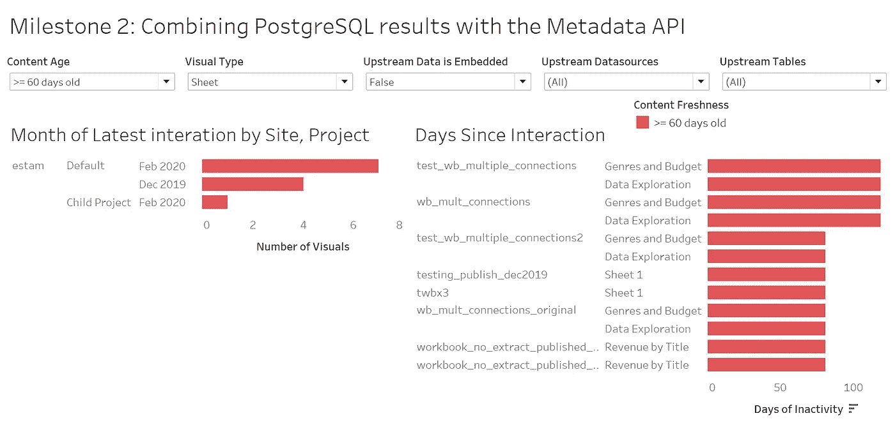
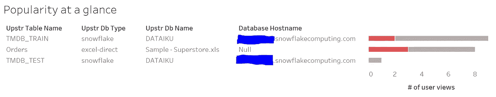

# Tableau 服务器影响分析报告:将元数据与 PostgreSQL 相结合

> 原文：<https://towardsdatascience.com/tableau-server-impact-analysis-reports-combine-metadata-with-postgresql-47447b830513?source=collection_archive---------40----------------------->

## TABLEAU REST API: TABLEAU-API-LIB 教程

## 一个关注使用交互式可视化工具跟踪数据传承来提高团队生产力的系列

用 Tableau 的 PostgreSQL 存储库数据库发送(图片由 [Bundo Kim](https://unsplash.com/@bundo?utm_source=medium&utm_medium=referral) 在 [Unsplash](https://unsplash.com?utm_source=medium&utm_medium=referral) 上拍摄)

就其本身而言，Tableau 服务器存储库对于任何想要深入 Tableau 环境的人来说都是一座金矿。但是今天，PostgreSQL 数据库并不孤单。在本教程中，我们将探索存储库数据库如何通过元数据 API 为可用的补充数据增添美味，从而构建强大的影响分析报告。

这篇文章继承了我们在[之前的教程](/tableau-server-impact-analysis-reports-accessing-metadata-9e08e5fb5633)中的地方，在那里我们演示了如何访问关于工作簿、视图和底层数据库资产的信息(以及它们之间的关系)。

如果你一直怀疑你已经错过了一些重要的东西，那么就去看看这个系列的[原始帖子](/building-tableau-server-impact-analysis-reports-why-and-how-191be0ce5015)来了解我们正在努力的方向。

让我们开始吧。

## 我们在本教程中完成了什么(里程碑 2)

在本系列的[前一阶段(里程碑 1)](/tableau-server-impact-analysis-reports-accessing-metadata-9e08e5fb5633) ，我们深入到元数据 API 中，为影响分析报告构建了一个坚实的基础。作为复习，这些影响分析报告是 Tableau 可视化，我们可以与之交互，以探索我们的 Tableau 内容和支持该内容的数据源之间的关系。

我们在前面的教程中看到，元数据 API 是一个收集动态信息阵列的优秀工具，能够提供高层次的概述和对细节的细粒度内省，具体到我们的视觉效果所引用的确切数据库列。

虽然元数据 API 自己做了很多工作，但 Tableau 的内部 PostgreSQL 数据库(也称为存储库数据库)中仍然存在大量有价值的数据。

就本教程的范围而言，我们将带着两个非常具体的目标来处理存储库数据库:

1.  计算用户查看我们每一个视频的次数。
2.  确定最近的互动日期。

当我说这只是 PostgreSQL 数据库所提供的价值的皮毛时，我一点也不夸张。就个人而言，存储库数据库和元数据 API 都是强大的工具。将它们结合起来，为获得极其有价值的见解和创建专门的交互式影响分析报告的能力铺平了道路。

## 访问 Tableau 服务器的 PostgreSQL 数据库

如果您在 Tableau Online 上，在撰写本文时(2020 年 4 月)，您无法访问内部 PostgreSQL 数据库。

对于 Tableau 服务器上的人来说，你们很幸运！我们将直接使用这个数据库，跳过一些具体的细节。如果你想要更深入的信息，请随意跟随[这篇教程，学习如何使用 Python](https://medium.com/snake-charmer-python-and-analytics/querying-tableaus-internal-postgresql-repository-database-with-python-ceaf2e3734ca) 查询 Tableau 的存储库数据库。

我建议至少看一看上面链接的教程。为了不在本文中重复整篇文章，我们将简单地继续下面步骤，并假设您已经有了用 Python 设置 PostgreSQL 连接的经验。

## 了解我们正在使用的 PostgreSQL 表

在 Tableau 的内部 PostgreSQL 数据库中有许多表可供我们使用。在我写这篇文章的时候，我计算出我正在使用的“只读”帐户有 235 个可用的表。

这些表中的每一个都发生了什么？如果你是一个 SQL 迷，并且真的想获得内幕消息，那就深入 Tableau 的数据字典中的一些[文档。](https://tableau.github.io/tableau-data-dictionary/2020.1/data_dictionary.htm?_fsi=pXordm8o)

为了避免分析瘫痪，让我们专注于我们的目标，并解释与我们在本教程中需要的内容相关的表格。当你自己开始玩这个的时候，以后有足够的时间被所有的可能性麻痹。

我们这里的目标是识别任何给定内容的最近交互日期，以及用户与该内容交互的总次数。

我们在上一个教程中提取的元数据是以工作簿和视图(以及它们的底层数据库资产)为中心的，所以让我们放大每个视图(工作表)并提取与该视图最近交互的日期，以及用户访问该视图的总次数。

## 说到点子上

关于 Tableau 内部 PostgreSQL 数据库的更详细的解释可以写满多篇文章，所以让我们直奔主题，将我们需要的数据放入 Python，这样我们就可以将它加入到我们在上一篇教程中生成的元数据中。

使用[这个 GitHub 要点](https://gist.github.com/divinorum-webb/78b7caef506cfbb5fed4764ff612aa13)作为相关 SQL 代码的参考:

这个查询只是实现相同目标的许多可行方法之一。

## 将这些结果与我们的元数据整合

参见本文末尾的合并代码，获取将 PostgreSQL 结果与上一教程中的元数据 API 输出相结合的工作示例。

简而言之，我们将把新数据加入到第一个里程碑中生成的元数据中。两个数据集都被设计为有一个共同的“view_id”列，这使得连接成为可能。

## 可视化结果

让我们根据综合数据来看看一些基本的视觉效果。这些并不是为了赢得任何选美比赛(我们将把这一点留到后面的教程中)，而是展示了我们现在如何获得信息，否则很难获得这些信息。

事实上，我们将这些数据放在一个交互式的 Tableau 仪表板中，这代表了它为桌面带来的大部分价值。有很多假设场景通常是非常乏味的，现在可以通过与 Tableau 中的数据交互来回答。

上面的仪表板允许我们放大至少 60 天没有互动的内容，提供一些关于我们服务器上哪些内容可能过时的见解。我们可以更深入地研究，以发现我们的数据源、表和单个视图的含义。

也许是时候淘汰一些用红色突出显示的陈旧内容了…

在未来的教程中，我们将会花更多的心思来构建我们的视觉效果。在这里，我们只是展示了一些我们已经取得的快速胜利，现在我们已经结合了我们的元数据和只是我们的 PostgreSQL 数据的味道。

看来雪花数据从我这里得到的爱最多，但是超市数据紧随其后！

## 包装它

本教程将我们在第一个里程碑(从元数据 API 获取数据)中学到的知识与从 Tableau 的内部 PostgreSQL 数据库中提取的数据结合起来。这两种信息来源各有特色，将它们结合在一起给我们带来了视角，如果我们局限于使用单一来源，我们就不会有这样的视角。

从这里，我们可以开始构建真正动态的影响分析报告和其他交互式视觉效果，展示 Tableau 生态系统的内部工作方式。

## 即将到来的里程碑

里程碑 3 (ETA 为 5/6/2020):使用 hyper API 将里程碑 1 和 2 的组合输出转换为. Hyper 提取，并将内容发布到 Tableau 服务器(或 Tableau Online)。

里程碑 4 (ETA 是 5/13/2020):使用里程碑 3 中发布的数据源构建我们的第一个影响分析仪表板。

*里程碑 5 (TBD)*

## 合并代码

使用这个 GitHub 要点作为实现第二个里程碑的模板。请记住，这里的代码只是完成工作的一种可能的方法，您可以根据自己的需要修改它。