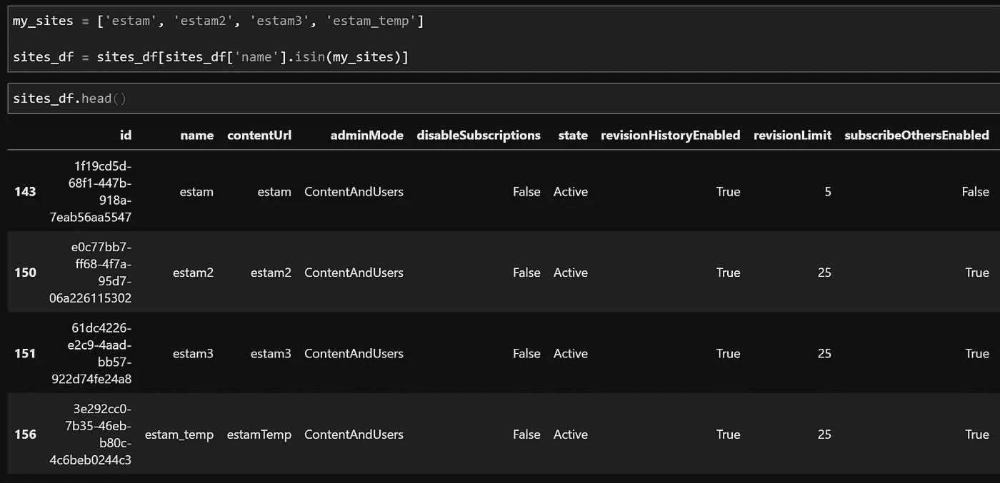
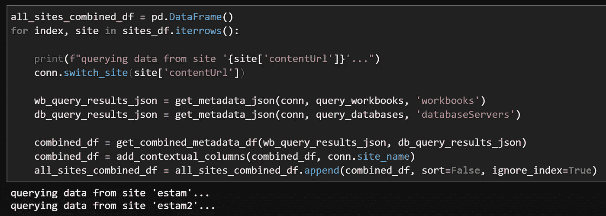

# Tableau 服务器影响分析报告:收集所有站点的数据沿袭

> 原文：<https://towardsdatascience.com/tableau-server-impact-analysis-reports-harvesting-data-lineage-for-all-sites-7c207eef9ca5?source=collection_archive---------53----------------------->

## TABLEAU REST API: TABLEAU-API-LIB 教程

## 一个关注使用交互式视觉跟踪数据传承来提高团队生产力的系列


马库斯·斯皮斯克在 [Unsplash](https://unsplash.com?utm_source=medium&utm_medium=referral) 上的照片

本系列中的前三个里程碑生成了 Tableau Hyper extract，其中包含来自元数据 API 的数据血统信息、来自 Tableau Server 内部 PostgreSQL 数据库的用户交互信息。第四个里程碑(我们之前的文章)基于该摘录构建了一个交互式 Tableau 仪表板。

在本文中，我们回到第二个里程碑，从元数据 API 中提取数据血统信息。在这里，我们将重新审视这个过程，并将范围扩大到包括 Tableau Server 上所有可用站点的数据沿袭信息。最初，该流程只为我们认证的*活动*站点提取数据。

如果这是您第一次关注这个系列，为了方便起见，下面是以前的里程碑:

1.  [构建 Tableau 服务器影响分析报告:原因和方式](/building-tableau-server-impact-analysis-reports-why-and-how-191be0ce5015)
2.  [Tableau 服务器影响分析报告:访问元数据](/tableau-server-impact-analysis-reports-accessing-metadata-9e08e5fb5633)(里程碑 1)
3.  [Tableau 服务器影响分析报告:将元数据与 PostgreSQL 结合](/tableau-server-impact-analysis-reports-combine-metadata-with-postgresql-47447b830513)(里程碑 2)
4.  [构建一个 Tableau Hyper extract 并将其发布为数据源(里程碑 3)](/tableau-server-impact-analysis-reports-metadata-publishing-and-using-apis-54b203fdd183)
5.  [在 Tableau 中构建交互式影响分析仪表板(里程碑 4)](/tableau-server-impact-analysis-reports-building-customized-interactive-visuals-85ce4798dead)

## 我们在本教程中完成了什么(里程碑 5)

到目前为止，Tableau 的 REST API 已经为我们扮演了一个使能器的角色。它是我们发布元数据 API 查询的网关，也是我们用来将 Hyper extract 发布到 Tableau 服务器(或 Tableau Online)的网关。

在本教程中，我们将利用'[切换站点](https://help.tableau.com/current/api/rest_api/en-us/REST/rest_api_ref.htm#switch_site)'端点来遍历服务器上所有可用的站点。这样做允许我们从不同的站点多次执行相同的元数据 API 查询。一旦我们检索了所有站点的数据沿袭信息，我们只需合并结果来构建整合的数据沿袭细节。

如果您习惯于手工从 GraphiQL 接口提取数据，而不是通过 REST API 发出元数据 API 查询，那么这里概述的过程可能会说服您转向 Python。为什么？因为在无代码方法中，您一次只能提取单个站点的数据。通过构建执行代码的自动化流程，我们能够自动化涉及切换站点和对多个站点重复相同查询的过程。

请注意，您的 Tableau 帐户只能看到您有权访问的网站。如果您的目标是为整个服务器构建准确的影响分析，请验证您是服务器管理员。如果您不是服务器管理员，请注意，由于您的用户没有分配相关权限，某些内容可能会对您隐藏。

## 在我们开始之前，有一个小问题…

即使你是这些教程的专家，在下面的步骤中使用最新版本的库也无妨。

`pip install --upgrade tableau-api-lib`

## 扩展我们现有的元数据收集流程

为了避免重复不必要的内容，我将坚持新的内容，并假设您已经熟悉我们在本教程系列的第二个里程碑中完成的内容。

这个里程碑给我们留下了这个 GitHub 要点，我们将在本文中详细阐述。

我们这里的主要目标是将前面代码中的逻辑放入一个循环中，该循环将为我们的每个 Tableau 服务器站点执行。为了让这个迭代过程工作，我们首先需要获得我们想要遍历的站点。一旦我们有了这些网站，我们将建立一个类似这样的过程:

```
for site in sites:
    <switch the active connection to this site>
    <execute site-specific query>
    <append site-specific results to a server-wide object>
```

## 获取要迭代的站点列表

我喜欢使用 Python 库 [tableau-api-lib](https://pypi.org/project/tableau-api-lib/) 来处理这样的任务。图书馆里有一个方便的功能，可以拉出一个熊猫数据框，里面有我们网站的详细信息。

```
from tableau_api_lib import TableauServerConnection
from tableau_api_lib.utils.quering import get_sites_dataframe# establish a connection as seen in the milestone 2 GitHub Gistsites_df = get_sites_dataframe(conn)
```

产生的 *sites_df* 看起来像这样:


我们真正需要的是名为“contentUrl”的列。当我们调用“切换站点”端点时，这是 REST API 需要的值。在我们的服务器环境中，每个站点的“contentUrl”值都是唯一的。请注意，这与网站名称是*而不是*相同的东西，尽管在某些情况下它们是相同或非常相似的。

## 过滤到站点子集(可选)

我发现自己在这个服务器上有多个站点，但是这些站点中有许多与我无关。如果您希望您的服务器上的每个站点都包含在您的分析中，请跳过这一步。然而，如果你只关心网站的一个子集，那么这一部分就是为你准备的。

将我们的数据存储在熊猫数据框架中带来了某些便利。例如，我们可以根据逻辑条件轻松地修剪数据。下面的代码块演示了如何在查询相关元数据之前定义站点子集。

```
my_sites = ['estam', 'estam2', 'estam3', 'estam_temp']sites_df = sites_df[sites_df['name'].isin(my_sites)]
```

以下是我的结果:



## 重构我们现有的逻辑并构建循环

虽然我不会去张贴这个重构过程的截图，但请注意，本文末尾的合并 GitHub 要点是我们在第二个里程碑中使用的要点的重构版本。

我将大部分代码放入函数中，努力将我们在这个里程碑中的注意力集中在循环本身上。

下面是最终代码的循环部分:



上面的代码执行以下操作:

1.  我们定义了一个空的数据帧来存储每个站点的数据
2.  我们开始一个 for 循环来迭代我们的 *sites_df* 数据框架中的所有站点
3.  对于每个站点，我们将 Tableau 服务器连接切换到该站点
4.  我们发布我们想要的元数据 API 查询
5.  我们处理并组合这些查询的输出
6.  我们将单个站点的输出附加到 *all_sites_combined_df*

下面是一个屏幕截图，显示了多个站点所需的数据现在如何存在于单个 Pandas 数据框架中:


## 下一步是什么？

既然我们可以为多个站点提取元数据，我们可以简单地用这个里程碑的输出替换第二个里程碑的输出。

在我们完成的第三个里程碑中，我们从 Tableau Server 的内部 PostgreSQL 数据库中提取信息。它已经有了我们所有站点的数据，所以当我们将这个输出与那个里程碑的输出相结合时，结果将是我们在这里看到的所有站点的数据。

本教程到此为止！我们已经扩展了我们的原始元数据里程碑，现在我们可以访问所有 Tableau 站点的数据，而不仅仅是我们认证的站点。

这是一个好消息，因为我们现在可以构建覆盖所有网站的影响分析报告，并在 Tableau 服务器上的一个集中位置发布这些报告！当您登录 Tableau Server 时，一次只能看到一个站点的数据沿袭。现在，您已经拥有了构建单个报告的必要工具，该报告在一个位置提供了所有信息。

## 合并代码

使用[这个 GitHub 要点](https://gist.github.com/divinorum-webb/0a4fccc8beb1e4bcadd708c53d1cdec8)作为将本教程集成到您自己的工作流程中的起点。

## 即将到来的里程碑

里程碑 6 (ETA 为 5/27/2020):探索 Tableau 新的“[指标](https://www.tableau.com/metrics)功能，这为方便的 KPI 分析打开了大门。我们将了解一种 KPI 分析方法来查看我们的影响分析数据。