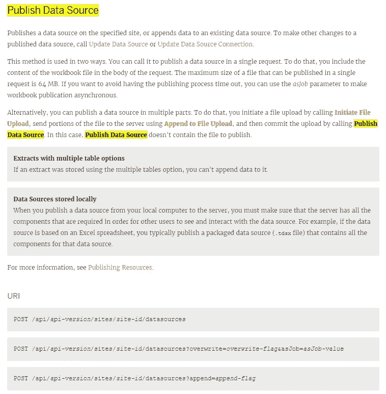
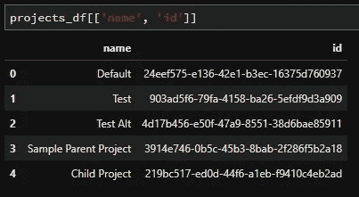
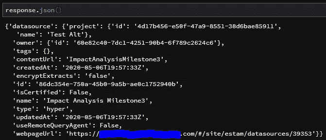
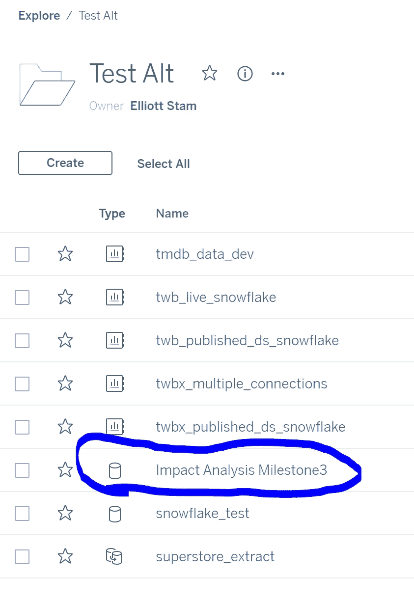
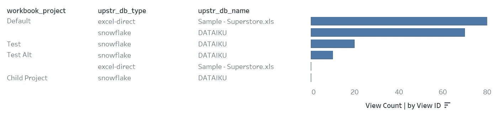

# Tableau 服务器影响分析报告:元数据、发布和使用 API

> 原文：<https://towardsdatascience.com/tableau-server-impact-analysis-reports-metadata-publishing-and-using-apis-54b203fdd183?source=collection_archive---------49----------------------->

## TABLEAU REST API: TABLEAU-API-LIB 教程

## 一个关注使用交互式视觉跟踪数据传承来提高团队生产力的系列


Tableau 元数据现在就在你的手中(图片由 [Rohan Makhecha](https://unsplash.com/@rohanmakhecha?utm_source=medium&utm_medium=referral) 在 [Unsplash](https://unsplash.com?utm_source=medium&utm_medium=referral) 上拍摄)

在本系列的前三篇文章中，我们介绍了 Tableau 的元数据 API 和内部 PostgreSQL 数据库，并展示了如何将它们结合起来构建强大的数据集，从而推动我们的影响分析工作。

如果这是您第一次关注这个系列，为了方便起见，下面是以前的里程碑:

1.  [构建 Tableau 服务器影响分析报告:为什么和如何](/building-tableau-server-impact-analysis-reports-why-and-how-191be0ce5015)
2.  [Tableau 服务器影响分析报告:访问元数据](/tableau-server-impact-analysis-reports-accessing-metadata-9e08e5fb5633)(里程碑 1)
3.  [Tableau 服务器影响分析报告:将元数据与 PostgreSQL 结合](/tableau-server-impact-analysis-reports-combine-metadata-with-postgresql-47447b830513)(里程碑 2)

我们完成的最后一个里程碑留给我们一个 CSV 文件，它包含元数据 API 输出(我们的影响分析的核心)和 PostgreSQL 输出(增加了额外的味道，包括用户查看次数和最后交互日期)。

## 我们在本教程中完成了什么(里程碑 3)

本文探讨了一些相关的后续步骤:一旦我们获得了想要的数据，我们应该如何存储这些数据？我们能否发布数据，以便其他 Tableau 用户可以自由构建自己的交互式报告？

处理这些数据的一个可行的方法是将其转换成 Tableau。超提取并发布到 Tableau 服务器。这是我们将在下面的章节中关注的。

到本文结束时，我们将有一个建立在先前里程碑基础上的工作流，将数据打包成一个表格。hyper 提取并发布数据到我们的 Tableau 环境中。

## 认识你的新朋友:Tableau 的 Hyper 和 REST APIs

两个新工具进入本文:Tableau 的 [Hyper API](https://help.tableau.com/current/api/hyper_api/en-us/index.html) 和 [REST API](https://help.tableau.com/current/api/rest_api/en-us/REST/rest_api.htm) 。请注意，如果您以前有过使用 Tableau 的遗留提取 API 或遗留 Tableau SDK 的经验，那么 Hyper API 是您今后(Tableau 10.5 以上)构建提取文件时应该使用的。

Hyper API 允许我们创建高性能的数据提取，并允许我们从这些提取中添加或删除数据。的。hyper extract 文件是 Tableau 世界中的一等公民，所以与继续使用 CSV 或 JSON 文件的替代方案相比，这对我们来说是一种升级。

你可以去寿司店点通心粉和奶酪，但是谁会这么做呢？Tableau 中的数据存储也是如此。Tableau 已经构建了一个完整的提取引擎，为什么还要在 Tableau 服务器上使用 CSV 呢？超级文件？点该死的寿司。

一旦我们有了。hyper extract 文件准备就绪，我们将把接力棒传递给 Tableau 的 REST API，将摘录作为数据源发布在 Tableau 服务器(或 Tableau Online)上。

这里没有什么特别的，只是两个简单的用例，它们建立在 Tableau dev 团队提供的一些优秀工具的基础上。向 [#DataDev](https://twitter.com/hashtag/datadev?lang=en) 社区大声喊出来！

## 从我们离开的地方继续

如果您需要赶上进度，请随意向上滚动到顶部，然后单击将带您完成早期里程碑的步骤的文章。

在下面的部分中，我们从第二个里程碑结束时停止的地方继续。我们拥有构建定制影响分析报告所需的核心数据，现在我们希望将这些数据放入. hyper extract 中，并将其发布到 Tableau Server(或 Tableau Online)。

## 使用超级 API

本着将所有各种工具放在一个屋檐下的精神，我使用 Python 作为编排所有各种工具的霸主。下面是我们如何使用 Hyper API 将现有数据转换成. hyper extract。

让我们首先定义一个本地文件路径。hyper 文件将被存储(这建立在之前的里程碑中已经开发的 Python 代码之上——完整代码请参见本文末尾的综合 GitHub 要点):

```
PATH_TO_HYPER = 'tableau/datadev_round2/workbooks_and_owners.hyper'
```

我从 Hyper API 文档中借用了一些模板代码，并对其进行了修改，以构建熊猫数据帧的摘录，如下面的 GitHub 要点所示。本文末尾包含了包含整个过程的合并代码。

这个 [GitHub 要点](https://gist.github.com/divinorum-webb/450b8b81c7544629fa71ff682b1522e0)涵盖了与本节相关的代码片段，但是请注意，单独运行它是行不通的(请使用本文末尾的合并 GitHub 要点)。

在我自己的测试中，我还需要对数据帧进行一些清理，以使 Hyper API 不会抱怨某些输入为空。特别是，当从 pandas DataFrame 转移到. hyper extract 时，datetime 和 date 列一直是我的眼中钉，所以我倾向于强制 date 列键入“str ”,然后在 Tableau 中将该文本转换回日期。这样就避免了担心日期是用日期、日期时间、时间戳还是任何其他特定的日期格式来表示的麻烦。

## 正在发布。您的 Tableau 环境的超级文件

现在我们有了提取文件，让我们把它推送到 Tableau 服务器(或者 Tableau Online)。这里我将使用的库是 [tableau-api-lib](https://github.com/divinorum-webb/tableau-api-lib) ，它是我开发和维护的。它被设计成镜像在 [Tableau 的 REST API 引用](https://help.tableau.com/current/api/rest_api/en-us/REST/rest_api_ref.htm)上找到的 REST API 端点。

这个库与其他 Python / Tableau REST API 库(比如 Tableau 自己的 [Tableau 服务器客户端](https://github.com/tableau/server-client-python)库)的主要区别在于，这个库的设计使得如果您在 Tableau 文档中看到一个端点，那么该端点将使用相同的命名约定来实现。

例如，现在我们需要发布一个数据源。查看 Tableau Server REST API 参考，我们找到了[期望的端点](https://help.tableau.com/current/api/rest_api/en-us/REST/rest_api_ref.htm#publish_data_source):



“发布数据源”端点的 tableau-api-lib 实现为我们提供了一个实例方法，我们可以这样调用:

```
conn.publish_data_source(<arguments to function go here>)
```

让我们把摘录出版吧！但是在我们发布它之前，我们需要知道我们要发布到的项目(更重要的是，项目 ID)。

我们可以使用 tableau-api-lib 轻松地获取有关项目的信息(注意，示例代码中的“conn”表示到 tableau 服务器的连接——有关更多详细信息，请参见本文末尾的完整代码):

```
projects_df = get_projects_dataframe(conn)
print(projects_df[['name', 'id']]
```

下面是我的“项目 _df”的样子:



现在让我们将摘录发布到我的“Test Alt”项目中。

```
response = conn.publish_data_source(
datasource_file_path=PATH_TO_HYPER,
datasource_name='Impact Analysis Milestone3',
project_id='4d17b456-e50f-47a9-8551-38d6bae85911')
```

我们现在可以查看“response”变量内部，以验证此发布请求是否成功:

```
print(response.json())
```



## 连接到。带有 Tableau 桌面的超级文件

现在摘录已经发布，我们可以验证它在 Tableau 服务器上，我们可以用 Tableau Desktop 连接到它来构建我们的视觉效果。



这是我在 Tableau Desktop 中创建的一个快速视觉效果，它连接到已发布的摘录:



看起来，如果雪花或超市出了什么事，我的“默认”项目将受到最严重的打击。

关于我之前如何处理日期字段的一个小注意事项:因为我连接到一个已发布的提取，我需要构建一个计算字段，使用 Tableau 的 date()函数将我的每个“日期”字段转换成一个日期。

这一点也不困扰我，因为我已经因为不得不替换数据源而焦头烂额了很多次，我总是为我的字段建立占位符计算，并试图避免使用“原始”字段，因为它们会出现在 Tableau 中。但那是另一篇文章的话题了！

## 包装它

对于本教程来说，这就是我们的前两个里程碑(利用元数据 API 和内部 PostgreSQL 数据库)并将数据存储到 Tableau 中。超精华。

敬请关注下一个里程碑，我们将进一步了解如何在 Tableau 仪表盘中使用这些数据来构建交互式影响分析视觉效果！

## 即将到来的里程碑

里程碑 4 (ETA 是 5/13/2020):使用本文中发布的数据源构建我们的第一个影响分析仪表板。

里程碑 5 (ETA 是 5/20/2020):演示如何从所有站点提取元数据。在里程碑 1 中，我们从元数据 API 中提取数据。默认情况下，该数据特定于您通过身份验证进入的站点。使用 REST API，我们可以遍历所有可用的站点，并提取整个服务器的元数据。

*里程碑 6 (TBD)*

## 合并代码

使用[这个 GitHub 要点](https://gist.github.com/divinorum-webb/a300f41bca41677113e4a49012365e95)作为实现我们第三个里程碑的模板。请记住，这里的代码只是完成工作的一种可能的方法，您可以根据自己的需要修改它。

代码开始变长了(大约 300 行)。我是否建议让您的生产代码看起来像这里这样？没有。但是，将所有内容都放在一个文件中有利于概念验证的启动和运行。我将由您来决定如何将它集成到您自己的工作流中。