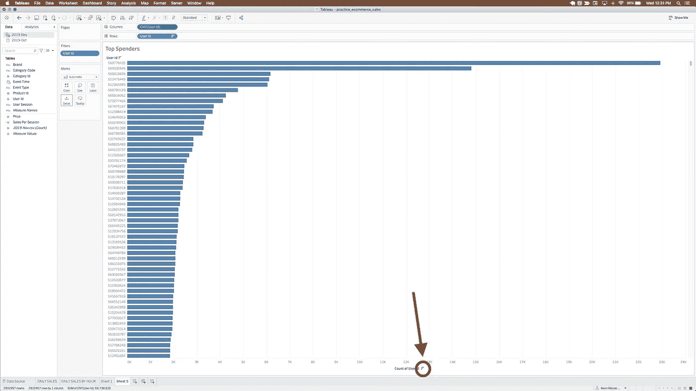
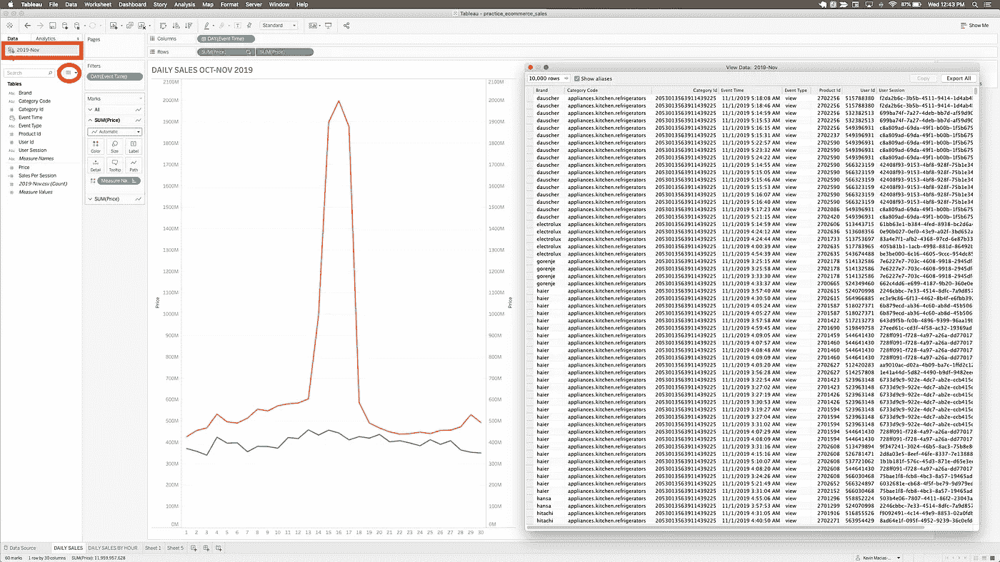
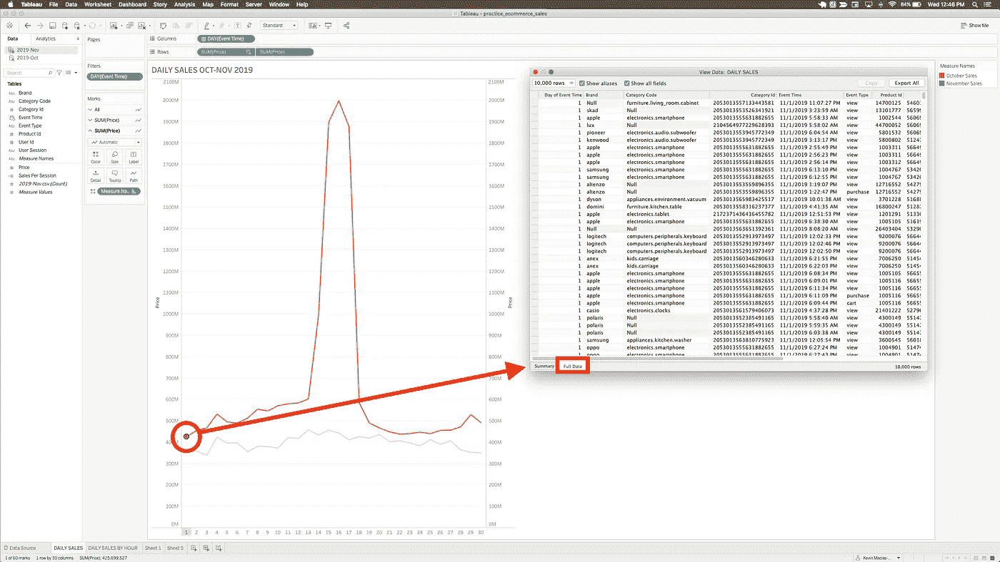
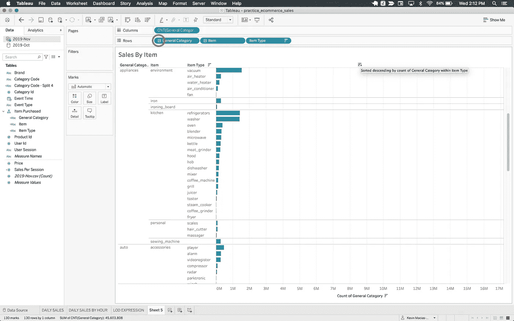
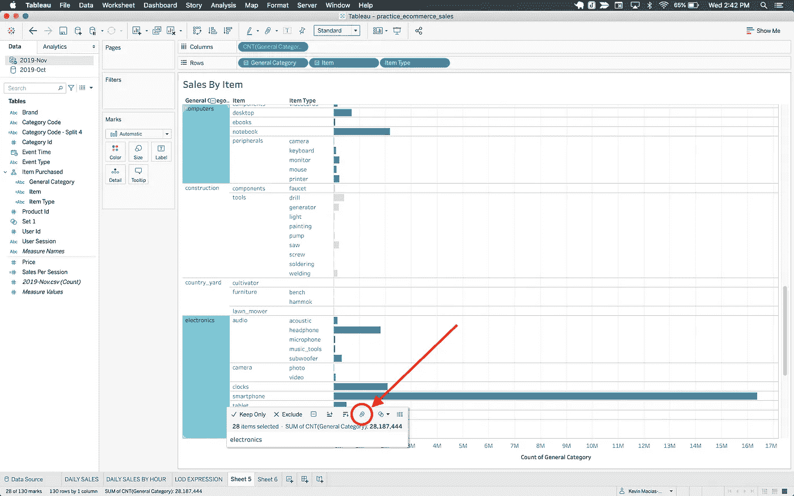
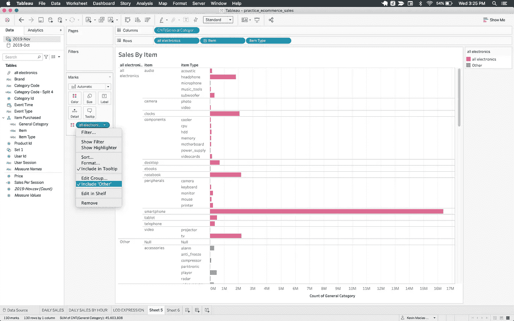
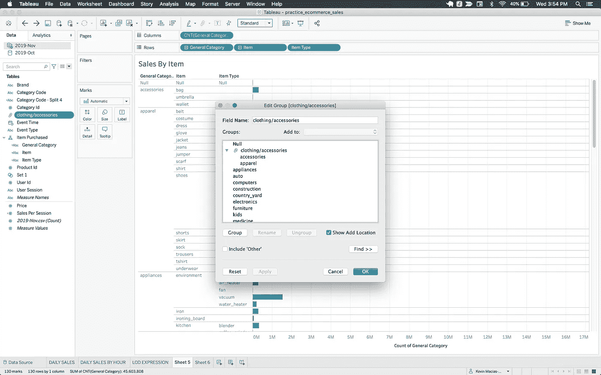

# Tableau 教程:组和层次+一点额外的

> 原文：<https://towardsdatascience.com/tableau-tutorials-groups-hierarchies-a-little-extra-6e4c5d2d5cc9?source=collection_archive---------49----------------------->

照片由 [**麦克**](https://www.pexels.com/@mike-468229?utm_content=attributionCopyText&utm_medium=referral&utm_source=pexels) 发自 [**像素**](https://www.pexels.com/photo/depth-of-field-photography-of-file-arrangement-1181772/?utm_content=attributionCopyText&utm_medium=referral&utm_source=pexels)

欢迎来到我正在进行的 Tableau 教程系列的第四篇。这个博客将分为两部分，第一部分介绍组和层次结构，第二部分介绍使用计算和参数的集合和动态分组。在过去的博客中，我已经讨论了基本的数据——连接到仪表板、计算和过滤，同时非常简短地讨论了组和层次结构。在这篇文章中，我将深入到组和层次结构的更详细的解释。

当处理大型数据集时，您可能会得到比帕台农神庙更多的列。为了我们的理智和易于分析，我们希望能够以某种方式对我们的数据进行排序和分组。Tableau 为我们提供了使用集合、组、层次结构的选项，以及前面提到的根据数据或用户输入动态更新的分组的计算和参数。

首先，让我们回顾几个快速简单的概念。首先让我们考虑订购我们的数据。这通常是一项简单的任务。在这个例子中，我将使用来自电子商务网站的数据。如果我们想要查看购买最多商品的顶级用户列表，我们可以将适当的药丸拖动到列和行中来构建我们的图表。在这里，我们可以通过单击图表上的行轴或列轴上的下降条图标来轻松地对值进行排序。在这种情况下，我们希望对计数进行排序，因此我们单击列轴来显示具有最多实例或购买的用户 id。要按升序排序，我们只需再次单击同一个图标。

因为我们正在使用分组，所以让我们一直深入到最细粒度的层，也就是原始数据源。有几种方法可以查看数据源。我们可以单击看起来像数据表的图标，以及它上面的选定数据源，以查看一个弹出窗口，其中包含整体数据的视图。

为了获得更具体的信息，我们还可以单击图表中的任何一点，弹出一个窗口，显示各种选项，包括相同的数据图标。我们只需单击它，然后从随后窗口的底部，从“Summary”选项卡切换到“Full Data”选项卡。

既然我们可以向下钻取并查看我们的数据，那么让我们看看如何用层次结构对数据进行分组。顾名思义，这种方法涉及某种类型的顺序关系，允许您深入了解更多细节。例如，任何日期时间变量都会自动分组到一个层次结构中，允许您从年到月到日到小时进行钻取。在这个例子中，从 Data Source 选项卡，我将 Category Code(显示购买的项目，其间有句点以指示子类别)字段拆分为 General Category、item 和 Item Type 子类别。

若要创建层次结构，请将所需的字段标识为层次结构的第二级。将该字段拖放到您想要指定为顶级的字段上。在这种情况下，我希望 General 类别显示为顶层，所以我将项目 pill 拖动到 General 类别 pill 的顶部。从这里将出现一个窗口，我可以在其中命名层次。我称我的为“已购买项目”。您可以看到，在 Tables 部分中，药丸被分组到新的层次名称下。要添加更低的级别，我们只需将想要添加的药丸拖放到层次结构下的适当位置。当层次结构组成后，我们可以将它移动到列和行字段来构建我们的图形。要在层次结构中向下钻取，我们单击层次结构药丸中的加号，相反，要向上钻取，我们单击减号。为了构建下面的图表，我一路向下钻取，然后按项目数排序，如前所示。

我们可以组合字段中相关值的另一种方法是使用 Tableau 组。我们来举个例子。假设我们想要突出显示用层次结构生成的图表中“General Category”列下的计算机和电子产品值。在该视图中，我们可以按住 command 并单击计算机和电子设备字段，此时会出现一个弹出窗口。在此窗口中，我们单击回形针图标对这些值进行分组。

视图中的结果组将组合名称，但我们可以简单地右键单击并在“编辑别名”下将其重命名为“所有电子”。我们还可以在 Tables 部分下重命名生成的药丸。从这里，我们可以将药丸拖动到颜色部分，并从药丸下拉菜单中选择包括“其他”以根据我们的选择和“其他一切”进行分组。这使得我们能够突出显示该分组部分。

如果仅用视图进行分组很困难，我们也可以在“表格”部分右键单击我们想要分组的药丸，然后将鼠标悬停在“创建”上，然后单击“分组”,这将弹出一个菜单，我们可以在其中选择适当的字段。

在菜单中，我们还可以单击查找>>来搜索值。当我们选择了我们的字段，我们可以点击组，然后重命名。如果我们想将另一个类别添加到组中，我们单击该类别，然后在标有“添加到:”的下拉菜单中，我们可以选择它应该加入哪个组。从菜单中，我们还可以通过选择组，然后单击“取消分组”，轻松地选中“包括‘其他’”和“取消分组”。要编辑群组，请访问药丸的下拉菜单，然后单击“编辑群组…”。

分组是分离您感兴趣的值的一种强大且快速的方法。它还可用于修复拼写或数据输入错误，这些错误会导致多个字段，而实际上应该只有一个字段。使用一点脑力可以产生有趣和有用的方法来分组数据进行分析。遵循我的中等配置文件，并在下周详细了解集合和动态分组。