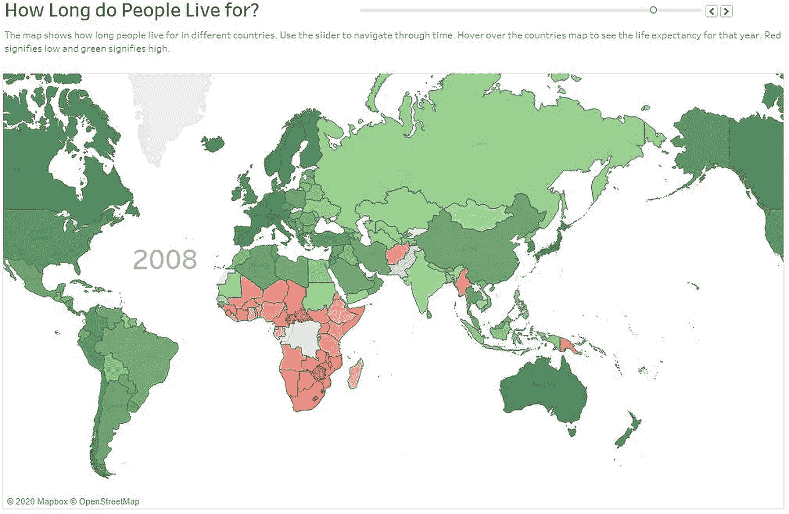
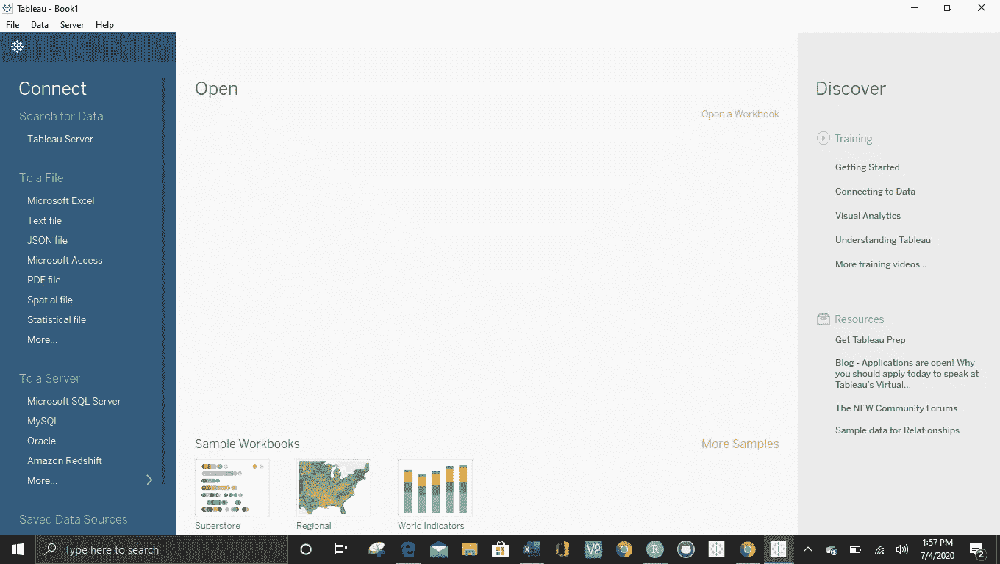
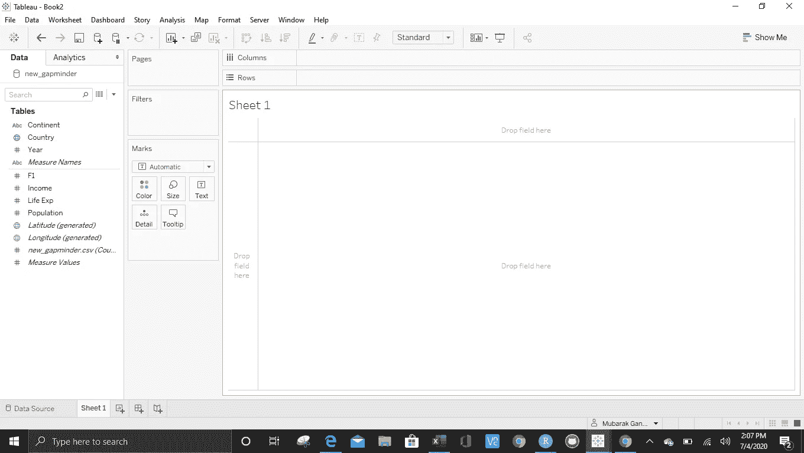
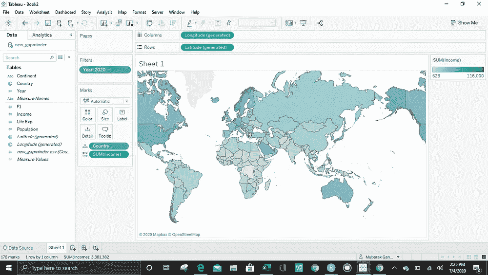
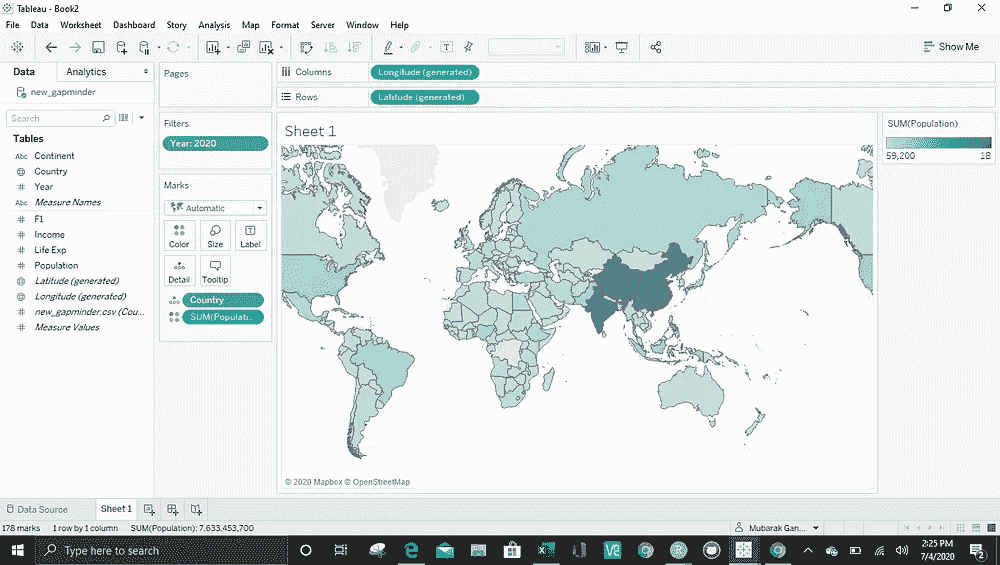
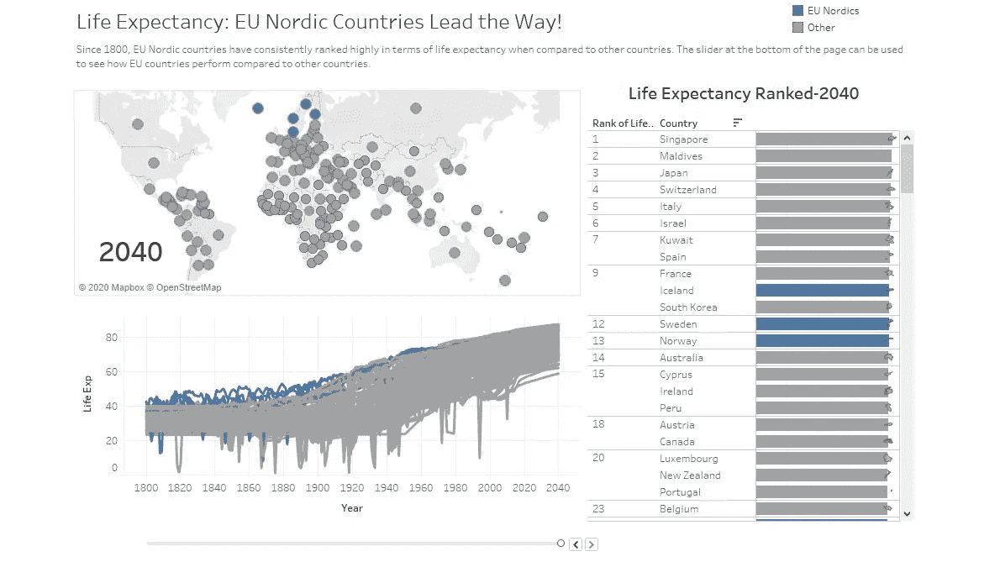

# Tableau:释放视觉分析的力量

> 原文：<https://towardsdatascience.com/tableau-unleashing-the-power-of-visual-analytics-3376ccf0c1f8?source=collection_archive---------28----------------------->

我用 Tableau 创建的仪表板示例

## 是什么使 Tableau 成为一个无可挑剔的数据可视化工具，为什么你应该使用它！

大约一个月前，我决定挑战自己，学习更多关于数据可视化的知识。在多次谷歌搜索寻找最佳数据可视化工具后，有一款产品不断脱颖而出， **Tableau** 。我决定安装它，试一试。作为一名学生，我可以免费使用它。然后，我打开它，看到一个大页面要求我连接数据或打开工作簿。我不知道下一步该做什么。

打开后的画面。

困惑之余，我查阅了许多关于如何使用 Tableau 的在线资源，并偶然发现了本·琼斯的*用 Tableau 交流数据:设计、开发和交付数据可视化*一书。我强烈推荐这本书。对于对利用 Tableau 的数据可视化能力感兴趣的初学者来说，这是非常简单明了和有用的。

它教会了我如何使用分类数据和连续数据来创建不同种类的图表，如条形图、时间序列图、散点图、箱线图和地理图。此外，我学会了如何使用过滤器、页面、标记等功能来创建高质量的工作表。最后，我找到了利用仪表板特性来构建交互式可视仪表板的窍门，这些仪表板可用于向人们讲述故事。

Tableau 是一个众所周知的快速分析和快速商业智能平台，没有更好的方式来描述它。我在过去一个月里对 Tableau 的体验非常令人兴奋。下面是一个简短的总结，介绍如何使用 Tableau 来构建漂亮的交互式视觉界面。

## 加载数据:

与 Python、R 或任何其他数据科学编程语言不同，Tableau 不需要您运行多行代码来加载数据、转换数据和创建图表。一旦你习惯了，这是非常简单的。你只需要通过将 Tableau 连接到服务器或本地文件来上传数据。一旦连接了数据，您就可以访问工作表并开始构建图表。

Tableau 上的空工作表

## 构建和更改图表:

我喜欢 Tableau 的另一个方面是，我可以通过从 table 部分拖动字段并将其与用于创建工作表的功能集成来轻松构建图表。构建工作表的基本功能是列、行、过滤器、标记和页面。

当有人试图移动字段或操作要素时，可以立即在工作表上发现变化。我还可以使用演示功能来更改我的图表。我不再需要编辑我的代码，重新运行它，等待得到不同的输出。当你使用它时，它会不断变化。

左图是 2020 年基于收入的地图。右图是基于 2020 年人口的地图。

在上面的图表中，通过删除 marks 部分下包含收入的绿色条，并在几秒钟内用 population 替换它，进行了更改。

## 交互式仪表盘:

在工作簿中构建多个工作表后，可以将它们组合起来构建一个仪表板。Tableau 上的仪表盘可以按照你认为合适的方式进行交互。当观众/演示者与仪表板交互时，仪表板在图表中绘制见解或显示活动。这使得仪表板在讲述故事或提供高质量信息时非常有用。

交互式仪表板的一个例子

## 通过 Tableau Public 共享项目:

一旦建立了仪表板，用户可以决定在 Tableau Public 上与 Tableau 社区的其他成员共享它。这是通过创建一个 Tableau 公共帐户，并使用页面上的服务器功能，通过使用您的凭据登录，将仪表板连接到 Tableau 公共帐户来完成的。上传仪表板后，还可以添加仪表板的详细信息。

Tableau 是一个美丽的平台，我在过去的一个月里学会了如何使用它，我将在未来继续使用它。使用它让我对学习如何使用其他数据科学或数据可视化工具充满热情。首先，我很高兴见到了 Tableau。

下面是我通过重现汉斯·罗斯林的著名视频[*Stats 的喜悦*](https://www.youtube.com/watch?v=jbkSRLYSojo) *制作的视频。它显示了从 1800 年至今，不同国家的预期寿命和收入是如何变化的。我用我的 Tableau 知识建立了一个预期寿命与收入的散点图，并制作了一个交互式仪表盘。*

预期寿命与收入的历史

感谢您的阅读。