# Tableau 可视化

> 原文：<https://towardsdatascience.com/tableau-visualizations-dc9e544dc9a8?source=collection_archive---------19----------------------->

## 了解如何在 Tableau 中创建基本图表

[斯科特·格雷厄姆](https://unsplash.com/@sctgrhm?utm_source=medium&utm_medium=referral)在 [Unsplash](https://unsplash.com?utm_source=medium&utm_medium=referral) 上拍照

# 什么是 tableau？

Tableau 是一款端到端、强大、安全、灵活的交互式可视化分析软件，用于商业智能行业。它正在改变我们使用数据来发现和解决问题的方式。众所周知，它是发展最快的数据可视化平台之一。它的基本功能是将原始数据转换成易于理解的可视化数据，供许多个人和组织用于问题分析和决策制定。

# 为什么要用 tableau？

*   首先，使用 Tableau 执行数据分析是一个**快捷方便的**过程。
*   它的形象化很容易理解。由于其用户友好性，组织中任何职位的人都会发现它易于使用。
*   它的可视化不仅易于查看，而且易于创建。任何有技术甚至非技术背景的人都可以使用 Tableau 创建可视化效果。
*   **数据混合和实时分析**是 Tableau 众多重要功能中的一部分。
*   这是一个可以**应用于任何业务**以获得清晰见解的软件。
*   Tableau 提供对数百个数据连接器的支持。列表可以在这里找到[。](https://help.tableau.com/current/pro/desktop/en-us/exampleconnections_overview.htm)
*   Tableau 有一个庞大的社区，在 Twitter 上非常活跃，人们使用标签，比如:#改头换面星期一
*   创建的仪表板可以作为动态可视化**共享**。如果给定平台不支持动态可视化，那么用户也可以选择将其导出为**静态可视化。**

如果你仍然不确定 Tableau 是否适合你，我建议你阅读下面的文章: [Excel，Tableau，Power BI…你应该使用什么？](/excel-tableau-power-bi-what-should-you-use-336ef7c8f2e0)

Tableau 产品:

*   [**Tableau Desktop**](https://www.tableau.com/products/desktop)是 Tableau 最畅销的产品之一，用户可以在其中构建图表和仪表盘。
*   [**Tableau Prep Builder**](http://tableau.com/products/prep)主要用于对您的数据进行预处理。
*   [**Tableau 服务器**](https://www.tableau.com/products/server) 和 [**Tableau Online**](https://www.tableau.com/products/cloud-bi) 允许您发布您的仪表板，并允许用户查看和与之交互
*   [**Tableau Public**](https://public.tableau.com/s/)是 Tableau 的公共平台，任何人都可以在这里查看你的可视化。

让我们从这个教程开始吧。

## 注册 Tableau 公共帐户

a.转到[public.tableau.com](http://public.tableau.com/)

b.点击右上角的注册

c.填写你的详细资料并记下来

## 安装 Tableau 的 14 天完全免费试用版

a.前往 Tableau 桌面:[https://www.tableau.com/products/trial](https://www.tableau.com/products/trial)

b.输入您的电子邮件地址并下载免费试用版。如果你有一个学生或教师帐户，你可以获得一年的免费许可证。

c.一旦应用程序被下载，注册自己。

你可以在这里找到这篇教程的参考资料。

让我们启动应用程序，并探索应用程序的主要组件。

第一次打开 Tableau 桌面应用程序时，会出现以下窗口。在此窗口的左侧窗格中，我们有不同的选项来连接不同的数据源，如 Tableau Server(您可以将报告直接发布到服务器)、Microsoft Excel、JSON File、Microsoft SQL Server、Google Analytics、MariaDB、MySQL 等。

在底部，tableau 提供了一些提供介绍的示例工作簿。

在右侧窗格中，我们有一些培训资源，可以帮助您更好地了解 Tableau 及其服务和功能。

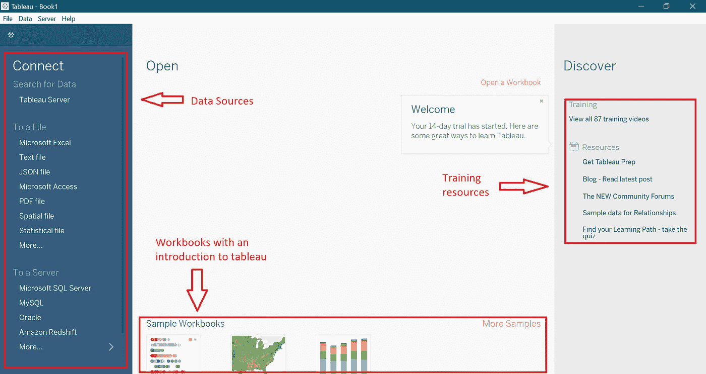

# 准备数据

在本教程中，我们将导入 excel 文件形式的数据

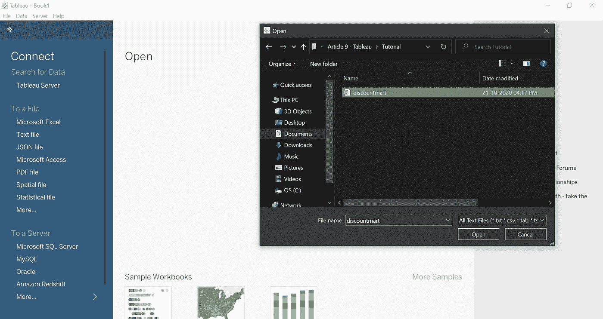

导入数据后，出现的窗口称为数据源窗口。

在左侧，我们有“连接”,它显示了您可以连接到的数据源。您可以在“连接”部分更新、编辑或删除选定的数据源。

下一部分是“文件”部分，通常显示数据源中的表格。

在它下面，我们有一个 Union 函数，允许您将数据追加到表中。例如，如果您有两个相似的雇员数据文件，您可以使用 union 选项来合并它们。

在 Union 选项的右侧，我们看到了表格的预览

在每个字段名的上方，我们有一个代表字段类型的图标，它由 Tableau 本身识别，可以通过点击它来修改。

在右上角，我们有另一个连接选项。在这里，Tableau 允许我们选择想要与数据建立的连接类型:实时连接或提取连接。

默认情况下，将选择实时选项。当您选择“提取”时，过滤器选项出现，这是一个非常重要的功能。使用过滤器，我们可以在我们已经过滤的特定数据上构建数据，这意味着我们不能使用我们已经过滤掉的数据。

## 要添加过滤器

a.点击右上角的“添加”。

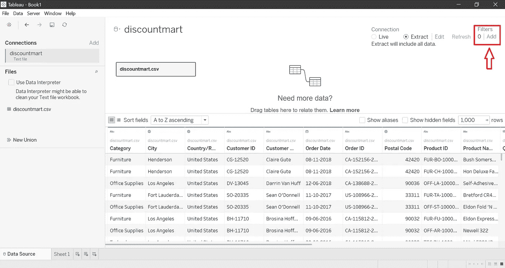

b.单击出现的窗口中的添加按钮。

c.选择要在筛选器中使用的字段。例如:城市

d.在所选字段中选择您要过滤的值，然后单击“确定”

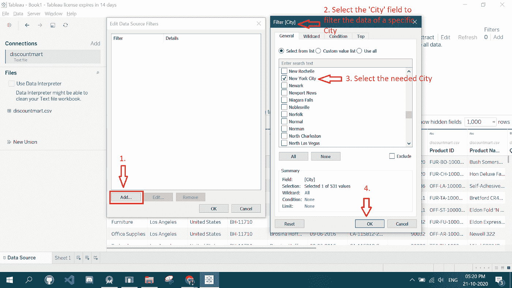

## 要编辑/删除过滤器

a.点击右上角的“添加”

b.在出现的窗口中，单击要编辑/删除的添加字段。

c.根据您想要执行的操作，选择“编辑”或“删除”按钮。

d.点击“确定”。

现在我们已经了解了过滤器的工作原理，让我们继续学习教程并开始创建图表。

选择窗口左下角的“第 1 页”选项，并选择您要存储摘录的位置。

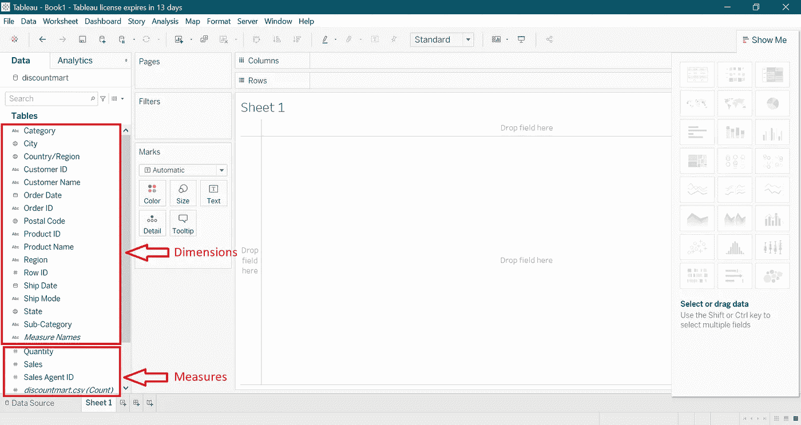

现在，在左边我们可以看到我们连接的数据源。当您右键单击数据源时，您可以使用各种选项，如刷新、编辑、复制等。

在那下面，我们还有两个窗格:维度和度量

通常以蓝色显示的尺寸包含细分类别中的数据。你不能对它们进行数学运算。比如你不能把两个类别相乘。

通常用绿色表示的度量是维度的反义词。这意味着我们可以将两个场相乘。

您可以通过右键单击将度量移至维度。在这里，我们将右键单击“销售代理 ID”并将其从度量移至维度

请注意，像纬度和经度这样的字段在我们的数据集中并不存在，而是由 Tableau 在读取城市、州、地区等字段时自动添加的。

# 创建图表

简单的方法是将类别拖到“行”和“列”字段中。

让我们将“区域”类别拖到行中，将“销售”类别拖到列中。Tableau 然后自动为我们创建一个条形图。

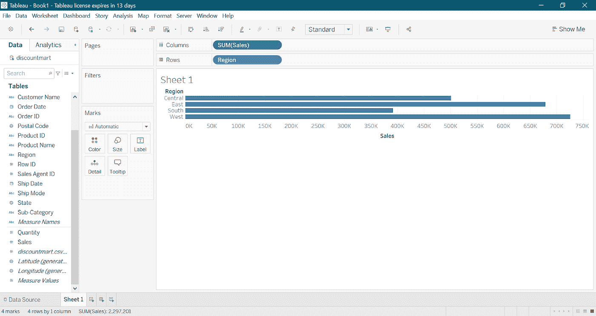

在 Tableau 桌面的右上角，我们有“演示”选项，Tableau 显示各种类型的图表，我们可以用它们来可视化我们的数据。

要清除工作表，您可以单击“清除工作表”图标。

要撤消或重做图表上的操作，可以单击应用程序左上角的箭头按钮。

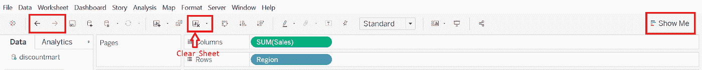

现在让我们创建一个可视化视图来按月查看销售额。

首先，将“订单日期”拖到列中，单击它旁边的箭头并选择“月份”,因为我们希望按月查看我们的销售额。

你可能会注意到，有两个部分的年，季度，月等。第一部分仅表示日期的一部分，但第二部分显示月份和年份，因此我们将从第二部分中选择月份。

列字段以前是蓝色的，现在变成了绿色。这是因为我们把年份改成了月份。蓝色表示场是离散的，绿色表示场是连续的。连续基本上意味着连续的数据点。因为时间是连续的，所以它是绿色的，而像类别这样的字段是绿色的，因为类别彼此不相关，它们是离散的。

接下来，要按月显示我们的销售额，我们需要将“销售”类别拖到行字段中。当你这样做时，Tableau 自动将“SUM”操作添加到 Sales 类别中，这基本上意味着它对数据集的每一行进行求和。要查看除 SUM 之外要在数据集字段上执行的其他操作，请单击它旁边的箭头。现在我们将离开操作是一个总数。

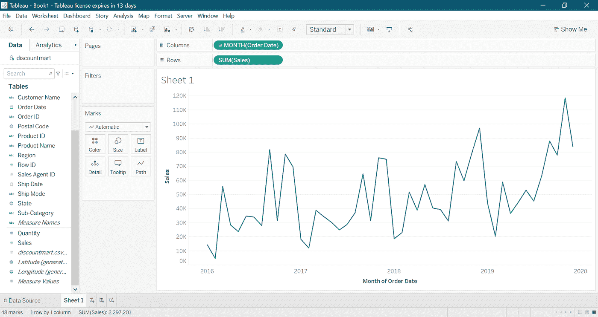

接下来，让我们以这样一种方式来改变可视化效果，即用户可以按特定年份的月份来查看销售额。为此，我们需要按年份过滤数据集，因此将订单 ID 字段拖到“过滤器”卡上，并选择年份。然后选择特定的年份，在我们的例子中是 2019 年，最近的一年。

让我们整理一下我们的销售额，因为它是一种货币。因此，请转到“Measures”下的“Sales”字段，单击“Default Properties”并选择“Number Format”选项，因为这是我们打算更改的内容。然后选择“货币(标准)”并选择“英语(美国)”，因为我们的销售货币是美元。之后，转到“货币(自定义)”，将小数位数更改为 0，然后单击“确定”。您的图表应该如下所示:

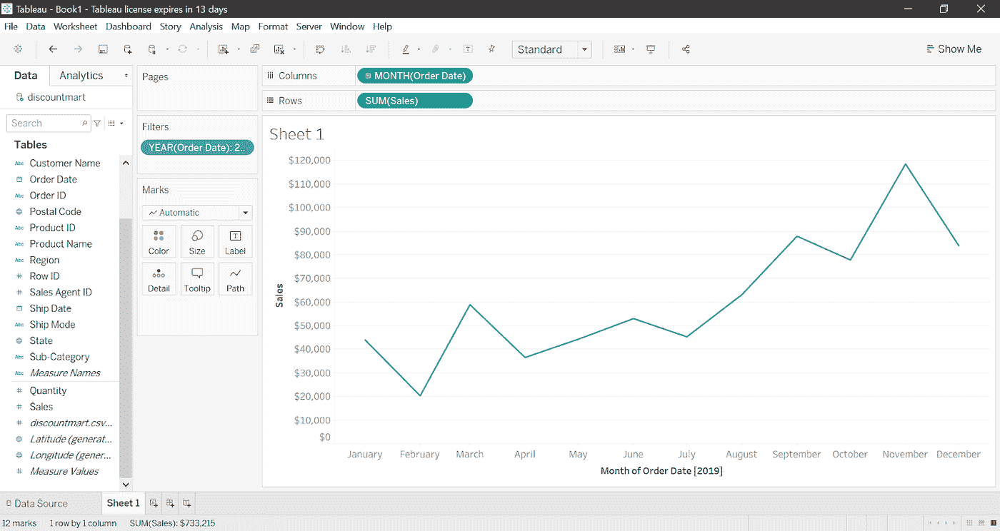

接下来，我们引入一条平均线。

在窗口左上角的“分析”窗格中，将“平均线”选项拖到出现在窗口中的表格选项中。

要进一步自定义该行，请单击该行并转到编辑。选择一个自定义标签并输入“平均值:<value></value>

此外，你可以选择线的类型，它的颜色等。

## 动态更改工作表的标题

双击图表中的“工作表 1”。清除当前数据。写下“销售日期”，并在其前面添加一个动态日期，单击此窗口右上角的插入，并选择“年份(订单日期)”。

此外，您可以更改标题的字体类型或大小，将其加粗并居中对齐。

要检查我们的动态标题是否有效，或者只是查看不同年份的数据，右键单击“YEAR(Order Date)”过滤器，然后选择“Show Filters”选项。选择或取消选择任何年份，查看标题如何根据所选年份动态工作。

# 自定义图表

在标记窗格中，我们可以更改线条的颜色和大小。

要在每个点上添加标签，请将“销售”指标拖放到“标记”下的“标签”字段中。要修改标签，右键单击它，转到格式，单击默认下的“数字”，转到货币(自定义)，将十进制值更改为“0”，并将数据前缀更改为“$”。

继续自定义标签，右键单击“标记”窗格下的“标签”,并在“字体”部分编辑字体，如下面的视频所示。

要进一步自定义图表，请右键单击图表上的任意位置，然后选择“格式”选项。您可以在“格式”窗格的“工作表”字段下更改字体样式。在本节中，您可以继续探索更多的功能。

除了这一部分的图标，我们有对齐部分，其次是阴影部分。在阴影部分，您可以更改图表的背景颜色。

要删除网格线，请单击“线条”选项，并将“网格线”字段更改为“无”。

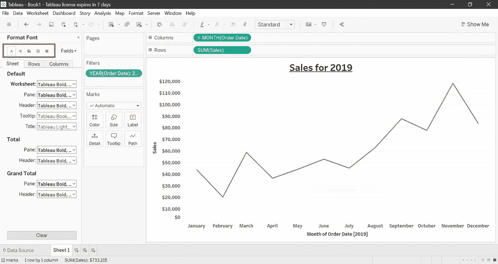

# 添加新工作表

首先，让我们双击当前工作表，将其重命名为“按年销售”。您可以通过单击窗口底部当前工作表名称右侧的“新建工作表”按钮来添加新工作表。然而，为了我们的教程，我们将右键单击我们当前的表并复制它。让我们将这个复制的图表重命名为“按类别销售”。

正如新工作表的名称所示，我们现在将在该工作表中创建一个不同的图表。从“列和行”节中删除“月”(订单日期)和“总额”(销售额)字段。相反，将 SUM(Sales)和 Category 字段分别从左窗格拖到 Columns 和 Rows 部分。这将自动为您创建一个条形图(如果没有，请选择窗口右上角的演示部分下的条形图选项)。

现在，我们可以通过在顶部窗格中将图表的适合度从标准更改为完整视图来增加条形的宽度，如下所示。

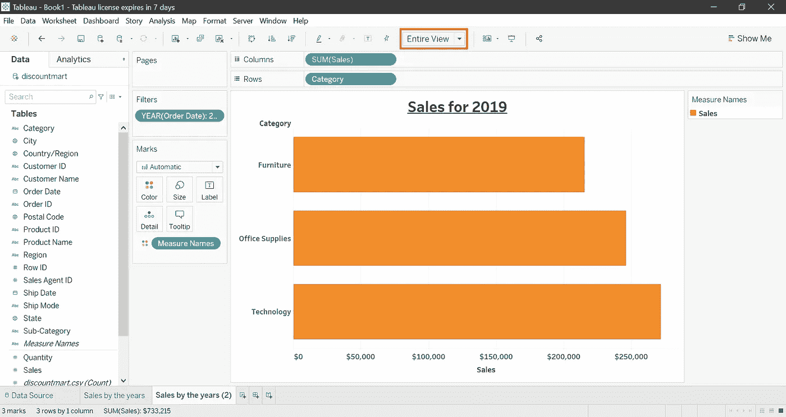

再次添加标签，将“销售”字段拖动到“标记”窗格下的“标签”部分

请注意，由于我们复制了我们的工作表，前一个工作表中的设置在这里仍然是相同的。例如，文本是粗体的，没有网格线，等等。

Tableau 的另一个功能是可以根据数据改变条形的颜色。为了更好地理解这一点，尝试将“销售”度量拖到“标记”窗格下的“颜色”上，它将显示如下。

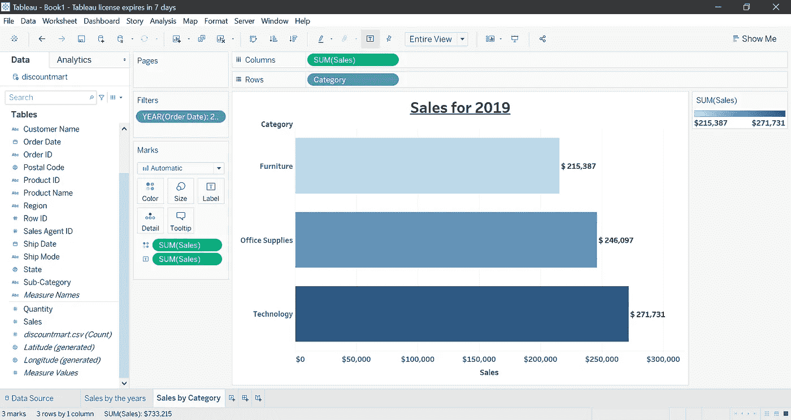

蓝色最浅的条形销售额最少，蓝色最深的条形销售额最多。Tableau 在这里显示蓝色作为默认配色方案，但我们可以通过在“标记”窗格中单击“颜色”并编辑颜色来轻松选择不同的颜色组合。为了与之前的图表相匹配，我们将选择绿色作为条形图的配色方案。

为了对条形图进行排序，我们在顶部窗格中有一个升序和降序选项。

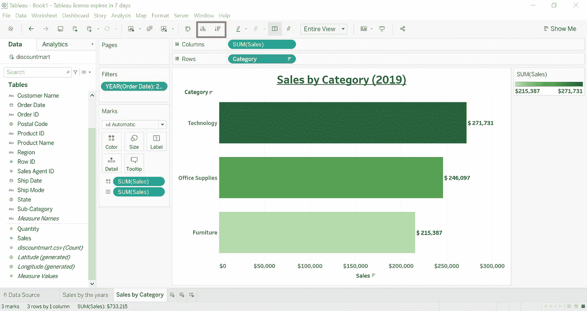

# 直方图

复制“按类别销售”表，并将其重命名为“产品/订单”。拖出并删除过滤器中除“年份(订单日期)”字段之外的所有字段。现在让我们创建一个直方图，看看在一个订单中是否售出了 2 个或更多的产品。为此，双击“数量”测量，并在“演示”选项中选择“直方图”。您希望确保容器大小为 2，因此右键单击“数量(容器)”维度，并将容器大小编辑为 2。

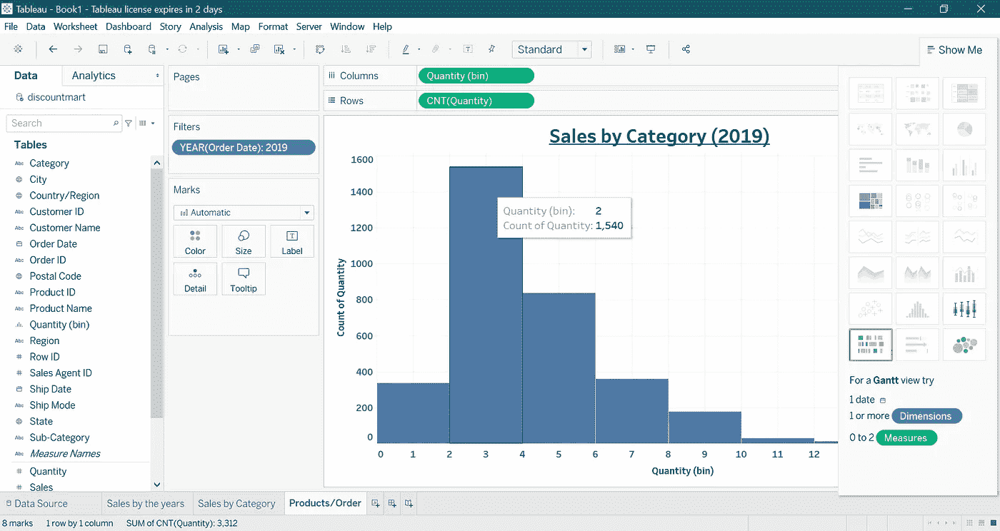

这个柱状图告诉我们的是，有 337 个订单的数量在 0-2 之间，1450 个订单的数量在 2-4 之间，以此类推。像我们之前更改其他图表的颜色一样更改直方图的颜色，以便我们在最后创建的仪表板的主题是统一的。您也可以通过按住 Ctrl 键并将 CNT(数量)从行拖动到标记窗格下的标签字段来添加数量标签。此外，双击图表的标签，因为这是一个不同的图表，而不是我们复制此工作表的图表。

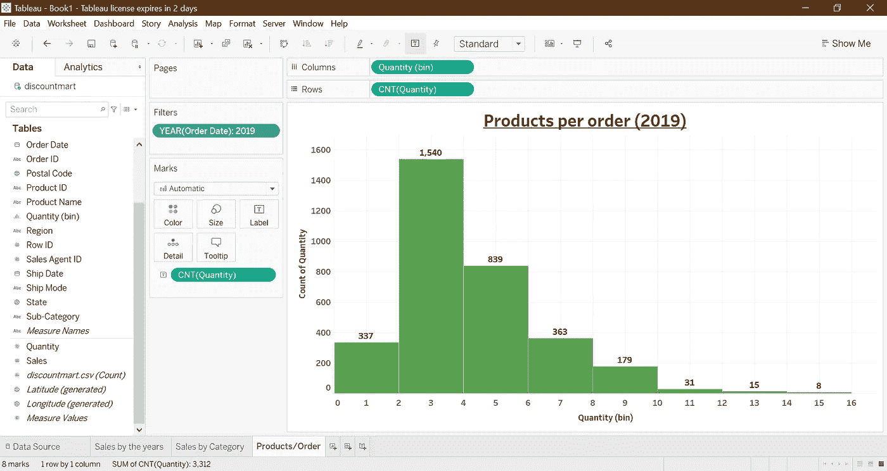

# 地图

复制直方图，并像我们之前做的那样将其重命名为“销售图”。将图表的标签也更改为销售地图。在开始绘制地图之前，我们需要创建一个层次结构，因为 Tableau 需要知道哪个是您的州字段，以及该字段链接到哪个国家。若要创建层次结构，请将“州”、“城市”和“邮政编码”维度拖到“国家/地区”维度上。确保您保持了层次结构，即首先必须出现“国家/地区”维度，然后是“州”、“城市”和“邮政编码”。如果出现错误，您可以随时将这些字段上下移动。此外，将层次结构拖到标记窗格下的“详细信息”字段。出现一张地图。您可能还注意到,“国家/地区，州”字段出现在标记窗格中，其左侧有一个“+”号。当您点击它时，下一个版本的层次结构就会出现，让我们开始吧。现在，双击“销售”度量，将销售值添加到地图中。此时，您的地图应该如下所示:

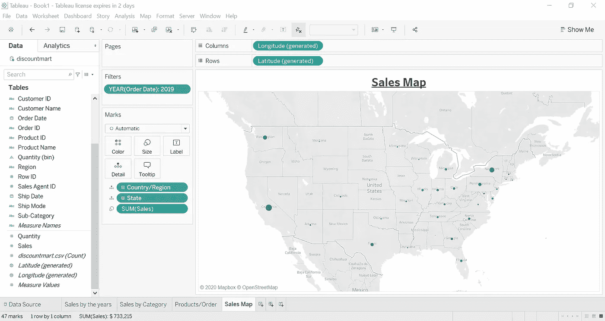

我们还可以在地图上以不同的方式显示我们的数据。只需转到演示并选择地图图表。(上图是一个符号图表。)就像我们前面所做的那样，我们可以通过在拖动“销售”字段(因为这会创建字段的副本)的同时按住 Ctrl 键，将“销售”的标签添加到我们的地图中，该字段已经存在于“标记”窗格中。要进一步格式化此标签，请右键单击并选择格式化。在“默认”下的“数字”字段中，将显示单位更改为千(K)。我们的地图现在看起来像这样。

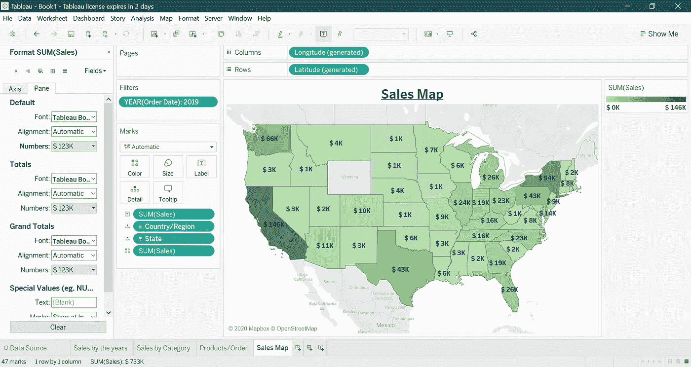

# 卡片

像往常一样，复制以前的“销售地图”表，从标记窗格中拖出所有字段以及行和列。双击 Sales Measure，转到“演示”并选择应该是第一个选项的文本表。让我们对此进行一些定制。在顶部窗格中，将“标准”调整为“整个视图”。在“标记”窗格中，单击“文本”并增加字体大小，将对齐方式改为居中。现在我们的销售卡准备好了。您可以使用相同的方法为不同的类别创建卡片。

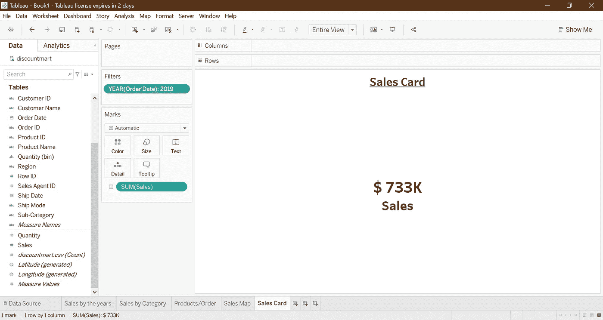

# 创建仪表板

要创建仪表板，请单击窗口底部的“新建仪表板”按钮。

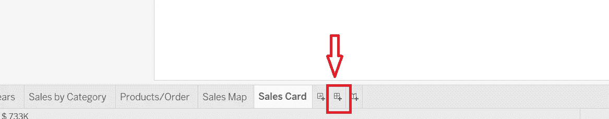

您创建的所有工作表都将出现在窗口的左侧。让我们将仪表板的大小更改为 1400 像素和 900 像素。此外，如果您希望更改仪表板背景颜色，您可以转到窗口顶部的仪表板选项并选择格式选项。

要将可视化添加到仪表板，只需将它们拖放到仪表板上。要隐藏可视化的标题/标签，右键单击并选择隐藏标题选项。这就是你的第一个仪表盘

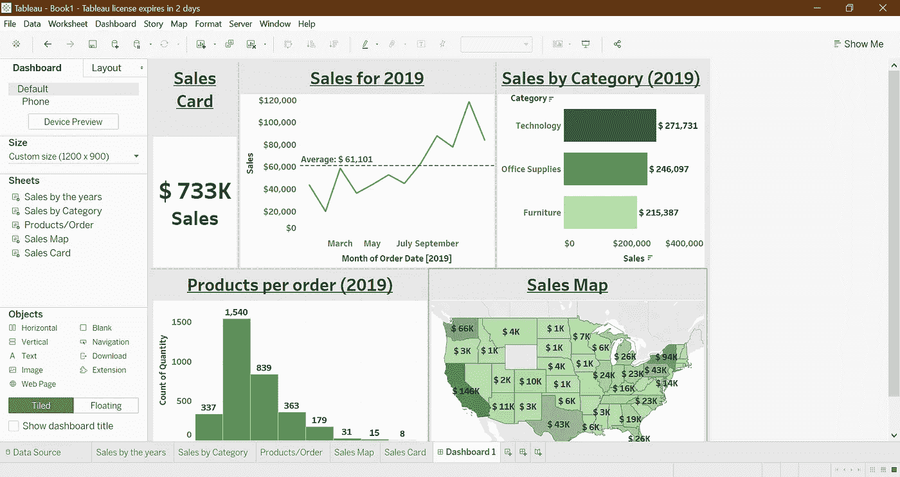

目前，我们的仪表板正在显示 2019 年的销售数据。如果我们添加一个过滤器，用户可以选择年份，并相应地查看特定年份的所有可视化效果。为此，单击任何图表，并在过滤器选项下选择“订单日期年份”。这就是我们的过滤器。我们可以通过单击它旁边的箭头并选择“多值下拉”选项，将其更改为下拉过滤器。要确保此过滤器适用于选择特定年份的每个图表，请右键单击过滤器并转到“应用于工作表”下的“所选工作表”，选择“全部在仪表板上”选项，您就可以开始了。

# 发布仪表板

最后，让我们将仪表板发布到 Tableau public。为此，单击窗口顶部的“服务器”,输入您的登录详细信息，命名您的仪表板。

本文到此为止。我希望你喜欢用 Tableau 可视化数据。

谢谢你阅读它！