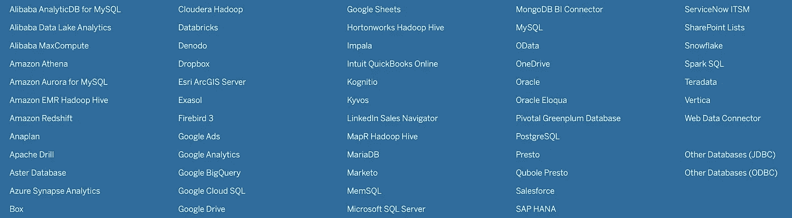
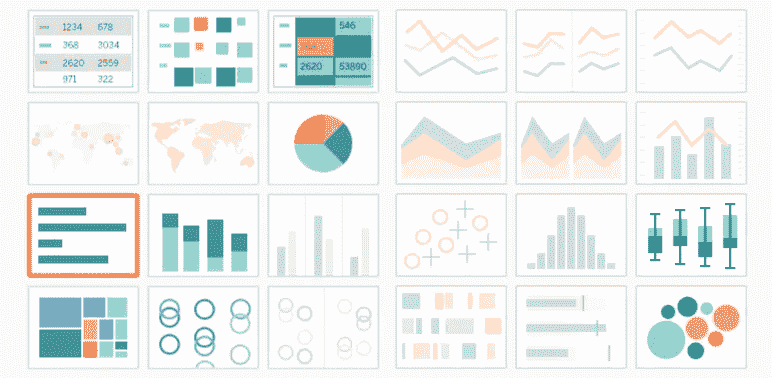
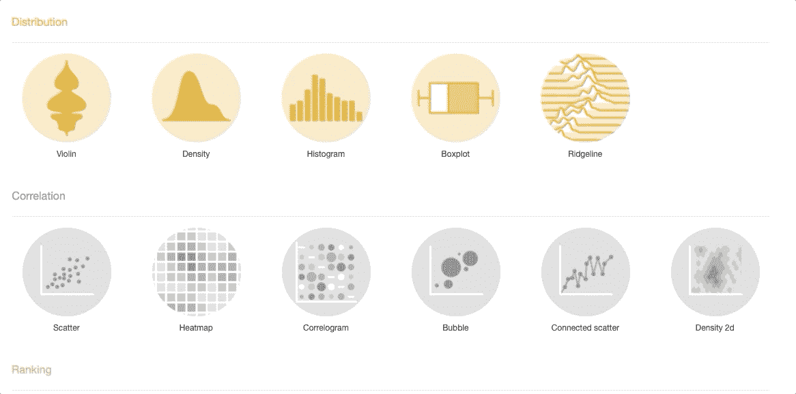
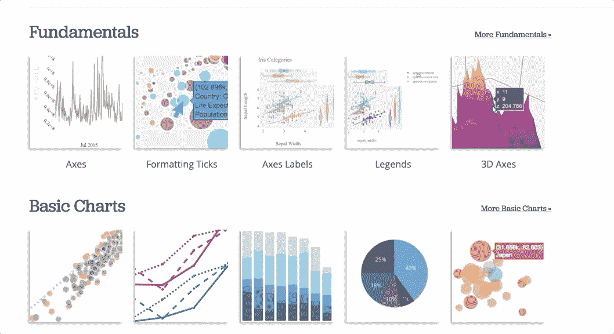
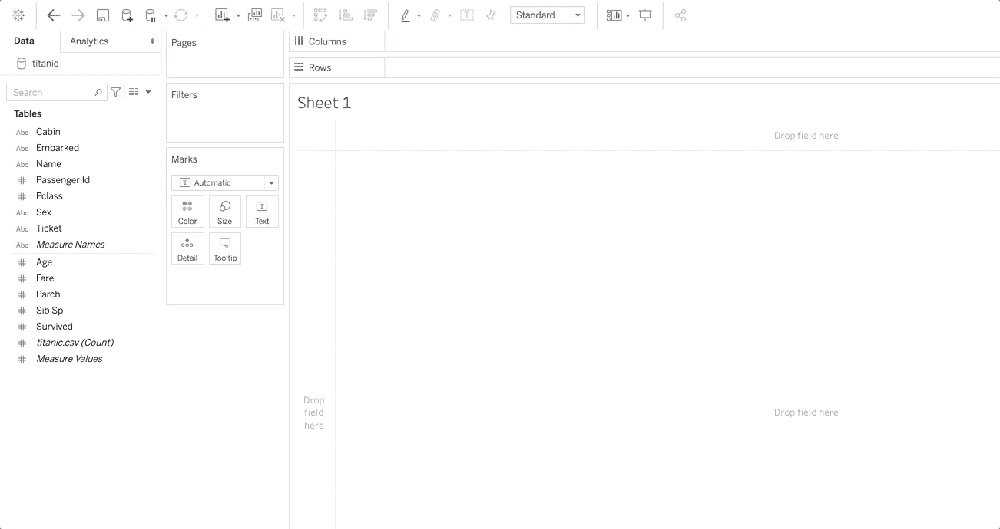
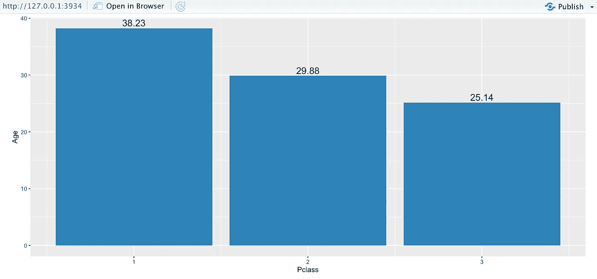
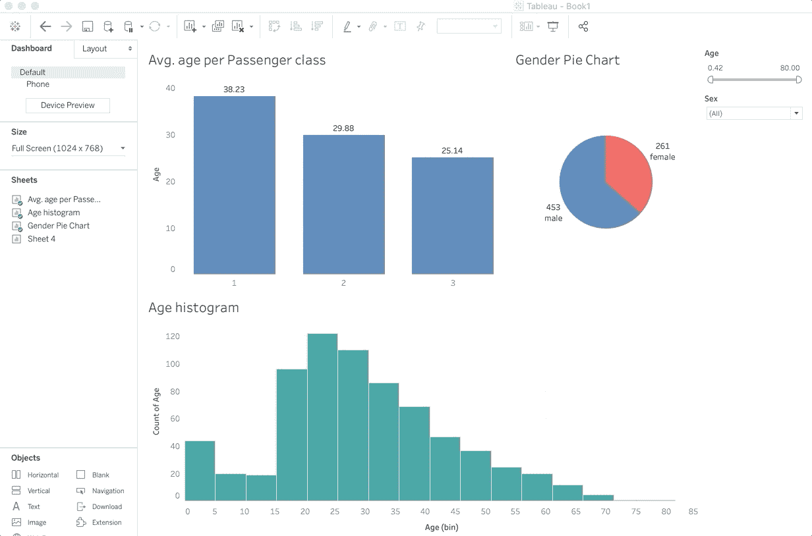
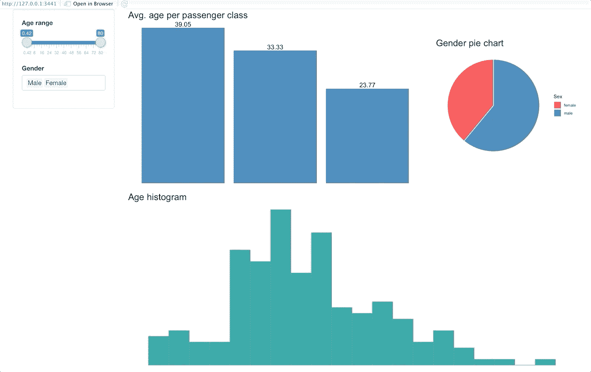
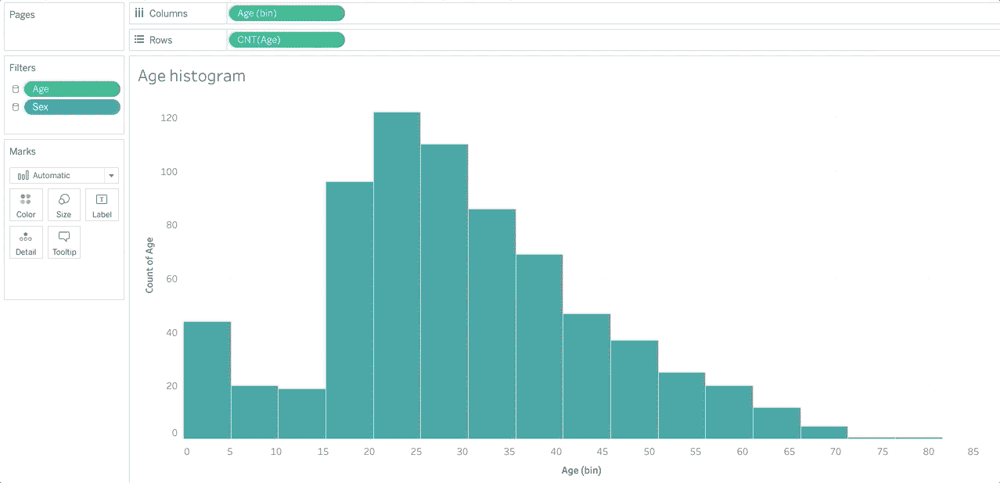
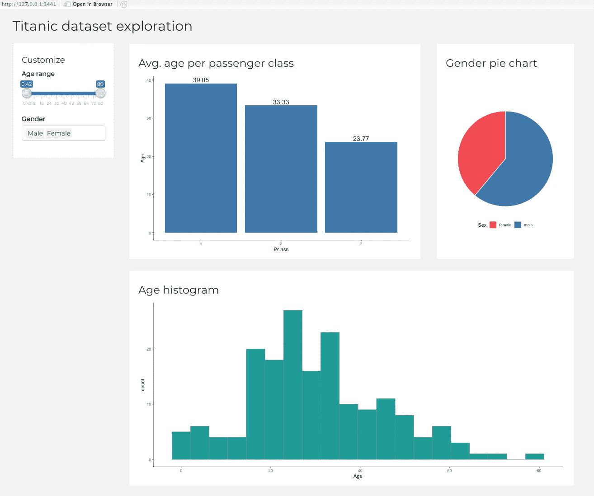

# Tableau vs. R Shiny:哪个 Excel 替代品适合你？

> 原文：<https://towardsdatascience.com/tableau-vs-r-shiny-which-excel-alternative-is-right-for-you-488da22e82b6?source=collection_archive---------16----------------------->

## 意见

## R Shiny 和 Tableau 之类的拖拽可视化工具相比如何？

截至 2020 年底，有许多 dashboard/reporting/BI 工具，其中最受欢迎的是 Tableau、PowerBI 和 [R Shiny](https://appsilon.com/shiny) 。问题很快就变成了— *“我如何为我的特殊需求确定合适的工具？”*今天，我们将比较财富 500 强公司最广泛使用的两种工具:

*   **Tableau** -一个用于数据分析的直观和简单的拖放解决方案
*   用 R 编写的 web 框架，广泛用于制作仪表盘和交互式 web 应用程序


让我们弄清楚一件事——R Shiny 不是一个报告/仪表板工具。大多数人用它来做仪表盘，所以我们可以认为这个比较公平。如前所述，R Shiny *是*一个完整的 web 框架。与 Tableau *等工具相比，它带来了一些明显的好处和一些需要注意的事项。*

我们将检查 Tableau 和 R Shiny 相互竞争的以下领域，并宣布每个领域的获胜者(或平局):

*   连通性
*   图表类型
*   易用性:简单的图表
*   易用性:简单的仪表盘
*   用户输入和交互性
*   视觉造型

# 连通性

*Tableau* 提供了两个与数据连接相关的选项。首先，你可以连接一个本地文件——比如 *CSV* 、 *Excel* 、 *JSON* 、 *PDF* 、 *Spatial* 等。或者，您可以连接到远程服务器。选项太多了，无法一一列出，所以这里有一个当前产品的截图(2020 年末):



所以是的，Tableau 有很多选择。另一方面，R Shiny 使用 R 作为编程语言的选择，所以 Shiny 可以连接到 R 可以连接的任何源。就像它的竞争对手一样，这里的选择是无限的。一个简单的 Google 搜索将会产生一个预制的库或者任何数据源类型的 API 调用示例。

对于特定领域的来源，R Shiny 有时会有优势。例如，使用 R Shiny，您可以加载和分析基因表达数据或 CAD 文件。这些来源对 Tableau 来说可能是个问题。

**赢家(连通性):平手，在特定领域的情况下，R 的边发亮**

# 图表类型

再一次，Tableau 在这里并不缺乏，它有过多的可视化选项，如条形图、饼图、折线图和面积图，甚至还有更复杂的选项，如地理图。完整列表请参考下图:



尽管如此，R Shiny 在图表类型的可选性方面击败了竞争对手。使用最广泛的可视化库是`ggplot2`和`Plotly`。以下是你可以用`ggplot2`制作的可视化类型的概述:



来源:[https://www.r-graph-gallery.com](https://www.r-graph-gallery.com)

这里有一些你可以用`Plotly`做的很酷的事情:



来源:[https://plotly.com/r/](https://plotly.com/r/)

就图表选项而言，赢得这场战斗是显而易见的。

**赢家(图表类型):R 闪亮**

# 易用性:简单的图表

现在，我们将看到在 Tableau 和 R Shiny 中创建一个简单的条形图需要经历的困难程度。出于演示的目的，我们将使用 [Titanic 数据集](https://raw.githubusercontent.com/datasciencedojo/datasets/master/titanic.csv)，因此如果您想继续学习，请下载此处链接的 *CSV* 文件。更准确地说，我们将创建一个条形图，在 x 轴上包含**乘客等级**，在 y 轴上包含**平均年龄**。

让我们从 Tableau 开始。数据导入后，创建可视化相对容易。只需遵循下图中的步骤:



这非常容易，因为 Tableau 被设计成对非技术人员来说直观和简单。这种易用性伴随着被称为**可定制性**的成本，但稍后会有更多的介绍。

用 R Shiny 创建一个简单的图表是完全不同的事情。我们需要编写实际的代码来得到一个简单的条形图。首先，我们需要以某种方式聚合庞大的数据集，这样我们就有了一个简洁的、可视化的数据格式。接下来，我们需要引入一些样板文件来管理 UI 和服务器。它只有几行代码——对于较大的项目来说可以忽略不计，但是对于非技术人员创建简单的图表来说却是一个真正的障碍。

请参考下面的代码:

```
library(shiny)
library(ggplot2)

ui <- fluidPage(
    plotOutput('bar')
)

server <- function(input, output) {
    output$bar <- renderPlot({
        pclass_age_data <- titanic %>%
            select(Pclass, Age) %>%
            group_by(Pclass) %>%
            summarise(Age = round(mean(Age, na.rm=TRUE), 2))
        ggplot(data=pclass_age_data, aes(x=Pclass, y=Age)) +
            geom_bar(stat='identity', fill='steelblue') +
            geom_text(aes(label=Age), vjust=-0.3, size=5)
    })
}

shinyApp(ui=ui, server=server)
```

结果如下:



如您所见，如果您需要的只是简单直观的数据可视化，而没有任何交互元素，那么使用就毫无意义。这就是 Tableau 大获全胜的地方。如果你仍然想用 R 来制作图表，并且你愿意努力去做一些完全可定制的东西，那么`ggplot2`和`Plotly`是很好的选择。

然而，对于非技术人员来说，即使用 R 制作简单的图表也是一项繁重的任务。我们推荐 Tableau 来完成这类任务。

**赢家(简单图表):Tableau**

# 易用性:简单的仪表盘

好吧，让我们看看谁会在仪表板之战中获胜。我们在这里不会太复杂，因为仪表板开发是一个涉及很多方面的非常广泛的主题。下面是我们将放入仪表板的图表概要:

*   条形图——每个乘客等级的平均年龄
*   饼图—性别
*   直方图—年龄

此外，当用户更改两个筛选器之一时，所有三个图表都应该更新:

*   年龄滑块—从最小到最大乘客年龄的范围滑块
*   性别选择器-从可视化中排除男性或女性的选项

这是最后的仪表板在*场景*中的样子:



这整个仪表板需要 0 行代码。我们只需要几分钟点击正确的地方。在 R Shiny 中，仪表板的情况是不同的，因为我们需要在那里编写实际的 R 代码。然而，这不是一个太糟糕的交易，因为 R 相对容易学习，并且对于闪亮的仪表板来说，定制的可能性是无穷的。

以下代码重新创建了 Tableau 中的仪表板:

```
library(shiny)
library(dplyr)
library(ggplot2)
library(titanic)
titanic <- titanic::titanic_train

ui <- fluidPage(
    sidebarPanel(
        width = 2,
        sliderInput(
            inputId='ageslider',
            label='Age range',
            min=min(titanic$Age, na.rm=T),
            max=max(titanic$Age, na.rm=T),
            value=c(min(titanic$Age, na.rm=T), max(titanic$Age, na.rm=T))
        ),
        selectInput(
            inputId='genderselect',
            label='Gender',
            choices=c('Male', 'Female'),
            selected=c('Male', 'Female'),
            multiple = TRUE
        )
    ),
    mainPanel(
        fluidRow(
            column(8, plotOutput('bar')),
            column(4, plotOutput('pie'))
        ),
        fluidRow(
            column(12, plotOutput('hist'))
        )
    )
)

server <- function(input, output) {
    output$bar <- renderPlot({
        pclass_age_data <- titanic %>%
            filter(Sex %in% tolower(input$genderselect)) %>%
            select(Pclass, Age) %>%
            filter(Age >= input$ageslider) %>%
            filter(Age <= input$ageslider) %>%
            group_by(Pclass) %>%
            summarise(Age = round(mean(Age, na.rm=TRUE), 2))
        ggplot(data=pclass_age_data, aes(x=Pclass, y=Age)) +
            geom_bar(stat='identity', fill='#4179ab') +
            geom_text(aes(label=Age), vjust=-0.3, size=5) +
            ggtitle('Avg. age per passenger class') +
            theme_void() +
            theme(plot.title=element_text(size=20), panel.background=element_blank())
    })
    output$pie <- renderPlot({
        pie_data <- titanic %>%
            filter(Sex %in% tolower(input$genderselect)) %>%
            filter(Age >= input$ageslider) %>%
            filter(Age <= input$ageslider) %>%
            select(Sex) %>%
            group_by(Sex) %>%
            count() %>%
            mutate(Midpoint = cumsum(n) - n / 2)
        ggplot(pie_data, aes(x='', y=n, fill=Sex)) +
            geom_bar(width=1, stat='identity', color='white') +
            coord_polar('y', start=0) +
            scale_fill_manual(values=c('#f34a53', '#4179ab')) +
            ggtitle('Gender pie chart') +
            theme_void() +
            theme(plot.title=element_text(size=20))
    })
    output$hist <- renderPlot({
        hist_data <- titanic %>%
            filter(Age >= input$ageslider) %>%
            filter(Age <= input$ageslider) %>%
            filter(Sex %in% tolower(input$genderselect)) %>%
            select(Age)
            ggplot(hist_data, aes(x=Age)) +
            geom_histogram(bins=20, color='#62aca8', fill='#1e9a95') +
            ggtitle('Age histogram') +
            theme_void() +
            theme(plot.title=element_text(size=20))
    })
}

shinyApp(ui=ui, server=server)
```

这是最终产品的样子:



如你所见，这个仪表板还没有完成。这就是我们将在文章的最后一部分讨论的内容。在这里很难宣布一个明确的赢家，但 R Shiny 的仪表板感觉更坚实。Tableau 的仪表板对意外点击太敏感了，在股票状态下，仪表板看起来非常相似。

然而，正如我们看到的，你可以用 Tableau 比用 R Shiny 更快地制作一个简单的仪表板。出于这个原因，我们将宣布 Tableau 是简单仪表板的赢家，但仅仅是因为**的易用性**。正如您将看到的，如果您打算提升仪表板的复杂性和视觉风格，R Shiny 是一个更好的选择。

**获胜者(简单的仪表盘):被鼻子牵着鼻子走的画面**

# 用户输入和交互性

在我们的场景对比中，这是事情变得特别有趣的地方。在 Tableau 中，你不能对用户输入做什么——它非常有限，因为它不是为这类事情设计的。

然而，输入对于构建良好的交互式仪表板来说是必不可少的，因为它们提供了一种与应用程序交互的方式。**互动性**是 R Shiny 严重抢眼 Tableau 的地方。

R Shiny 提供了广泛的输入选项。与其罗列它们，不如展示其中的一些:


是的，这是很多，你当然可以用它们做任何任务。作为商业用户，你可能会立即想到一个问题:**为什么交互性如此重要？**

互动使得任何数据集都更容易分析。例如，*文件输入*组件可以让您上传自己的文件，以便在仪表板中浏览，然后通过日期(*日期范围输入*)和列选择器( *var select* )进一步过滤。这与只读仪表板形成对比，只读仪表板不允许用户上传数据或与数据交互。

使用 R Shiny 仪表板，您还可以构建具有密码和文本字段输入功能的完整交互式表单。这为闪亮的最终用户增加了另一个关键的可选层。交互性是简单仪表板与强大的企业级业务工具之间的主要区别。

**赢家(用户输入):R 闪亮**

# 视觉造型

不幸的是，你没有太多的办法来调整画面的视觉效果。它被设计成开箱即用的样子，并且由你来改变颜色、坐标轴、标题、字体和其他小东西。可调整方面的数量取决于你调整的情节类型，但一般来说，Tableau 不会像 Shiny 那样给你太多的控制。

以下是如何更改直方图颜色的示例:



亮亮完全是另一种动物。你可以定制一切。首先，在您的`app.R`所在的位置创建一个文件夹`www`。在里面，创建一个`main.css`文件。是的，你说对了——我们可以使用 CSS 提供的一切来设计闪亮的仪表盘。

为了将闪亮的应用程序连接到 CSS 文件，我们可以将`theme=main.css`放在 R 文件中的`fluidPage`之后。仅此而已。真的就这么简单。以下是我们用 CSS 和 R Shiny 在几分钟内完成的工作:



视觉造型部分的赢家再一次非常明显。当谈到视觉定制时，R Shiny 让 Tableau 相形见绌，即使 Tableau 仪表盘开箱后看起来相当不错。

**获胜者(视觉造型):R 闪亮**

# 结论

根据我们的计算，最终结果如下:

*   r 闪亮— 3 分
*   表格— 2 点
*   平局— 1 分

那么，闪亮是所有情况下的明显赢家吗？嗯，不是。这取决于你需要做的工作类型。如果你需要快速绘制一个图表或图形，或者需要时不时地制作一个非常简单的仪表板，那么 Shiny 可能有些过头了。Tableau 正是为这类任务而设计的。此外，如果您是一个非技术人员，并且您不想过多地钻研实际代码，那么 Tableau 对于简单的图表和仪表板是一个很好的选择。

此外，请记住 **Tableau 不是免费的**。Tableau 许可证从每年 70 美元的基础上上涨，所以它不是一个便宜的软件。对于财富 500 强公司来说，这不是一个问题，但如果你是一个试图决定选择正确工具的个人，Tableau 的价格可能会成为一个交易破坏者。或者，R Shiny 是一个开源解决方案，完全免费使用(尽管如果你需要在线托管你的 Shiny 应用，你可能需要投资一个 [RStudio Connect](https://appsilon.com/rstudio-connect-as-a-solution-for-remote-data-science-teams/) 许可证)。

[**加入我的私人邮件列表，获取更多有用的见解。**](https://mailchi.mp/46a3d2989d9b/bdssubscribe)

*喜欢这篇文章吗？成为* [*中等会员*](https://medium.com/@radecicdario/membership) *继续无限制学习。如果你使用下面的链接，我会收到你的一部分会员费，不需要你额外付费。*

[](https://medium.com/@radecicdario/membership) [## 通过我的推荐链接加入 Medium-Dario rade ci

### 作为一个媒体会员，你的会员费的一部分会给你阅读的作家，你可以完全接触到每一个故事…

medium.com](https://medium.com/@radecicdario/membership) 

*原载于 2020 年 10 月 14 日*[*https://appsilon.com*](https://appsilon.com/tableau-vs-r-shiny/)T22。