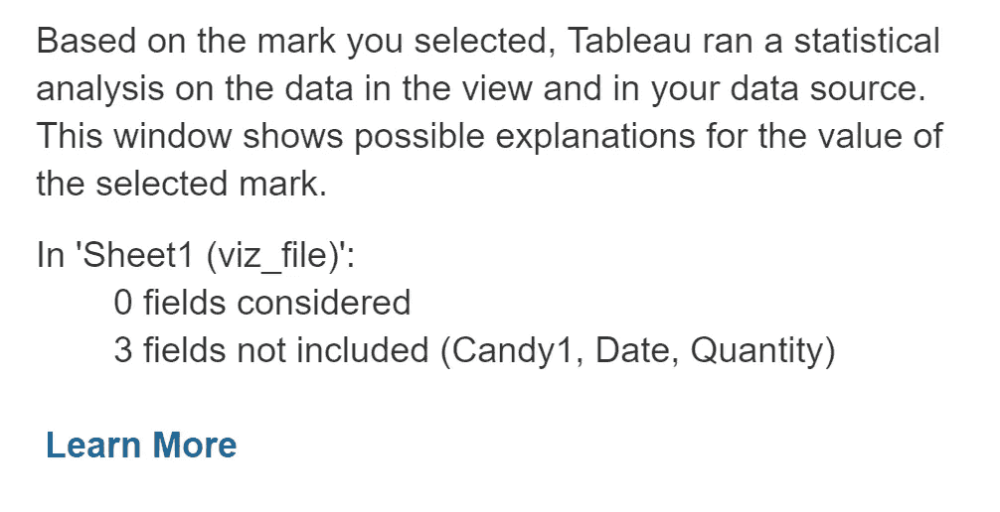

# Tableau 的人工智能解释数据功能

> 原文：<https://towardsdatascience.com/tableaus-ai-enabled-explain-data-feature-c1c6380f9b66?source=collection_archive---------49----------------------->

## 快速介绍 Tableau 功能，开始解释数据点的“为什么”。不需要额外的设置。

图片由 [chenspec](https://pixabay.com/users/chenspec-7784448/?utm_source=link-attribution&utm_medium=referral&utm_campaign=image&utm_content=5644732) 来自 [Pixabay](https://pixabay.com/?utm_source=link-attribution&utm_medium=referral&utm_campaign=image&utm_content=5644732)

数据分析师创建数据可视化的原因之一是为了发现意外和不寻常的情况。在 viz 中直接获得一些更详细的信息越容易，我们所有人的状况就越好。Tableau 通过其功能“解释数据”帮助满足了这一需求。据说是由“人工智能”驱动的，当请求解释数据时，会提供额外的见解。

使用我为早先的[文章](/fixing-data-files-adding-a-missing-date-column-dc42d7106325)创建的工作簿，我可以进一步调查我的糖果销售数据。这是一个简单的例子，基于非常简单的数据，便于复制。

## 首先要做的事

> 相关性并不意味着因果关系

## 如何激活解释数据

在 Tableau 公共桌面应用程序中，我可以单击一个数据点。对于可用的数据点，您会看到一个小灯泡。点击那个灯泡。

这将创建一个弹出窗口，其中包含对该数据点的更多分析。如果单击带标记的图标(下面用黄色圈出)，图表将作为新工作表添加到工作簿中。

## 在幕后

对解释数据进行人工智能分析的重点是不同数据特征之间的相关性和关系。这是我提醒你的地方；再说一次，相关性并不意味着因果关系！这个过程试图根据这些相关性来解释数据点的价值。

## 另一个例子

我的例子非常简单。下面是 Tableau 提供的一个例子:

## 资源

 [## 解释数据

### 只需点击一下鼠标，即可获得数据点背后的“为什么”的解释。更快地找到业务背后的驱动因素…

www.tableau.com](https://www.tableau.com/products/new-features/explain-data)  [## 使用解释数据检查视图

### 解释数据为您提供了一个了解数据的新窗口。使用它来检查，发现，并深入挖掘标记在一个 viz…

help.tableau.com](https://help.tableau.com/v2020.3/public/desktop/en-us/explain_data.htm)  [## 解释数据如何工作

### 使用解释数据作为进一步探索数据的增量起点。可能的解释是…

help.tableau.com](https://help.tableau.com/v2020.3/public/desktop/en-us/explain_data_explained.htm)  [## 解释数据:状态信息

### 当您在标记上运行解释数据时，统计分析将在聚合标记上运行，然后在可能相关的标记上运行…

help.tableau.com](https://help.tableau.com/v2020.3/public/desktop/en-us/explain_data_lm_status.htm) 

## 结论

如您所见，在 Tableau 应用程序中开始使用解释数据并不费力。这有助于指出哪些数据点可能需要进一步分析。这可能会节省你的时间，可以让你避免隐藏的惊喜。虽然统计分析在这个时候似乎仅限于关系和相关性，但 Tableau 开发更复杂的分析的大门是敞开的。