# TabPy:结合 Python 和 Tableau

> 原文：<https://towardsdatascience.com/tabpy-combining-python-and-tableau-511b10da8175?source=collection_archive---------1----------------------->

## 开始在 Tableau 中使用 Python


由[paweczerwi324ski](https://unsplash.com/@pawel_czerwinski?utm_source=medium&utm_medium=referral)在 [Unsplash](https://unsplash.com?utm_source=medium&utm_medium=referral) 拍摄的照片

> 我们能把 Python 计算的能力和 Tableau 结合起来吗？

这个问题鼓励我开始探索在 Tableau 中使用 Python 计算的可能性，最终我得到了一个 TabPy。

那么，塔比是什么？如何使用 TabPy 来集成 Python 和 Tableau？

在本文中，我将介绍 TabPy，并通过一个例子说明如何使用它。

# TabPy 游戏攻略

TabPy 是来自 Tableau 的分析扩展，它使我们作为用户能够使用 Tableau 执行 Python 脚本和保存的函数。使用 TabPy，Tableau 可以动态运行 Python 脚本，并将结果显示为可视化。用户可以通过在 Tableau 工作表、仪表板或使用参数的故事中进行交互来控制发送到 TabPy 的数据。

你可以在官方的 Github 资源库中阅读更多关于 TabPy 的内容:

[](https://github.com/tableau/TabPy) [## 表格/标签

### 动态执行 Python 代码并在 Tableau 可视化中显示结果:—Tableau/tabby

github.com](https://github.com/tableau/TabPy) 

# 安装标签

我假设您的系统中已经安装了 Python。如果没有，可以先去[https://www.python.org/](https://www.python.org/)下载 python 安装来安装。然后你可以把它安装到你的系统中。

接下来，我们可以使用`pip:`将 TabPy 安装为 python 包

```
pip install tabpy
```

# 跑步标签

一旦安装成功，我们可以使用以下命令运行服务:

```
tabpy
```

如果一切顺利，您应该会看到:

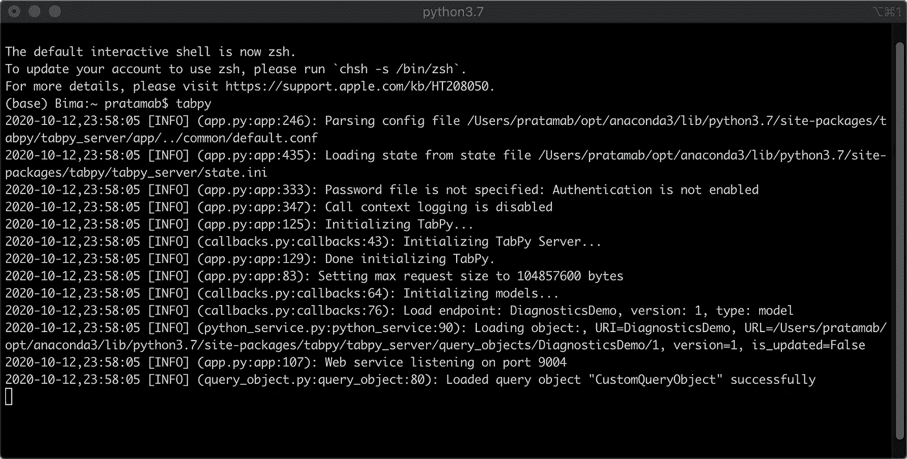

奔跑的塔比。作者图片

默认情况下，该服务将在本地主机的端口 9004 上运行。您也可以通过在 web 浏览器中打开它来验证它。

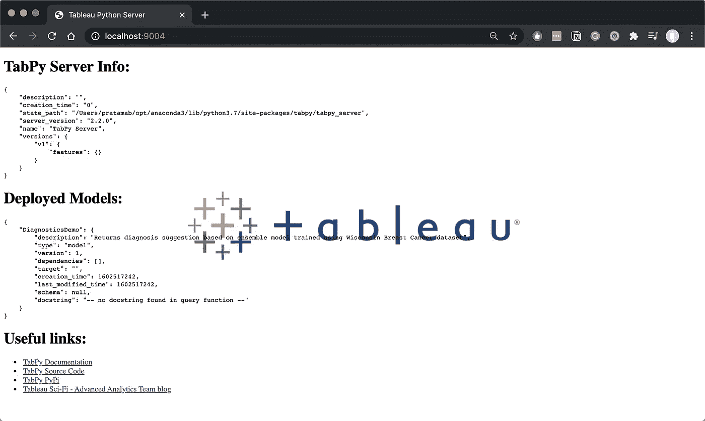

TabPy 服务器信息。作者图片

# 启用 TabPy

现在，让我们去我们的桌子，并设置服务。我用的是 Tableau 桌面版 2020.3.0。然而，在以前的版本中也不会有什么不同。

首先，转到帮助，然后选择设置和性能，并选择管理分析扩展连接。

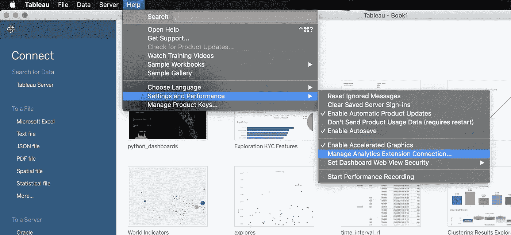

分析扩展连接位置。作者图片

然后，您可以设置服务器和端口。您可以将用户名和密码留空，因为我们不会在 TabPy 服务中设置凭据。

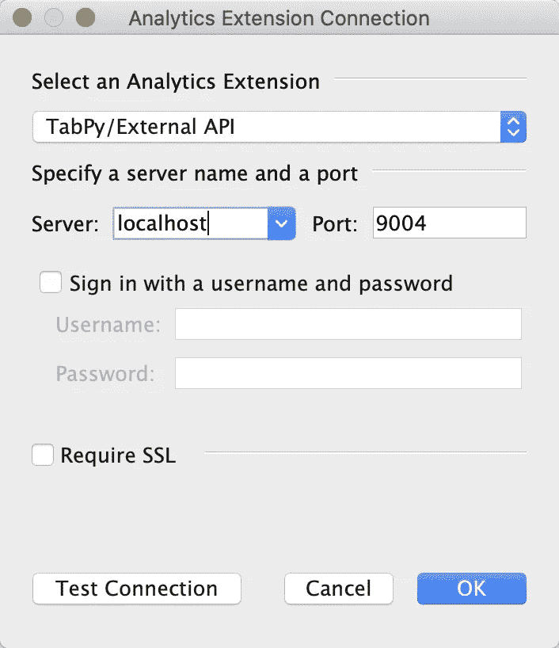

完成后，单击测试连接。如果成功，您将看到以下消息:


恭喜你！！现在，我们的 Tableau 已经和 TabPy 连接好了，可以使用了。

# 使用 TabPy

我们可以使用两种方法来进行 Python 计算:

*   将代码直接编写为 Tableau 计算字段。然后，代码将在 TabPy 服务器上立即运行。
*   在 TabPy 服务器中部署一个函数，该函数可以作为 REST API 端点到达。

在本文中，我将只展示如何做第一种方法，我们将直接编写代码作为 Tableau 计算字段。

例如，我们将对通过 Tableau 网站公开的 Airbnb 数据集执行聚类，您可以使用这个[链接](https://public.tableau.com/s/sites/default/files/media/airbnb.xlsx)下载它。我们将使用几种流行的聚类算法，根据每个邮编的住房特征对其进行聚类。

## 步骤 1 导入数据

第一步，让我们将数据集导入 Tableau。该数据集有 13 列。

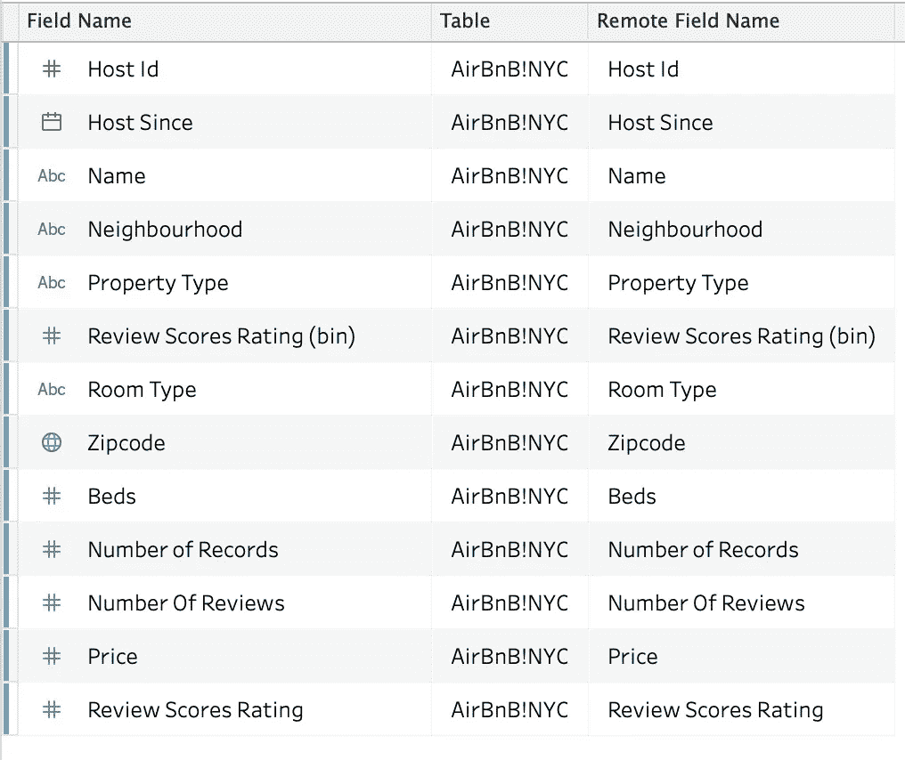

因为我们的主要目标是了解如何使用 TabPy，所以我们不会专注于创建最好的模型。因此，我们将仅使用该数据集中的以下变量来执行聚类:

*   每个邮政编码的床位数中位数
*   每个邮政编码的平均价格
*   每个邮政编码的收视率中值

## 步骤 2:创建控制参数

我们需要创建两个参数来选择我们的聚类方法和聚类数，它们是:

*   集群编号
*   聚类算法

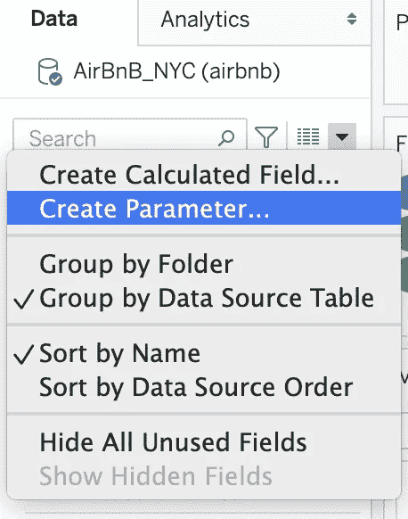

创建一个参数。作者图片

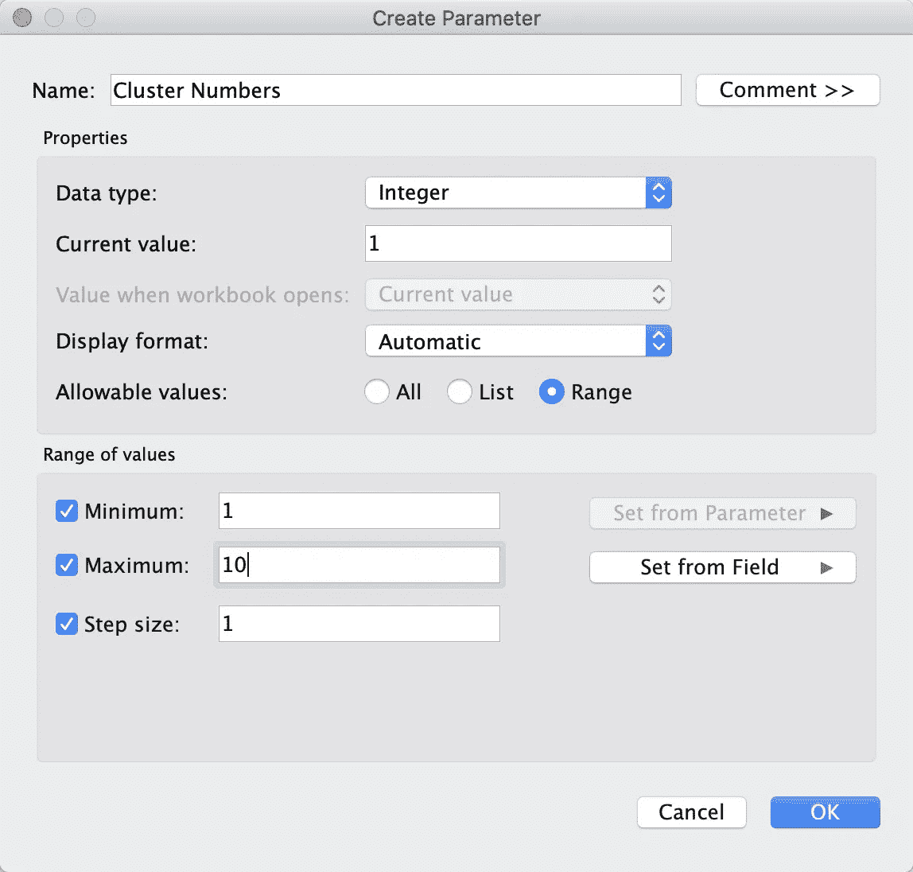

聚类数参数。作者图片

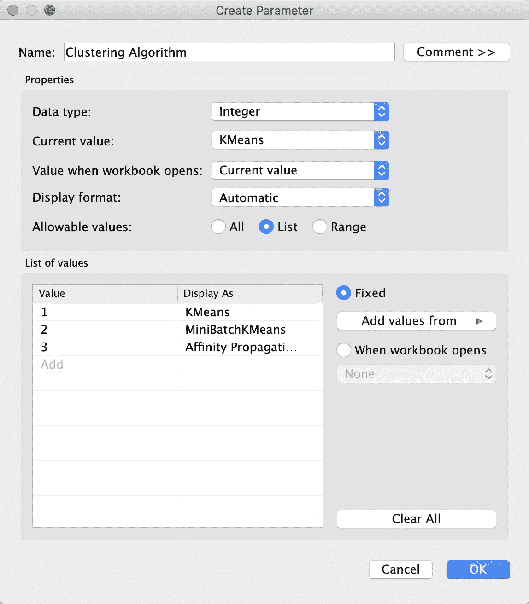

聚类分析算法参数。作者图片

## 创建脚本

我们将创建一个 python 脚本作为 Tableau 中的计算字段。

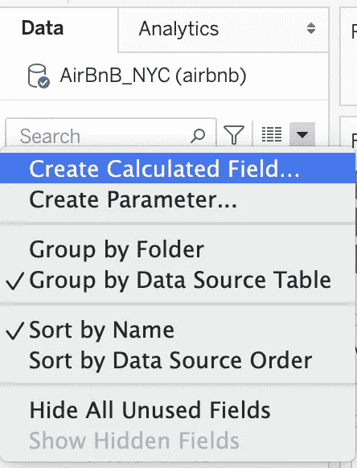

创建计算字段。作者图片

然后，您可以在计算字段中插入以下脚本。

这段代码封装在 Tableau 的 SCRIPT_REAL()函数中，将执行以下操作:

*   导入所需的 Python 库。
*   使用标准定标器的定标功能
*   组合缩放的要素并处理空值
*   有条件地检查要使用的算法，并执行以下操作
*   以列表形式返回聚类结果。

然后，我们将结果转换成字符串数据类型，使其成为分类数据。

还有一点需要注意的是，我们需要在 Zipcode 中进行表计算。因此，我们需要将默认的表计算更改为 Zipcode，以使该代码有效。

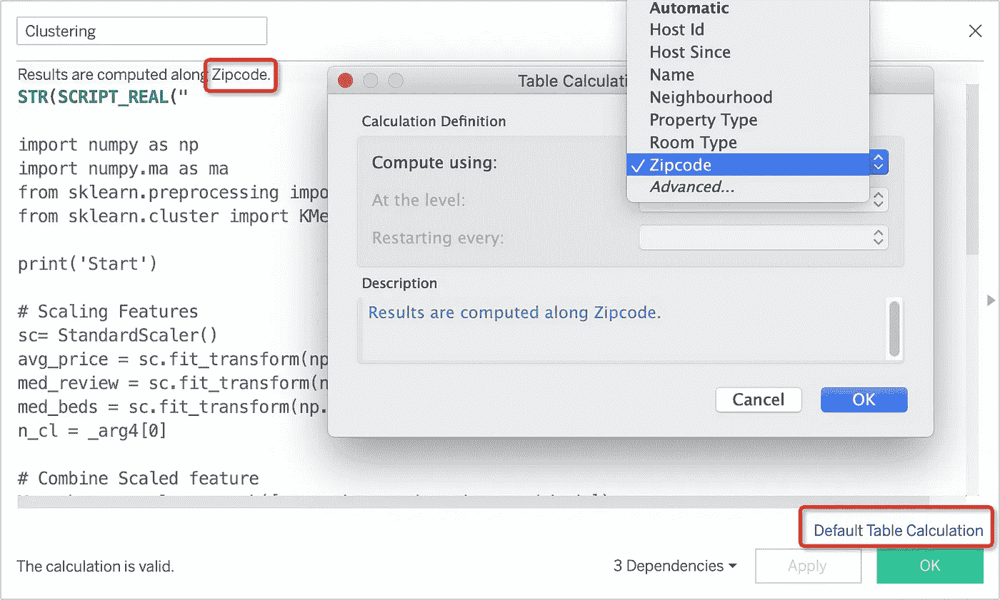

更改默认表计算。图片作者。

## 可视化结果

现在，是时候可视化结果了。我使用 Zipcode 创建一个地图来可视化聚类结果。我们可以使用参数来改变聚类的数量。

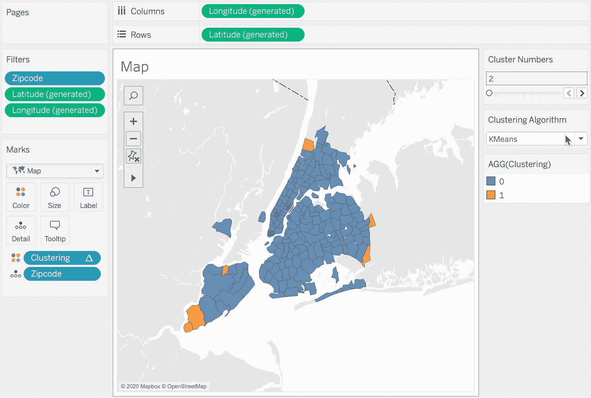

# 包裹


由 [Elisha Terada](https://unsplash.com/@elishaterada?utm_source=medium&utm_medium=referral) 在 [Unsplash](https://unsplash.com?utm_source=medium&utm_medium=referral) 上拍摄的照片

让我们庆祝走到这一步！如果您按照步骤操作，您已经成功地集成了 Python 和 Tableau。这种集成是使用 Tableau 和 Python 的更高级用例的开始。

我期待着看到您用这种集成构建的东西！

# 关于作者

Bima 是一名拥有 Tableau 桌面专家认证的数据科学家，他总是渴望扩展自己的知识和技能。他毕业于采矿工程师专业，通过 HardvardX、IBM、Udacity 等各种在线项目开始了他的数据科学之旅。目前，他正与 DANA Indonesia 一起在印度尼西亚建立一个无现金社会。

如果您有任何反馈或任何要讨论的话题，请通过 [LinkedIn](https://www.linkedin.com/in/bpratama/) 联系 Bima。很高兴和你联系！

# 参考

*   [https://tableaumagic . com/tableau-and-python-an-introduction/](https://tableaumagic.com/tableau-and-python-an-introduction/)
*   【https://github.com/tableau/TabPy 
*   [https://public.tableau.com/en-us/s/resources](https://public.tableau.com/en-us/s/resources)
*   [https://www . tableau . com/about/blog/2017/1/building-advanced-analytics-applications-tabpy-64916](https://www.tableau.com/about/blog/2017/1/building-advanced-analytics-applications-tabpy-64916)
*   [https://www . tableau . com/about/blog/2016/11/leverage-power-python-tableau-tabpy-62077](https://www.tableau.com/about/blog/2016/11/leverage-power-python-tableau-tabpy-62077)
*   [https://towards data science . com/tableau-python-tabpy-and-geographic-clustering-219 b 0583 ed3](/tableau-python-tabpy-and-geographical-clustering-219b0583ded3)