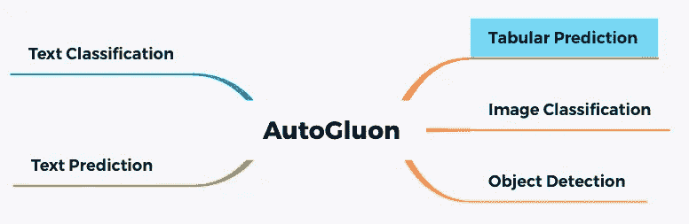
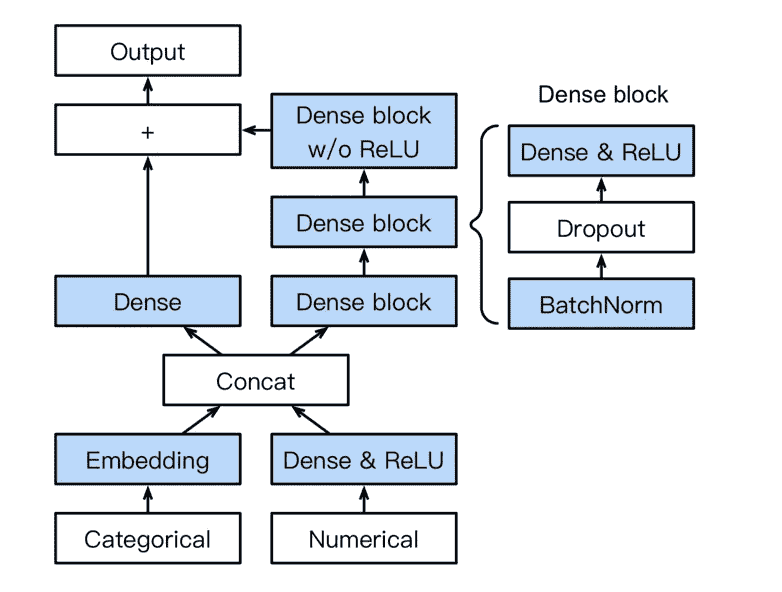
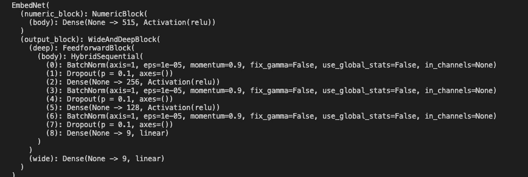
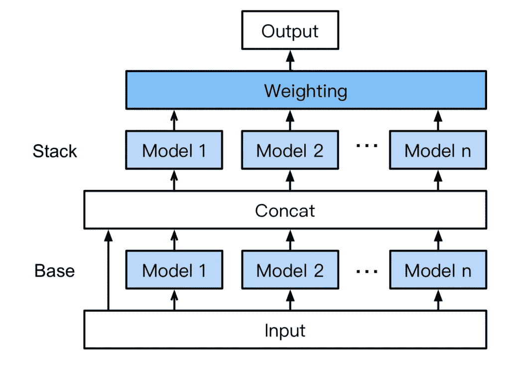
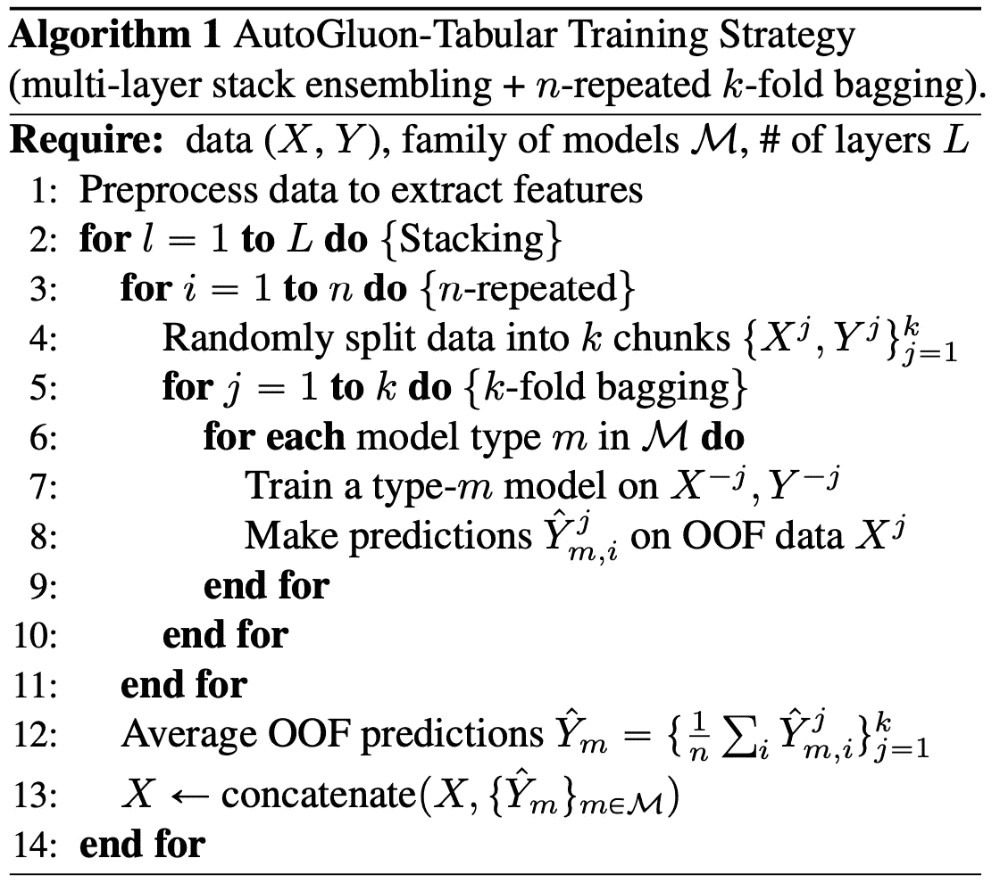
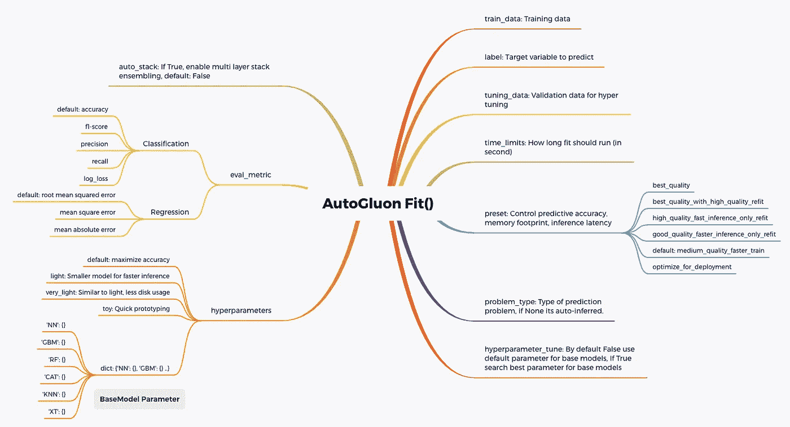
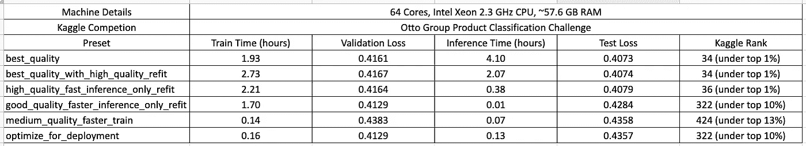
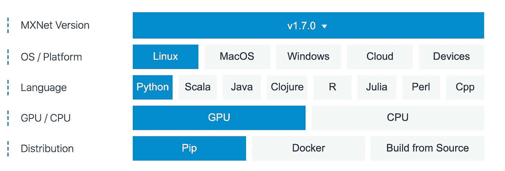
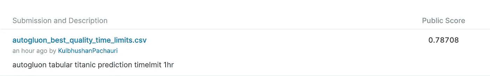

# 使用自动机器学习的表格预测

> 原文：<https://towardsdatascience.com/tabular-prediction-using-auto-machine-learning-autogluon-de2507ecd94f?source=collection_archive---------15----------------------->

在这篇文章中，我分享了我使用 AWS labs 的**Auto****M**achine**L**earning(**AutoML**)**autoglon**对表格预测(使用剩余列预测表格数据集的目标列)的探索，以及关于其内部工作的细节。

A utoML 框架提供了诱人的选择，因为它们消除了新手训练高质量模型的障碍，并且对于专家来说，它们减少了第一个可行模型的时间，专家可以通过基于数据分析和领域知识的特征工程来进一步微调。一些流行的开源 AutoML 平台有

*   https://github.com/EpistasisLab/tpot
*   h20:[https://www.h2o.ai/](https://www.h2o.ai/)
*   http://www.cs.ubc.ca/labs/beta/Projects/autoweka/
*   自动 sklearn:[https://github.com/automl/auto-sklearn](https://github.com/automl/auto-sklearn)
*   自动旋转:[https://github.com/awslabs/autogluon](https://github.com/awslabs/autogluon)

# 自动增长

AutoGluon 是一个用于深度学习的 AutoML 工具包，它自动执行端到端的机器学习任务，使我们能够用很少的代码行实现强大的预测性能。AutoGluon 目前支持下图所示的五个主要任务，并且还支持自定义 mxnet 或 PyTorch 模型。在这篇博客中，我们将深入探讨使用自动增长及其内部工作的**表格预测**任务。



自动登录中预定义的任务

对于表格预测任务，支持使用自动增长进行高质量建模的主要因素有

*   新型表格神经网络。
*   自动堆叠和组装多个模型。
*   强大的数据预处理。

自动登录表格支持二进制分类、多类分类和回归问题类型，如果未提供问题类型，实际问题类型将根据目标列的值自动推断。自动增长表格目前训练所有以下模型

*   [k-最近邻](https://scikit-learn.org/stable/modules/generated/sklearn.neighbors.KNeighborsClassifier.html#sklearn.neighbors.KNeighborsClassifier)
*   [随机森林](https://scikit-learn.org/stable/modules/generated/sklearn.ensemble.RandomForestClassifier.html)
*   [额外的随机化树](https://scikit-learn.org/stable/modules/generated/sklearn.ensemble.ExtraTreesClassifier.html#sklearn.ensemble.ExtraTreesClassifier)
*   渐变增强树( [LightGBM](https://lightgbm.readthedocs.io/en/latest/) ， [CatBoost](https://catboost.ai/) )
*   [表格深度神经网络](https://arxiv.org/pdf/2003.06505.pdf)

# 表格深度神经网络

AutoGluon 表格深度神经网络是一个精心设计的神经网络，它由一个前馈网络组成，该网络具有线性快捷路径以及针对表格数据的每个变量嵌入，这些表格数据缺乏平移不变性以及可由卷积利用的图像或文本的局部性。表格深度神经网络的架构和模型细节如下所示。



自动旋转神经网络结构。图片来源:[https://arxiv.org/pdf/2003.06505.pdf](https://arxiv.org/pdf/2003.06505.pdf)



自动增长神经网络模型详细信息

表格神经网络使用一个数字块，它由一个密集连接的神经网络层组成，并对实值特征进行重新激活。表格网络的**宽和深块**由一个混合顺序块组成，该混合顺序块具有两个密集连接的神经网络层，其大小为 **256，128** ，根据多类分类的类数进行缩放。网络的广阔部分有助于记忆，网络的深层部分有助于归纳。

# 自动堆叠

AutoGluon 还使用多层堆栈组合以及 k-fold bagging 来大幅降低最终预测的方差，如下图所示。下图所示的多层堆叠在基础层有多个模型，其输出被连接并提供给下一层，下一层也由多个堆叠器模型组成。这些堆叠器模型是具有与基础层相同的超参数的基础模型，并且被馈送了基础层模型的级联输出以及输入。



多层堆叠，image credit:[https://arxiv.org/pdf/2003.06505.pdf](https://arxiv.org/pdf/2003.06505.pdf)

如果自动堆叠为真，则使用公式 ***min(1，max(0，math.floor ( number train rows /750))试探性地计算堆叠层数。*** 和使用公式 **min(10，max(5，math . floor(num _ train _ rows/100))**启发式地计算装袋折叠数

# 数据预处理

自动插补使用[中值插补](https://scikit-learn.org/stable/modules/impute.html)用于缺失数值，使用[分位数归一化](https://en.wikipedia.org/wiki/Quantile_normalization)用于偏斜分布，标准归一化应用于所有其他变量。

对于分类特征，如果离散等级大于 4，自动生成使用嵌入层，否则使用[一键编码](https://scikit-learn.org/stable/modules/generated/sklearn.preprocessing.OneHotEncoder.html)。

# 适合()

AutoGluon **fit()** 函数调用实现了学习高质量预测模型的所有功能，下面的伪代码总结了整体训练策略。训练后的每个模型被立即保存到磁盘以用于容错，并且模型按照复杂度从低到高的顺序被连续训练以保持时间包络。



训练策略，形象学分:[https://arxiv.org/pdf/2003.06505.pdf](https://arxiv.org/pdf/2003.06505.pdf)

fit()函数通过各种输入参数提供了良好的自由度，下图显示了所有主要的输入参数，以符合它们的默认值，从而生成可靠的高质量模型，并可以通过进一步试验这些参数进行改进。



自动拟合输入参数

重要参数之一，**预置**中的**拟合**函数控制预测精度、推理延迟和资源使用。下表显示了不同预设在[奥托集团产品分类](https://www.kaggle.com/c/otto-group-product-classification-challenge)挑战赛中预测准确性、训练时间、推理时间和 kaggle 等级的详细比较。*‘high _ quality _ fast _ inference _ only _ refit’*提供预测准确性和推理延迟的最佳折衷。



奥托集团产品分类自动引导预设性能

另一个重要参数是 **time_limits** ，它控制 **fit** 函数应该运行多长时间，如果在线环境的训练模型在指定时间内实时更新模型是重要的话。基于堆栈级别、装袋折叠数和基础模型数，为不同的超参数优化分配时间限制。

**time _ limits _ hpo = time _ limits/(1+num _ bagging _ folds *(1+stack _ ensemble _ levels))**

# 装置

**安装 pip3 的指令**

```
sudo apt install python3-pip
sudo -H pip3 install -U pip (update to latest version)
```

**安装 MXNET 的说明**

从 https://mxnet.apache.org/versions/1.7/get_started?[选择基于操作系统/平台的合适版本](https://mxnet.apache.org/versions/1.7/get_started?)



MXNET 配置，图片来自[https://mxnet.apache.org/versions/1.7/get_started?平台=linux &语言=python &处理器=gpu &环境= pip&](https://mxnet.apache.org/versions/1.7/get_started?platform=linux&language=python&processor=gpu&environ=pip&)

```
sudo -H pip3 install mxnet-cu102 (**GPU Version with CUDA 10.02**)
sudo -H pip3 install mxnet (**CPU Version**)
```

**安装自动旋转的说明**

```
sudo -H pip3 install autogluon
```

# 作为表格预测的泰坦尼克号生存预测

下载[泰坦尼克号数据集](https://www.kaggle.com/c/titanic/overview)

```
sudo -H pip3 install kaggle (install kaggle python package)
#download the key and save it home directorty (/home/userid/.kaggle)
kaggle competitions download -c titanic
```

使用自动旋转训练模型

```
from autogluon import TabularPrediction as tasklabel_column = 'Survived'**#load data (assuming train.csv and test.csv is alredy downloaded)**
train_data = task.Dataset(file_path='train.csv').drop(labels=['PassengerId'],axis=1)test_data = task.Dataset(file_path='test.csv')**#create temp dataset to hold passenger id.**
test_data_tmp = pd.DataFrame()
test_data_tmp['PassengerId'] = test_data['PassengerId'].copy()
test_data = test_data.drop(labels=['PassengerId'],axis=1)**#To get the best predictive accuracy, recommended setting is to make auto_stack=True and time how long we can wait (time_limits).**metric='accuracy'
predictor = task.fit(train_data=train_data, label=label_column, eval_metric=metric, auto_stack=True, time_limits=3600)**#calcutate test prediction** 
y_pred = predictor.predict(test_data, as_pandas=True)
y_pred = y_pred.to_frame()**#save the prediction to the file**
y_pred['PassengerId'] = test_data_tmp['PassengerId'].copy()
tfilename = 'autogluon_titantic.csv'
y_pred.to_csv(tfilename, index=False)**#submit test prediction to kaggle for scoring**
kaggle competitions submit titanic -f tfilename -m "autogluon tabular titanic prediction"
```

提交后，我们查看了 kaggle competition Titanic 上的分数，在我的提交页面下，我们得到了一个分数 **0.78708** ，排名在 top **15%** 之下的是好的，在应用了一个特征工程后，我们可以进一步提高这些模型的预测能力。



# 结论

AutoGluon 在几行代码中实现了表格预测任务的竞争性准确性，并且对于新手和专家都有一个工具包是很好的。通过新颖的体系结构和时间约束容错训练策略，实现了自动旋转中预测任务的灵活性、效率和易用性。

感谢您阅读这篇文章，我希望这对您有所帮助。如果你有，请在你最喜欢的社交媒体上分享，这样其他人也可以找到它。此外，如果有不清楚或不正确的地方，请在评论区告诉我们。

# 参考

1.  [https://mxnet.apache.org/versions/1.7/](https://mxnet.apache.org/versions/1.7/)
2.  [https://github.com/apache/incubator-mxnet](https://github.com/apache/incubator-mxnet)
3.  [https://arxiv.org/pdf/2003.06505.pdf](https://arxiv.org/pdf/2003.06505.pdf)
4.  [https://AWS . Amazon . com/blogs/open source/machine-learning-with-autoglion-an-open-source-automl-library/](https://aws.amazon.com/blogs/opensource/machine-learning-with-autogluon-an-open-source-automl-library/)
5.  [https://towards data science . com/autoglon-deep-learning-automl-5 cdb4 e 2388 EC](/autogluon-deep-learning-automl-5cdb4e2388ec)