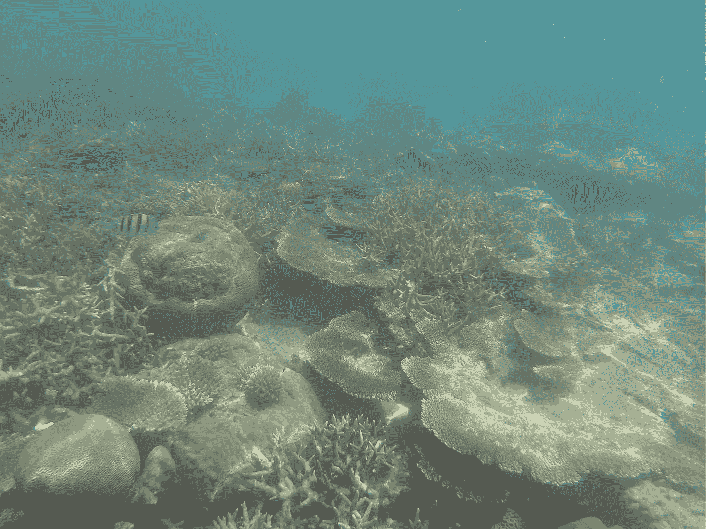

# 用机器学习解决气候危机:使用 60 年海洋学数据的水温预测

> 原文：<https://towardsdatascience.com/tackling-climate-crisis-with-machine-learning-d9426fe1f5a9?source=collection_archive---------45----------------------->



海洋温度上升严重影响海洋物种和生态系统。气温上升会导致珊瑚漂白，海洋鱼类和哺乳动物失去繁殖地。机器学习有助于预测水温上升的原因，并及时缓解温度上升。

在这个实验中，我使用了加州合作海洋渔业调查(CalCOFI)的数据集，它包含了 60 年的海洋学数据，托管在 ka ggle:[https://www.kaggle.com/sohier/calcofi](https://jovian.ml/outlink?url=https%3A%2F%2Fwww.kaggle.com%2Fsohier%2Fcalcofi)

CalCOFI 数据集代表了世界上最长(1949 年至今)和最完整(超过 50，000 个采样站)的海洋学和鱼类幼体数据时间序列。它包括关于温度、盐度、氧气、磷酸盐、硅酸盐、硝酸盐和亚硝酸盐、叶绿素、透射计、PAR、C14 初级生产力、浮游植物生物多样性、浮游动物生物量和浮游动物生物多样性的数据。这里我将重点介绍通过使用机器学习来预测水温的内容。让我们从导入库和数据开始吧！

我现在将重点关注一些变量，所以让我们将数据帧切片。

# 我们来看看哪些变量对水温的预测作用更大。

我们可以看到 7 个变量似乎与温度更相关。然而，我们将删除七个中的一个，因为它指的是瓶号，而不是一个重要的变量(BtlNum)。我们将在模型中保留 6 个参数，并移除其他变量。

*   保持:'深度'，'萨朗蒂'，' O2ml *L '，'斯特塔'，' O2Sat '，'氧* mol/Kg '，
*   已删除:' RecInd '，' T_prec '，' T_qual '，' S_prec '，' S_qual '，' P_qual '，' O_qual '，' SThtaq '，' O2Satq '，' BtlNum '

如您所见，有 6 列。我们的目标变量将是 T_degC，它代表水温。其余的列将用于预测水温(目标变量)。因此，它是多种多样的。

# 现在我们将对数据进行预处理。首先，我们从检测缺失值开始。

看起来我们有很多缺失的值。有不同的方法来处理缺失值。一种方法是用平均值填充它们。首先，我们需要检查数据是如何分布的。

看起来对于 O2Sat 和 Oxy_ mol/Kg，我们可能希望使用归一化。fillna()使用平均值，而不是。dropna()。对于其他变量，似乎没有很大的区别。为了标准化，让我们用所有七个变量的平均值代替所有缺失值。最后，我们可以标准化我们的数据集。

完美！我们用平均值代替了所有 NA 值。

# 我们现在可以开始构建我们的机器学习模型了。

我们将通过以下步骤创建一个模型:

*   为训练准备数据集
*   创建线性回归模型
*   训练模型以适应数据
*   使用训练好的模型进行预测

如果你看一下这个图表，你会发现这个分布几乎是正态的。最小 1.44°C，最大 31.14°C，跨度相当大。这就是为什么我们希望看到水数据(氧气、饱和度、盐度等)的关系。)和水温作为我们要了解的变量哪个影响最大。

前面的函数将 pandas 数据帧转换为 Numpy 数组。inputs_array 是输入变量的所有值的数组，输入变量是我们用来预测目标变量(或自变量)的特征，targets_array 是目标变量(即水温)的所有值的数组。因此，我们将数据转换为适合我们机器学习模型的格式。

结果如下:

下面的张量运算将 numpy 数组`inputs_array`和`targets_array`转换成 PyTorch 张量。为了标准化，我们将数据类型设置为`torch.float32`。

接下来，我们需要为训练和验证创建 PyTorch 数据集和数据加载器。我们将从创建一个`TensorDataset`开始。

现在，我们将把数据分成两个数据集:

*   训练数据集

实际上，我们正在使用这个数据集来“训练”我们的模型。机器学习模型基于它改变它的权重和偏差(我们假设它是线性回归)。

*   验证数据集

我们使用这个数据集来实际测试学习算法是否理解，而不是记忆。这模拟了模型在现实世界中的表现

这里，我声明 val_percent = 0.15，这意味着我将使用 15%的数据集作为验证数据集，85%的数据作为训练数据集。而且我是随机拆分的，这样学习算法案例就可以无偏地学习，增加性能更好的机会。

最后，我们可以为培训和验证创建数据加载器。

在这里，我使用 DataLoader 将数据分成几批。批次将 batch_size number 元素分组到 DataLoader 中的一个组中。此外，我将 train_loader 中的 shuffle 设置为 True，这意味着批次将被打乱，使得训练公平且随机，这再次增加了算法更有效地拾取的机会。在这里，我使用的批量大小为 32。

```
batch_size = 32
train_loader = DataLoader(train_ds, batch_size, shuffle=True)
val_loader = DataLoader(val_ds, batch_size)
```

前面的函数可能看起来让人不知所措，但是我们可以分解它。nn。模块表明我们正在扩展 Pytorch 模块。在 **init** (初始化式)中，我们声明 self.linear = nn。使用 Pytorch 的线性建模。这本质上是一个简单的线性回归。因为线性模型最简单，而我们的目标变量是连续变量。不然就是分类问题了。

“Forward”函数将训练数据集中的输入变量 xb 插入到线性模型中，并通过模型获得预测的目标变量值，即水温。

training_step 函数返回每批的计算损失。损失函数是特定于问题的，即，它可以针对不同的数据集和 ML 问题而改变。这里，我使用 Huber 损失(平滑平均绝对误差)作为损失函数。与平方误差损失(MSE)相比，该函数对异常值不太敏感。我决定使用这个基于目标变量的准正态分布的损失函数。

Validation_step 函数使用验证数据集来评估使用训练集训练模型准确性。它还返回 Huber 损失函数的结果。

Validation_epoch_end 返回验证数据集评估的平均值(损失函数)，然后返回损失的平均值。这里，设置为 20 个历元，意味着每 20 次迭代(历元=用于训练和改变权重和偏差的迭代)，将返回平均值。

现在，让我们创建模型对象:

```
model = WaterTempModel()
```

现在，让我们检查我们的默认权重和偏差。请注意，所有参数都是随机选择的，因此会给出不正确的结果。

这些是我们模型的参数。等式中的模型可以表示如下:

y =-0.2380 x1+0.3374 x2+0.1023 x3-0.0871 x4-0.2690 X5-0.2864 X6

其中 y 是水温。x1 是以米为单位的水深，x2 是盐度，x3 是以 ml/L 为单位的 O2 测量值，x4 是 sigma-theta(海水密度)，x5 是氧饱和度，x6 是 Oxy_ mol/Kg。如您所见，盐度的权重最大，海水密度的权重最小。

现在，为了评估我们的模型，我们将定义如下两个附加函数:

evaluate function 计算每批验证数据集的损失函数值(请记住，我们也将验证数据集划分为批)，并返回损失函数与预测值的平均值。这就给出了我们模型的最终评价。

Fit 函数接受 epoches(迭代次数)、学习率、模型、train_loader(训练数据)、val_loader(验证数据)、设置为梯度下降的 opt_function，这是我们之前讨论过的。该函数使用梯度下降算法和每个历元计算最小点，它使用验证数据和评估函数返回结果以返回其性能。

现在，这是初始参数性能的结果:

112 左右是分数，很高！现在使用梯度下降，让我们改进。

它看起来是这样的:

从默认参数的大约 112 的错误分数，我们把它降低到大约 0.4！现在，让我们用一些真实值进行实际测试！

# 我们现在将使用训练好的模型进行预测

# 第一次测试:

0.16 C 左右的差距，还不错！看起来我们选择的变量可以很好地预测水温。

# 第二次测试:

0.18℃左右的差价，还不错！

# 第三次测试:

在此感谢 Jovian.ml 团队(尤其是 Aakash 先生)！

如果你对学习机器学习感兴趣，可以在 freecodecamp [youtube](https://www.youtube.com/channel/UC8butISFwT-Wl7EV0hUK0BQ) 频道查看他们的视频。通过他们的材料学习 [PyTorch](https://jovian.ml/forum/c/pytorch-zero-to-gans/) 到目前为止是一次有趣的旅程！

# 感谢阅读！

如果你喜欢我的工作，想支持我…

1.  支持我的一种方式是在**媒体** [这里](https://medium.com/@bilgenurb)关注我。
2.  点击 **LinkedIn** [这里](https://www.linkedin.com/in/bilgenur-baloglu/)或者 **Twitter** 这里[关注我。](https://twitter.com/bilgeMolEcol)
3.  想看看我的作品吗？看看我的**Github**:[https://github.com/BBaloglu](https://github.com/BBaloglu)
4.  你想看看我的项目并与我合作吗？看看我的网站:[https://bbaloglu.github.io/](https://bbaloglu.github.io/)