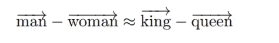
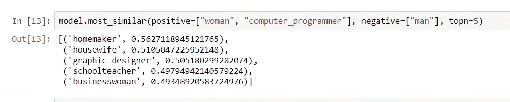
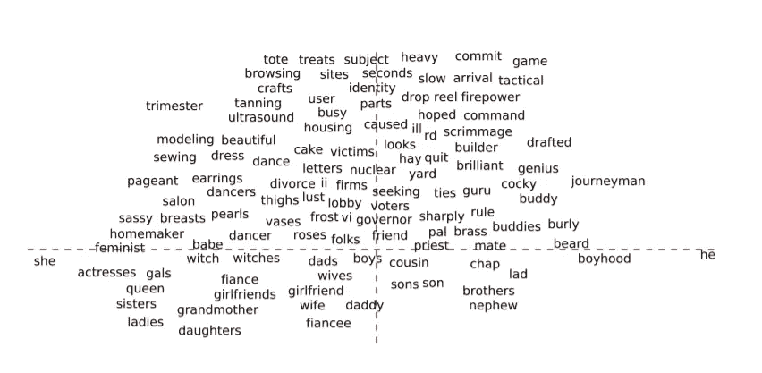
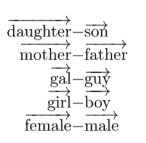
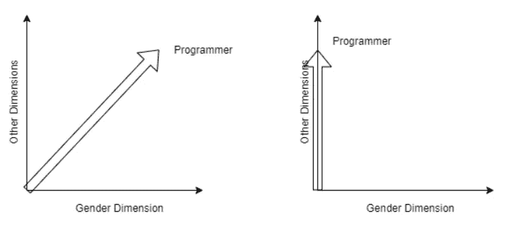
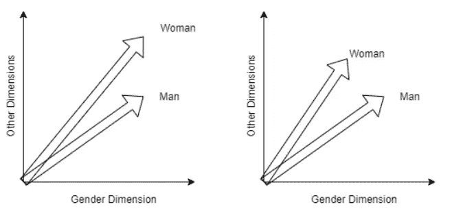
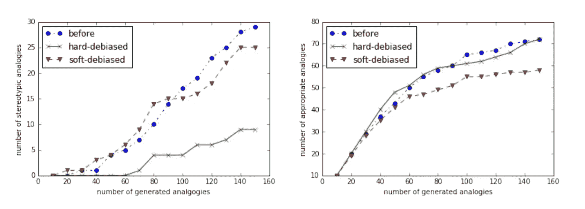
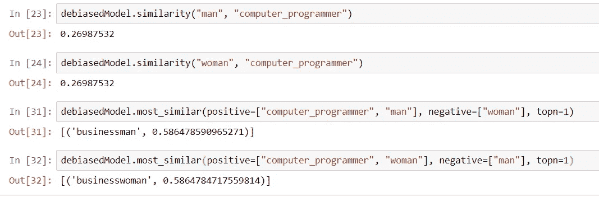

# 解决词语嵌入中的性别偏见

> 原文：<https://towardsdatascience.com/tackling-gender-bias-in-word-embeddings-c965f4076a10?source=collection_archive---------14----------------------->

## 一篇试图减轻单词嵌入中的性别偏见的技术论文的摘要

照片由 [Unsplash](https://unsplash.com?utm_source=medium&utm_medium=referral) 上的 [Dainis Graveris](https://unsplash.com/@dainisgraveris?utm_source=medium&utm_medium=referral) 拍摄

ord 嵌入是自然语言处理的基础。但是他们没有固有的偏见吗？想象一下，谷歌搜索“*酷酷的程序员 t 恤*”，谷歌只回复男性 t 恤。随着已经显示出性别偏见迹象的 BERT 被纳入谷歌搜索，人们不需要想象。随着我们不断看到这些系统在日常生活中的使用越来越多，保持定义人工智能的“智能”本质上无偏见是必不可少的。

这可能是单词嵌入最广为人知的成就。(来源—此处)。

当 Word2Vec 首次公布其成果时，这种关系也让计算机科学界产生了怀疑。单词的向量表示的概念是 NLP 的主要支柱之一。然而，正是这些词的嵌入甚至可以吸收人类世界的偏见。

事实上——当我在谷歌新闻向量上尝试时，我得到了惊人的结果。(来源——自己)

(In)上述著名结果真正指出了问题的隐含本质*。事实上，这些庞大的模型是基于人类文学的语料库来训练的，这些语料库是有偏见的。*

*博鲁克巴斯等人*。男人对于电脑程序员就像女人对于家庭主妇一样？消除单词嵌入的偏见 ”进一步阐明了对这种性别偏见的一些分析，以及我们如何努力克服它。幸运的是，这些模型包含了足够的信息，甚至可以在一定程度上减轻这种偏差。

# 问题是

本质上，模型被训练的语料库有一些性别中性的词，如“*垒球*”、“*接待员*”和“*程序员*”。还有一些性别专有的术语，如“*女商人*”、“*父亲*”和“*母亲*”。据观察，性别中立的术语获得刻板印象和偏见，由于他们在语料库中出现的语境。

> 例如，假设对于卡内基梅隆大学的计算机科学博士生，搜索查询是“cmu 计算机科学博士生”。现在，该目录为学生提供了 127 个几乎相同的网页——这些网页只是学生的名字不同...然而，单词嵌入也将与计算机科学相关的术语排序为更接近男性名字而不是女性名字…结果是，在两个仅名字 Mary 和 John 不同的页面之间，单词嵌入将影响搜索引擎将 John 的网页排序高于 Mary。

目标是“去偏向”这些性别中立的向量，同时保留嵌入中相同的语义关系。

## 直接和间接偏见

偏见本身有两种类型，直接和间接。

**直接偏见**可以分为“*足球*”天生更接近男性“*接待员*”更接近女性。**间接偏见**源于语料库中的细微关联，导致“*簿记员*”更接近于“*垒球*”而不是“*足球*”，因为它们的女性联想更大。

在“他-她”空间上表示的向量。X 轴上方的是中性术语，X 轴下方的是特定性别术语。(资料来源——报纸)

如上所示，性别中立术语应该与*他-她*对等距，而性别特定术语应该继续传达其中嵌入的性别信息。

# 方法

## 性别子空间的识别

首先捕获这个性别嵌入的*子空间*。这是通过取定义性别概念本身的一些预先知道的集合的差来完成的。

等式对的子集用于确定性别子空间。(资料来源——报纸)

对这种相反性别对的子集执行 SVD，以最终获得这种偏差的方向或子空间。这种平滑是为了消除一些术语不同含义的影响，如“ *man* ”。

## **硬去偏置:中和并均衡**

位于该子空间中的向量(性别中立项)被“中和”，使得它们与类似“*他-她*”的等式对保持等距。从技术上讲，所发生的是从向量中减去嵌入在偏移方向上的投影。

左侧—中和前，右侧—中和后。(来源——自己)

这个方向之外的嵌入(性别特定的术语)被“均衡”，或者平均为具有相同的向量长度。这样做是为了确保中性项与所有等式对等距。例如，术语*医生*应该与*男女孩*和*男女人*等距。

左侧—均衡前，右侧—均衡后。(来源——自己)

## **软去偏置**

有时性别专用术语可能包含更多需要捕捉的含义，例如:*到祖父法规*。在这种情况下，我们可能只想基于一个参数“软化”性别偏见对嵌入的影响，比如说 **λ** 。

这里，我们不完全中和嵌入，而是仅在 **λ** 的范围内这样做。如果 **λ** = 0，那么本质上与硬去偏相同。

# 结果和结论

使用不同(无)偏向嵌入、左定型类比和右适当类比生成的类比数量。(资料来源——报纸)

上面显示的结果与任务的目标相一致，成功地从嵌入中消除了偏差，而不影响性能。对于所描述的问题，还有其他方法，比如清理语料库本身。

从本质上说，去除单词嵌入的偏见有助于满足对无偏见世界不断增长的需求。至少，机器学习不应该被用来无意中放大这些偏见，因为我们已经看到这种情况会自然发生。

使用论文作者在 GitHub 上发布的[代码，我对我之前使用的 Google 新闻向量进行了硬去偏置，并获得了以下结果。](https://github.com/tolga-b/debiaswe)

检验去偏见模型——性别偏见明显减轻。(来源——自己)

我们看到这种方法是如何利用中和与均衡来减少明显的偏差的。

有些人认为嵌入中的性别偏见捕获了有用的统计数据。然而，机器学习算法有很大的可能性放大性别刻板印象和歧视，最好在无偏见的系统上运行。

由于性别只是单词嵌入所表现出的偏见之一，种族或民族偏见的识别也会随之而来，这是迈向真正的**#伦理**的一大步

# 参考

T .博卢克巴斯，K .常，J .邹，V .萨利格拉玛和 A .卡莱。男人对于电脑程序员就像女人对于家庭主妇一样？去偏置词嵌入。2016T21。