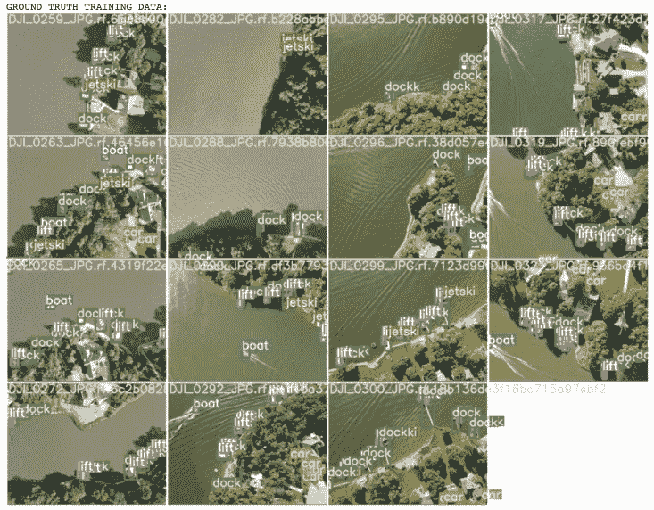
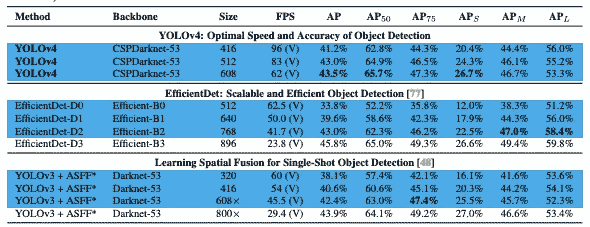
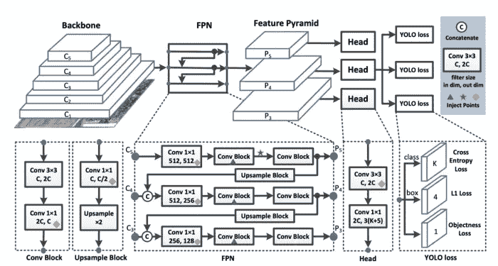
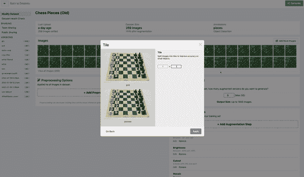

# 目标检测中小目标问题的处理

> 原文：<https://towardsdatascience.com/tackling-the-small-object-problem-in-object-detection-6e1c9976ee69?source=collection_archive---------24----------------------->

## 注意:我们也在博客上发布了[解决小物体问题](https://blog.roboflow.com/detect-small-objects/)。[检测小物体](https://blog.roboflow.com/detect-small-objects/)是计算机视觉中最具挑战性和最重要的问题之一。在本帖中，我们将讨论我们在 Roboflow 通过迭代数百个小型[物体检测模型](https://blog.roboflow.com/object-detection/)开发的一些策略。



在[公共航空海事数据集](https://public.roboflow.ai/object-detection/aerial-maritime/1)中，无人机从上方看到的小物体

为了提高模型在小对象上的性能，我们推荐以下技术:

*   提高您的[图像捕捉分辨率](https://blog.roboflow.com/you-might-be-resizing-your-images-incorrectly/)
*   提高您的型号的[输入分辨率](https://blog.roboflow.com/you-might-be-resizing-your-images-incorrectly/)
*   平铺您的图像
*   [通过增强生成更多数据](https://blog.roboflow.com/boosting-image-detection-performance-with-data-augmentation/)
*   自动学习[模型锚](https://blog.roboflow.com/what-is-an-anchor-box/)
*   [过滤掉无关类](https://blog.roboflow.com/introducing-class-management/)

如果你喜欢视频，我也记录了这篇文章的讨论

# 小物体问题为什么难？

小目标问题困扰着世界范围内的目标检测模型。不买？查看 [COCO](https://www.youtube.com/watch?v=B4gNml3V2cc) 对最新型号 [YOLOv3](https://blog.roboflow.com/training-a-yolov3-object-detection-model-with-a-custom-dataset/) 、 [EfficientDet](https://blog.roboflow.com/breaking-down-efficientdet/) 和 [YOLOv4](https://blog.roboflow.com/training-yolov4-on-a-custom-dataset/) 的评估结果:



查看 AP_S、AP_M、AP_L 的最新型号。小物件硬！( [*引用*](https://arxiv.org/abs/2004.10934) *)*

例如，在 EfficientDet 中，小对象的 AP 仅为 12%，而大对象的 AP 为 51%。这几乎是五倍的差异！

那么为什么探测小物体如此困难呢？

一切都归结于模型。[物体检测模型](https://blog.roboflow.com/the-ultimate-guide-to-object-detection/)通过聚集卷积层中的像素来形成特征。



*[*PP-YOLO*](https://arxiv.org/pdf/2007.12099.pdf)中用于物体检测的特征聚合*

*并且在网络的末端，基于损失函数进行预测，该损失函数基于预测和地面真实之间的差异对像素求和。*

**

**YOLO 的* [*损失函数*](https://stats.stackexchange.com/questions/287486/yolo-loss-function-explanation)*

*如果地面真值盒不大，训练时信号会变小。*

*此外，小物体最有可能出现数据标签错误，它们的标识可能会被忽略。*

*经验上和理论上，小物体很难。*

# *提高图像捕捉分辨率*

*分辨率，分辨率，分辨率…这都是关于[分辨率](https://blog.roboflow.com/you-might-be-resizing-your-images-incorrectly/)。*

*非常小的对象在边界框内可能只包含几个像素，这意味着提高图像的分辨率以增加检测器可以从那个小框中形成的特征的丰富性非常重要。*

*因此，如果可能的话，我们建议捕捉尽可能高分辨率的图像。*

# *提高模型的输入分辨率*

*一旦你有了更高[分辨率](https://blog.roboflow.com/you-might-be-resizing-your-images-incorrectly/)的图像，你就可以放大你的模型的输入分辨率。警告:这将导致大型模型需要更长的训练时间，并且在开始部署时推断速度会更慢。您可能需要进行实验来找出速度和性能之间的正确权衡。*

*在我们的[训练 YOLOv4](https://blog.roboflow.com/training-yolov4-on-a-custom-dataset/) 教程中，你可以通过改变配置文件中的[图像大小](https://blog.roboflow.com/you-might-be-resizing-your-images-incorrectly/)来轻松缩放你的输入分辨率。*

```
*[net] 
batch=64 
subdivisions=36 
width={YOUR RESOLUTION WIDTH HERE} 
height={YOUR RESOLUTION HEIGHT HERE} 
channels=3 
momentum=0.949 
decay=0.0005 
angle=0 
saturation = 1.5 
exposure = 1.5 
hue = .1  
learning_rate=0.001 
burn_in=1000 
max_batches=6000 
policy=steps 
steps=4800.0,5400.0 
scales=.1,.1*
```

*在我们关于如何训练 YOLOv5 的[教程中，您还可以通过更改训练命令中的图像大小参数来轻松缩放您的输入分辨率:](https://blog.roboflow.com/how-to-train-yolov5-on-a-custom-dataset/)*

```
*!python train.py --img {YOUR RESOLUTON SIZE HERE} --batch 16 --epochs 10 --**data** '../data.yaml' --cfg ./models/custom_yolov5s.yaml --weights '' --name yolov5s_results  --cache*
```

*注意:只有达到训练数据的最大分辨率时，您才会看到改进的结果。*

# *平铺您的图像*

*检测小图像的另一个伟大策略是将图像平铺作为预处理步骤。平铺可以有效地放大小物体上的检测器，但允许您保持所需的小输入分辨率，以便能够运行快速推断。*

**

**在 Roboflow 中平铺图像作为预处理步骤**

*如果你在训练中使用平铺，记住你也需要在推理时平铺你的图像是很重要的。*

# *通过增强生成更多数据*

*[数据扩充](https://blog.roboflow.com/boosting-image-detection-performance-with-data-augmentation/)从你的基本数据集生成新图像。这对于防止模型过度适应训练集非常有用。*

*一些对小物体检测特别有用的增强包括[随机裁剪](https://blog.roboflow.com/why-and-how-to-implement-random-crop-data-augmentation/)、[随机旋转](https://blog.roboflow.com/why-and-how-to-implement-random-rotate-data-augmentation/)和[马赛克增强](https://blog.roboflow.com/advanced-augmentations/)。*

# *自动学习模型锚*

*[锚框](https://blog.roboflow.com/what-is-an-anchor-box/)是模型学习预测的原型边界框。也就是说，锚定框可以预先设置，有时对您的训练数据来说不是最佳的。这是很好的定制调整这些你手头的任务。幸运的是， [YOLOv5 模型架构](https://blog.roboflow.com/how-to-train-yolov5-on-a-custom-dataset/)会根据您的定制数据自动为您完成这项工作。你所要做的就是开始训练。*

```
*Analyzing anchors... anchors/target = 4.66, Best Possible Recall (BPR) = 0.9675\. Attempting to generate improved anchors, please wait... WARNING: Extremely small objects found. 35 of 1664 labels are < 3 pixels in width or height. Running kmeans for 9 anchors on 1664 points... thr=0.25: 0.9477 best possible recall, 4.95 anchors past thr n=9, img_size=416, metric_all=0.317/0.665-mean/best, past_thr=0.465-mean: 18,24,  65,37,  35,68,  46,135,  152,54,  99,109,  66,218,  220,128,  169,228 Evolving anchors with Genetic Algorithm: fitness = 0.6825: 100%|██████████| 1000/1000 [00:00<00:00, 1081.71it/s] thr=0.25: 0.9627 best possible recall, 5.32 anchors past thr n=9, img_size=416, metric_all=0.338/0.688-mean/best, past_thr=0.476-mean: 13,20,  41,32,  26,55,  46,72,  122,57,  86,102,  58,152,  161,120,  165,204*
```

# *过滤掉无关的类*

*[类管理](https://blog.roboflow.com/label-management-for-computer-vision/)是提高数据集质量的一项重要技术。如果有一个类与另一个类明显重叠，则应该从数据集中过滤掉该类。或许，您认为数据集中的小对象不值得检测，因此您可能想要将其删除。您可以使用作为 [Roboflow Pro](https://roboflow.com/pro) 一部分的[高级数据集健康检查](https://public.roboflow.com/object-detection/hard-hat-workers/health#intro)快速识别所有这些问题。*

*类省略和类重命名都可以通过 [Roboflow 的本体管理工具](https://blog.roboflow.com/label-management-for-computer-vision/)实现。*

# *结论*

*正确检测小物体确实是一个挑战。在本帖中，我们讨论了一些改进小型[物体探测器](https://blog.roboflow.com/the-ultimate-guide-to-object-detection/)的策略，即:*

*   *提高您的[图像捕捉分辨率](https://blog.roboflow.com/you-might-be-resizing-your-images-incorrectly/)*
*   *提高您的[型号的输入分辨率](https://blog.roboflow.com/you-might-be-resizing-your-images-incorrectly/)*
*   *平铺您的图像*
*   *[通过增强生成更多数据](https://blog.roboflow.com/boosting-image-detection-performance-with-data-augmentation/)*
*   *自动学习[模型锚](https://blog.roboflow.com/what-is-an-anchor-box/)*
*   *[过滤掉无关类](https://blog.roboflow.com/introducing-class-management/)*

*一如既往，愉快的检测！*