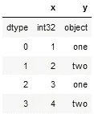
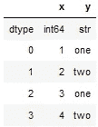
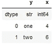
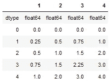
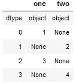
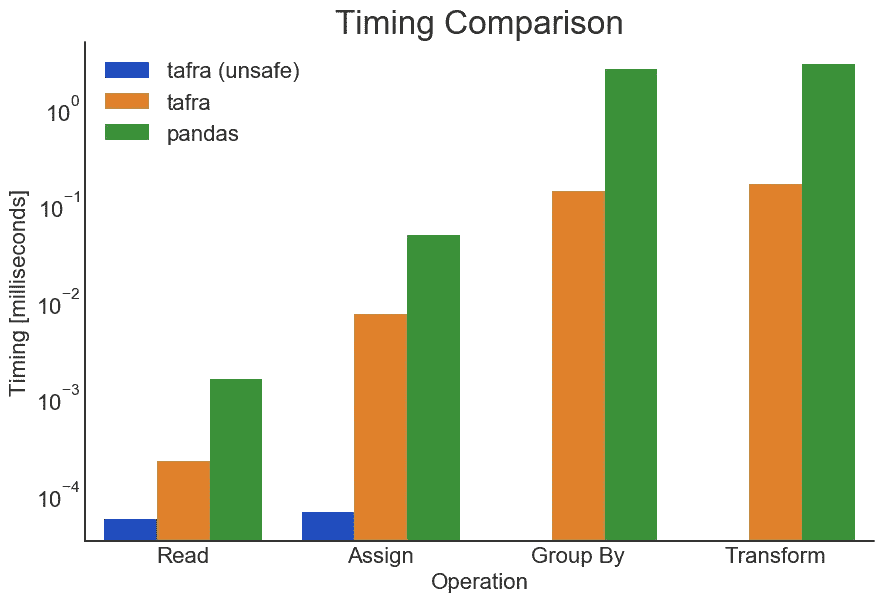

# 塔夫拉:一个极简的数据框架

> 原文：<https://towardsdatascience.com/tafra-a-minimalist-dataframe-61c7561ded2b?source=collection_archive---------56----------------------->

## 一个小的纯 Python 包，对类型的支持一流，对可用性和性能的依赖性最小。

大卫·s·富尔福德和德里克·w·特克。2020 年 6 月 17 日


图片来源: [Pixabay](https://pixabay.com/photos/laptop-book-information-online-819285/)

## 介绍

很明显，数据科学需要数据。当我们处理数据时，我们必须首先从数据源加载数据，并存入内存。我们的数据可能有不同的*类型*:文本、整数、小数、日期、时间戳等等。*数据框架*是我们在执行数据科学时存储这种异构数据的实际机制。

`tafra`作为一个思想实验开始了它的生命:我们怎样才能把阿达 ***塔夫拉*** 我的想法(用像`pandas`这样的库或者像`R`这样的语言表达)减少到它有用的本质，同时切掉脚？

[原始概念验证](https://usethe.computer/posts/12-typing-groupby.html)在`group_by()`处停止。从那以后，我们扩展了这个想法，构建了一个完整的库，产生了一个实用的 T4，我们希望你会发现它是一个有用的轻量级替代品，可以替代 T5 的某些用途。

一个`tafra`或多或少是一组命名的*列*或*尺寸*。每一个都是长度一致的类型化`numpy.ndarray`，用*行*表示每一列的值。该库提供了用于操作行和列的轻量级语法、对管理数据类型的支持、对行和子帧的迭代器、`pandas`式的支持和从 pandas 数据帧的转换，以及 SQL 风格的`GROUP BY`和`JOIN`操作。

## 一个简短的例子

```
from tafra import Tafrat = Tafra({
   'x': np.array([1, 2, 3, 4]),
   'y': np.array(['one', 'two', 'one', 'two'], dtype='object'),
})t.pformat()
> Tafra(data = {
>  'x': array([1, 2, 3, 4]),
>  'y': array(['one', 'two', 'one', 'two'])},
> dtypes = {
>  'x': 'int', 'y': 'object'},
> rows = 4)
```

如果我们在一个 Jupyter 笔记本中，我们得到一个第一行带有`dtypes`的 HTML 表格:



tafra 的 HTML 表格渲染

编写高性能代码(比如通过使用`[numba](https://numba.pydata.org/)`)需要严格执行您的数据类型。奇怪的是，Windows 将`int32`作为默认`long`，而 Linux 和 MacOS 则是默认`int64`。需要改吗？`Tafra.update_dtypes()`可以接受`numpy.dtype()`接受的任何输入。

```
# these are all equivalent
t.update_dtypes({'x': 'int64', 'y': 'str'})
t.update_dtypes({'x': np.int64, 'y': str})
t.update_dtypes({'x': np.dtype('int64'), 'y': '<U3'})
```



铸造类型是灵活和直接的

除了从其他数据结构中读取数据(例如 [CSV](https://tafra.readthedocs.io/en/latest/api.html#tafra.base.Tafra.read_csv) 、 [SQL 游标](https://tafra.readthedocs.io/en/latest/api.html#tafra.base.Tafra.read_sql)，或者[行记录](https://tafra.readthedocs.io/en/latest/api.html#tafra.base.Tafra.from_records)，以及[许多其他数据结构](https://tafra.readthedocs.io/en/latest/api.html#tafra.base.Tafra))，能够将`tafra`转换为其他数据结构也很有用:

```
print('List:', '\n', t.to_list())
> List:
>  [array([1, 2, 3, 4], dtype=int64),
>  array(['one', 'two', 'one', 'two'], dtype='<U3')]print('Records:', '\n', tuple(t.to_records()))
> Records:
>  ((1, 'one'), (2, 'two'), (3, 'one'), (4, 'two'))print('NamedTuple:', '\n', t.to_tuple())
> NamedTuple:
>  Tafra(x=array([1, 2, 3, 4], dtype=int64), y=array(['one', 'two', 'one', 'two'], dtype='<U3'))print('NamedTuple:', '\n', t.to_tuple(inner=True))
> NamedTuple:
>  Tafra(x=(1, 2, 3, 4), y=('one', 'two', 'one', 'two'))
```

要将聚合函数映射到列:

```
t.group_by(
    ['y'], {'x': sum}
)
```



group_by()运算

并将函数映射到行:

```
Tafra(t.row_map(lambda tf: (
    tf['x'],
    np.linspace(0, tf['x'].item(), 5)
)))
```



row_map 示例

`iterate_by`方法提供了很大的灵活性。`Iterable`是唯一分组的`Tuple`，匹配唯一分组的行的索引，以及这些行的`Tafra`。例如:我们还没有构建 pivot 方法，但是执行您自己的方法非常简单:

```
pivot = []
not_null = np.full(len(t), False)
for y, idx, tf in t.iterate_by(['y']):
    not_null |= idx
    pivot.append([y, np.full(len(t), None)])
    pivot[-1][1][idx] = t['x'][idx]Tafra(pivot)[not_null]
```



有枢轴的塔夫绸

有一些适合熊猫的代码，或者只是一种你喜欢的做事方式？`tafra`灵活:

```
df = pd.DataFrame(np.c_[
    np.array([1, 2, 3, 4]),
    np.array(['one', 'two', 'one', 'two'])
], columns=['x', 'y'])t = Tafra.from_dataframe(df)
```

回去也一样简单:

```
df = pd.DataFrame(t.data)
```

*或*

```
df = t.to_pandas()
```

请注意，大多数函数的默认设置是将数据视为不可变的。存在许多函数的就地版本，这样做是为了明确每个函数的返回类型。也就是说，一个函数最多返回一个类型或者一个`None`，而不是调用代码必须检查的另外两个类型的一个`Union`。

不同返回类型的另一个例子在`Tafra.read_sql`和`Tafra_read_sql_chunks`中。前者将在调用时在一个`Tafra`中返回所有记录，而后者将根据需要返回一个`Iterator[Tafra]`来消费。

## 计时

在这种情况下，轻量级也意味着高性能。除了添加到库中的任何附加特性，`tafra`应该为组织数据结构进行数值处理提供必要的基础。最重要的方面之一是快速访问数据本身。通过最小化访问底层`numpy.ndarray`，`tafra`提供了数量级的性能提升。

```
# Read Operations%timemit x = t['x']
> 219 ns ± 71.6 ns per loop (mean ± std. dev. of 7 runs, 1000000 loops each)%timemit x = df['x']
> 1.55 µs ± 105 ns per loop (mean ± std. dev. of 7 runs, 1000000 loops each)# Assignment Operations%timeit tf['x'] = x
> 7.39 µs ± 950 ns per loop (mean ± std. dev. of 7 runs, 100000 loops each)%timeit df['x'] = x
> 47.8 µs ± 3.53 µs per loop (mean ± std. dev. of 7 runs, 10000 loops each)
```

对于那些需要更快性能的人来说，可以通过直接读写`_data`属性来进行绕过数据验证检查的“不安全”操作。这些分别是熊猫的 10 倍和 100 倍。

```
%timemit x = t._data['x']
> 55.3 ns ± 5.64 ns per loop (mean ± std. dev. of 7 runs, 10000000 loops each)%timeit tf._data['x'] = x
> 65 ns ± 5.55 ns per loop (mean ± std. dev. of 7 runs, 10000000 loops each)
```

## 聚合函数

dataframe 式结构的主要用途之一是能够模拟 SQL 风格的`GROUP BY`和`JOIN`操作。`tafra`在这些方面也很出色，即使是基本功能的性能也提高了*10 倍*。此外，我们提供了将任何函数映射到任何列的能力。

```
# Group By%timeit tf.group_by(['y', 'z'], {'x': sum})
> 138 µs ± 4.03 µs per loop (mean ± std. dev. of 7 runs, 10000 loops each)%timeit df.groupby(['y','z']).agg({'x': 'sum'}).reset_index()
> 2.5 ms ± 177 µs per loop (mean ± std. dev. of 7 runs, 100 loops each) # Transform, e.g. a GROUP BY followed by a LEFT JOIN back to the original table%timeit tf.transform(['y', 'z'], {'sum_x': (sum, 'x')})
> 161 µs ± 2.31 µs per loop (mean ± std. dev. of 7 runs, 10000 loops each)%%timeit
tdf = df.copy()
tdf['x'] = df.groupby(['y', 'z'])[['x']].transform(sum)
> 2.81 ms ± 143 µs per loop (mean ± std. dev. of 7 runs, 100 loops each)
```

## 摘要

对于这些基本操作，`tafra`至少快了一个数量级。而“不安全”赋值(直接赋值给`_data`属性)是 3 个数量级如果你想自己提供`dtypes`，或者在一组操作后调用`[Tafra._coalesce_dtypes()](https://tafra.readthedocs.io/en/latest/api.html#tafra.base.Tafra._coalesce_dtypes)`。



操作时间的比较

## 你想知道更多吗？

这只是对`tafra`的介绍。我们相信它非常适合许多工作流，这些工作流需要一个以类型为中心的数据帧类型的结构，而不需要所有的花里胡哨…或者如果您只是想要一个替代方案，不会妨碍您将`numpy.ndarray`传递到您想要它们去的地方。

在这里查看文档[，并在这里](https://tafra.readthedocs.io/en/latest/)随意发布任何问题、错误或贡献[。](https://github.com/petbox-dev/tafra)