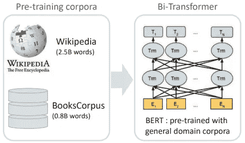
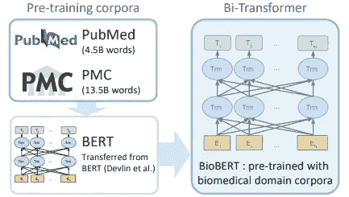
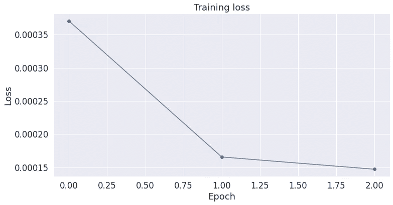

# 用 BioBERT 标记基因和蛋白质

> 原文：<https://towardsdatascience.com/tagging-genes-and-proteins-with-biobert-c7b04fc6eb4f?source=collection_archive---------6----------------------->

## BioBERT 背后的直觉以及在 Colab 中的实现


在 [Unsplash](https://unsplash.com?utm_source=medium&utm_medium=referral) 上由 [Ani Kolleshi](https://unsplash.com/@anikolleshi?utm_source=medium&utm_medium=referral) 拍照

# **一、简介**

临床领域的文本挖掘变得越来越重要，目前有大量的生物医学文档包含有价值的信息，等待通过 NLP 技术进行解码和优化。随着自然语言处理的加速发展，预先训练的语言模型现在可以携带数百万(甚至数十亿)的参数，并可以利用大量的文本知识来完成下游任务，如问答，自然语言推理，以及在我们将要完成的情况下，通过命名实体识别进行生物医学文本标记。所有代码都可以在我的 [GitHub](https://github.com/perkdrew/advanced-nlp/tree/master/BioBERT) 上找到。

# 二。背景

作为自然语言处理领域的最新突破，谷歌的研究人员开发了一种被称为 [BERT](https://arxiv.org/abs/1810.04805) 的语言模型。al，2018)，该模型通过在其架构的所有层中联合调节文本的双向上下文来学习深度表示。这些表示对于严重依赖上下文的顺序数据(如文本)很有价值，迁移学习在该领域的出现有助于将编码的知识用于加强个人跨领域的较小任务。在迁移学习中，我们将这一步称为“微调”，这意味着预先训练的模型现在正在针对我们脑海中的特定任务进行微调。最初的英语语言模型在预训练中使用了两个语料库:维基百科和图书语料库。对于像 BERT 这样的变形金刚背后的更深层次的直觉，我会建议一系列关于它们的架构和微调任务的[博客](https://medium.com/dissecting-bert)。



伯特建筑(德夫林等人，2018 年)

[BioBERT](https://arxiv.org/abs/1901.08746) (Lee et al .，2019)是来自高丽大学和 Clova AI 的前述模型的变体。研究人员用 PubMed 和 PMC 增加了原始 BERT 的语料库。PubMed 是生物医学引文和摘要的数据库，而 PMC 是全文期刊文章的电子档案。他们的贡献是一种生物医学语言表示模型，可以管理诸如关系提取和药物发现等任务。通过拥有包含通用和生物医学领域语料库的预训练模型，开发人员和从业人员现在可以封装生物医学术语，这些术语对于通用语言模型来说难以理解。



BioBERT 建筑(Lee 等人，2019 年)

在 BERT 和 BioBERT 中，文本被分解为单词片段标记器，该标记器将单词拆分为频繁出现的子单词，这样*免疫球蛋白*将被标记为 *I ##mm ##uno ##g ##lo ##bul ##in 的组成片段。*这些词块可以通过字符组合利用字符的灵活性以及一般的词义。使用 BioBERT 实现最先进结果的微调任务包括命名实体识别、关系提取和问题回答。在这里，我们将看看第一项任务，以及到底完成了什么。

# 三。工作

命名实体识别(NER)是对大量专有名词(或给定的目标短语)的识别过程，我们将这些专有名词建立为要标记的实体类型。用于评估 NER 的数据集以 BIO(开始、内部、外部)模式构建，这是该任务中最常见的句子标记格式。此外,“S-Protein”中的“S”可用于推断单个标记。这样，我们就可以注意到根据训练数据预测的位置前缀和实体类型。


基于 BioNLP13 语料库的命名实体识别

本例中使用的数据集是由 [BioNLP09 语料库](https://link.springer.com/referenceworkentry/10.1007%2F978-1-4419-9863-7_138)、 [BioNLP11 语料库](http://2011.bionlp-st.org/home)和 [BioNLP13 语料库](http://2013.bionlp-st.org/)组合而成。虽然我们关注基因和蛋白质，但还有其他实体类型，如疾病、化学物质和药物。这些实验中包含了 74 个标签，但为了简洁起见，下面是 BIO 模式中的 BioNLP13 语料库标签:

```
'B-Anatomical_system',
'B-Cancer',
'B-Cell', 
'B-Cellular_component',
'B-Developing_anatomical_structure',
'B-Gene_or_gene_product', 
'B-Immaterial_anatomical_entity',
'B-Multi-tissue_structure',
'B-Organ',
'B-Organism', 
'B-Organism_subdivision',
'B-Organism_substance',
'B-Pathological_formation', 
'B-Simple_chemical',
'B-Tissue',
'I-Amino_acid',
'I-Anatomical_system',
'I-Cancer', 
'I-Cell',
'I-Cellular_component',
'I-Developing_anatomical_structure',
'I-Gene_or_gene_product', 
'I-Immaterial_anatomical_entity',
'I-Multi-tissue_structure',
'I-Organ',
'I-Organism', 
'I-Organism_subdivision',
'I-Organism_substance',
'I-Pathological_formation',
'I-Simple_chemical', 
'I-Tissue',
'O'
```

# 四。履行

首先，我们要从原来的 [GitHub](https://github.com/dmis-lab/biobert) 导入 BioBERT，并将文件转移到我们的 Colab 笔记本中。在这里，我们正在下载主要的 BioBERT 文件，提取 BioBERT 权重，并将其转换为适用于 PyTorch，以便与 [HuggingFace API](https://huggingface.co/transformers/) 一起工作。为了简单起见，我们移动了配置文件，现在可以开始了！

你需要 HuggingFace 的变形金刚库。关于安装和导入的完整列表，请查阅我的[笔记本](https://colab.research.google.com/drive/18g_Z6tufHi_TPdVNO45KBcLRSr_k-mUQ?usp=sharing)。我们将文本的最大长度和批量大小设置为约束条件，我们将在后面使用这些约束条件。我们还将在 Colab 中创建一个利用 GPU 进行计算的设备。BertTokenizer 类将从我们之前设置的 BioBERT 文件中获取 vocab.txt。

SentenceFetch 类将接收我们的数据，读取生物模式文本进入的 TSV 文件，并将句子和标签组织成可用的数据结构。然后我们就有了检索句子和标签的方法。

我们搜索根目录的所有子目录。在 Colab 中，我建议从 Google Drive 或本地硬盘上传数据。我们使用 SentenceFetch 类并创建一个在实验中使用的句子和标签列表。

我们创建一个助手函数来标记文本，而不会丢失每个标记的标签。我们的模型需要完整的标签。

现在，我们可以通过 Keras 中的“pad_sequences”将输入数据规范化。这用于保持固定长度与比我们的最大长度短的序列一致。

现在我们可以完成建模的数据准备工作了。当将序列批处理在一起时，使用注意屏蔽来指示应该观察哪些记号。我们在训练和验证数据之间分割输入和屏蔽。然后，我们将数据转换为张量，以便与 PyTorch 一起正常工作。之后，我们通过 PyTorch 中的数据工具传递这些张量，最终为我们的模型准备好数据。

在建模阶段，我们使用 BertConfig 类来使用模型的配置文件。我们还使用预先训练的权重来帮助建立我们的“状态字典”。“state_dict”是一个字典，它将每一层映射到它的参数张量，这大大增加了 PyTorch 中模型和优化器的模块性。

我们为 NER 模型创建了一个简单的 BioBERT 类。我们的属性是我们网络中的层以及一个向前传递的方法。

创建了主要模型后，我们设置了优化和学习率调度程序。我们还在这里设置了其他超参数。

创建了管理纪元训练的功能。在这里，我们通知各层我们正处于训练模式，因此批处理 norm 和 dropout 层在训练模式下工作，而不是在 PyTorch 中要求的 eval 模式下工作。计算梯度并更新模型权重。

创建第二个函数来评估我们的模型。正如人们所猜测的，我们知道需要通知层我们处于 eval 模式。我们还停用自动签名引擎，以减少内存使用和加快计算速度。将来，将这两个函数合并为 BioBERT 模型类中的方法会更简洁。

这里，我们将循环遍历我们的纪元，使用我们的两个函数，并打印训练和验证损失/准确性的结果。

我们的结果显示，训练准确率高达 96%，验证准确率高达 95%。考虑到它所花费的时间(尽管在这里模型在可用的 GPU 上运行得非常快！)，没有理由增加 epochs。

```
======== Epoch 1/3 ========
Train Loss: 0.20869970354739556 Train Accuracy: 0.9479462699822381
Val Loss: 0.1037805580667087 Val Accuracy: 0.9576587301587302
======== Epoch 2/3 ========
Train Loss: 0.09325889256480109 Train Accuracy: 0.9650584665482536 Val Loss: 0.09049581730413059 Val Accuracy: 0.9589087301587302
 ======== Epoch 3/3 ======== 
Train Loss: 0.0828356556263529 Train Accuracy: 0.9658170515097693 Val Loss: 0.08888424655038213 Val Accuracy: 0.9585449735449736CPU times: user 8min 41s, sys: 6min 12s, total: 14min 54s 
Wall time: 14min 58s
```

当我们考虑损失时，学习曲线表示三个时期的合理损失:



现在我们可以从一篇生物医学论文[摘要](https://www.ncbi.nlm.nih.gov/pmc/articles/PMC17719/)中随机标记一个句子:

```
( - O 
i - O 
) - O 
Genetic - O 
experiments - O 
demonstrate - O 
that - O 
complementation - O 
of - O 
an - O 
in - O 
- - O 
frame - O 
deletion - O 
of - O 
HisG - S-Protein 
from - O 
Escherichia - O 
coli - O 
( - O 
which - O 
does - O 
not - O 
possess - O 
HisZ - S-Protein 
) - O 
requires - O
both - O 
HisG S-Protein 
and - O 
HisZ - S-Protein 
from - O 
L - O
```

我们看到它已经正确地标记了单个/单独的蛋白质提及。然而，考虑到大量的“0”表示与手头的任务无关的单词，由于训练数据中的示例数量太多，所以存在过度适合标记为“0”的结果。这种标签不平衡将是未来需要改进的地方。

# **五、结论**

我们大致了解了 BioBERT 是如何运作的，以及它是如何扩展 BERT 的工作的。通过利用 BioBERT，我们试图通过 NER 任务正确地标记生物医学文本。我介绍了我的 BioBERT 实现，它导入了必要的文件，预处理了数据，最后构建、训练和测试了模型。对于 Colab 中 BERT 的更深入分析，我强烈推荐 [ChrisMcCormickAI](https://www.youtube.com/channel/UCoRX98PLOsaN8PtekB9kWrw) 的教程。在[实用自然语言处理](https://github.com/practical-nlp)的第 10 章中也有一些与 NLP 工具和应用直接相关的有价值的信息(包括 BioBERT！)在医疗保健行业。我希望这有助于引导您了解生物医学领域的最新模型。

[1]:德夫林等人。艾尔。(2018 年 10 月)。*伯特:语言理解深度双向转换器的预训练*[https://arxiv.org/abs/1901.08746](https://arxiv.org/abs/1810.04805)

[2]:李等。艾尔。(2019 年 9 月)。 *BioBERT:用于生物医学文本挖掘的预训练生物医学语言表示模型*【https://arxiv.org/abs/1901.08746 