# 如何改变你在 excel 中的数据来做有效的尾部支出管理？逐步指南|第 03 章

> 原文：<https://towardsdatascience.com/tail-spend-analysis-chapter-03-data-preparation-7ae11af97487?source=collection_archive---------36----------------------->

**第 03 章—逐步指南的数据准备**

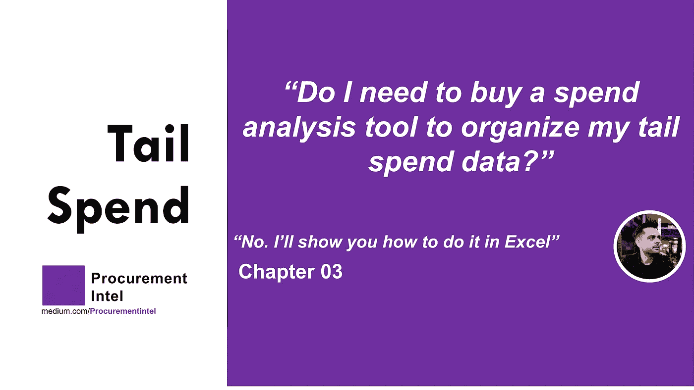

在花了几年时间用 Excel、Tableau、Python 进行采购分析，并详细评估了当前市场供应商的产品功能后，我可以自信地说，支出分析作为一个问题被高估和高估了。是的，在支出分析中，机器学习变得绝对必要(我们将在后续章节中讨论这些部分)，但如果你的公司刚刚开始进行支出分析，Excel(或者任何可以切割数据的工具)将会很好地完成这项工作。*一切都是为了准备和细节，而不是复杂的工具*

我们现在将着手准备我们的数据集。你可以在这里找到样本数据集。除了我们在第 2 章中讨论的 4 列之外，我还添加了另外两列，即“供应商类别”和“采购订单类别”。“供应商类别”基于供应商数量，“采购订单类别”基于“采购订单数量”。

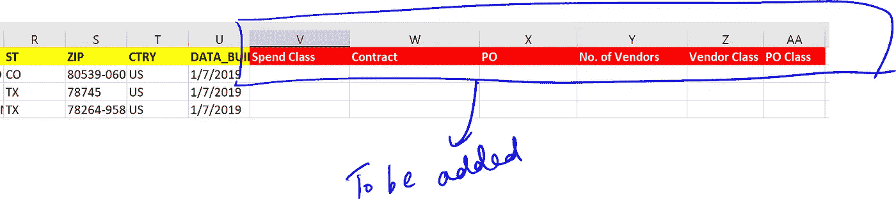

## **花类:**

让我们继续添加我们的第一列“消费类”。请仔细遵循以下步骤:

**步骤 1:** 使用“raw_dataset”工作表插入一个透视文件，并重新排列行&列以匹配下图。确保以下字段处于正确的位置:

*商品描述:成排*

*总 PO 值:In Values(商品描述的排列百分比运行合计)。*确保该字段按升序排列。

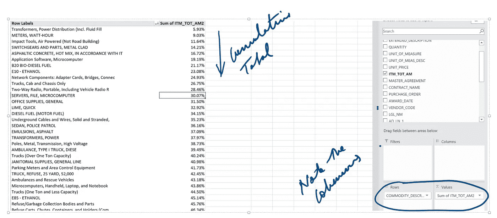

注意:要获得表示为%(如上所示)的总 PO 值，您必须进入“*值字段设置*”选项。这可以通过点击值字段中的下拉箭头(“ITM _ 总计 _AM2 的总和”)&从下拉列表中选择来找到。之后，在“*显示数值为*”选项下，选择“ *%运行总数在*”。最后一步是选择一个基本字段。在这种情况下，基本字段是“商品描述”。

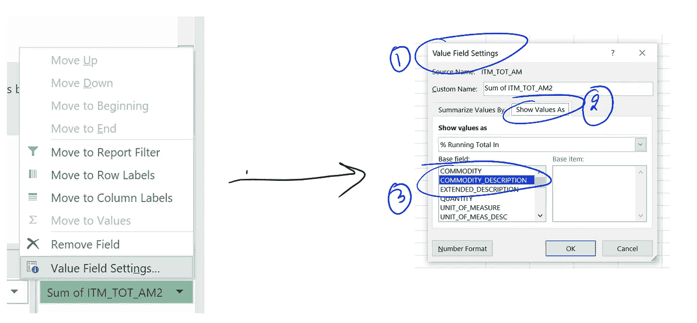

**第二步:**如第 02 章所述，我们的目标是从*尾花*中分割出*主花*。因此，向下滚动 total %列，直到达到 80%的数字。从 0%到 80%的项目(换句话说，前 80%)将被标记为“**主要花费**的项目。同样，从 80%到 100%(换句话说，最底层的 20%)的项目将被标记为“**尾花**”。将整个列表复制到一个新的单独的 excel 工作表中，并将其命名为“ *WIP 工作表*”。现在，您的 excel 文件应该类似于下图。

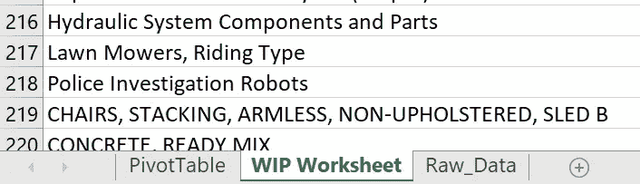

在新的 WIP 工作表中，插入一个新列，并将其命名为“*支出类别*”(列 C)。在这一栏中，我们会将每个项目标记为“主要支出”项目或“次要支出”项目。对于 B 列，我们有总支出百分比，滚动到 80%支出(即从 0%到 80%)，并在 C 列(“支出类别”)中填写**“主要支出”**。对于剩下的 20%(即从 80%到 100%)，写**“尾花”。**重复此过程，直到到达最后一项。您的"*WIP 工作表"*应该如下图所示:

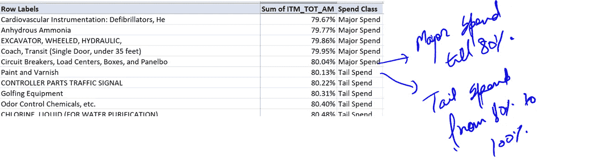

**步骤 3:** 我们现在几乎准备好在" *WIP 工作表"*中使用这些数据，并将其填充回我们的主" *raw_data* "工作表中。现在只需要一个简单的 Vlookup 就可以了。返回到*“raw _ data”*工作表，如上所述，使用商品描述上的*“Vlookup”*功能，并选择消费类别来填充它。下面是这样做的公式:

> ***= VLOOKUP(B2，' WIP 工作表'！$A$1:$C$6681，3，FALSE)***

*其中列 B2 暗示包含商品描述的“raw_data”工作表中的列 B*

*$A$1: $C$6681 表示“WIP 工作表标签”中的列，A 列包含商品说明，B 列包含累计百分比，C 列包含支出类别*

完成后,“raw_data”工作表中的“支出类”列应该如下图所示。*搞定！*

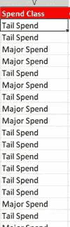

## 合同:

让我们添加第二列“合同”。这个简单明了。请参考“ *raw_data* ”工作表中我命名为“主协议”的列。正如第 02 章所讨论的，逻辑很简单。如果“*主协议*栏为空(如下图所示)，我们将填写“**合同不可用**”，如果“*主协议*栏不为空，我们将填写“**合同可用**”。我们将使用此逻辑填充所有单元格。

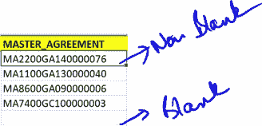

下面是这样做的公式:

> =IF(I2 <>" "，"合同可用"，"合同不可用")

*其中 I2 表示“raw_data”工作表中的 I 列(名为“主协议”)。< >“符号表示“不等于”，“符号表示空白”。因此，在这个公式中，我们检查 I2 是否不等于空白，然后写“合同可用”或其他。*

将此公式拖到“*raw _ data”*工作表的最后一个单元格。完成后，合同列应该如下图所示。*搞定！*

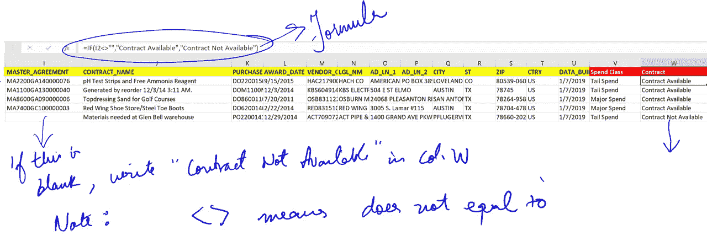

## **采购订单:**

我们继续我们的下一个专栏“PO”。这里，我们将重复添加合同列时的相同步骤。只是，我们将使用 K 列( *Purchase_Order* )，而不是 I 列(*主协议*)。因此，如果“*采购订单*”列为空，我们将写“**采购订单不可用**”，如果“采购订单”列不为空，我们将写“**采购订单可用**”。使用此逻辑填充所有单元格。下面是这样做的公式:

> =IF(K2 <>" "，"采购订单可用"，"采购订单不可用")

*其中 K2 表示“原始数据”工作表中的 K 列(名为“采购订单”)。“< >”符号表示“不等于”，“符号表示空白。因此，在这个公式中，我们检查 K2 是否不等于空白，然后写“PO Available”或其他。*

将此公式拖到“*raw _ data”*工作表的最后一个单元格。完成后，PO 列应该如下图所示。*搞定！*

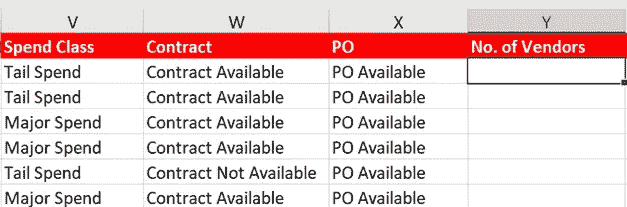

## 供应商数量:

**关键时刻之一已经到来。**现在，我们将计算每种商品描述的供应商数量。如果你还记得第 2 章，我们首先想知道每个项目的供应商数量，然后将他们进一步细分为高、中、低类别。在 Python 中计算每件商品的供应商数量很容易，但在 excel 中有点复杂(至少我是这样做的)。

我的逻辑很简单，但需要几个步骤。我将首先获得每个商品描述的所有供应商名称的列表。供应商名称可以很多，但商品描述必须是唯一的。简而言之，一对多关系(一个商品描述可以有多个供应商名称)。

第二步是将这些信息复制到一个新的工作表中，然后在 raw_data 工作表中使用 COUNTIF 公式来获得实际的供应商数量。遵循下面提到的步骤来实现这一目标。

## **从重新排列数据透视表开始**

回到我们的数据透视表工作表，根据下图重新排列。如果你能自己做，你可以跳到第三步。否则，请遵循以下说明。

***第一步:*** *我们先从拉商品描述和法定名称信息开始。在数据透视表的行部分，首先拉入“商品描述”，然后拉入“供应商的法定名称”。*

***第二步:*** *现在，让我们来改变一下我们透视表的布局。为此，选择数据透视表，然后您将能够在顶部看到 Design 选项卡。在 Design 选项卡下，单击 Report Layout 选项，您将能够看到几个选项。你必须选择下面提到的两个选项:*

*a .)选择“以表格形式显示”*

*b .)选择“重复所有项目标签”*

***第三步:*** *取消选择商品描述行的小计。这可以通过右击任何商品描述并取消选择“小计”选项来完成(参考第二张图片)。*

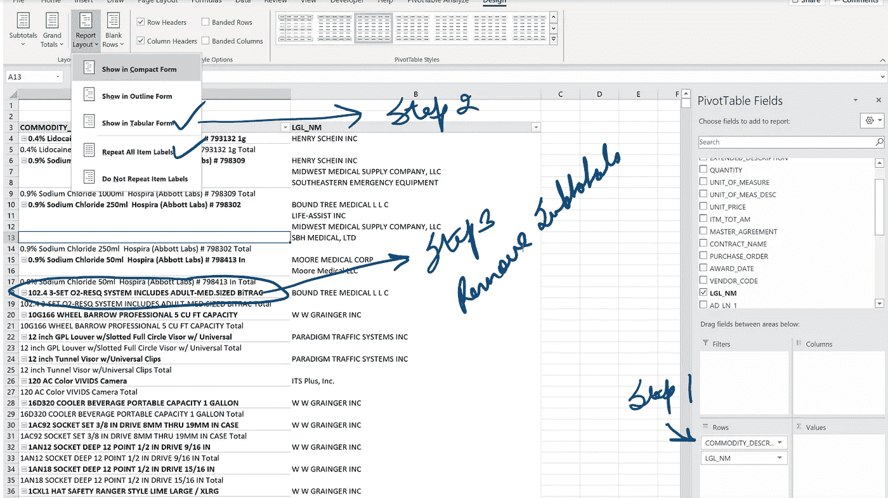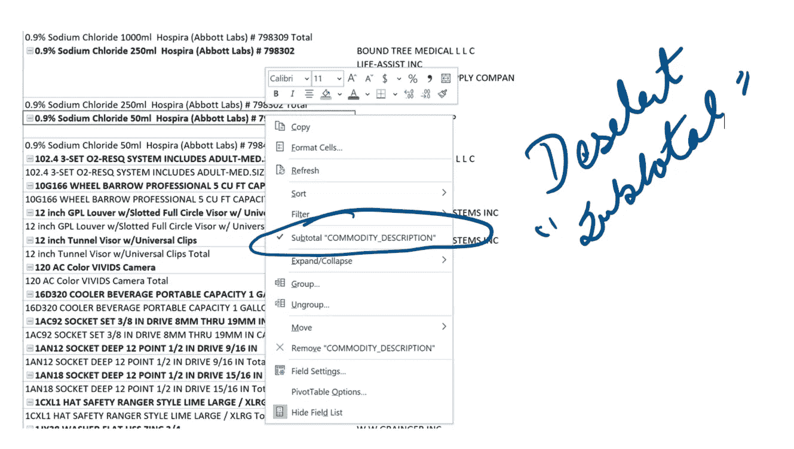

一旦您完成了*步骤 1、2 和 3，*您的数据透视表应该如下图所示。如您所见，我们现在有一个表格，左边是商品描述字段，右边是供应商的法定名称。完美！

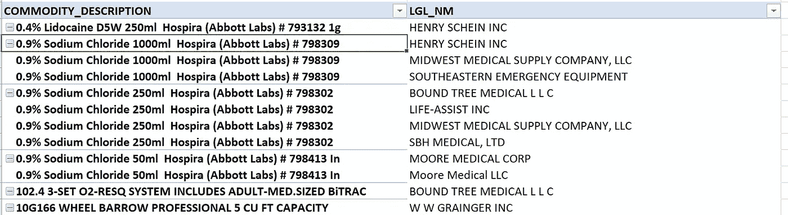

**步骤 4:** *现在让我们将此表复制到一个新的工作表“供应商数量”中。我们将在 A 栏中显示“商品描述”,在 B 栏中显示“供应商的法定名称”,如下所示。*

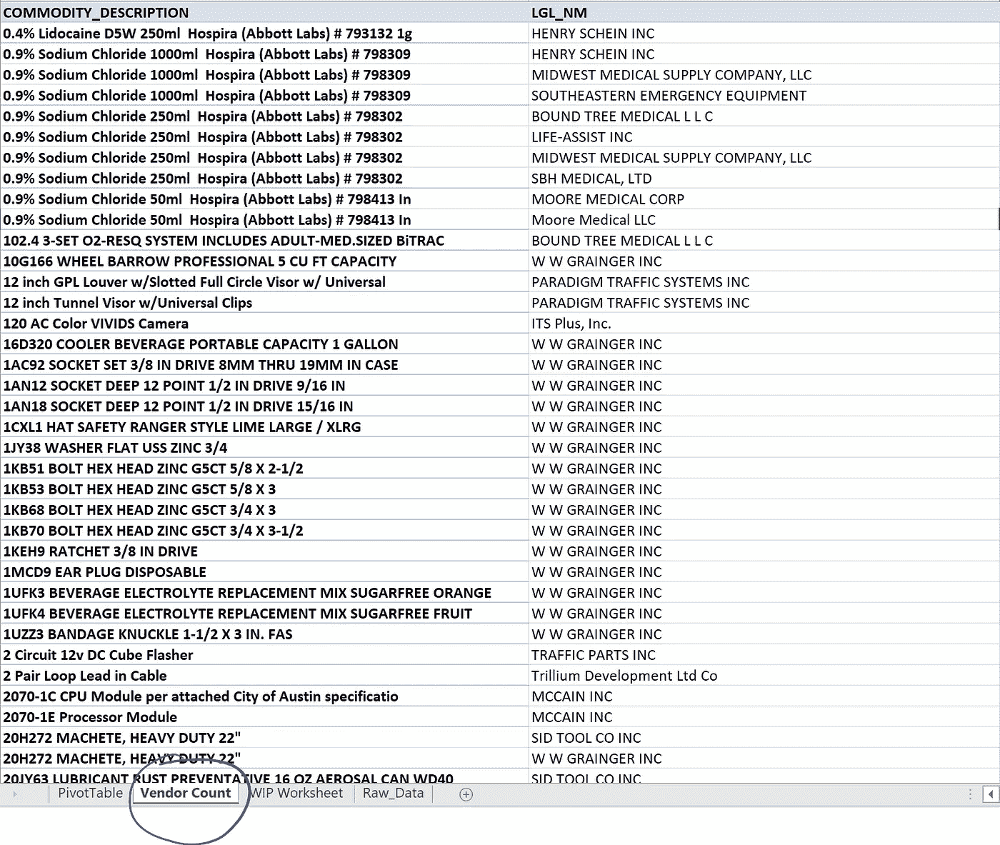

现在，让我们开始*计数。*我们将使用此表来最终统计每种商品描述的供应商数量。导航回我们的“Raw_Data”工作表，在“供应商数量”列(我们之前插入的那个)中，使用 *COUNTIF* 公式。由于 *COUNTIF* 函数需要一个数据范围，我们将使用新的“供应商计数”工作表中的数据范围。下面是这样做的公式:

> =COUNTIF('供应商计数'！$A$1:$B$13412，Raw_Data！B2)

*其中 A1 表示 A 列(包含“商品 _ 描述”)，B 列表示“供应商数量”工作表中供应商的法定名称。Raw_Data！B2 暗示到原始数据工作表中的 B 列(包含“商品描述”)。*

将此公式(将在 Y 列中输入)拖动到“*raw _ data”*工作表中的最后一个单元格。完成后，“*供应商编号”*栏应如下图所示。我们最终获得了每种商品描述的供应商数量信息。搞定了。

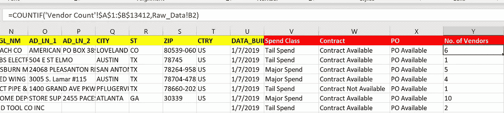

## 供应商类别

这是我们在本章中增加的少数几个栏目之一。让我们创建一个新列，并将其标记为“供应商类”。如第 2 章所述，我们将进一步将该供应商分为 3 类(如下所述),以帮助我们进行分析。由于我们已经计算了每种材料描述的供应商数量，我们可以将它们分为以下类别之一:

*a.)* ***单个供应商*** *(其中供应商计数为 1)*

*b.)* ***在 1 到 5 之间*** *(其中供应商数量在 1 到 5 的范围内)*

*c.)* ***超过 5 个*** *(其中厂商数大于 5)*

注意:我选择了 5 个供应商作为我的上限。可以根据商品行情适当选择自己的上限。

下面是填充“*供应商类别”*列的公式:

> =IF(Y2=1，“单一供应商”，IF(AND(Y2>1，Y2<5)，“介于 1 和 5 之间”，“大于 5”))

*其中 Y2 表示“raw_data”工作表中的 Y 列(包含“供应商数量”)。这里我们使用了一个 IF 条件。逻辑是针对供应商值的数量为 1 的情况，写“单一供应商”。对于供应商数量值介于 1 和 5 之间的情况，填写“介于 1 和 5 之间”,对于所有其他情况，在“供应商类别”栏中填写“大于 5”。*

将此公式(将在“*供应商类别*列中输入)拖至“*raw _ data”*工作表的最后一个单元格。完成后，“*供应商类”*列应该如下图所示。搞定了。

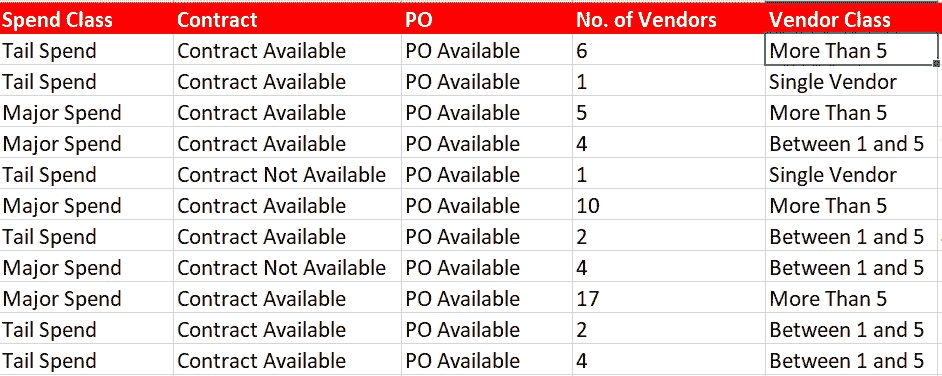

## 位置数量

类似于卖方编号，我们现在也需要计算“*POs*编号”列。让我们在我们的*“raw _ data”*工作表中添加一个新列，并将其标记为*“位置编号”。*通过我们在第 2 章中的初步分析，我们现在必须知道，我们的数据集中的每个行项目都有一个 PO。我们还有许多订单字段为空的行项目，因此我们在“ *PO* ”栏中填写了“ *PO 不可用*”。

计算*【位置号】*的逻辑很简单。我们必须计算商品项目描述字段在数据集中出现的次数。这是假设我们每个行项目都有一个采购订单，并且它是唯一的。在所有实际场景中，情况可能是这样，也可能不是这样。如果您遇到这种情况，我建议您遵循我们在“*供应商*编号”栏中采用的方法。

回到我们的数据集，使用 *COUNTIF* 函数计算一个商品描述在数据集中出现的次数是相当容易的。但是，我们必须减去数据集中“ *PO 不可用”*的情况。为了总结这一逻辑，我们必须做到以下几点:

> (商品描述出现的次数)——(该商品描述出现 PO 不可用的次数)

为此，我们将使用 ***COUNTIFS*** 函数，而不是使用***COUNTIF****f*函数。以下是填充“*位置编号”*列的公式:

> = COUNTIFS(＄B＄2:＄B＄72854，B2，＄X＄2:＄X＄72854，“PO Available”)

*B2 暗示到“原始数据”工作表中的 B 列(包含“商品描述”)，X2 暗示到 X 列(包含“采购订单”和采购订单可用值&采购订单不可用值)。通过选择“PO Available”过滤器，我们将得到同时满足两个条件的结果，即商品描述在数据集中出现的次数以及 PO Available 的条件。*

将该公式(输入到栏的*号中)拖动到“*raw _ data”*工作表的最后一个单元格。完成后，“*POs 号”*栏应如下图所示。搞定了。*

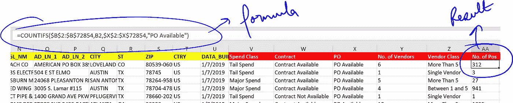

## 采购订单类别

与“*供应商类别”*栏类似，我们将“*订单编号”*信息进一步细分为 3 个类别(如下所述)，以帮助我们进行分析。由于我们已经计算了每种材料描述的采购订单数量，我们可以将它们分为以下类别之一:

*a.)* ***单个采购订单*** *(一次性采购:其中采购订单数为 1)*

*b .)****1 到 12 之间*** *(采购订单数量在 1 到 12 范围内的现货订单)*

*c.)* ***超过 12 个*** *(高频 POs:其中 PO 计数大于 12)*

我们的主要目标是找到高频 POs，以便进行整合。

注意:我将“*高频 POs”*定义为每月至少 1 个 PO(因此每年 12 个 PO)。您可以根据您的初步数据分析来更改该数字。

现在我们已经定义了我们的段，下面是填充“PO*Class”*列的公式:

> =IF(AA2=1，“单个采购订单”，IF(AND(AA2>1，AA2 <12),”Between 1 and 12",”More Than 12"))

*其中 AA2 表示“原始数据”工作表中的 A 列(包含“采购订单数量”)。这里我们使用了一个 IF 条件。逻辑是针对 PO 值的数量为 1 的情况，写“单个 PO”。对于采购订单数量介于 1 和 12 之间的情况，请填写“介于 1 和 12 之间”,对于所有其他情况，请在“采购订单类别”栏中填写“大于 12”。*

将此公式(将输入到“*采购订单类别*列中)拖动到“*raw _ data”*工作表中的最后一个单元格。完成后，“*PO Class”*列应该如下图所示。搞定了。

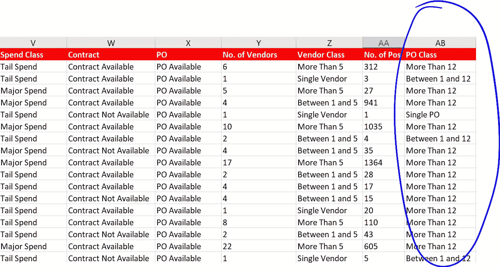

## 结论

全部完成！我们在准备数据集方面走过了漫长的道路。事实上，我们现在都准备好开始我们的切块和切片！在下一章，你将会看到，我们如何从所有这些艰苦的工作中获得益处！

# 第 04 章

让我们从理解现有数据开始。然后，我们将通过解决 ***【隐藏的尾巴】*** 问题，深入分析我们的第一个大的成本节约机会。

 [## 尾部支出中最大但经常被忽略的部分是什么？隐藏的尾巴！第 04 章

### 第四章:隐藏的尾巴。找到并修复它。

medium.com](https://medium.com/procurementintel/tail-spend-analysis-chapter-04-hidden-tail-4e5fdda97194) 

我很感激你的评论，这样我可以进一步改进这些课程。

*对于即将到来的采购课程的简短总结，您可以随时*

*订阅我的刊物:*[**【https://medium.com/procurementintel】**](https://medium.com/procurementintel)

*在 LinkedIn 上关注我:*[***https://www.linkedin.com/in/gsrm/***](https://www.linkedin.com/in/gsrm/)