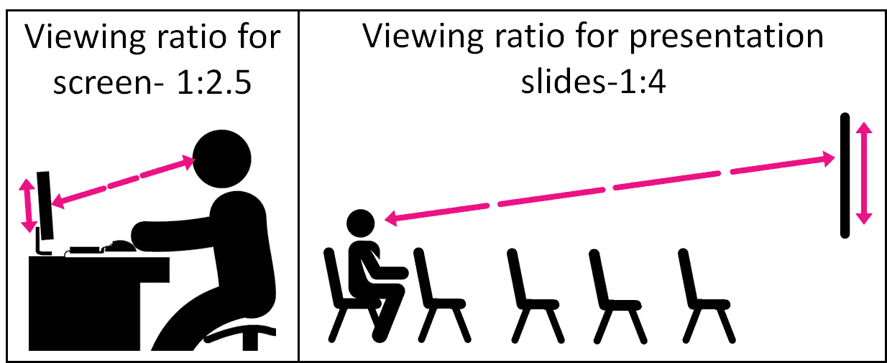
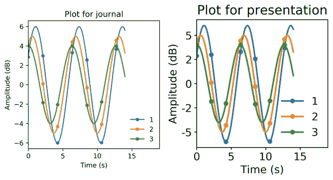

# 轻松定制用于论文和演示的图表

> 原文：<https://towardsdatascience.com/tailor-figures-for-papers-and-presentations-63cd37228312?source=collection_archive---------79----------------------->

## 不要让你的观众斜视


在合适的场合使用合适的尺寸。杰西卡·鲁斯切洛在 [Unsplash](https://unsplash.com?utm_source=medium&utm_medium=referral) 上的照片

你有没有坐在演示文稿中眯着眼睛看幻灯片，努力阅读带有微小文字的图表？或者更糟的是，在海报上看到一个模糊的身影，让人无法看清坐标轴？人们经常倾向于在不同的媒体上复制相同的数字，如网站上的文章、演示幻灯片、期刊文章(pdf 文档)，导致不愉快的用户体验。让我们变得更好。

在这篇文章中，你会学到-

1.  为什么要修改每种媒体的数字
2.  如何用一行代码轻松修改它们

我分享的例子是用 python 写的，但是我提供了用 R 和 Matlab 复制相同方法的资源。

## 适用于屏幕的东西不适用于幻灯片



演示文稿和论文/网络文章之间的距离与屏幕大小的比率不同。来自 svgrepo.com[和 clipartmax.com](https://www.svgrepo.com/svg/3858/man-in-office-desk-with-computer)和[的作品](https://www.clipartmax.com/middle/m2i8G6m2K9Z5N4K9_188-workplace-ethics-icons-working-people-icon-png/)

人们在准备演示时最常犯的错误是使用他们在网上/杂志文章中使用的相同数字。这是错误的，因为人们从不同的感知距离观看文章和演示。当一个人从 2.5 英尺外的约 [1 英尺屏幕上阅读文章时，他们从 40 英尺外的约](https://www.osha.gov/SLTC/etools/computerworkstations/components_monitors.html) [10 英尺屏幕上观看演示。](https://www.projectorscreen.com/projector-screen-calculators)

这意味着一个在计算机屏幕上看起来可读的图形在投影到幻灯片上并从房间的最后一排观看时可能是不可读的。因此，图形元素必须放大。**根据经验，如果您正在笔记本电脑上制作图表/图形，但想将其包含在演示文稿中，请后退一步，检查图形是否可读。**如果没有，放大注释并加厚线条/点，然后重试。

然而，为每个图形手动地做这件事，或者每次你想要转换你的图形是乏味的。我们如何实现自动化？

## 介绍样式表

样式表是自动获取几个样式命令的简单方法。本质上，它们包含了改变不同元素的默认样式参数的指令，如图形大小、线条宽度等。尽管 matplotlib 和[一起提供了几个预制的样式表](https://matplotlib.org/3.1.1/gallery/style_sheets/style_sheets_reference.html)，但是它们中的大部分都专注于美学而不是绘图媒介。

要为不同的媒体创建自己的样式表:

1.  在 python 中输入“matplotlib.get_configdir()”找出 matplotlib 的配置目录。
2.  转到该目录，并在其中创建一个名为“stylelib”的目录
3.  在 stylelib 目录中为每个带扩展名的绘图介质创建新的样式表。mplstyle”(例如“presentation.mplstyle”)。该文件的内容将在本文后面解释。
4.  你都准备好了！从现在起，您只需输入以下内容，就可以根据您的图形的预期目的使用所需的样式:

```
plt.style.use(’presentation’) 
# for producing figures for your presentation slides
```

如果你是一个 R 用户，你可以使用[级联样式表包](https://cran.r-project.org/web/packages/Rcssplot/vignettes/Rcssplot.pdf)跟随这篇文章。如果你是一个 Matlab 用户(我很同情)，你可以创建自定义。使用本博客末尾提到的命令将 m 文件作为样式表。至此，让我们学习不同的媒体使用什么样的风格参数。

## 文章和论文的样式表

我们大部分的数字制作实践都是为文章和论文量身定制的，因为我们在创建它们的同一距离上观察它们。因此，当你创建一个图形时，只要看起来不错，在发布时就应该足够了。

我使用下面的样式表为我的在线文章创建图表(我的“article.mplstyle”文件的内容):

```
lines.linewidth : 1.5
lines.markersize : 4   
figure.figsize: 3.54,3.54
figure.dpi: 200
font.size: 10.0
axes.titlepad: 6.0
axes.linewidth : 0.8
legend.frameon: False
xtick.major.width : 0.8
ytick.major.width : 0.8
```

对于期刊论文，由于期刊之间的差异，我不会自己调整风格。相反，我使用的是 [plotsettings](https://pypi.org/project/plotsettings/) ，这是一个专门为此构建的 python 包——根据每个期刊的规则自动裁剪数据。

## 演示文稿的样式表

为了演示，我加厚线元素，放大标记元素，提高分辨率，并将文本元素放大 1.5 倍。这大致与观看比率成比例(4/2.5 ~ 1.5)，并确保我在笔记本电脑上创建的图形在投影仪上从最后一行观看时看起来相同。我使用下面的样式表为我的演示文稿创建图表(我的“presentation.mplstyle”文件的内容):

```
lines.linewidth : 2.25
lines.markersize : 6   
figure.figsize: 3.54,3.54
figure.dpi: 300 
font.size: 16.0
axes.titlepad: 8.0
axes.linewidth : 1.1
legend.frameon: False
xtick.major.width : 1.1
ytick.major.width : 1.1
```

比较两个样式表产生的输出，差异是显而易见的:



使用两种不同的样式表比较同一个数字。图片作者。

最后，除了调整大小之外，还有许多其他的调整可以让你的数字在演示文稿中更具可读性。你可以减少显示的数据量，使用容易在投影仪上渲染的颜色，等等。在这篇精彩的 [PLOS 文章](https://journals.plos.org/ploscompbiol/article?id=10.1371/journal.pcbi.1003833)中可以找到这样的提示。

## 我们学到了什么？

1.  善待你的读者，避免在你的文章、论文和演示中使用相同的数字
2.  样式表是为每种媒体定制图形的简单方法
3.  我的 matplotlib 样式表可以在[这里](https://github.com/kkraoj/tailor_figures)找到
4.  一旦创建并保存了样式表，就可以通过键入- plt.style.use(" <style-name>")来快速使用它们</style-name>

有没有其他方法可以根据不同的媒介来裁剪人物？在下面留下回应。