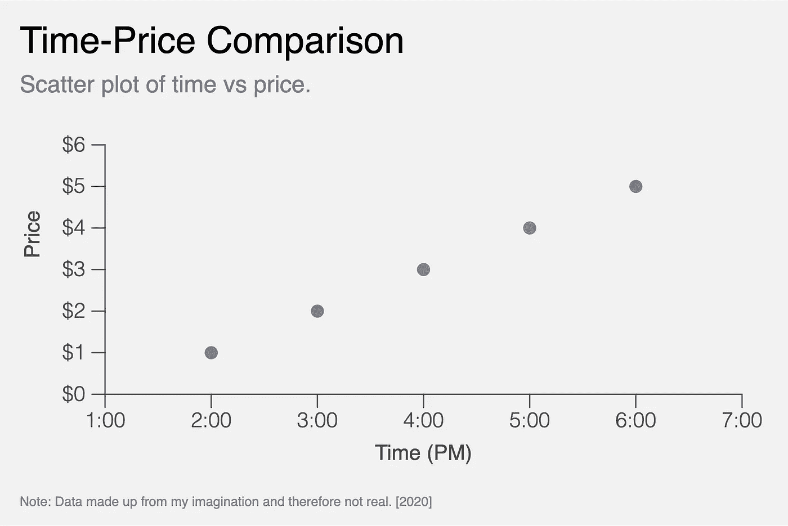

# 用 Jinja 完全控制你的 Python 情节

> 原文：<https://towardsdatascience.com/take-full-control-of-your-python-plots-with-jinja-15496a7ebf1d?source=collection_archive---------26----------------------->

## 使用 SVG 和 Jinja 在 Python 中创建完全自定义的绘图


照片由[艾萨克·史密斯](https://unsplash.com/@isaacmsmith?utm_source=medium&utm_medium=referral)在 [Unsplash](https://unsplash.com?utm_source=medium&utm_medium=referral) 拍摄

你是否曾经花了太多的时间挖掘文档，试图让你的图看起来像你想要的那样？下一次，考虑放弃 matplotlib 或 seaborn，使用`Jinja`创建一个自定义的绘图。

Jinja 是一种 Python 模板语言，基于 Django 模板，你可能从 Flask 或 Airflow 等其他包中熟悉它。它有很多有用的功能，但你只需要一些基础知识就可以开始了。

在 Jupyter 中，您可以使用 Jinja 将您的视图制作成 SVG(工作流程与 D3 非常相似)并显示它们。

# 一些基本的 SVG

在我们进入正题之前，让我先介绍一些基础知识。SVG 代表*可缩放矢量图形*，这意味着所有图像数据都存储为矢量空间中的点，因此可以在不进行像素化的情况下调整大小(不像*光栅*图像)。

SVG 是基于 XML 的，有许多不同的标签，代表不同的路径和形状。一些关键标签是:

*   `circle`:使用 *xy* 坐标和半径画一个圆
*   `rect`:使用左上角的 *xy* 坐标加上*宽度*和*高度*绘制矩形
*   `polyline`:画一条连接 *xy* 点的路径
*   `text`:绘制文本

每个 SVG 元素都有自己可以更改的属性，但是大多数元素都有共同的属性来控制*填充*和*笔画。*

创建 SVG 时要记住的另一个关键点是， *xy* 坐标从*左上角*的 *(0，0)* 开始，随着向*右下角*移动而增加。

关于使用 SVG 的更多信息，请查看 Mozilla 的参考资料[这里](https://developer.mozilla.org/en-US/docs/Web/SVG/Tutorial/Introduction)。

现在到金贾…

# Jinja 模板的(迷你)介绍

Jinja 的模板有很好的特性，比如循环、条件和模板继承，这只是皮毛；有大量的功能。

下面是一个 Jinja 模板的基本示例:

```

  Hello, {{ name }}, welcome to {{ place }}!

```

如果你用`names = ["tim", "sue", "tom", "sally"]`和`place = "my party"`渲染模板，你会得到…

```
Hello, tim, welcome to my party!
Hello, sue, welcome to my party!
Hello, tom, welcome to my party!
Hello, sally, welcome to my party!
```

更多关于 Jinja 模板的信息，请查看[文档](https://jinja.palletsprojects.com/en/2.11.x/templates/)。

现在，让我们继续建立一个金贾的阴谋。

# 与金佳密谋

让我们使用 Jinja 用一些示例数据制作一个简单的演示散点图。

首先，这里是我将在模板中使用的数据和一些基本布局信息:

用于绘图的数据和布局信息。

现在让我们制作模板，它将是 SVG 的 XML 风格标记和特殊 Jinja 命令的混合:

让我们假设我们的模板作为一个字符串存储在变量`plot_template`中。

现在我们可以使用我们的 *plot* 和 *layout* 数据渲染模板，代码如下:

下面是作为 svg 的渲染图:

以下是作为参考的 png:



使用 Jinja 在 Python 中创建的 SVG 演示图

对于完整的代码，检查要点[在这里](https://gist.github.com/a-poor/173f0d190634065bfd7ad73eb882e637)。

# 结论

如果你只是做 EDA 调用`plt.scatter(x,y)`仍然是一条路要走，但如果你想能够完全定制你的情节，尝试使用 Jinja。启动可能需要更多时间，但您的模板很容易重复使用，并且您不会受限于您的绘图库所支持的绘图。

SVG 的另一个巨大好处是能够从另一个 SVG 复制路径，并将其合并到您自己的路径中。例如，如果您想将散点图中的点更改为您公司和竞争对手的徽标，您只需下载 SVG 徽标，并用徽标路径替换模板中的圆圈。

*感谢阅读！我很想知道你对这项技术的看法——如果你有任何意见或建议，请告诉我！*