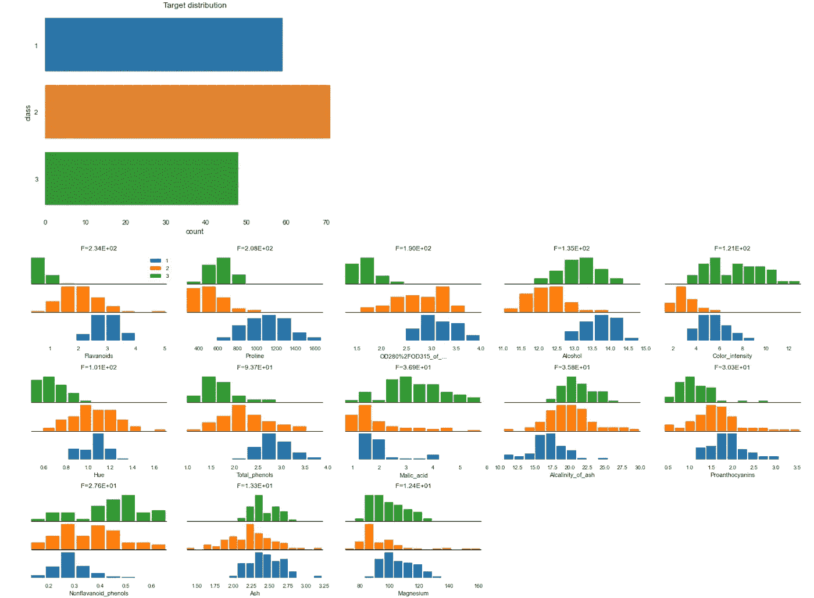

# 为机器学习消除数据清理的痛苦

> 原文：<https://towardsdatascience.com/take-the-pain-out-of-data-cleaning-for-machine-learning-20a646a277fd?source=collection_archive---------28----------------------->


[摄](https://unsplash.com/@thecreative_exchange?utm_source=unsplash&utm_medium=referral&utm_content=creditCopyText) [Unsplash](https://unsplash.com/s/photos/cleaning?utm_source=unsplash&utm_medium=referral&utm_content=creditCopyText) 上的创意交流

## …有了这四个 python 库

根据 Anaconda 最近的 [**2020 年数据科学状态**](https://www.anaconda.com/state-of-data-science-2020) 调查，这是一个很好的阅读，顺便说一下，大多数数据科学家 66%的时间仍然花在数据加载、清理和可视化上。

现实世界的数据集总是杂乱无章。包含缺失值和错误值、分类数据和缩放不当的变量。在我们可以使用这些数据来建立机器学习模型之前，数据科学家必须(通常是煞费苦心地)分析数据，以确定要应用的适当预处理技术。然后花更多时间执行这些数据清理和转换任务。

幸运的是，目前有开发人员正在研究这个问题的解决方案。在本文中，我将介绍四个开源 Python 库，它们使数据准备过程更容易、更健壮。

# 1.熊猫简介

pandas-profiling 库是一个工具，它允许您快速了解数据集的质量，并在一行代码中计算基本的统计数据。这个包有一个名为`ProfileReport`的函数，默认情况下它会加载一个给定数据集的探索性摘要。

该软件包可以通过 pip 安装。

```
pip install pandas-profiling[notebook]
```

让我们加载一个数据集，并在 Jupyter 笔记本中运行标准 profile 报告。

配置文件报告显示如下所示。


# 2.Dabl

[Dabl](https://amueller.github.io/dabl/dev/quick_start.html) 由 Scikit-learn 项目的核心开发者之一 Andreas Muller 开发，是一个数据分析库，旨在使机器学习项目的数据探索和预处理部分变得更加容易。

Dabl 可以通过 pip 安装。

```
pip install dabl
```

Dabl 有一个内置的功能，可以自动检测数据类型和质量问题，并对数据集进行适当的预处理，为机器学习做准备。这包括执行诸如处理缺失值和将分类变量转换为数值之类的任务。

```
data_clean = dabl.clean(data)
```

Dabl 库也有许多用于快速数据浏览的内置可视化功能。简单地在数据集上调用 `dabl.plot()`将产生下面的一组图表。

```
dabl.plot(data, 'class')
```



# 3.动力操作研究机构（dynamic operators research apparatus 的缩写）

[Dora 库](https://github.com/NathanEpstein/Dora)是另一个数据分析库，旨在简化探索性数据分析。

该软件包还包括用于清理、转换和可视化浏览数据集的实用工具。尽管它有别于其他类似库的一个特性是它的数据版本控制能力。

Dora 提供了一个简单的接口，可以在转换数据集时获取数据集的版本或快照。它还保留了所做更改的日志，以便您可以轻松地跟踪转换。

Dora 可以通过 pip 安装。

```
pip install Dora
```

下面的代码演示了如何使用这个库来执行数据清理、预处理、数据版本控制和跟踪数据的变化。

# 4.漂亮的熊猫

[Pretty pandas](https://prettypandas.readthedocs.io/en/latest/quickstart.html) 旨在与核心 pandas 库一起工作，为您的数据提供一种创建“漂亮”汇总表的简单方法。这在与其他人共享数据时尤其有用，比如项目中的利益相关者。

要安装 run。

```
pip install prettypandas
```

在下面的代码中，我们用漂亮的熊猫给数据集的汇总视图添加一个总平均值。


我们距离解决作为机器学习项目的一部分，需要在数据准备上花费多少时间的问题还有很长的路要走。这部分是由于现实世界中数据的高度可变性，因此这是一个难以自动化的过程。然而，本文中讨论的库在某种程度上减轻了这项耗时任务的痛苦。

感谢阅读！

[**我每月发一份简讯，如果你想加入请通过这个链接注册。期待成为您学习旅程的一部分！**](https://mailchi.mp/ce8ccd91d6d5/datacademy-signup)