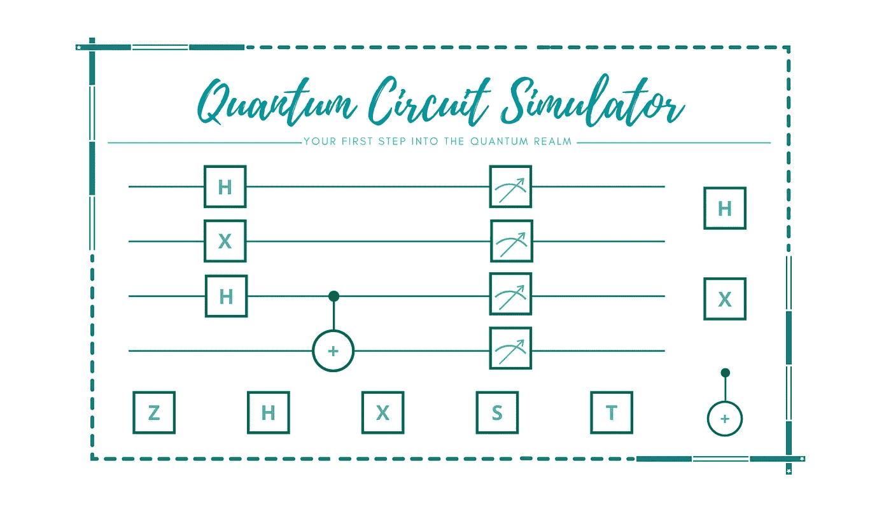
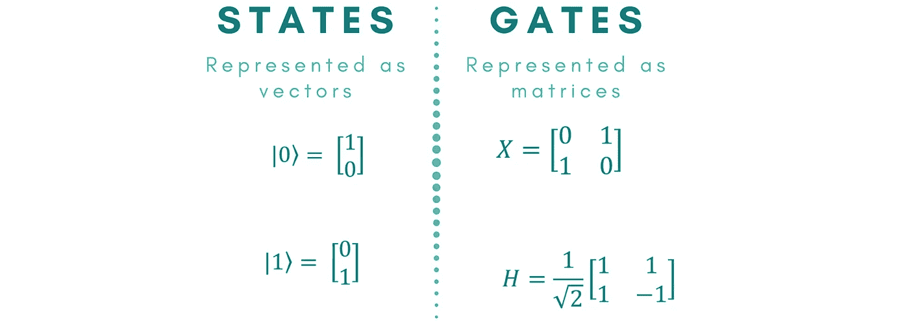
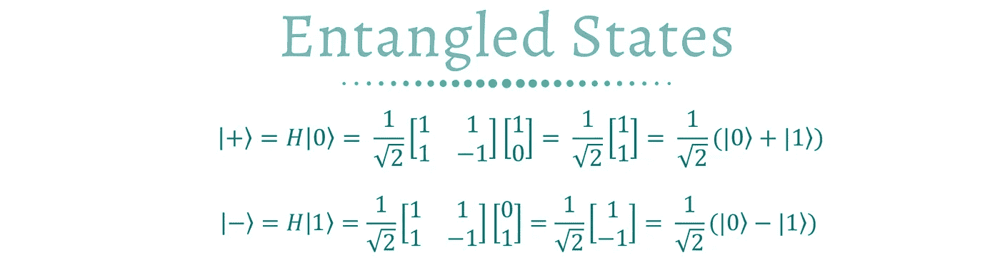
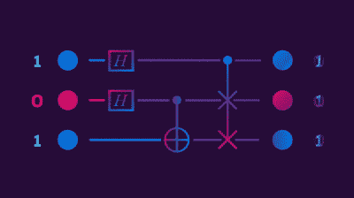
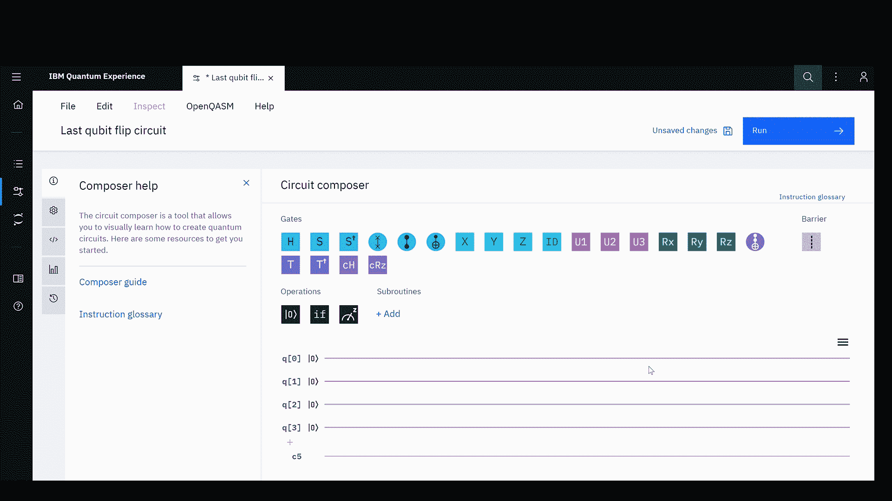
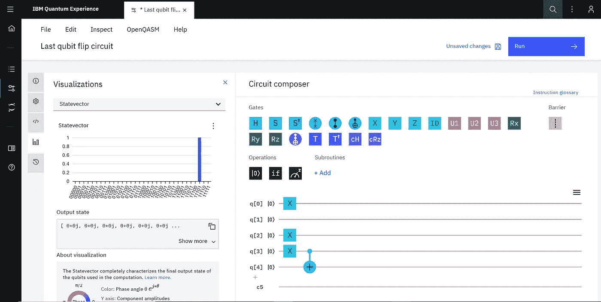
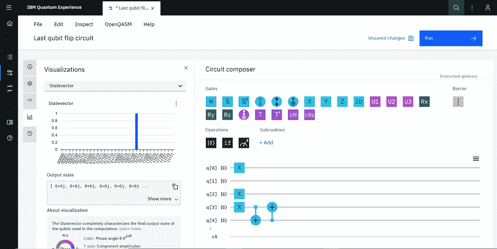
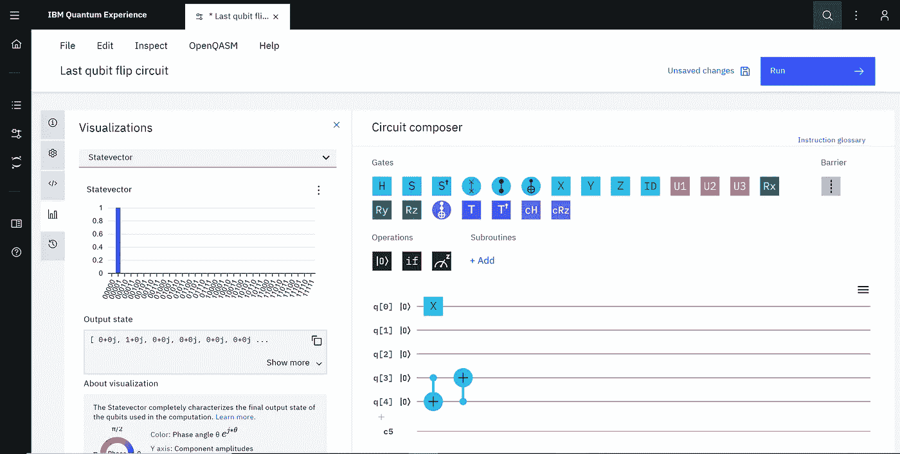

# 向量子领域迈出第一步

> 原文：<https://towardsdatascience.com/take-your-first-step-into-the-quantum-realm-a13e99fab886?source=collection_archive---------34----------------------->

## 你的想法太经典了

## 量子门和量子电路导论

作者使用 [Canva](https://www.canva.com/)

开始使用量子计算可能看起来令人生畏，如果你在网上搜索 start，你可能会得到和我第一次开始使用量子计算时一样的结果。我到处都在说，要开始，我需要有一些关于量子物理学、量子力学和基本线性代数的知识。一旦我这样做了，我需要学习如何使用 Qiskit (Python 库来编程量子计算机)或另一种编程工具来开始构建量子电路和实现量子算法！不要让我开始需要学习量子算法是如何工作的！

事情变得非常复杂非常快，这可能是相当令人沮丧的！😖

但是…

如果我告诉你，你可以开始构建量子电路，只需要基本的量子门的基本知识，不需要任何类型的编码，会怎么样？

是🤩

你没看错；我们将在不使用任何代码的情况下构建量子电路。

做到这一点的方法是使用一种叫做量子电路模拟器的特殊工具。要使用这些工具中的任何一个，你只需要知道量子计算的三个基础的定义，量子位，叠加和纠缠，以及一些基本的量子门是做什么的。

我们将从量子计算的基础开始:

1.  ***量子位:*** 量子计算中数据的基本单位。一个量子位可以处于|0⟩态或 state|1⟩态，或者是两种态的叠加态。
2.  ***叠加:*** 一个术语，指一个物理系统同时以两种状态存在。
3.  ***纠缠:*** 当两个或两个以上的量子比特共享一个特殊的连接时。

你可以在我的文章“量子计算的三大支柱”中找到关于量子位、叠加和纠缠的更深入的信息

 [## 量子计算的三大支柱

### 理解量子计算机如何工作的基础

medium.com](https://medium.com/digital-diplomacy/the-three-pillars-of-quantum-computing-d80ff5f50ec7) 

现在你已经知道了量子计算的基本原理，我们可以开始谈论基本的量子门，然后开始使用它们构建一些电路。

# 量子门

外面有许多量子门；一旦你完全理解了基本的，你甚至可以创建你的自定义门。量子门是量子电路的组成部分。它们是在一个或多个量子位上执行特定功能的操作符。它们是经典逻辑门的量子等价物，如今被用于所有技术中。然而，与大多数经典逻辑门不同，量子门是可逆的，这意味着你可以通过重新应用相同的量子位来撤销它们的影响。

数学上，量子门是用酉运算来表示的。酉运算就是方阵(行数和列数相等的矩阵)。另一方面，量子位的状态被表示为一个向量。从几何学的角度来说，向量通常有一个振幅和一个相位来表示它在空间中的三维位置。要找出对任何状态的量子位元应用闸的结果，我们只要用闸的矩阵乘以量子位元的状态向量。

作者使用 [Canva](https://www.canva.com/)

我们现在开始讨论单量子比特量子门。这些门一次只能控制一个门。这些门可以扩展到运行更多的量子位，我们很快就会看到。在本文中，我们将介绍六种基本的量子门:身份门、哈达玛门、泡利(X、Y 和 Z)门和受控非门。

## 1-身份大门

身份门(符号为 **I** )是一个单量子位门，它保持量子位的状态不变。这可能看起来没用，我是说，为什么我们会有一个什么都不做的门？I 门有用有两个原因:

*   它通常用于数学计算，以证明门是可逆的。
*   在实际硬件上执行 gate 时，这是很有用的。这是一种精确地告诉它什么都不做或者什么都不做的方法。

作者使用 [Canva](https://www.canva.com/)

## 2-非门

非门( **X** )是一个单量子位门，它翻转它所操作的量子位。如果我们给它|0⟩，它会返回一个|1⟩，如果我们给 it|1⟩，它会返回一个|0⟩.在具有许多叠加态的应用中，该门用于将特定态与整体态隔离开来。

作者使用 [Canva](https://www.canva.com/)

## 3-哈达玛门

哈达玛门(H)是魔法之门🌟。它是负责创造叠加态的门。不管输入态是不是|0⟩ or|1⟩.，这个门都将量子位置于|0⟩和|1⟩态的 50/50 叠加态 H 门可能是最重要的量子门，它是许多量子算法的基本构件。

作者使用 [Canva](https://www.canva.com/)

如果给 h 门一个|0⟩作为输入态，它将产生一个叠加态，量子人们称之为正态|+⟩.如果我们给 h 门一个|1⟩态，它会产生负态|–⟩.

作者使用 [Canva](https://www.canva.com/)

## 4-Y 门

Y 门和 X 门类似，也是翻转门。然而，这些门之间的区别在于，y 门翻转状态|0⟩，然后将结果乘以一个虚数 ***j*** (给它增加一个相位)。这种额外的相位变化使得该门对于创建某些算法中使用的特定相长/相消干涉非常有用。

作者使用 [Canva](https://www.canva.com/)

## 5-Z 门

Z 门也是翻转门；然而，这个门不会翻转状态的值；相反，它会翻转相位。这个门在将 state|1⟩的相位乘以-1 时保持 state|0⟩振幅不变。

z 门的力量来自于它只影响|1⟩州而不影响|0⟩。这个门经常被用来突出显示系统中的一些状态，而保持其他状态不变。

作者使用 [Canva](https://www.canva.com/)

我们刚刚走过的所有单门量子位都可以通过添加控制和目标量子位扩展到受控门。这种工作方式的一个例子是受控非门。

## 6-受控非门

受控非(CX 或如图所示的 GIF)门是我们第一个操作两个量子位的门。这个门是一个条件门，当且仅当第一个量子位(控制量子位)的状态是|1⟩.时，它对第二个量子位(称为目标)执行 x 门结合其他的门，CX 门将允许我们构造各种多量子比特操作。

作者使用 [Canva](https://www.canva.com/)

好了，现在我们已经了解了基础知识，让我们来谈谈如何使用这些门——以及更多——来构建一个量子电路。我们将使用量子电路模拟器。

# 量子电路模拟器

[动作 gif](https://makeagif.com/action-gifs)中 [FrOOtLooP](https://makeagif.com/user/FrOOtLooP) 的图片

量子电路模拟器是一种特殊的工具，允许你建立和模拟量子电路，而不需要写任何代码或执行任何数学技巧！由于量子计算是一个正在进行的研究领域，新的工具经常被开发出来，以帮助人们熟悉量子门和量子电路，并为量子时代的到来做好准备。最好、最简单的基于浏览器的产品(无需安装😁)量子电路模拟器，在我看来是:

1.  [IBMQ 体验](https://quantum-computing.ibm.com/composer) : IBM 提供了一个拖放式电路编辑器，允许您构建电路并查看结果。
2.  [Quirk](http://algassert.com/quirk) : Quirk 是一个拖放式量子电路模拟器，运行在你的浏览器中。这个工具是由谷歌软件工程师[克雷格·吉德尼](https://twitter.com/craiggidney?lang=en)开发的。
3.  [QUI](https://qui.research.unimelb.edu.au/#tabmain) : QUI 是一个编程和模拟环境，旨在让用户可视化和理解量子算法的内部工作原理。

在本文的其余部分，我将使用 IBMQ circuit composer 来模拟两个简单的电路。然而，你可以使用上面的任何模拟器来实验量子电路。

## 熟悉 IBMQ Circuit Composer

一旦打开 IBMQ Circuit Composer，您将看到这个屏幕:

[IBMQ 电路设计器](https://quantum-computing.ibm.com/composer/)

你可以通过简单的拖放来给特定的量子位设置门。如果你需要更多的量子位，你可以点击最后一个量子位下面的小+号，这将为电路增加一个量子位。您可以通过点击量子位并按下键盘上的 DELETE 键来删除量子位。在右侧，您可以看到一个条形图，显示电路的最终状态。空电路有一个状态|0000⟩.每次添加一个门，产生的状态都会相应地改变。

# 我们的第一个量子电路

我们现在准备建立我们的第一个量子电路！让我们从一个简单的开始。

假设我们想要创造一个电路，只要它是 1，就翻转任何给定状态的最后一个量子位。例如，|1011⟩会变成|1010⟩，因为最后一位是 1。然而，如果输入状态是|1100⟩，电路不会做任何改变，将返回相同的状态。我如何才能做到这一点？

最初，所有的量子位都被设置为|0⟩状态，所以我们需要创建起始状态，例如，首先是|1011⟩状态，然后应用一些门来翻转该状态的最后一位。

在我们开始之前，状态通常是从右向左读取的，在 composer 中是从上到下。

**步骤 1:** *创建 starting|1011⟩状态*

为了创建|1011⟩态，我们需要将 x 门应用于量子位 q[0]、q[2]和 q[3]，如下面的视频所示。

**第二步:** *翻转最后一个量子位。*

为了翻转最后一个位元，我们会在电路中再加入一个量子位元。这个额外的量子位将作为控制量子位。首先，只有当电路的最后一个量子位是 1 时，我才需要这个量子位处于|1⟩状态；否则，它将在|0⟩.这可以通过在 q[3]和 q[4]上使用 CX 门来实现。

如你所见，现在的结果是|10111⟩；我们可以忽略最后一个，因为它是我们刚刚添加的一个额外的量子位，以帮助我们实现我们的目标。也就是说我们的状态还是没变。接下来，我们将使用 q[4]作为另一个 CX 门的控制，并使用它来翻转 q[3]。

现在，我们得到的状态是|10101⟩，没有 q[4]，它将是|1010⟩，这是我们想要的结果！耶！

但是，如果我输入最后一个量子位等于 0 的状态呢？让我们看看会发生什么！如果我们将状态|1000⟩输入到电路中，产生的状态将与我们的输入状态相同。

耶！你刚刚建立了你的第一个量子电路，没有进入量子力学或者写代码！👏

如果你知道如何使用电路模拟器工作，你可以建立任何电路，一旦你足够舒适，你可以开始使用代码来创建你的电路，因为你深入到量子领域。

# 参考

[1] Brylinski，J. L .，& Brylinski，R. (2002 年)。通用量子门。*量子计算的数学。*