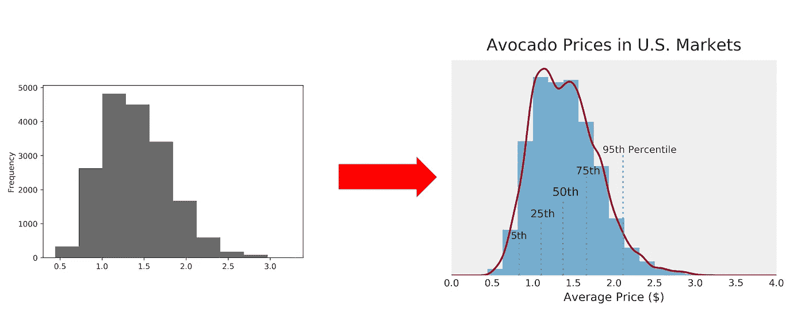
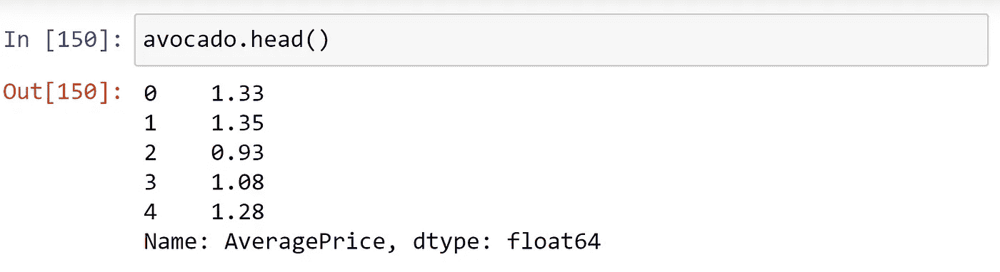
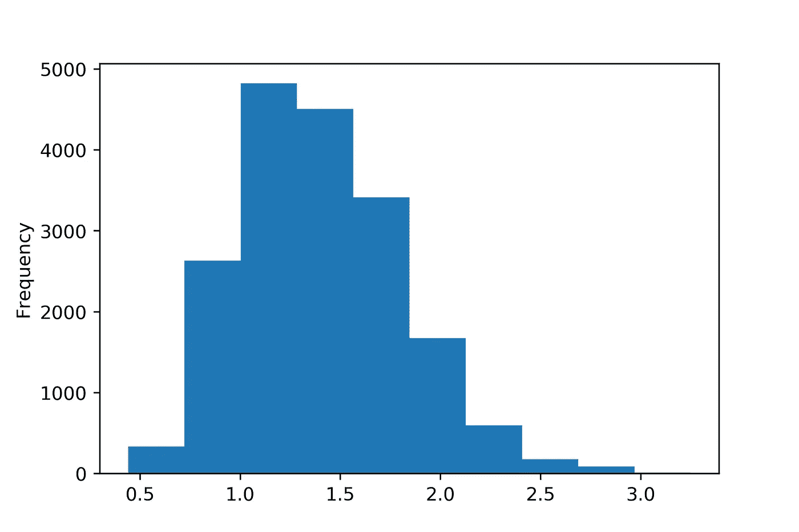
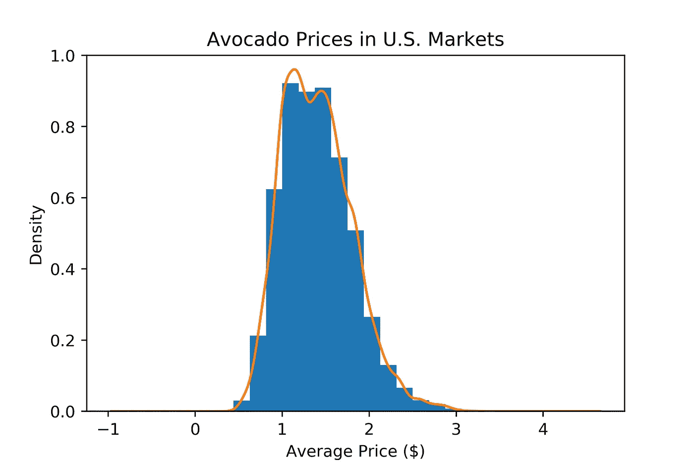
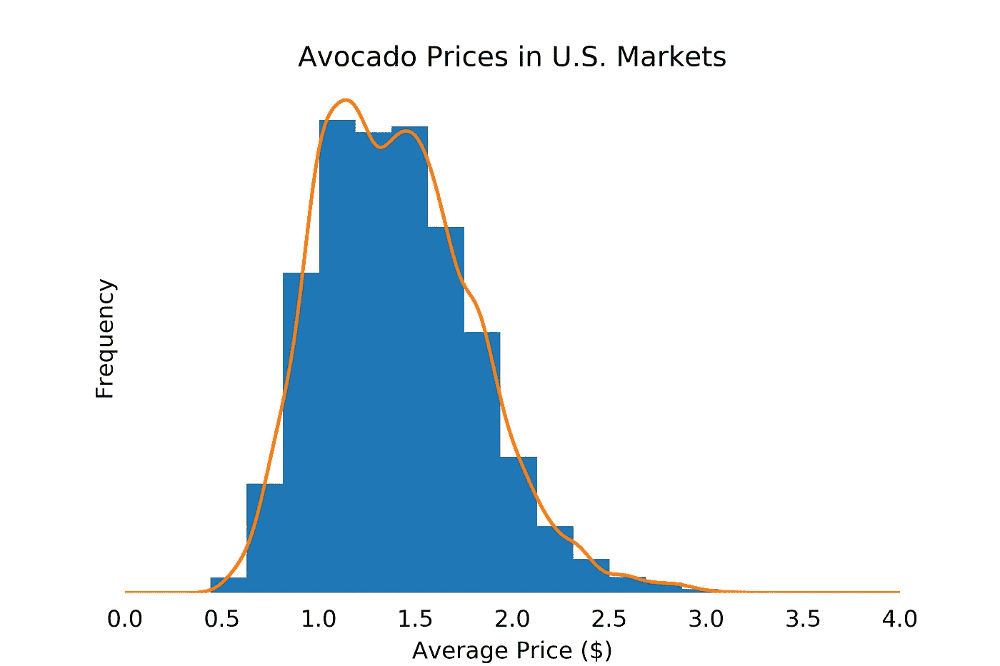
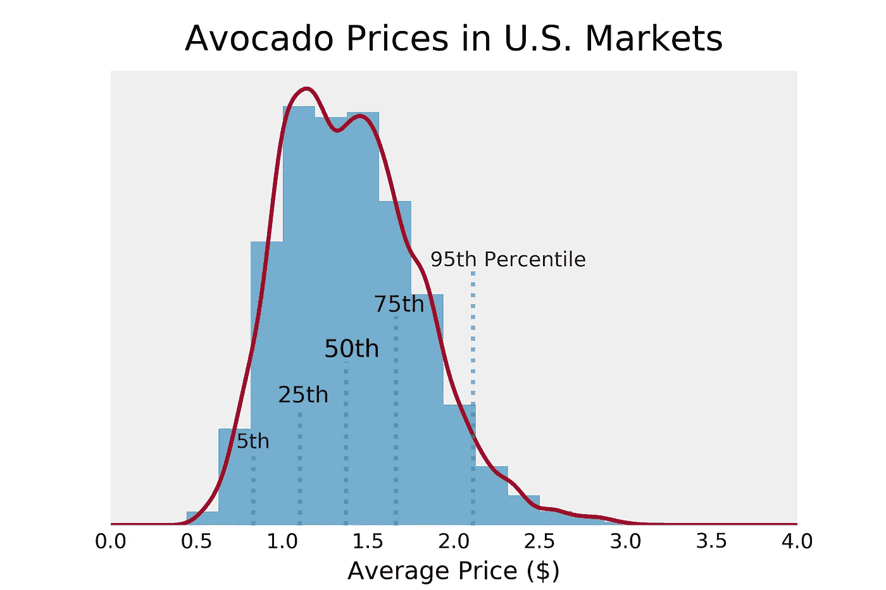

# 使用 Matplotlib 让你的直方图更上一层楼

> 原文：<https://towardsdatascience.com/take-your-histograms-to-the-next-level-using-matplotlib-5f093ad7b9d3?source=collection_archive---------4----------------------->

## 如何让最无聊的情节变得有吸引力和知识性



直方图是可视化变量分布的最常用方法。一个简单的直方图对于浏览数据非常有用。然而，与其他著名的绘图类型如饼图、条形图或折线图相比，它们看起来相当乏味。最重要的是，它们需要有统计学背景才能被正确解释。然而，在我们完全抛弃直方图之前，让我们试着让它更漂亮，信息更丰富，也更容易解释！

在本教程中，我们将采用一个标准的 matplotlib 直方图，并从美学角度对其进行改进，同时添加一些有用的组件。为此，我们将遵循一个**三步程序**，正如我的文章[“从数据分析师到数据故事讲述者”](/from-data-analyst-to-data-storyteller-in-3-steps-54b56815b567)中所阐述的:

1.  添加信息
2.  删除信息
3.  强调信息

# 数据集和第一个图

对于本文，我们将使用来自 kaggle 的[“鳄梨价格”数据集。市场中的价格分布是直方图的一个有用的应用。](https://www.kaggle.com/neuromusic/avocado-prices)

为此，我们只需要这两个库:

```
import pandas as pd
import matplotlib.pyplot as plt
```

因为我们只需要一列(“AveragePrice”)，所以我们可以将数据作为一个系列而不是 dataframe 来读取。这样，我们将节省以后指定列的时间。

```
avocado = pd.read_csv("avocado.csv")["AveragePrice"]
```



我们的第一个也是非常基本的历史程序可以使用下面的代码非常容易地绘制出来:

```
fig, ax = plt.subplots(figsize = (6,4))
avocado.plot(kind = "hist")
plt.show()
```



第一个情节

按照本教程的三个步骤，我们将得到这个最终结果:


我们开始吧！

# 步骤 1:添加信息

一个显而易见的事情是添加一个标题和轴标签。如果你比较上面的两张图，你还会发现第二张图中的直方图没有那么“块状”。我们可以通过**增加*仓*** 的数量来实现这一点，这实质上是直方图将数据划分成的类的数量。更多的箱将使直方图更平滑。最后，您可能已经意识到第二个图形在直方图周围有一条线。这条线被称为**核密度估计(KDE)。** KDE 试图计算变量的基本分布，这将在直方图周围画出一条非常平滑的线。然而，只有当我们将 y 轴从绝对值变为密度值时，KDE 才会起作用。这样做的缺点是密度值对大多数人来说很难解释。我们稍后会解决这个问题。首先，我们来编码这个！



添加信息绘图

我们可以看到，可视化现在包含了更丰富的信息。然而，这并不完全是美丽的，有点势不可挡。让我们减少信息量，让剧情更干净。

# **第二步:删除信息**

最后一个数字中的一些信息是不真实的，甚至是完全无用的。例如，对于大多数人来说，y 轴不再是可解释的。我们应该**移除刻度和刻度标签**并再次用“频率”标记轴。这将使读者了解轴的含义，而不会被不必要的数字所混淆。此外，KDE 还估算了 0 美元以下数值的密度。显然，我们需要通过**重新调整 x 轴来解决这个问题。**最后，在大多数情况下你可以**删除图中的任何记号和刺**而不会损失太多可读性。让我们应用所有这些:



用减少的信息绘图

这看起来已经干净多了。最后一步，我们可以强调特定的信息，并进行美学上的改进。

# 第三步:强调信息

强调信息不仅仅意味着**增加字体大小**，也意味着**选择一种有益于你试图用视觉传达的信息的配色方案**。由于这一步需要更多的代码，我将分别展示代码片段。

首先，我们需要一组不同的颜色。前几幅图中的橙色/蓝色组合看起来不太好。改变绘图布局的一个简单方法是改变 [matplotlib 样式表。](https://matplotlib.org/3.1.1/gallery/style_sheets/style_sheets_reference.html)就我个人而言，我喜欢“bmh”样式表。然而，这个样式表添加了一个网格，这会分散我们的绘图注意力。让我们把样式表改成“bmh”，去掉它产生的网格。

```
plt.style.use("bmh")
# Later in the code
ax.grid(False)
```

另一个美学上的改进是**减少直方图的不透明度**。这将使 KDE 更占主导地位，这将给读者一个整体更流畅的印象。

```
avocado.plot(kind = "hist", density = True, alpha = 0.65, bins = 15) 
```

为了让标题更加突出，我们可以**增加它的字体大小**。“pad”参数也允许我们添加一个偏移量。

```
ax.set_title("Avocado Prices in U.S. Markets", size = 17, pad = 10)
```

在这一步，我也想知道 y 标签“频率”是否是必要的。在测试了这两种变体之后，我发现 y 标签更令人困惑，而不是更有帮助。如果没有给出其他信息，我想我们直观的把 y 轴读成“频率”。

```
ax.set_ylabel("")
```

如果我们应用以上所有内容，我们会得到这个图:


带有强调信息的绘图(1/3)

此时，可视化已经为您的演示或报告做好了准备。然而，还有一件事我们可以做，使情节更容易理解。原则上，直方图包含了我们显示百分位数所需的所有信息。遗憾的是，无法直接从剧情中读出信息。如果我们想向老板展示鳄梨价格的第 75 百分位是多少，同时保留关于分布的所有信息，该怎么办？我们可以**计算一些百分点，并在图**中显示为垂直线。这类似于箱线图，但实际上集成到直方图中。让我们试试这个！

首先，我们要画出垂直线。为此，我们将计算分布的第 5、25、50、75 和 95 个百分点。一种方法是让每一条垂直线比前一条长一点，就像楼梯运动一样。我们也可以给内部线条比外部线条更高的不透明度。

为此，我们将把分位数、线不透明度和线长度存储在一个列表列表中。这将允许我们循环遍历这个列表，并自动绘制所有行。


带强调信息的绘图(2/3)

现在，我们需要添加标签。就像之前一样，我们可以使用不同的不透明度和字体大小来反映分布的密度。为了更好的可读性，每个文本应该相对于百分位线有一点偏移。



带强调信息的绘图(3/3)

我们现在可以使用这个直方图来做出以什么价格出售鳄梨的商业决策。也许我们的鳄梨比一般的鳄梨好一点，我们公司的鳄梨相当出名。也许我们应该收取分布第 75 百分位的价格(大约 1.65 美元)？这个直方图在某种程度上是直方图和箱线图的结合。

这是最终直方图的完整代码:

**非常感谢您阅读这篇文章**！希望你觉得有用。如果您有任何问题或批评，请给我留言或评论。