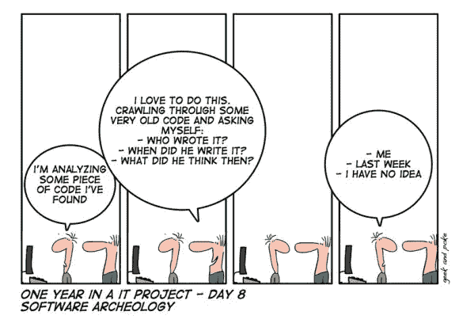

# 如何让你的编程技能更上一层楼

> 原文：<https://towardsdatascience.com/take-your-programming-skills-to-the-next-level-bad506a1031c?source=collection_archive---------38----------------------->

## 编程技能

## 遵循简单干净的代码原则，开发简单、可扩展、易读、易维护的程序。

尼古拉斯·酷(Nicolas Cool)在 [Unsplash](https://unsplash.com?utm_source=medium&utm_medium=referral) 上的照片

你曾经访问过你最近写的函数吗？也许你需要更新一个功能。但是，由于代码相当复杂，您通过使用“如果它有效，就不要碰它”的原则，让代码保持原样？

如果你现在打开你的遗留代码，你能马上理解它们吗？或者也许你需要花至少几分钟来记住代码是关于什么的？

如果你需要花更多的时间浏览，那么这篇文章很可能适合你。这里我们谈谈**在不浪费时间的情况下理解遗产代码的方法** **。**

图片来源:[尼克·帕帕斯](https://www.quora.com/profile/Nick-Pappas-2)上 [Quora](https://www.quora.com/What-do-people-not-tell-you-about-being-a-software-engineer)

如果你遵循我们在这篇文章中描述的原则，你可能不需要浪费更多的时间去理解你的遗留代码，因为它们永远不会过时。

[农旺](https://unsplash.com/@californong?utm_source=medium&utm_medium=referral)在 [Unsplash](https://unsplash.com?utm_source=medium&utm_medium=referral) 上的照片

最近，我开始创建一个图书馆。久而久之，库已经超过了几千行。有趣的是，随着库变得更先进，一些意想不到的问题开始出现。

> 随着代码规模的增长，实现新的功能需要更多的时间。

由于该库处于开发阶段，它可能会有一些功能部件表现不佳。

例如，一个函数可能会因为单元测试中没有考虑到的极端输入值而失败。

这就是为什么每当我实现使用库的其他部分的新功能时，首先，我需要花一些时间来理解相关的函数。

乔治·帕甘三世在 [Unsplash](https://unsplash.com?utm_source=medium&utm_medium=referral) 上的照片

在检查了一个新功能并处理了失败的部分之后，随着时间的推移，同一个功能的其他部分会被破坏。

当我回到最近重构的函数时，我发现自己几乎什么都不记得了。我不得不重新检查相同的功能。

这个问题导致我来回地去理解一些代码片段大部分时间在做什么。

在某种程度上，我已经停下来，并开始寻找什么是错的。

尼古拉斯·酷在 [Unsplash](https://unsplash.com?utm_source=medium&utm_medium=referral) 上的照片

当我在寻找解决方案时，我发现了一个“干净代码”视频课程[1]，它是由《干净代码》一书的作者 Robert C.Martin 准备的。

最后，在干净代码视频课程的帮助下，我已经解决了我所有的问题。不再有导致我浪费时间的糟糕的实现代码。

# 解决方案是干净的代码

在这里，我整理了《干净的代码》系列中的一些关键规则，即使过了几个星期，我仍然记得。通过应用干净代码原则，我所有的问题都解决了。

> 永远不要浪费时间借助干净的代码来理解一个函数的行为。

照片由[美元吉尔](https://unsplash.com/@dollargill?utm_source=medium&utm_medium=referral)在 [Unsplash](https://unsplash.com?utm_source=medium&utm_medium=referral) 拍摄

# 1 —命名

> 每个变量、类和函数名都应该描述自己。[1]

[Guillaume TECHER](https://unsplash.com/@guillaume_t?utm_source=medium&utm_medium=referral) 在 [Unsplash](https://unsplash.com?utm_source=medium&utm_medium=referral) 上拍摄的照片

让我们从回顾下面这段代码开始，这段代码是我在参加 Clean Code 视频课程之前写的。

示例 1:在重构命名之前

在这里，我们可以看到我们有一个网飞数据集，它提供了一种在数据集文件中加载电影的方法。

当我们深入研究这个函数的实现时，乍一看很难理解它到底在做什么。

现在让我们看下面的代码片段，例 1.1，它做的事情和例 1 完全一样。

示例 1.1-重构命名后

在代码示例 1.1 中，我们再次有一个加载电影的网飞数据集。但是，这一次，当我们查看 load movies 函数时，我们可以详细了解代码在做什么。

> 看代码就像一个英文脚本。

你甚至不需要阅读除了前 7 行之外的任何代码来理解代码在做什么，这与示例 1 相反，在示例 1 中，我们需要阅读所有的 12 行，并且还要弄清楚代码在做什么。

詹姆斯·巴尼特在 [Unsplash](https://unsplash.com?utm_source=medium&utm_medium=referral) 上的照片

在例 1.1 中，我们看到我们已经命名了很长时间的助手函数，这些函数只打算被 load_movies 函数使用。

因为没有其他函数会调用这些辅助函数，所以我们可以随心所欲地命名它们，对吗？

一天结束时，没有人再调用它们，我们只是在这里调用它们来给出有意义的函数名，并使代码本身更具描述性，而不需要任何注释。

此外，程序员通常需要理解 load_movies 函数在做什么，而不是理解它的实现细节，比如如何转换格式以及如何准确地从输入文件中读取数据。

如果一个程序员想弄清楚它们，那么他总是可以访问各自的私有函数，这些私有函数只由 load_movies 函数使用。

照片由[大卫·特拉维斯](https://unsplash.com/@dtravisphd?utm_source=medium&utm_medium=referral)在 [Unsplash](https://unsplash.com?utm_source=medium&utm_medium=referral) 上拍摄

简而言之，我们应该有**长的描述性名字，带有私有函数**，这些函数会被调用一两次。

此外，我们应该有简短明了的公共函数，因为不同的程序员会多次调用它们。

> 最后，**函数应该有不超过 2 到 3 个参数**以增加可读性。

# 2 —注释

> 注释意味着不能写出干净的代码。如果任何注释存在于公共 API 之外，接受你的失败。[1]
> 
> 如果有任何评论，那么知道是很重要的。[1]

[蒂亚戈·卡多佐](https://unsplash.com/@tfcardoso?utm_source=medium&utm_medium=referral)在 [Unsplash](https://unsplash.com?utm_source=medium&utm_medium=referral) 上的照片

让我们回顾一下下面的代码，例 2。同样，你根本不需要理解它。仅仅通过查看代码，我们就可以看到存在相当多的注释来使代码更容易理解。

示例 2:重构之前

在示例 2 中，我们看到数据有一个时间约束，可以是时间框约束或最大限制约束。

为了理解代码，我们需要阅读代码的每一行，包括注释。即使全部看完，你可能还是对这个时间约束的目的细节不太满意。

现在让我们来看看下面的代码，它是我在应用干净代码原则后写的。

示例 2.1:重构后(重要部分)

在这里，我们看到存在两种取决于间隔的时间约束。如果间隔有效并且属于预期类型，则满足约束，否则不满足约束。

> "在这里，我所做的唯一一件事就是试图删除评论."

如您所见，没有注释和复杂代码的 17 行代码传达了与旧版本的 58 行代码相同的信息。

以下代码片段是示例 2.1 的其余代码。

因为我们的目的是理解 TimeConstraint 类在做什么，我们甚至不需要回顾这段代码。因为，从它的名字区间来看，很清楚这个类是干什么的。

示例 2.2:重构后(剩余部分)

# 3 —功能长度

> 尽可能减少函数长度，直到不能。[1]
> 
> 最佳函数长度为 4 到 10 行。[1]

沙哈达特·拉赫曼在 [Unsplash](https://unsplash.com?utm_source=medium&utm_medium=referral) 上拍摄的照片

让我们回顾一下示例 3，它加载了网飞数据集的用户电影评级数据。

示例 3:重构之前

这里我们看到 49 行长 load_ratings 函数。这个函数到底是如何实现其功能的还不太清楚。我们需要阅读每一行代码来彻底理解它。

现在让我们来看看代码的新版本，例 3.1，它遵循干净代码规则。

这里我们看到

我们有 7 行长负载额定值函数。load_ratings 函数本身很好地描述了它所做的事情，没有任何注释。我们甚至不需要阅读其他私有函数来理解代码。

示例 3.1:重构后

# 4-文件长度

> 文件应该平均 50-100 行，最多 500 行。[1]

照片由 [Maksym Kaharlytskyi](https://unsplash.com/@qwitka?utm_source=medium&utm_medium=referral) 在 [Unsplash](https://unsplash.com?utm_source=medium&utm_medium=referral) 拍摄

最后但同样重要的是，现在让我们回顾一下来自推荐系统库的一个代码文件[惊喜](https://github.com/NicolasHug/Surprise)。

在示例 4 中，我们可以看到代码片段超过 700 行！

尝试阅读代码片段，您很可能会被冗长的注释卡住。

*   它包括对库文档的不可理解的格式注释。

即使从这个库的设计者的角度来看，将文档放在代码内部可能很容易，但这确实使代码难以阅读，并且还会产生很大很长的文件。

> 永远不要在评论中放 HTML 或者任何格式的文本。这使得注释和代码难以阅读。

实例 4

# 应用干净代码原则后的变化

在接下来的几周里，在应用干净代码原则后，我的代码中开始出现以下症状:

*   代码是任何人都完全可读的，不仅仅是程序员。
*   除了他们想理解的函数，没有人需要阅读更多的代码。
*   代码看起来简单、漂亮、简短。
*   没有一个代码文件看起来令人生畏，难以理解。
*   任何功能都比以往任何时候都更容易构建。
*   缩放也相当容易。

照片由 [Nghia Le](https://unsplash.com/@lephunghia?utm_source=medium&utm_medium=referral) 在 [Unsplash](https://unsplash.com?utm_source=medium&utm_medium=referral) 上拍摄

# 干净代码原则有用吗？

从我的角度来看，只要阅读 17 行代码就能理解这 58 行庞大的代码在做什么。

这些原则使得代码更易维护、更干净、更简单，并且成本更低，因为没有程序员会浪费时间去理解它。

在使用干净代码原则之前，每当我回到一个无法理解的代码片段时，我会浪费相当多的时间去理解代码，而在这段时间里，我本可以为项目设计和实现新的特性。

照片由[玛利亚·宝拉·孔特雷拉斯](https://unsplash.com/@paulamx22?utm_source=medium&utm_medium=referral)在 [Unsplash](https://unsplash.com?utm_source=medium&utm_medium=referral) 拍摄

# 干净代码原则

总而言之，我可以说，只要习惯了我在下面总结的干净代码原则，你就可以创造出更专业的代码。

生成的代码简单、可伸缩、易读，并且易于维护。

> 1-每个变量、类、函数名都应该描述自己。
> 
> 2-函数最多应该有 2 到 3 个参数来增加可读性。
> 
> 3-如果有任何评论，那么知道是很重要的。
> 
> 4-注释意味着不能写出干净的代码。如果任何注释存在于公共 API 之外，接受你的失败。
> 
> 5-尽可能缩短函数长度，直到你做不到为止。
> 
> 6-最佳功能长度为 4 到 10 行。
> 
> 7-文件应该平均 50-100 行，最多 500 行。
> 
> 永远不要在评论中放 HTML 或者任何格式的文本。这使得注释和代码难以阅读。

从我数百次不同的 Github 代码检查中，我意识到几乎没有一个程序员遵循所有的干净代码原则。

在您的代码中尽可能多地尝试它们，看看我得到的症状是否也会出现在您的代码中。

这些原则绝不是提高编程技能的全面清单。这些只是干净代码系列中所有技术的一小部分。还有很多其他的技巧可以让你更加进步。

克里斯托夫·杰施克在 [Unsplash](https://unsplash.com?utm_source=medium&utm_medium=referral) 上的照片

# 接近尾声

我希望您现在有动力开始学习干净代码原则，并在很大程度上提高您的编程技能。

尝试应用八个干净代码原则，并随意分享你对它们的感受。

想象一下，如果您可以通过使用 Clean 代码中定义的一些令人惊讶的有趣技术来学习如何确保一切都遵循这些规则。

你可以通过参加视频课程或阅读我们在下面提供的参考书籍，发现如何具体实施这些原则。

## 进一步研究

 [## 不断增长的专业编程技能

### 将您的编程能力从中级过渡到专业。

medium.com](https://medium.com/cyber-explorer/growing-professional-programming-skills-577b7cc76187) 

[1]罗伯特·C·马丁，干净代码视频系列(2016)

[2] Robert C.Martin，干净的架构:软件结构和设计的工匠指南