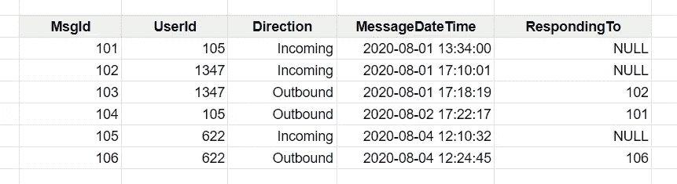
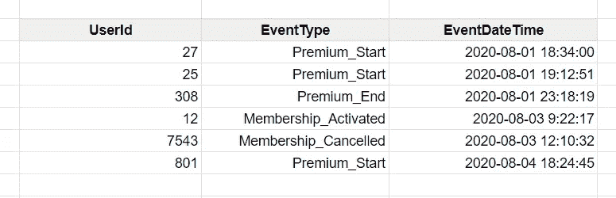

# 通过理解自连接，将您的 SQL 技能提升到一个新的水平

> 原文：<https://towardsdatascience.com/take-your-sql-skills-to-the-next-level-by-understanding-the-self-join-75f1d52f2322?source=collection_archive---------30----------------------->


由 [You X Ventures](https://unsplash.com/@youxventures?utm_source=unsplash&utm_medium=referral&utm_content=creditCopyText) 在 [Unsplash](https://unsplash.com/s/photos/coder?utm_source=unsplash&utm_medium=referral&utm_content=creditCopyText) 上拍摄的照片

我写的前几篇博客对初学者来说非常棒([不用学习编码的数据概念](https://datadreamer.io/2020/08/07/dont-fall-for-the-hype-learn-these-3-basic-data-concepts-before-stressing-about-programming-languages-or-tools/)或[培养数据科学家的思维](https://datadreamer.io/2020/04/24/developing-a-data-scientists-mindset/))。但是，我真的想推动自己为我的其他观众创造内容。所以今天，我们将进入更中级的数据分析领域。并讨论自我联接:它们是什么以及如何使用它们将您的分析带到下一个层次。

*免责声明:这篇文章假设你已经理解了 SQL 中的连接是如何工作的。如果你还不熟悉这个概念，完全不用担心！把这篇文章留到以后吧，因为我认为当你将来掌握 SQL 时，它肯定会有用的。*

# 什么是“自我”加入？

自连接实际上是字面上的意思——它是将数据库表连接到自身。您可以使用任何类型的连接来执行自连接(左连接、右连接、内连接等)。)—使它成为自连接的是您在两端使用同一个表。只要确保为您的特定场景和期望的结果选择了正确的联接类型。

# 什么时候应该使用自联接？

如果你在数据分析和数据科学领域工作或学习超过 5 分钟，你就会知道解决一个问题总有 27 种方法。当然，有些比其他的好，但有时差异几乎听不出来。

也就是说，很可能永远不会有一个确切的情况，你必须有一个自我连接，否则你的分析将会萎缩，无处可去。*当然，如果你有的话，请在下面的评论中给我一个场景*

但是，我至少在一些场景中使用了自连接来解决我的分析问题，无论是在工作中还是在个人分析中。下面是我自己对其中两个最好的(也就是我记得的和能想到的好例子)的看法。

# 场景#1:消息/响应

假设有一个名为 Chats 的数据库表，它保存了在线服装店发送或接收的所有聊天消息。



对于服装店老板来说，知道她通常需要多长时间来回复顾客的信息是非常有益的。

但是，来自她的客户的消息和发送给她的客户的消息在同一个数据源中。因此，我们可以使用自连接来查询数据，并向店主提供这种分析。我们需要一份聊天表来获取客户的初始信息，一份聊天表来获取所有者的回应。然后，我们可以对与这些事件相关联的日期进行一些日期计算，以计算出店主需要多长时间做出响应。

我将把这个假设的自连接查询写成如下形式:

```
SELECT
  msg.MessageDateTime AS CustomerMessageDateTime,
  resp.MessageDateTime AS ResponseDateTime,
  DATEDIFF(day, msg.MessageDateTime, resp.MessageDateTime)
    AS DaysToRespond
FROM
  Chats msg
  INNER JOIN resp ON msg.MsgId = resp.RespondingTo
```

注意:这个 SQL 查询是使用 Transact-SQL 编写的。使用任何适用于您的数据库的日期函数。

这个查询相对简单，因为 RespondingTo 列为我们提供了要返回到哪个原始消息的一对一映射。

# 场景#2:开/关

假设这次您看到了一个数据库表 AccountActivity，它保存了一个 yoga 订阅站点上可能发生的事件的日志。yoga 网站提供特定的“高级试用期”，顾客在首次加入时可以享受一段时间的会员折扣。在此表中，使用 Premium_Start 和 Premium ed 事件类型跟踪试验的开始和结束日期。



假设这家 yoga 订阅公司的一些业务员工在问 1。有多少人的保费试用期目前活跃，和 2。有多少曾经有高级试用期，但现在没有了。

同样，我们在同一个数据库表中获得了保费期开始和保费期结束的事件(以及其他帐户活动)。

## 分析请求 A:高级试用期中的帐户

要回答第一个问题，我们需要找到高级会员已经开始但尚未结束的活动。因此，我们需要将 AccountActivity 表连接到它本身，以查找高级开始和高级结束事件匹配。但是，这次我们不能使用内部连接。我们需要结束表中的空行…所以是左连接。

```
SELECT
  t_start.UserId,
  t_start.EventDateTime AS PremiumTrialStart,
  DATEDIFF(day, t_start.EventDateTime, GETDATE()) AS DaysInTrial
FROM
  AccountActivity t_start
  LEFT JOIN AccountActivity t_end ON t_start.UserId = t_end.UserId
    AND t_start.EventType = 'Premium_Start' 
    AND t_end.EventType = 'Premium_End'
WHERE
  t_end.EventDateTime IS NULL
```

请注意我们是如何检查并确保我们加入的事件顺序正确的。我们希望高级试用从连接的左侧开始，高级试用在连接的右侧结束。我们还确保用户 Id 在两端匹配。我们不想参加两个不同客户的活动！

## 分析请求 B:曾经处于高级试用期的客户

关于第二个问题，我们想找到那些甜 premium 试用已经结束的客户。我们将再次需要 self join AccountActivity，但这一次我们可以将它切换得更严格一些。我们需要左右两边的匹配，因为在这个人群中，试验已经结束。所以，这次我们可以选择一个内联接。

```
SELECT
  t_start.UserId,
  t_start.EventDateTime AS PremiumTrialStart,
  DATEDIFF(day, t_start.EventDateTime, t_end.EventDateTime) 
    AS DaysInTrial
FROM
  AccountActivity t_start
  INNER JOIN AccountActivity t_end ON t_start.UserId = t_end.UserId
    AND t_start.EventType = 'Premium_Start' 
    AND t_end.EventType = 'Premium_End'
```

看，自我结合很有趣。如果在同一个数据库表中有相互关联的事件，它们会非常有用。感谢您的阅读，并祝您查询愉快。🙂

*原载于 2020 年 8 月 13 日*[*https://data dreamer . io*](https://datadreamer.io/2020/08/13/take-your-sql-skills-to-the-next-level-by-understanding-the-self-join/)*。*