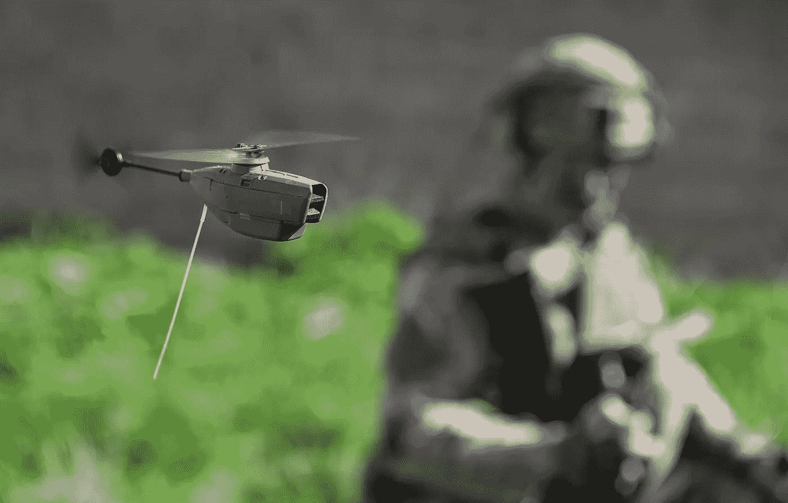
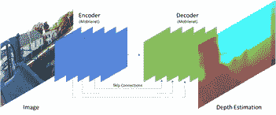
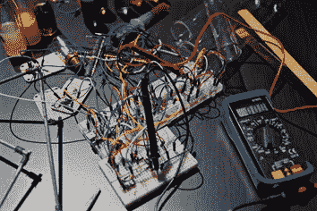
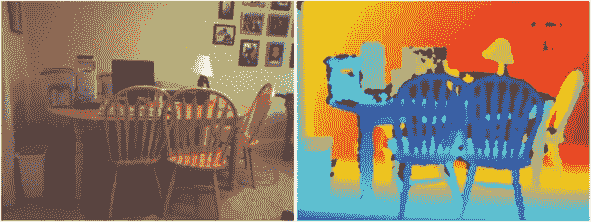
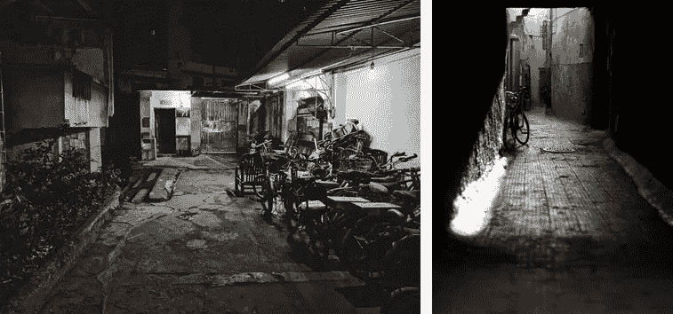
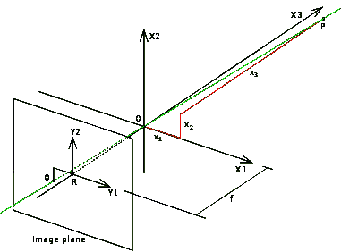

# 将机器学习白皮书投入生产

> 原文：<https://towardsdatascience.com/taking-a-machine-learning-white-paper-to-production-a25cfadcd16e?source=collection_archive---------53----------------------->

## 需要考虑的四件事。



图片来自维基百科

当我阅读白皮书时，我通常是带着一个目的去做的，也就是说，手边有一个潜在的挑战，通常是一个很大的挑战。通常，它们真的符合要求。有时，他们甚至会在 Github 上发布源代码。那更好。



作者图片

这是一个简短的故事，讲述了在麻省理工学院从白皮书到生产的一个名为[快速深度](http://fastdepth.mit.edu/)的项目中吸取的经验教训——在无人机上主动运行，为自主提供感知。

*注意——我绝不是在批评快速深度报道、人物或作品。我和他们的交流很有成效。本白皮书讲述了从有趣的白皮书/概念工作证明到“生产”的过程。*

**能帮上忙的四件事:**



尼古拉斯·托马斯在 [Unsplash](https://unsplash.com/s/photos/engineering?utm_source=unsplash&utm_medium=referral&utm_content=creditCopyText) 上的照片

1.  从部署的角度选择你的机器学习(ML)语言
2.  找到一个运行时推理引擎
3.  使用集中的训练数据调整您的模型
4.  根据一致的摄像机参数校准您的训练数据。

**着眼于部署选择你的机器学习语言**

有趣的机器学习模型的研究和开发通常是我们感兴趣的白皮书的重点。研究人员倾向于喜欢 PyTorch。与 Keras/Tensorflow 相比，它提供了额外的灵活性，例如在动态图形中。好吧。然而，Tensorflow 似乎在总体使用上占主导地位，尤其是在运行时性能方面。

实际上有两种方法可以在生产中运行您的模型:

1.  在类似于开发环境的环境中，例如 Python、PyTorch、CUDA 或
2.  使用针对您的平台和性能优化的推理引擎。

如果你的交付允许 CUDA，你有更多的选择。然而，我倾向于参与上面的第二个项目——嵌入式 Linux 和智能手机项目。例如，在 2010 年 4 月发布的 1.0 版本框架[移动神经网络](https://github.com/alibaba/MNN)(来自阿里巴巴)，他们专注于后端，如 ARM CPU、OpenCL、OpenGL、Metal 和 Vulkan。并且针对 Adreno 和 Mali 系列的 GPU 进行了深度调优。正合我的胃口。

此外，从语言角度来看，“MNN 目前支持 Tensorflow、Tensorflow Lite、Caffe 和 ONNX(py torch/MXNet)；后者通过算子融合、算子替换和布局调整来优化图形那就是，ONNX 当然看起来是二等公民。更进一步，它们支持 86 个 Tensorflow 操作，仅支持 34 个 Caffe 操作。

比赛可能不会总是跑得最快，但这是一个非常好的赌注。如有可能，使用 Tensorflow 进行部署。

**找到一个有效的部署推理引擎**

在之前的一篇文章中，我已经[深入地写过这个](/machine-learning-at-the-edge-a751397e5a06)。总的来说，有许多选择，完成这些选择是漫长而痛苦的。我发现了一个名为[的移动人工智能计算引擎](https://github.com/XiaoMi/mace) (MACE)，它是第一个在我的环境中运行良好的引擎。

您的里程可能会有所不同。为了获得最佳性能，我还想进一步探索 MNN(如上所述)和 [tvm.ai](https://tvm.apache.org/) 。

**使用集中的训练数据调整您的模型**

研究论文需要表明他们已经超越了以前的工作。他们的方法是使用基准数据集。在深度估计的情况下，正常的基准是 [NYU 深度数据集 V2](https://cs.nyu.edu/~silberman/datasets/nyu_depth_v2.html) 。这个数据集来自 2012 年，包含大约 50 多张用 Kinect 摄像头获得的训练图像(RGB-D，D 代表深度)。(一个类似的汽车感知数据集被称为 KITTI，也来自这个时间段。)



(图片来源 NYU Depthv2 训练数据)

这是一个来自 NYU 深度 V2 数据集的样本。即纽约公寓和办公室的内部。



[Jason Sung](https://unsplash.com/@jasonsung?utm_source=unsplash&utm_medium=referral&utm_content=creditCopyText) 和 [Amy Elting](https://unsplash.com/@amyames?utm_source=unsplash&utm_medium=referral&utm_content=creditCopyText) 在 [Unsplash](https://unsplash.com/s/photos/factory?utm_source=unsplash&utm_medium=referral&utm_content=creditCopyText) 上的照片

相比之下，我们的重点是更多的砂砾，工业设置。

请注意更大的深度和“不同”类型的场景组成。

简而言之，根据 NYU 数据训练的模型在两个方面让我们失望:

*   深度有限。短距离可以避开物体，但更长的距离对于绘制环境以进行路径规划很有价值。
*   在我们的特定环境中，准确性很差。

**下一步—查找新数据集**

四处搜索，我们发现了[二极管](https://diode-dataset.org/)，一个类似的数据集，但两者都有更大的数据范围，高达 350 米，以及室内和室外场景。这个好用多了。

**但是……(作弊部分……)**

在高度相似的图像上训练高度特定的场景仍然是值得的。好吧，你可以说“作弊”，我会继续优化我们的结果，因为我们努力推广。简而言之，我们将从一个高度特定的环境中捕捉大约 5000 张图像，并在此基础上训练我们的模型。

这些最终的图像是用一个[实感传感器](https://www.intelrealsense.com/stereo-depth/?utm_source=intelcom_website&utm_medium=button&utm_campaign=day-to-day&utm_content=D400_learn-more_button&elq_cid=6395200&erpm_id=7197935)捕捉的。这比 Kinect 更精确，但仍然受到 10 米(或更小)深度范围的限制。)

简而言之，行之有效的训练方案是:

*   基本模型，利用已经训练好的 Mobilenet
*   继续使用 NYU 深度数据集 V2 进行训练
*   继续用二极管训练
*   利用通过 RealSense 传感器获得的集中训练数据完成训练。

这在期望的域内很好地工作。

**然后，校准您的训练数据**

你可能已经注意到，到目前为止，我们大概使用了几种不同的相机:(无论 Mobilenet 使用什么)；Kinect 二极管；实感；别忘了无人机上的最后一个摄像头。摄像机具有不同的校准参数。



图片来自维基百科

参考[针孔摄像机型号](https://en.wikipedia.org/wiki/Pinhole_camera_model)。这是高中数学，我就不拖累你了。但是对我们来说两个关键参数是焦距和主点。

焦距在上图中显示为 f。主点没有显示，但表示图像中心在图像平面上的位置，对于相机来说，这通常是关闭的。

你说，那又怎么样。事实证明，你真的不应该在同一个训练数据集中混合和匹配来自不同参数相机的图像。

好消息是相机之间的转换很容易。

下面是一些帮助转换的代码。使用的摄像机[校准参数](http://docs.ros.org/melodic/api/sensor_msgs/html/msg/CameraInfo.html)来自 ROS 框架。一般来说，通过的路径是:

1.  预处理。一些传感器并不在每个点都提供深度图像。对于这些，图像必须被内涂，以用估计值填充这些点。此外，二极管传感器提供需要平滑的图像，以覆盖一些不适当的高频噪声。
2.  将图像从源摄像机转换或“注册”到目标摄像机。
3.  深度图像也是如此。顺便说一下，有一个 ROS 节点可以做到这一点，但这不是必需的。
4.  后期处理。如果 ROS 节点用于深度配准，则目前仅在绘制中。

下面是我为上面的#2 编写的 Python 代码:

```
'''
Convert an image between two different sensors.   Two cases:
- source completely fills (or more) the destination
- source fills less than full
'''
def registerImage(npImg,sourceSensorDef,destSensorDef):
    npImg = npImg.astype(np.float32)
    # Principal point adjustment - source
    npImg = principalPointAdjustment(npImg,sourceSensorDef) fxS = float(sourceSensorDef.fx)
    fyS = float(sourceSensorDef.fy)
    widthS = float(sourceSensorDef.width)  
    heightS = float(sourceSensorDef.height) fxD = float(destSensorDef.fx)
    fyD = float(destSensorDef.fy)
    widthD = float(destSensorDef.width)
    heightD = float(destSensorDef.height)
    WinterS = fxS * widthD /fxD
    HinterS = fxS * heightD /fyD
    WinterS = int(round(WinterS))
    HinterS = int(round(HinterS))
    WinterD = fxD * widthS /fxS
    HinterD = fxD * heightS /fyS
    WinterD = int(round(WinterD))
    HinterD = int(round(HinterD)) # Assumption - both Width and Height will behave similarly, i.e., crops or add boundary
    # if not, we need to handle width and height separately
    resizeInterp = cv2.INTER_NEAREST
    if WinterD<widthD:     # need border on destination
        # From ROS 'definition' - make left=right, top=bottom
        bdrLeft = (destSensorDef.width-WinterD) // 2
        bdrTop = (destSensorDef.height-HinterD) // 2
        # but also must adjust width
        WinterD = destSensorDef.width - (2 * bdrLeft)
        HinterD = destSensorDef.height - (2 * bdrTop) dim = (WinterD,HinterD)
        npImg = cv2.resize( npImg, dim, interpolation = resizeInterp )        # resize - use default interpolation - INTER_LINEAR
        bdrRight = bdrLeft
        bdrBottom = bdrTop
        npImg = cv2.copyMakeBorder( npImg, 
                top=bdrTop,
                bottom=bdrBottom,
                left=bdrLeft,
                right=bdrRight,
                borderType=cv2.BORDER_CONSTANT,
                value=(float("NAN"), float("NAN"), float("NAN"))
        )
    elif WinterD>widthD:        # crop out source
        bdrLeft = (sourceSensorDef.width-WinterS) // 2
        bdrTop = (sourceSensorDef.height-HinterS) // 2
        WinterS = sourceSensorDef.width - (2 * bdrLeft)
        HinterS = sourceSensorDef.height - (2 * bdrTop)
        npImg = npImg[ bdrTop:bdrTop+HinterS, bdrLeft:bdrLeft+WinterS ]
        dim = (destSensorDef.width,destSensorDef.height)
        npImg = cv2.resize( npImg, dim, interpolation = resizeInterp )        # resize - use default interpolation - INTER_LINEAR# Principal point adjustment - destination
npImg = principalPointAdjustment(npImg,destSensorDef)return npImg
```

**总结**

和往常一样，一个好的方法是迭代地进行，深入探索技术上未知/未证实的领域。上面概述的四件事将帮助你加速这个过程。

正如托马斯·爱迪生所说，“天才是百分之一的灵感，百分之九十九的汗水(T2)或者，用我的话来说，一个好主意是好的，一个概念的证明是伟大的，在现实世界中工作需要很多努力。