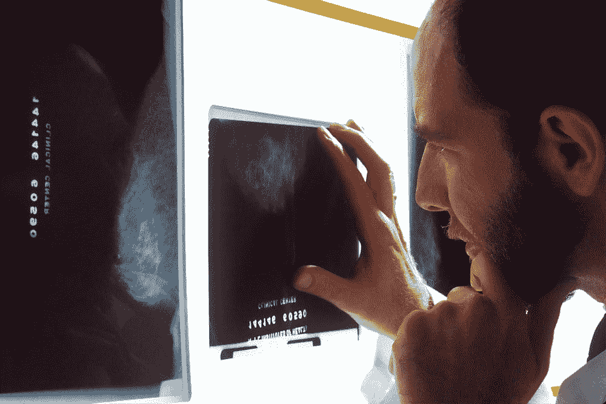
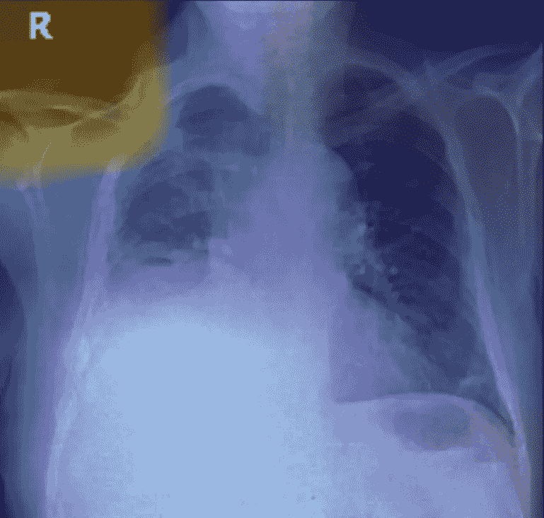

# 将人工智能模型从 Jupyter 笔记本带入真实的医院

> 原文：<https://towardsdatascience.com/taking-ai-models-from-jupyter-notebooks-into-real-hospitals-6fbc0832401e?source=collection_archive---------43----------------------->

## 将人工智能产品化和开发在医疗实践中实用的解决方案的主要挑战

图片来自 [Unsplash](https://unsplash.com/)

从放射学到病人护理，人工智能在医疗保健的许多领域都显示出惊人的潜力。AI 在放射学中的应用包括从胸部 X 射线中检测结核病，从 CT 扫描中检测新冠肺炎和颅内出血，从乳房 X 线照片中检测癌症，从 MRI 中检测脑肿瘤，从 PET 扫描中预测阿尔茨海默氏症的进展，等等。在 DeepTek，我们开发了仅从胸部 x 光就可以诊断 30 多种疾病的模型。除了放射学，人工智能还被应用于病理学，分析电子健康记录，疫情反应的接触追踪，预测再入院和死亡率，等等。强大的研究成果和活跃在这一领域的大量公司证明了人工智能从根本上改变医疗保健的承诺。

尽管如此，这一承诺在很大程度上仍未实现。许多令人兴奋的机器学习技术在基准数据集上表现出了显著的效果，但在学术论文和代码库中却没有使用。人工智能医疗创业公司的估值正在飙升，但他们没有收入，其中只有少数几家公司看到了任何形式的产品化人工智能和商业采用。

作为 DeepTek 的首席数据科学家 DeepTek 是少数几家成功实现其人工智能解决方案商业应用的公司之一——我想分享一下在开发*在实践中实际工作*的机器学习模型时所面临的关键挑战。以下是它们，没有特定的顺序。

# 缺乏足够的数据

是的，我们都听过这句话，不是吗？数据科学家总是抱怨没有足够的数据，过了一段时间后，团队的其他成员对这种抱怨充耳不闻。这是一个难以忽视的事实，但是让我们面对这个事实:根本没有办法绕过它。如果你没有数据，你就什么都没有。机器学习项目以数据开始，以数据结束——所有的创新都发生在两者之间。

神经网络渴望数据，它们不仅需要数据量，还需要输入的数据的多样性。成吨的医疗数据存在，但严重支离破碎。它存在于不同医院、诊所、个人电脑、USB 磁盘驱动器、电子邮件的小仓库中，其中很大一部分甚至没有数字化。即使医院允许你访问他们的数据，你也会发现跟踪、编辑和组织这些数据非常困难。HIPAA 和 GDPR 等数据隐私法规虽然本身非常重要，但却让事情变得更加困难。

# 嘈杂的注释

监督机器学习需要数据样本和标签。该算法首先在匹配样本-标签对上进行训练，从数据中提取模式，并将它们提取到数学模型中。这个模型后来被用来预测任何看不见的样本的标签。一个困难是这些标签经常是嘈杂的。

考虑放射科医生针对给定的病理将 X 射线图像标注为阳性或阴性的情况。作为数据科学家，我们愿意相信这种标签是清晰、确定和明确的。现实有些不同。正如许多研究表明的[ [1](https://link.springer.com/article/10.1186/1471-2334-12-31) ][ [2](https://www.scirp.org/html/5-2060165_59537.htm) ]，在评估 kappa 值范围为 0.3 至 0.8 的研究时，放射科医师之间存在高度的评分者间差异。因此，如果使用放射科医师的注释作为基础事实来构建 AI 模型，它们将从标签本身可能不准确的不确定基础开始。当注释不是来自一个放射科医生，而是来自一个由多个放射科医生组成的团队时，这个问题变得有些复杂——在处理大型数据集时可能就是这种情况。

开源研究数据集(NIH、MIMIC、Padchest 等。)带有使用 NLP 算法从报告中自动提取的标签。NLP 提取过程可能会在标签中引入错误，但是在使用它们时还有另一个微妙的问题。当人类放射科医师评估图像并撰写报告时，放射科医师可以访问患者的临床信息，并且他/她的诊断会考虑该信息。然而，这种额外的信息对于 AI 训练来说是不可用的。在缺乏这些关键信息的情况下，人工智能可能无法学习样本和标签之间的正确对应关系。

# 培训分布与实际不符

哦，这种事经常发生！考虑以下情况。我们从医院收集了大量的 x 光图像。我们的放射科医生会针对给定的病理(比如结核病)对这些数据进行注释。在这个数据集中，结核病的患病率为 25%。四分之一的样本被标记为结核。我们使用这个数据集训练我们的结核病模型。作为一个新项目的一部分，我们在一个从事结核病人群筛查的医疗保健中心部署了这一模型。在这个人群筛查项目中，结核病的患病率是 5%。该模型的性能如何？

> 在 DeepTek，这些挑战是我们日常生活的一部分。要了解我们如何克服这些困难，[联系我们](mailto:viraj.kulkarni@deeptek.ai)，我们将很乐意讨论更多。

不太好。该模型针对特定的流行情况进行了训练和评估。它预计在测试阶段会有同样的流行率。当然，有很多方法可以解决这个问题，但是也有更多的问题。医院的 X 射线设备可能与医疗保健中心的不同。患者位置可能不同。医院图像可能会显示导管和胸导联。人群筛查图像可能包括异物，如硬币、别针、珠宝和夹子，因为这些可能是在人们穿着衣服的情况下拍摄的。由于这些因素，模型训练所依据的数据可能与其预期的数据有很大差异。

# 分布漂移

这与上述问题有关，但需要一个单独的部分。医疗保健行业的流程和工作流处于不断变化的状态。医院会变的。医生会变的。年轻一代的医生和医疗从业者并不羞于使用技术。病人会变的。所有这些的净效果是数据分布一直在变化。一个模型，一旦被开发和部署，永远不会顺利地工作。事实上，在医院中采用人工智能可能会导致医院工作流程本身的根本变化，从而导致数据分布的变化。

分布漂移(也称为概念漂移或数据集漂移)发生在数据分布开始随时间变化时。为了在实践中成功部署人工智能解决方案，他们需要配备自动识别漂移发生的技术，并重新训练和更新模型以纳入这种漂移。

# 学习不相关的混杂因素而不是相关特征

机器学习算法被优化以在给定数据集上实现最佳性能。尽管我们希望模型在训练中学习正确的特性，但情况可能并不总是这样。众所周知，模型会偷偷利用图像中可能与预测相关也可能不相关的未知特征。例如，如果数据集中的阳性图像主要来自一家医院，而阴性图像来自另一家医院，则模型可以学习区分图像的来源，而不是目标病理；因此，它可能会拾取图像中的对比度差异、扫描主要区域之外的一些文本标记、扫描周围的黑色边界区域或其他一些不相关的特征(也称为混杂因素)，而不是学习根据指示病理的视觉症状来区分类别。如果这个模型也带有相同的混淆特征，那么它甚至可以在一个基准集上表现出优异的性能。

一个学习了不相关特征的人工智能模型的例子

# 对人工智能解决方案在实践中的应用理解不足

在许多组织中，无论是研究机构还是行业机构，技术开发人员都与医疗从业者保持一定的距离。由于这种差距，他们开发的解决方案解决了一个与需要解决的问题有质的不同的问题，以使解决方案对医疗人员实用。确定合适的利益相关者，通过对话引出他们面临的问题，将这些转化为一组明确的要求，客观地制定这些要求，然后设计满足这些要求的解决方案，当你开始计算这个漫长过程中涉及的人数时，这并不是一件容易的事情。

人工智能可以彻底改变医疗保健。通过消除流程中的瓶颈，自动化日常任务，提高诊断准确性，提高人类生产力，并最终降低成本，人工智能可以成为让所有人都能获得医疗保健的游戏规则改变者。为了实现这一潜力，我们需要承认上述挑战，给予它们应有的尊重，并找到缓解它们的方法。在 DeepTek，这些挑战是我们日常生活的一部分。要了解我们如何克服它们，[请联系我们](mailto:viraj.kulkarni@deeptek.ai)，我们将很乐意讨论更多。

*如果你喜欢这篇文章，可以在* [*中型*](https://medium.com/@diningphilosopher) *上查看我的其他作品，在*[*LinkedIn*](https://www.linkedin.com/in/kulkarniviraj/)*或*[*Twitter*](https://twitter.com/VirajZero)*，查看我的* [*个人网页*](https://virajkulkarni.org/) *，或发邮件给我*[*viraj@berkeley.edu*](mailto:%20viraj@berkeley.edu)