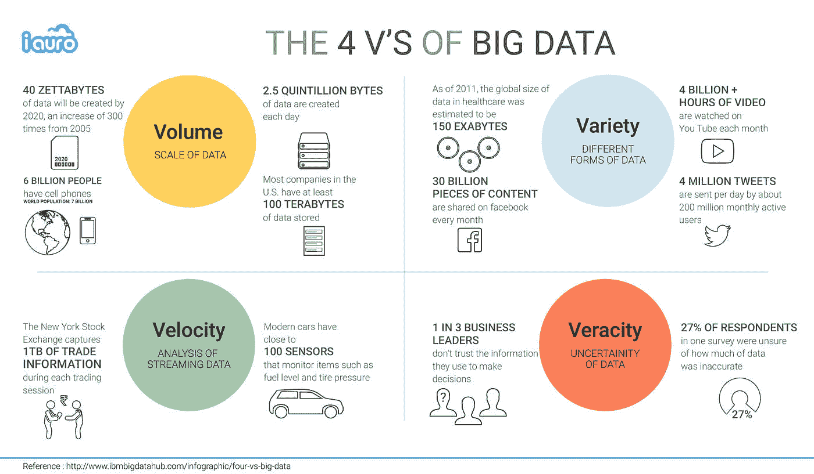
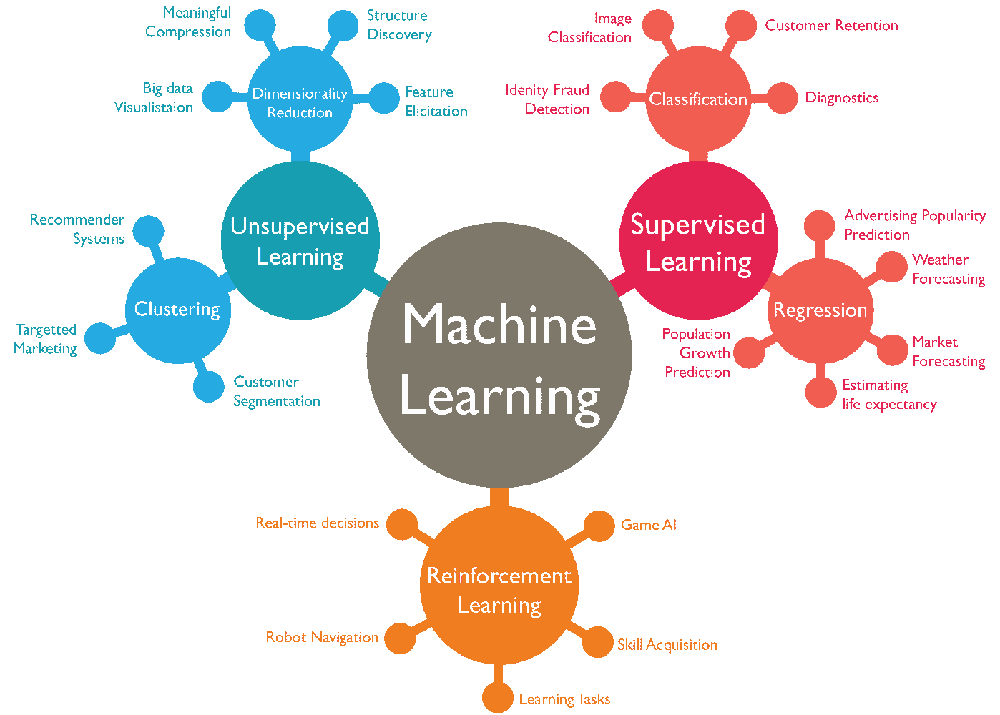
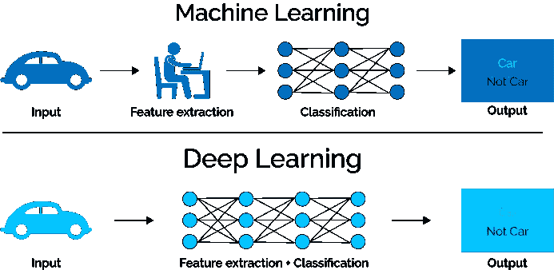
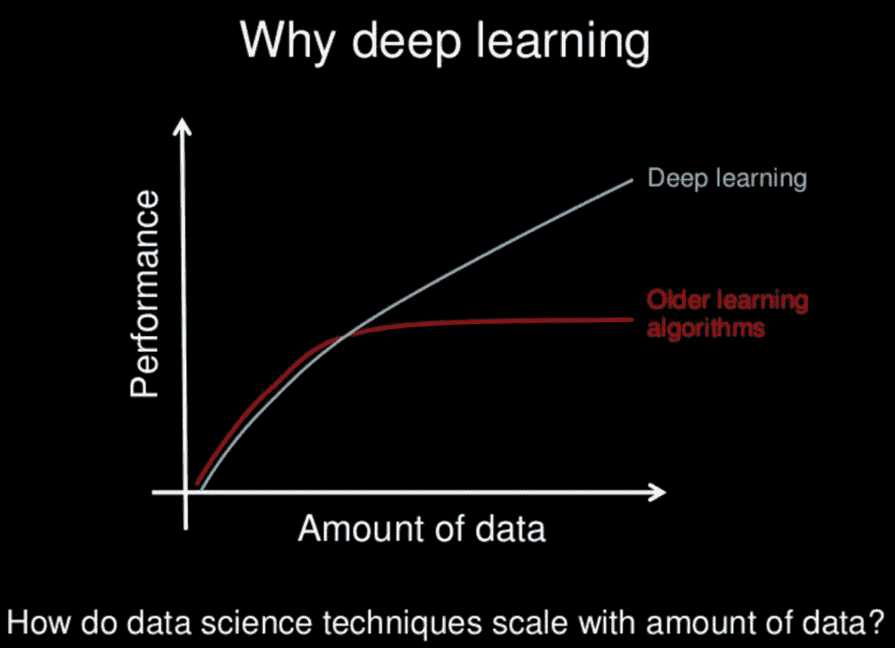
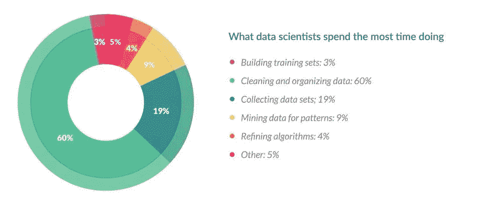
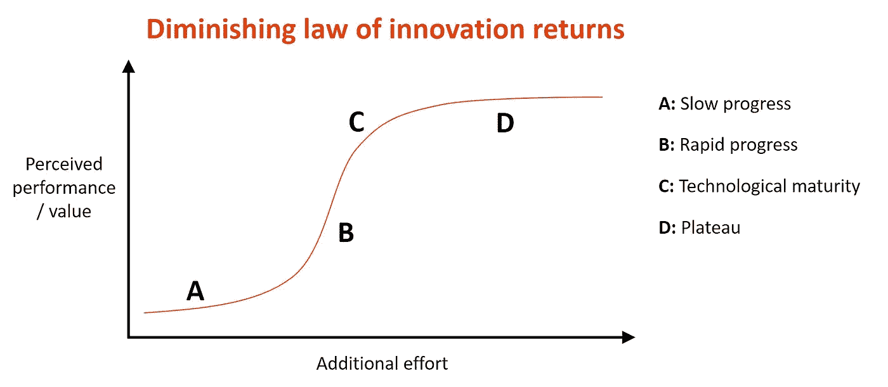

# 与有商业头脑的高管谈论数据科学话题

> 原文：<https://towardsdatascience.com/talking-about-data-science-topics-with-business-minded-executives-b968df91935b?source=collection_archive---------27----------------------->

## 向非技术受众有效传达技术数据科学工作的解释&减少误解

从[艾米·赫斯基](https://unsplash.com/@amyhirschi?utm_source=medium&utm_medium=referral)到 [Unsplash](https://unsplash.com?utm_source=medium&utm_medium=referral)

我从经理那里听说过一些数据科学家的故事，他们在技术能力方面非常出色，但缺乏一些基本的业务沟通技能。我还听到数据科学家抱怨说，高层管理人员不理解一些技术术语之间的区别，会在不理解其含义的情况下抛出一些术语，如“大数据”。

这篇文章的目的是帮助双方！数据科学家们，你可以阅读这篇文章，并获得用非技术术语解释行话的帮助。商业领袖，你可以深入了解当前数据术语的真正含义，也许还能更好地理解数据科学家的困境。

# 解释术语

*“人工智能！大数据！深度学习！我们需要在我们的组织中利用所有这些…尽快。”*

从 [Seema Singh](https://medium.com/u/a1a9e99dd9df?source=post_page-----b968df91935b--------------------------------) 开始[走向数据科学](/cousins-of-artificial-intelligence-dda4edc27b55)

## AI 的定义

我们可以将人工智能定义为“能够感知、推理、行动和适应的程序。”人工智能模仿人类表现出的认知功能，如推理和学习。

## 机器学习的定义

机器学习是一种特定类型的人工智能，它使用算法来学习数据和输出预测中的模式。机器学习需要相对较大的数据集，数据科学家通常会将数据分为训练集(用于构建模型)和测试集(用于测试模型性能和泛化能力)。

## 深度学习的定义

深度学习是一种复杂类型的神经网络(仅供参考:神经网络是机器学习的一个子集)。有些人会互换使用神经网络和深度学习这两个术语，但真正的深度学习是当神经网络至少有两个隐藏层时。如果你不知道隐藏层是什么，没关系，你需要知道的是深度学习算法比小型神经网络更复杂(因此计算成本更高)。

## 大数据是由什么构成的？

从 iauro on[Twitter](https://twitter.com/iauro/status/889725873707827200)

大数据是一个巨大的时髦词。但是，在您的组织中拥有大量数据和真正拥有大数据之间有什么区别呢？上图概述了使数据被视为“大”的 4 个关键描述符

当您处理大数据时，规模通常以 TB 为单位。大数据是以多种格式出现的数据，如图像、文本、数字等。此外，如果您的公司也在讨论分析流数据(即持续生成的数据)，那么您可能正在处理大数据。

# 消除困惑

*“我们公司使用的是尖端的机器学习技术。”*

## 机器学习与数据分析或统计

来自丹·舍万在 wordstream.com[的](https://www.wordstream.com/blog/ws/2017/07/28/machine-learning-applications)

数据分析和机器学习之间的一个巨大差异是它们寻求回答的问题。

在数据分析中，你想知道类似于*我们公司在这个时间点的销售额发生了什么变化？为什么会发生这种事？*在机器学习中，你想知道*基于过去发生的事情，我们可以预期未来我们的销售会发生什么？*

上图详细描述了一些可以通过机器学习解决的商业任务或问题。对于这些任务中的每一项，您都要创建一个模型，用数据训练该模型，然后测试其预测准确性(或另一个度量)。另一方面，数据分析只专注于分析趋势，然后寻找解释。

## 深度学习与其他机器学习算法

从[贾格里特·考尔·吉尔](https://www.xenonstack.com/author/jagreet-kaur-gill/)到[xenonstack.com](https://www.xenonstack.com/blog/log-analytics-deep-machine-learning/)

这些图形突出了深度学习和其他机器学习技术之间的两个重要区别(在我看来)。

从[杰森·布朗利](https://machinelearningmastery.com/author/jasonb/)到[machinelearningmastery.com](https://machinelearningmastery.com/what-is-deep-learning/)

第一张图解释了深度学习的好处之一-除了执行分类任务之外，它还完成了特征提取的过程(即从初始数据集创建特征)。这意味着数据科学家可以将原始数据输入深度学习算法，例如图像中的像素值，这是他们无法用其他机器学习方法完成的。

第二张图说明了深度学习如何在大型数据集上表现得更好。根据您拥有的数据类型和数量，一种方法比另一种方法更适合您的项目。(计算资源也是一个重要的考虑因素——用大量数据训练算法会花费大量时间。)

最后，深度学习方法最常用于带有标签数据(即结果/分类已知的数据)的行业。机器学习方法通常用于对标记为*或*未标记的数据进行建模。

# 设定期望

*“那你能在周末之前给我一个预测模型吗？”*

**这在我们的数据仓库中没有*

## 数据清理的工作量

来自吉尔出版社[forbes.com](https://www.forbes.com/sites/gilpress/2016/03/23/data-preparation-most-time-consuming-least-enjoyable-data-science-task-survey-says/#73bd5fa76f63)

《福布斯》公布了 2016 年对约 80 名数据科学家的众筹调查数据。上面的饼状图描述了“你花最多时间做什么”这个问题的答案。

这项调查的一个重要收获是，数据科学家花费*高达 80%的时间*在数据收集和清理上(在上图中，收集数据和清理/组织数据的总和为 79%)。我曾与数据科学家交谈过，他们说高管们并不总是理解或考虑到简单地为项目准备数据所需的工作量。

## 精度与时间的权衡

从[Cher Han Lau 博士](https://medium.com/u/c62d9160a680?source=post_page-----b968df91935b--------------------------------)上[走向数据科学](/5-steps-of-a-data-science-project-lifecycle-26c50372b492)

这是我在个人项目中经常思考的问题，但它同样适用于专业项目。第一张图说明了一般的数据科学流程，但在算法投入生产或用于演示之前，建模步骤之后通常会有迭代。

从[尼克·斯奇利科恩](http://www.improvides.com/)到[ideatovalue.com](https://www.ideatovalue.com/inno/nickskillicorn/2017/11/diminishing-law-innovation-returns-problem-better/)

在这个迭代中有一个内在的权衡:随着你在一个模型上花费更多的时间，它的准确性/性能会增加**，但**会以一个递减的速率增加(见:收益递减的[定律和这个图中标有 *C* 的部分)。](https://en.wikipedia.org/wiki/Diminishing_returns)

如果管理层要求某个准确度级别，例如 95%，他们必须明白，如果数据科学家带着一个准确度为 93%的模型回来，那么与在建模过程开始时增加准确度相比，增加最后 2%的准确度将花费更长的时间。

# 最后一个想法

我对这里的数据科学家观众还有最后一个要求——清晰简洁地说明你要用你的模型/分析回答什么业务问题，以及项目将如何为公司增加价值。此外，只要有可能，计算你的项目的商业影响(最好用货币单位)。

我认为，如果你能获得技术数据科学技能、沟通技能、*和*用商业思维看待项目，你对任何公司都是非常有价值的！

感谢您的阅读！如果你觉得这篇文章有帮助，请在 LinkedIn[或与你的团队分享。](http://linkedin.com)

如果您正在寻找更多关于数据科学主题的简单解释的文章，请查看我如何在我最受欢迎的文章中分解流行的机器学习模型的基础:

 [## 向一个五岁的孩子解释机器学习模型

### 尽可能简单地解释 ML 模型是如何工作的

towardsdatascience.com](/machine-learning-models-explained-to-a-five-year-old-f2f540d9dcea)