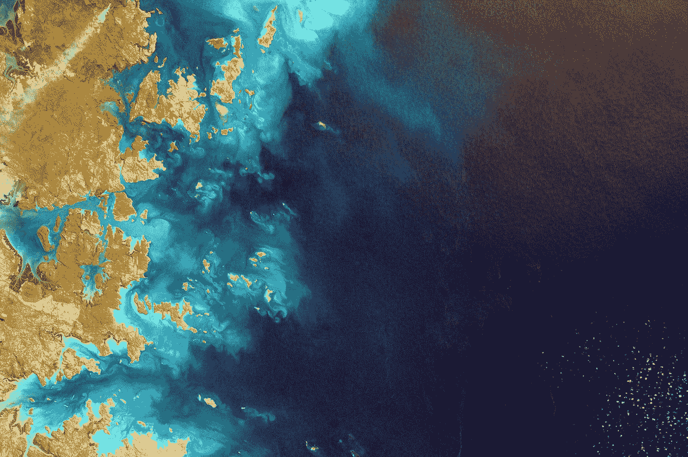
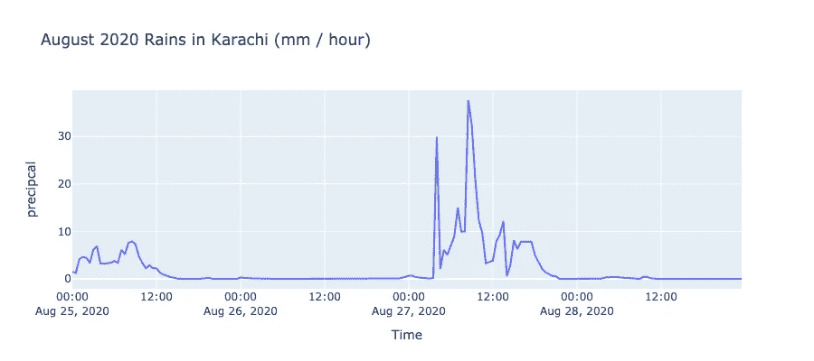

# 通过 OpeNDAP APIs 和 Python 挖掘 NASA 的地球数据

> 原文：<https://towardsdatascience.com/tapping-nasas-earth-data-via-opendap-apis-and-python-towards-earth-data-engineering-e6531095e8a0?source=collection_archive---------31----------------------->

## 走向地球数据工程



美国宇航局在 [Unsplash](https://unsplash.com?utm_source=medium&utm_medium=referral) 拍摄的照片

# 背景

NASA 地球数据对于地球科学家、水文学家以及对使用地球数据(例如，降水、温度等)感兴趣的任何人来说都是非常宝贵的资源。)用于教育、分析、可视化和建模等。这些数据可通过多个平台获得，包括美国宇航局戈达德地球科学(GES)数据和信息服务中心(DISC)，以及美国宇航局地球科学数据系统(ESDS)计划等。然而，这些平台需要用户手动访问网站来下载所需的数据。很多时候，Python 程序员和不习惯地理格式的用户似乎无法访问数据格式(例如 netCFD、hdf 等)。

本文试图通过提供一个通过 [OpeNDAP](https://earthdata.nasa.gov/collaborate/open-data-services-and-software/api/opendap) 访问这些数据的示例，来减少 python 用户访问 NASA 地球数据的障碍。我们将完全使用 python 来实现数据检索过程的自动化。因此，本指南也有利于地球数据工程和利用 NASA 的数据金矿开发数据管道。

# 问题陈述:2020 年卡拉奇洪水

我开发本指南的主要动机源于理解导致 2020 年 8 月下旬卡拉奇毁灭性洪水的[降水事件](https://earthobservatory.nasa.gov/images/147330/extreme-monsoon-rains-in-pakistan)的需要。美国宇航局地球数据包括大量数据集，其中包括基于卫星和历史降水事件的建模观测。本指南将说明如何在 python 中访问其中一个数据集，即 [GPM IMERG 数据集](https://gpm.nasa.gov/data/imerg)，以提取卡拉奇及其所在地(2020 年 8 月下旬)的卫星降水数据。

# 先决条件

通过 python 访问 NASA 地球数据集的关键先决条件是:

1)创建一个 [NASA 地球数据账户](https://urs.earthdata.nasa.gov/users/new)。它是免费和即时的。

2) 2)选择要访问的适当数据集。这里提供了一些探索 NASA 数据集的指南[。如前所述，在本文中，我们将从](/getting-nasa-data-for-your-next-geo-project-9d621243b8f3) [GPM IMERG hourly product](https://gpm.nasa.gov/data/imerg) 中访问和检索数据。

3)安装 [pydap](https://github.com/pydap/pydap) python 库。虽然有其他基于 python 的方法允许通过 OpeNDAP api 连接到 NASA 数据集，但 pydap 使用起来简单方便，应该可以与任何 python 3.6+版本一起工作。然而，我们[建议通过以下命令从 github 提交安装](https://github.com/pydap/pydap/issues/121):

```
pip install git+https://github.com/pydap/pydap.git@fc0dd0e6f180e455dbb68a06a85f84b1eca6754f
```

# 连接到 NASA 数据集

一旦创建了地球数据登录并安装了 pydap 库，我们就可以通过 OpenDAP 建立与 NASA 数据集的连接，给定 opendap url。此处提供了一些可用的 OpenDAP 数据集的档案[。我们有兴趣观察 2020 年 8 月下旬卡拉奇的次日降水模式。因此，](https://disc.gsfc.nasa.gov/information/tools?title=OPeNDAP%20and%20GDS) [GPM 半小时延迟降水](https://disc.gsfc.nasa.gov/datasets/GPM_3IMERGHHL_06/summary?keywords=GPM)是一个合适的数据集。以下代码块使 python 用户能够通过 pydap 连接到数据集(请提供 NASA 地球数据用户名和密码):

# 请求数据

一旦与 GPM 数据集建立了连接(该连接在上面的代码中表示为“dataset”)，我们就可以提取与我们感兴趣的空间区域相关的数据(在本例中为[卡拉奇及其所在地](https://latitudelongitude.org/pk/karachi/))，以及我们感兴趣的时间(在本例中为 2020 年 8 月 25 日至 28 日)。这里需要注意的是，GPM 数据集变量存储在三维数组中，时间作为第一个索引，纬度作为第二个索引，经度作为第三个索引(有关数据格式的详细信息，请参见[这里的](https://gpm1.gesdisc.eosdis.nasa.gov/dods/GPM_3IMERGHHL_06.info))。因此，为了从上述代码中的“数据集”请求一个(变量的)块，我们需要输入以下代码行:

```
requested_data = dataset[var_name][start_time_index: end_time_index, start_lat_index: end_lat_index, start_lon_index: end_lon_index]
```

如上所述，精确的数据请求需要 I)请求的变量的名称，ii)时间索引的范围，以及 iii)空间索引的范围(纬度和经度界限)。虽然理论上可以请求整个数据集，但是 [GPM 数据集](https://gpm1.gesdisc.eosdis.nasa.gov/dods/GPM_3IMERGHHL_06.info)是全局的和海量的(至少万亿字节)。因此，请求整个数据集是不可取的。无论如何，这样的请求会在 NASA 的服务器上超时，不会通过。

# 确定空间范围

这幅图中我们感兴趣的空间区域是卡拉奇及其所在地。因此，我们需要在跨越巴基斯坦卡拉奇的数据请求中提供纬度和经度索引。下面的代码块说明了如何确定这些索引的范围。变量“lat_range”和“long_range”应由用户定义，用于指定所请求数据的空间范围。剩下的代码查找对应于这个范围的 GPM 数据数组索引。

# 确定时间指数

确定对应于 2020 年 8 月下旬(8 月 25-28 日)的 GPM 数据集时间指数，需要了解数据集本身的开始时间。根据 [GPM 数据集](https://gpm1.gesdisc.eosdis.nasa.gov/dods/GPM_3IMERGHHL_06.info)的元数据，该数据的开始时间为 2000 年 6 月 1 日 00:00:00。此外，我们使用的 GPM 数据集是半小时一次的。因此，对应于 2020 年 8 月 25 日 00:00:00 的时间索引可以通过找到 20 00 年 6 月 1 日和 2020 年 8 月 25 日之间的 30 分钟间隔的数量来确定。下面的代码块在 GPM 数据集中找到开始时间索引，对应于 2020 年 8 月 25 日，按照上述逻辑。我们还通过核对与索引值相关联的时间变量来检查逻辑的有效性，以确保它确实是 2020 年 8 月 25 日。

# 获取请求的数据

现在我们已经确定了 GPM 数据的起始时间索引和感兴趣的空间索引，我们可以使用 pydap 请求 GPM 降水。请求 GPM 降水数据的代码如下。请注意，降水变量名为“precipcal ”,我们要求从 2020 年 8 月 25 日开始的 4 天(巴基斯坦卡拉奇)的数据。

# 将检索到的数据转换为数据帧

通过 pydap 从 NASA 接收的数据被保存为一个[“py DAP 模型”](https://www.pydap.org/en/latest/developer.html)对象。这个对象的四个属性是特别感兴趣的，即‘time’，‘lat’，‘lon’和‘precipcal’(请求的变量名)；“time”、“lat”和“lon”是表示请求的数据的时间、纬度和经度维度的 numpy 数组，“precipal”(请求的变量)是一个 3D numpy 数组，具有与时间、纬度和经度维度相对应的半小时 GPM 降水量值。下面的代码片段演示了如何将这些数据转换成 pandas 数据帧。

# 快速查看 2020 年 8 月卡拉奇的降雨

一旦检索到的数据被转换成数据帧，我们就可以通过一个简单的时间序列来快速查看 2020 年 8 月卡拉奇的毁灭性事件。让我们通过[的时间序列图(代码也在下面给出)来想象这些雨是如何在卡拉奇 Cantt 地区展开的。](https://plotly.com/python/)



卡拉奇坎特地区 2020 年 8 月的降雨结果如何(图片由作者提供)

# 最后的想法

本文展示了如何使用 [pydap](https://github.com/pydap/pydap) 库和 [OpeNDAP](https://earthdata.nasa.gov/collaborate/open-data-services-and-software/api/opendap) api 在 python 中访问 NASA 地球数据集。这里提供的代码片段也可以用作从 NASA 的地球数据开发数据管道的基线，还可以从 NASA 的数据仓库中挖掘出宝贵的见解。

我希望本文的内容对地球数据科学家、工程师和任何对探索地球数据感兴趣的人有用。你可以通过 [linkedin](http://www.linkedin.com/in/taimoor-akhtar-12683213) 或 [twitter](https://twitter.com/drkupster) 与我联系，进行任何询问、讨论等。