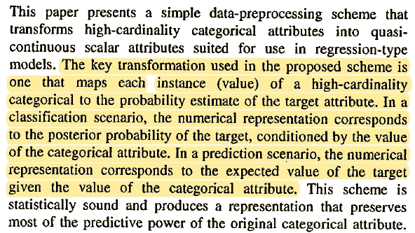
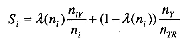
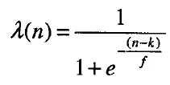
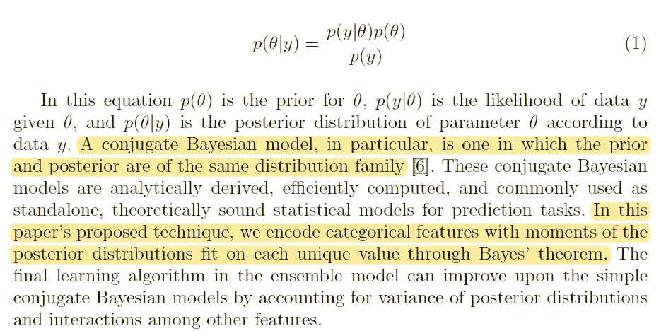
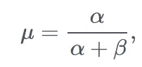
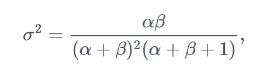
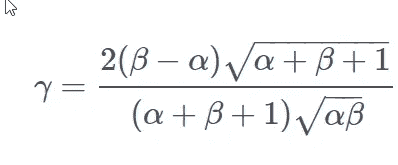
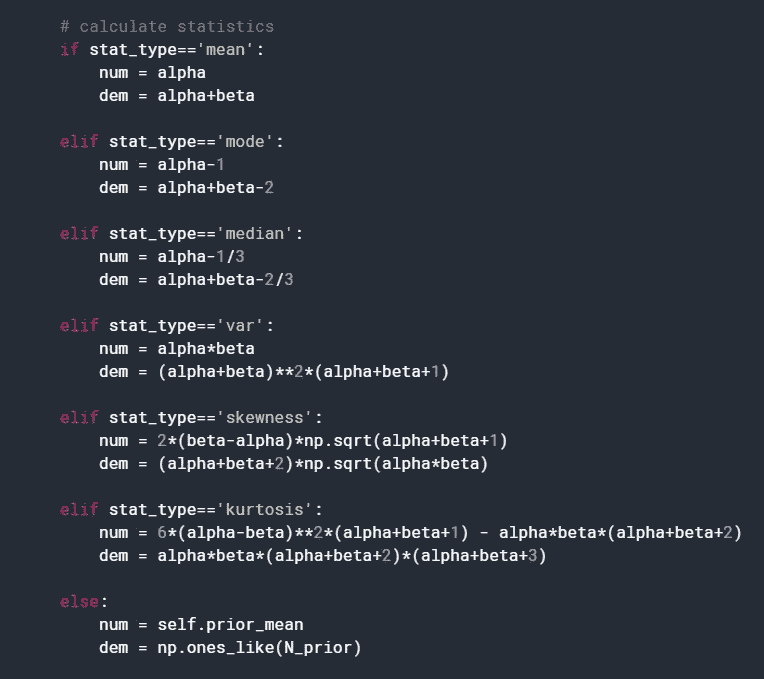
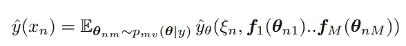
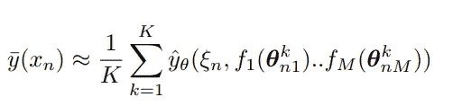

# 目标编码和贝叶斯目标编码

> 原文：<https://towardsdatascience.com/target-encoding-and-bayesian-target-encoding-5c6a6c58ae8c?source=collection_archive---------9----------------------->

## 数据科学竞赛中常用的分类编码技术

安妮·斯普拉特在 [Unsplash](https://unsplash.com?utm_source=medium&utm_medium=referral) 上的照片

分类变量的编码问题是特征工程中非常重要的一步。不幸的是，没有适用于所有情况的解决方案。人们发明了多种技术，我在这里介绍其中的一些、这里的和这里的。

在这篇文章中，我将讨论**目标编码**(又名**平均编码**)及其改进版本**贝叶斯目标编码**，以及其在**采样贝叶斯编码器中的最新改进。**

# 为什么要对类别进行编码？

给定无限量的干净数据，您将不需要对类别进行编码。您可以为每个类别训练一个模型。例如，对于泰坦尼克号问题，你可以为男性和女性训练不同的模型。如果你有几个分类变量，你必须为它们的每一个组合训练一个新的模型。

这种方法有明显的问题:

1.  某些类别组合的数据可能很少。在这种情况下，模型的预测将不具有统计意义。
2.  某些类别组合可能在训练集中找不到，但可能出现在看不见的数据中。

通常，这种方法通常会导致过度拟合，并且不用于高基数分类变量。然而，正如在[1]中所证明的，开发正则化技术并实现这种方法的良好推广是可能的。在那里，这项技术被用于模拟 DNA 序列。

# 基本编码方案

一般来说，分类变量的编码是用一个或多个数字变量替换分类变量的过程，以便得到的数据集可以用于期望数字变量的统计和机器学习算法中。许多编码技术，例如一键编码和顺序编码，都是在 20 世纪早期发展起来的，它们并没有失去它们的重要性。从 scikit-learn 查看一个很棒的[用户指南](https://scikit-learn.org/stable/modules/preprocessing.html#preprocessing-categorical-features)。对于高基数分类变量，这两种技术变得不太有用。序数编码不能从分类变量中提取有用的信息。一键编码为高基数分类变量生成了太多的特征，并且往往产生较差的结果。我们将考虑下面两种对高基数分类变量非常有效的编码。

# 目标(平均)编码

这种类型的编码被称为目标编码或均值编码。查看 Coursera 课程[“如何赢得数据科学竞赛:向顶尖高手学习”](https://www.coursera.org/learn/competitive-data-science)中对此类编码的精彩解释

经典论文[2]给出了这种方法的理论基础。这个想法非常简单:让我们使用目标统计对分类值进行编码。正如论文中所描述的:

实际上，这意味着我们计算每个类别的目标变量的平均值，并用目标平均值对该类别进行编码。这种技术适用于二元分类和回归。对于多类分类，应用类似的技术，其中我们用`m-1`新变量编码分类变量，其中`m`是类的数量。

值得注意的是，尽管作者声称使用目标统计对分类变量进行编码，但实际上只使用了均值。虽然它对于二元分类来说是一个充分的统计量，但对于回归来说却不是，因为它忽略了目标变量的类内变化。贝叶斯目标编码解决了这个问题。

由于目标泄漏，目标(平均)编码有过度拟合的趋势。有各种技术可以解决这个问题。例如，在留一编码器中，从目标统计中减去当前目标值。这减少了目标泄漏。另一种技术是向编码值添加高斯噪声。噪声的强度是模型的超参数。

另一个问题是，一些类别几乎没有训练示例，并且这些类别的目标平均值可能采用极值，因此用平均值编码这些值可能会降低模型性能。为了解决这个问题，该类别的目标平均值经常与目标变量的边际平均值相混合[2]:

对于有许多训练示例的类别，权重λ接近 1，对于稀有类别，权重λ接近 0。例如，它可以被参数化为:

系数λ可用[经验贝叶斯](https://en.wikipedia.org/wiki/Empirical_Bayes_method)模型解释。在这种情况下，我们首先拟合边际分布`p(y)`，即我们基于整个数据集找到后验分布。然后，我们可以将这个后验分布用作模型`p(y|c)`的先验分布，即给定分类变量值的目标变量的分布。

目标(平均值)编码的这些和其他变体在 python 包[类别编码器](https://github.com/scikit-learn-contrib/category_encoders)【3】中实现。目标编码的不同变体似乎从分类变量中提取出略有不同的信息，因此在数据科学竞赛期间，多种技术经常被用于各种叠加方案中。

# 贝叶斯目标编码

贝叶斯目标编码的主要动机是在编码分类变量时，除了使用目标平均值之外，还使用类别内方差。它是在[4，5]中提出的(看似独立)。主要观点是我们应该计算后验分布的均值、方差和高阶矩。

在贝叶斯学习中，分布的参数本身被认为是随机变量。在看到任何数据之前，参数的分布称为先验分布。基于新数据更新该分布以成为后验分布。对看不见的数据的预测可以通过在参数空间上边缘化来得到。为了避免难以处理的积分，贝叶斯从业者经常使用[共轭先验](https://en.wikipedia.org/wiki/Conjugate_prior)。它们的优点在于具有非常简单的更新规则，使得基于训练示例快速计算后验分布成为可能。更多解释请见下文[5]的摘录。

例如，考虑二进制分类问题。那么二元变量就可以用[伯努利分布](https://en.wikipedia.org/wiki/Bernoulli_distribution)来描述，只有一个参数`p`，就是它属于第一类的概率。第二类的概率是`q = 1-p`。在贝叶斯统计中，参数`p`本身是一个随机变量，共轭先验是[贝塔分布](https://en.wikipedia.org/wiki/Beta_distribution):

后验分布参数的更新规则非常简单:

后验分布参数的解释是α-1 成功和β-1 失败。

[4，5]中的想法是计算每个类别的成功和失败次数，然后根据*后验*分布的矩生成特征:平均值:

方差:

偏斜度:

可能还有更高的时刻。

同样的技术也可以用于回归和多类分类模型。在[5]中，这种方法被称为共轭贝叶斯模型(CBM)。对于多类模型，共轭先验是狄利克雷分布，对于回归问题，它是正态-逆伽玛分布。

如果我们只使用后验分布的一阶矩:它的均值，CBM 就简化为目标(均值)编码。通过添加更高的矩，我们可以添加目标变量的类别内分布的细节，这可以提高模型性能，前提是相同的分布对于看不见的数据是真实的。这是这种方法的一个弱点，因为模型可能会在更高的时刻过度拟合，而不会在看不见的数据上推广。在这种情况下，常规目标编码比 CBM 产生更好的结果。

在[5]中，先验分布是通过在整个训练数据集上拟合贝叶斯模型而得到的。这对于解决稀有类别的问题非常重要。实际上，您希望控制目标变量的边际分布对后验分布的影响程度，因此通常必须缩小先验分布，以实现更好的模型性能。

[4]中给出了贝叶斯目标编码的一个很好的实现:

 [## Avito 目标编码

### 使用 Kaggle 笔记本探索和运行机器学习代码|使用 Avito 需求预测挑战赛的数据

www.kaggle.com](https://www.kaggle.com/mmotoki/avito-target-encoding) 

它只涵盖了二元分类的情况。在`fit()`期间，我们计算成功和失败的次数。在`transform()`阶段，我们生成具有条件分布的均值和其他统计属性的特征，如下摘录所示:

一个通用的 CBM 算法可用于不同的 github 编码:

 [## aslakey/CBM_Encoding

### 共轭贝叶斯模型编码代码。该库包含可能提交给 2019 年 ECML 的代码…

github.com](https://github.com/aslakey/CBM_Encoding) 

我希望这种分类编码技术能被合并到分类编码器包[3]或另一个广泛使用的特征工程库中。此外，我希望看到更多的理论讨论，将贝叶斯目标编码技术放在一个更广泛的统计学习的背景下。

# 更新:采样贝叶斯编码器

[最近发表的预印本](https://arxiv.org/abs/2006.01317) [6]建议对贝叶斯目标编码技术进行改进。不使用后验分布的矩作为新特征，而是建议对后验分布进行采样，并将采样值作为新特征。该思想基于这样的观察，即一般的目标编码，特别是贝叶斯目标编码，可以被表示为使用弱学习器来发现新特征的分层模型。弱学习者试图基于有限的数据子集学习目标变量的表示，在我们的例子中，只有一个变量。那么由弱学习者产生的预测可以被用作输入来训练更健壮的模型。这种技术用于集合模型，如随机森林和梯度增强树。从贝叶斯的角度来看，使用弱学习者来训练模型可以表示如下:

让我给你解一下这个等式。在我们的数据集中，我们有 **M** 个分类变量，这意味着我们为分类变量 **m** 的每个唯一值 **v** 训练 **M** 个弱学习器。在给定目标值的情况下，我们学习参数 **θ** 的后验分布 **p_mv** ，而不是取平均值。一般来说， **θ** 是一个矢量。类似于贝叶斯目标编码器，我们可以取几个一阶矩，或者通常将任何函数 **f()** 应用于后验分布的参数。注意，我们还没有得到参数的期望值！我们使用这些函数的输出作为输入(以及不需要编码的数值变量 **ξ** )来训练模型 **y_θ** ，然后只取后验分布的期望值。与贝叶斯目标编码器相比，这是采样贝叶斯编码器的主要贡献，在贝叶斯目标编码器中，在应用函数 **f()之前过早地获取期望。**这有助于减少目标泄漏和避免过度拟合。

为了计算期望值，我们可以从后验分布中生成一个样本。因为我们使用共轭先验，这很容易。一旦我们生成了一个样本，我们就可以像这样在上面的等式中估计期望值:

K 是样本大小，或者我们从后验分布生成的参数集的数量。这种方法类似于统计学中的[多重插补](https://en.wikipedia.org/wiki/Imputation_(statistics)#Multiple_imputation)方法。它对计算的要求也更高，尤其是对于更大的 **K** 。这篇论文的代码以及所有实验与其他方法的比较可以在 github 报告中找到。

# 结论

贝叶斯目标编码技术是对标准目标编码的改进，因为它试图从目标变量的类内分布中提取信息，而目标编码忽略了这一点。该方法在 Kaggle 竞赛中证明非常有用，并在 WeWork 上建立了一个模型，该模型处理具有高基数分类变量的数据[5]。采样贝叶斯编码器[6]提供了贝叶斯目标编码的新视角，并为分类特征编码领域的研究和工程提供了更多机会。

# 参考

[1]邓森，大卫&兴，传化。(2012).多元分类数据的非参数 Bayes 建模。美国统计协会杂志。104.1042–1051.2009.tm08439。

[2]丹尼尔·米西-巴雷卡。(2001).分类和预测问题中高基数分类属性的预处理方案..SIGKDD 探索。3.27–32.10.1145/507533.507538.

[3]麦金尼斯，威廉&肖，查普曼& S，安德烈&黄，韩宇。(2018).分类编码器:一个 scikit-learn-contrib 转换器包，用于对分类数据进行编码。开源软件杂志。3.501.10.21105/乔斯 00501

[4]马特·基托，贝塔目标编码，[https://mattmotoki.github.io/beta-target-encoding.html](https://mattmotoki.github.io/beta-target-encoding.html)

[5]斯莱基，奥斯汀&萨拉斯，丹尼尔&斯坎罗特，约尼。(2019).用共轭贝叶斯模型为 WeWork 线索评分引擎编码分类变量。

[6]迈克尔拉里奥诺夫(2020)。贝叶斯目标编码中的采样技术。 [arXiv:2006.01317](https://arxiv.org/abs/2006.01317)