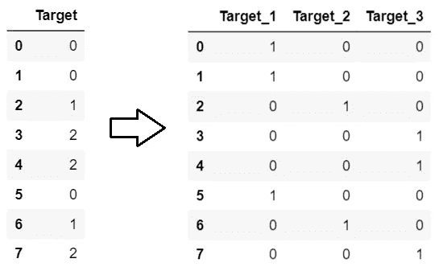

# 多类分类的目标编码

> 原文：<https://towardsdatascience.com/target-encoding-for-multi-class-classification-c9a7bcb1a53?source=collection_archive---------12----------------------->

## category_encoders 的 TargetEncoder 有什么问题？


在 [Unsplash](https://unsplash.com?utm_source=medium&utm_medium=referral) 上由 [Toa Heftiba](https://unsplash.com/@heftiba?utm_source=medium&utm_medium=referral) 拍摄的照片

这篇文章是我的上一篇文章[的延续，我的上一篇文章解释了目标编码实际上是如何工作的](/all-about-target-encoding-d356c4e9e82)。文章通过理论和实例说明了二分类任务的编码方法，以及 [*类别编码器*](http://contrib.scikit-learn.org/category_encoders/index.html) 库如何对多类目标给出不正确的结果。本文展示了当 *category_encoders 的 *TargetEncoder* 失败时，*给出了编码多类目标*、*背后的理论，并提供了正确的代码，以及一个示例。

## TargetEncoder 什么时候失败？

看看这个数据。颜色是一个特征，目标是好的...目标。我们的目标是基于目标对颜色进行编码。


让我们在这上面做通常的目标编码。

```
import category_encoders as cece.TargetEncoder(smoothing=0).fit_transform(df.Color,df.Target)
```


嗯，这看起来不太对，是吗？所有颜色都被替换为 1。为什么？因为 TargetEncoder 采用每种颜色的所有目标值的平均值，而不是概率。

虽然 TargetEncoder 适用于二进制目标为 0 和 1 的情况，但它不适用于以下两种情况:

1.  当目标是二进制，而不是 0/1 时。比如 1 和 2s。
2.  当目标是多类时，如上例所示。

所以，怎么办！？

## 该理论

下面是 Daniele Micci-Barreca 的[原始论文](https://dl.acm.org/doi/10.1145/507533.507538)中介绍的针对多类目标的均值目标编码。

假设标签中有 n 个类。

理论上说，第一步是一次性编码你的标签。这给出了 n 个二进制列，每个列对应于目标的一个类。然而，只有 n-1 个二进制列是线性无关的。因此，这些列中的任何一列都可以删除。现在，使用每个二进制标签对每个分类特征使用通常的目标编码，一次一个。因此，对于一个分类特征，您得到 n-1 个目标编码特征。如果数据集中有 k 个分类要素，则总共会得到 k 倍(n-1)个要素。

我们用一个例子来理解。

## 一个例子

我们继续前面的数据。

第一步:一键编码标签。

```
enc=ce.OneHotEncoder().fit(df.Target.astype(str))
y_onehot=enc.transform(df.Target.astype(str))
y_onehot
```



请注意，Target_1 列表示目标中是否存在 0。如果目标中有 0，则为 1，否则为 0。类似地，Target_2 列表示目标中是否存在 1。

**步骤 2:** 使用每个独热编码目标对颜色进行编码。

```
class_names=y_onehot.columnsfor class_ in class_names: enc=ce.TargetEncoder(smoothing=0)
  print(enc.fit_transform(X,y_onehot[class_]))
```


对于 0 类


对于 1 类


对于二班

**第三步:**如果除了颜色还有更多分类特征，对所有特征重复第一步和第二步。

完成了！

因此，数据集转换为:


注意，为了清楚起见，我对所有三个 Color_Target 列进行了编码。如果您知道 one-hot 编码，那么您知道可以删除其中一列而不会丢失任何信息。因此，这里我们可以安全地删除 Color_Target_3 列，而不会丢失任何信息。

## 完整的代码

你是来拿密码的，对吧！？

我在这里给出了一个函数，它将 pandas 数据帧的特征和 pandas 系列的目标标签作为输入。特征 df 可以具有数字和分类特征的混合。

```
def target_encode_multiclass(X,y): #X,y are pandas df and series y=y.astype(str)   #convert to string to onehot encode
    enc=ce.OneHotEncoder().fit(y)
    y_onehot=enc.transform(y) class_names=y_onehot.columns  #names of onehot encoded columns X_obj=X.select_dtypes('object') #separate categorical columns
    X=X.select_dtypes(exclude='object')    for class_ in class_names:

        enc=ce.TargetEncoder()
        enc.fit(X_obj,y_onehot[class_]) #convert all categorical 
        temp=enc.transform(X_obj)       #columns for class_
        temp.columns=[str(x)+'_'+str(class_) for x in temp.columns]
        X=pd.concat([X,temp],axis=1)    #add to original dataset

    return X
```

## 结论

在这篇文章中，我指出了 category_encoder 的 TargetEncoder 的问题。我解释了关于目标编码的原始论文对多类标签的看法。我通过一个例子解释了这一点，并为您提供了一个可在应用程序中即插即用的工作模块代码。

在 [LinkedIn](https://www.linkedin.com/in/mohannishant/) 上和我联系！

在 [GitHub](https://github.com/mohannishant6) 上看看我的一些很酷的项目！