# 目标颜色重新分配(TCR)

> 原文：<https://towardsdatascience.com/targeted-color-reassignment-tcr-3adce8b9ab0f?source=collection_archive---------34----------------------->

## **使用 K 均值聚类通过阴影空间映射进行个性化颜色识别和目标颜色重新分配(TCR)**

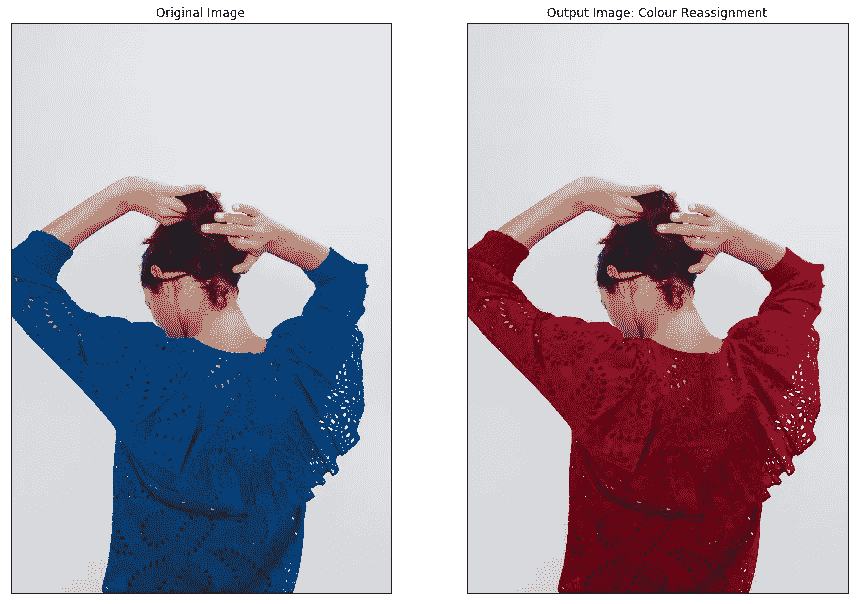

W hat 最初是一篇解释 K-Means 和理解如何使用“肘图”来选择 K-Means 中的聚类数的文章，后来转变为一个很好的例子，说明如何在图像处理领域使用数据科学中相当简单的概念 Kmeans 来解决图像中对象的相对复杂的目标颜色重新分配(TCR)问题。

我将广泛使用以下术语来解释 TCR 的过程。

**单目标图像(SOI):** 图像只包含一个目标。

**多对象图像(MOI):** 其中图像包含多个对象。

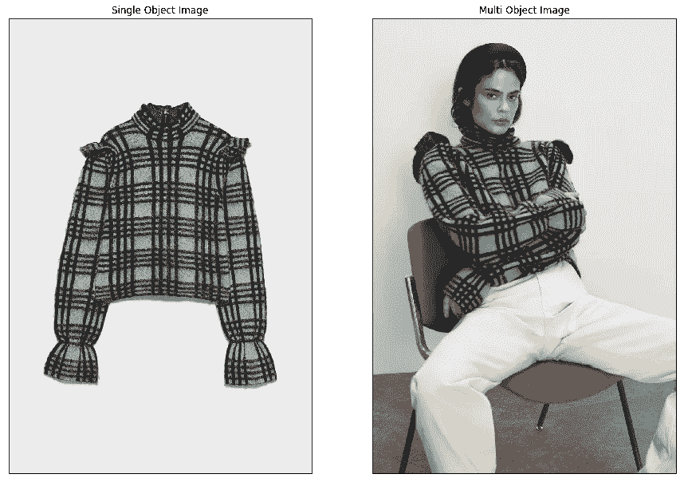

图 a:理解单个图像对象(左)和多对象图像(右)

我们正在努力实现的一个例子如下所示(图 b)。我们将拍摄 SOI 和 MOI 类别的输入图像，并尝试改变图像中出现的对象的颜色。例如，让我们看看图 b，我们把一件拉夫·劳伦的翻领套头衫的颜色从原来的**棕色**色改为我们选择的任何颜色，在这个例子中是**蓝色。**

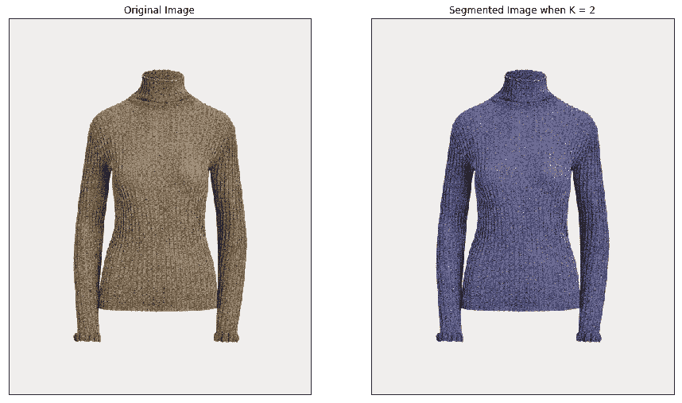

图 b:文章的目标。棕色输入跳线(左)和蓝色输出跳线

这个项目有两个主要目标**,第一是在单个对象图像(SOI)中重新分配一个对象的颜色，第二是在不改变其他对象的情况下，在多对象图像(MOI)中的目标对象中实现相同的颜色重新分配。回到毛衣的例子，我们的目标是改变毛衣的颜色，当只有毛衣出现在图像中时(SOI)以及当它被人装饰时(MOI)。**

**我们首先从加载图像开始，我们加载以下三个图像，一个蓝色衬衫的单对象图像和两个多对象图像，其中蓝色衬衫由一个人穿着。**

**阅读图像**

**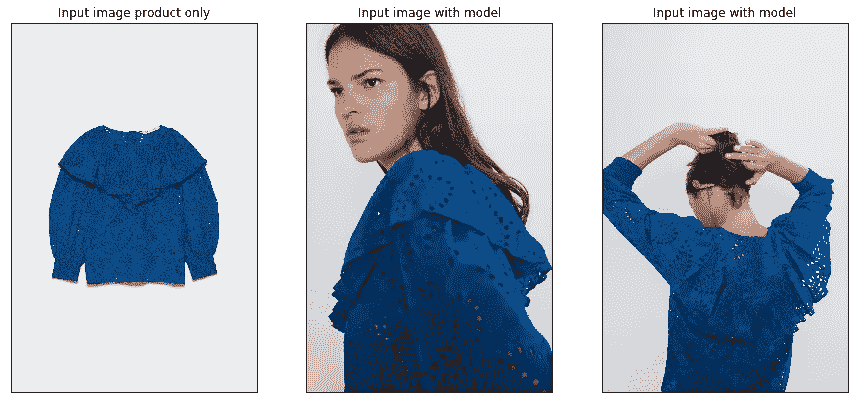**

**图 c:蓝色衬衫的 SOI(最左边)和模特穿的蓝色衬衫的 MOI(中间和最右边)**

# **单目标图像(SOI)中的目标颜色重新分配|聚类|调色板**

**在项目的这一部分，我们将只研究 soi 图 c(最左边)。我们将首先把输入图像从 **RGB 空间转换到 HSV 空间**，使我们更容易处理图像中的颜色。我将很快发布一篇博客，解释为什么在 HSV 空间工作对我们来说使用颜色更容易，敬请关注。我们现在需要查看输入图像中的颜色，让我们了解 SOI 中物体的颜色和背景的颜色，也就是我们需要查看图像的**调色板。**为了得到调色板，我们**使用 OpenCV 包中的 [Kmeans](https://docs.opencv.org/3.0-beta/doc/py_tutorials/py_ml/py_kmeans/py_kmeans_opencv/py_kmeans_opencv.html) 算法对图像中的所有像素进行聚类**。这将图像中具有相似颜色的所有像素分组到 K 个簇中，从而识别图像中 K 个最显著的颜色。**

**对于我们拍摄的输入图像，我们可以将 K 设置为 2，并将图像中的所有像素分组为两个集群，这两个集群代表两种最突出的颜色，在我们的情况下，它将是背景的颜色(白色)和对象的颜色(蓝色阴影)，如下所示(图 d)。**

****

**图 d 物体输入单个物体图像的调色板**

**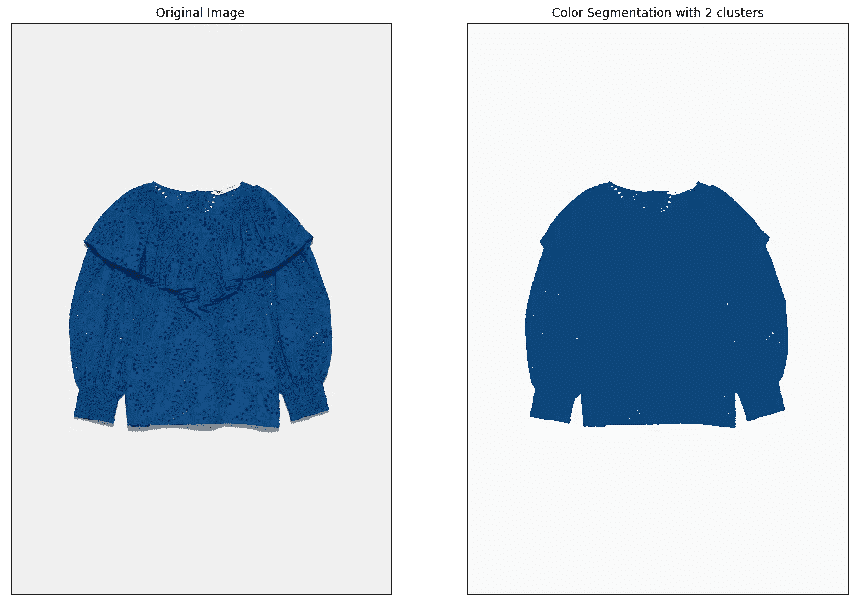**

**图 e K 均值的输入(左)。K 均值、TCR 滤波器的输出(右)**

```
The 2 cluters are 
Cluster A: [104, 227, 122]
Cluster B: [0, 0, 250]HSV           ------- >  BGR
[104 227 122] ------- > [122  71  13]
[  0   0 250] ------- > [250 250 250]Target Object pixel centroid: [104 227 122]
Background pixel centroid: [  0   0 250]
```

**一旦我们对图像进行了聚类并获得了如上所述的聚类细节，我们可以看到质心为[104，227，122]的聚类 A 映射到目标对象像素，蓝色阴影，质心为[0，0，250]的聚类 B 映射到背景像素，白色阴影。我们现在构建一个 **TCR 过滤器**，它将帮助我们对图像中的选择性像素应用函数或操作。在输入图像的像素上外推的 K 均值算法的输出产生 TCR 滤波器(图 e 右侧)。TRC 过滤器现在使我们能够独立地改变一个簇中的所有像素。**

****重新分配**，假设我们已经成功分割了图像中的对象(集群 A ),我们现在可以使用 TCR 滤镜将这些像素重新分配给我们选择的任何颜色。TCR 过滤器使我们能够改变聚类 A 的像素，保持聚类 B 的像素不变，我们现在可以将 delta 值添加到聚类 A 的像素的色调，对象像素将其颜色从蓝色阴影变为红色阴影，同时保持背景不变。在这里，我把原来的蓝色衬衫变成了红色衬衫，如下图所示。**

**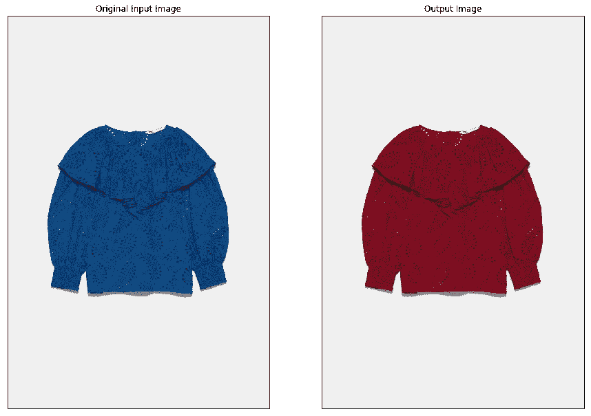**

**图 f:原始输入图像，蓝色衬衫(左)。TCR 输出，颜色重新分配的图像，红色衬衫(右)**

**单目标图像中的目标颜色重分配**

# **多目标图像中的目标颜色重分配**

**既然我们已经在单物体图像(SOI)中实现了 TCR，我们现在将继续改变多物体图像(MOI)中物体的颜色。我们读取第二个输入图像，即 MOI(图 g 最左边)，并将其转换到类似于 SOI 图像的 HSV 空间。**

**由于新输入图像(MOI)中的对象像素将位于来自 SOI 的对象群集的质心附近，因此我们使用在 SOI 中检测到的同一对象的群集来帮助识别目标对象像素，并为新输入 MOI 构建**新 TCR 滤波器**。例如，当我们绘制新输入 MOI(图 g 最左边)的 HSV 值时，蓝色衬衫的色调为红色，饱和度为黄色，值为黑色，如图 g(最右边)所示，我们清楚地观察到色调值**峰值在大约 10 和 100** 处。图中 H=100 附近的尖峰靠近 SOI 聚类的聚类 A [104，227，122]的质心色调，并代表 MOI **中的对象。**我们可以从下面的 HSV 图(图 g 中间)中看到，X 轴上绘制的是色调，Y 轴上绘制的是饱和度，接近 100 的色调映射到蓝色阴影，这是我们输入的衬衫的颜色。**

**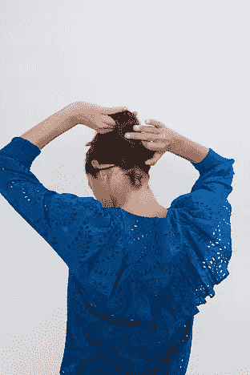****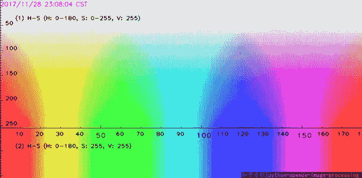****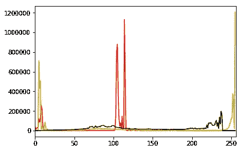**

**图 g 多物体输入图像(最左边)。HSV 标度(中间)。HSV 图[H:红色，S:黄色，V:黑色](最右边)**

**MOI 中目标对象的新 TCR 过滤器是通过选择色调在从对象的 SOI 导出的群集质心的**绑定距离**内的像素来构建的。新的 TCR 过滤器允许我们更改或编辑属于目标对象的像素，而不会影响其他对象的像素。我们现在可以移动色调比例(图 g 中)来改变目标对象的颜色。对于蓝衬衫的输入多对象图像(图 H 中)，我们选择的色调值与从蓝衬衫的 SOI 的 TCR 导出的**簇 A 的质心(H=104)的色调处于绑定距离内。这将选择目标对象像素，在本例中为图像中的蓝色衬衫，并为 MOI 生成**新的唯一 TCR 过滤器**(图 h 最左边)。我们现在可以使用新的 TCR 滤镜给这些像素添加一个 delta 值来改变它们的色调。给色调增加 70 的增量会导致衬衫的颜色从**蓝色变为**红色。图 1 表示输入蓝色衬衫的颜色重新分配，不同的δ值导致不同的颜色偏移。****

**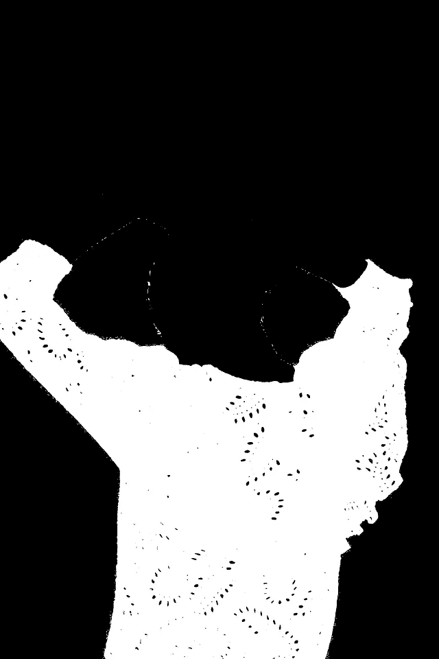******

**图 MOI 的 TCR 滤波器(最左边)。原始输入图像蓝色衬衫(中间)TCR 输出，颜色重新分配的输出图像，红色衬衫(最右边)**

**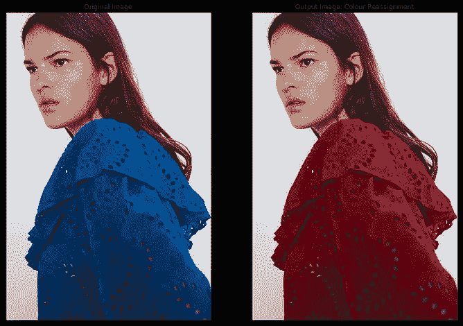****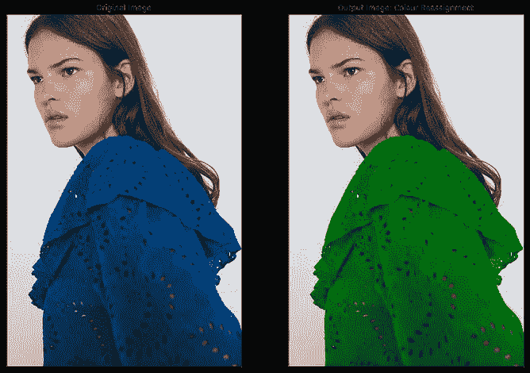****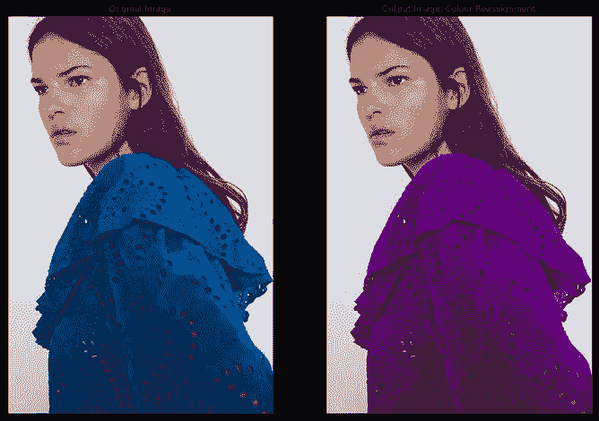**

**图一:不同 delta 值的输出**

**多目标图像中的颜色重新分配**

# **输出**

**以下是我对其他不同风格和质地的服装进行的一些探索性试验。**

**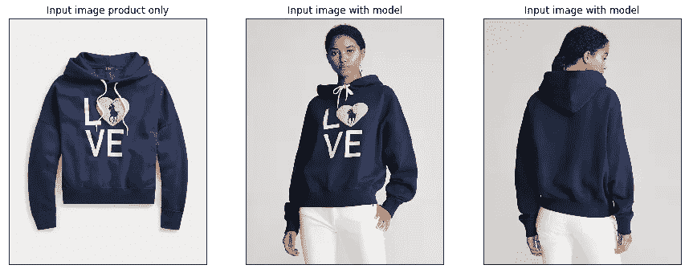****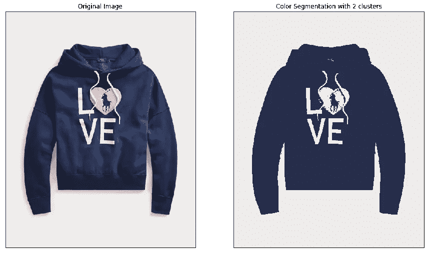****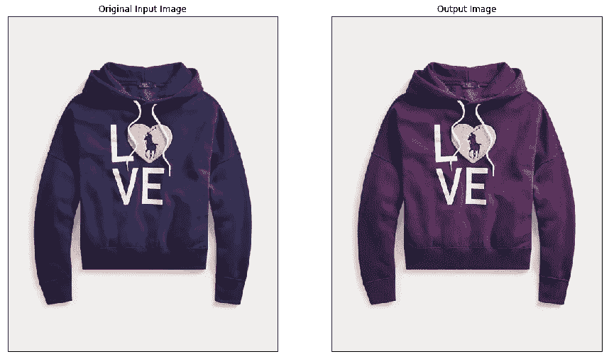****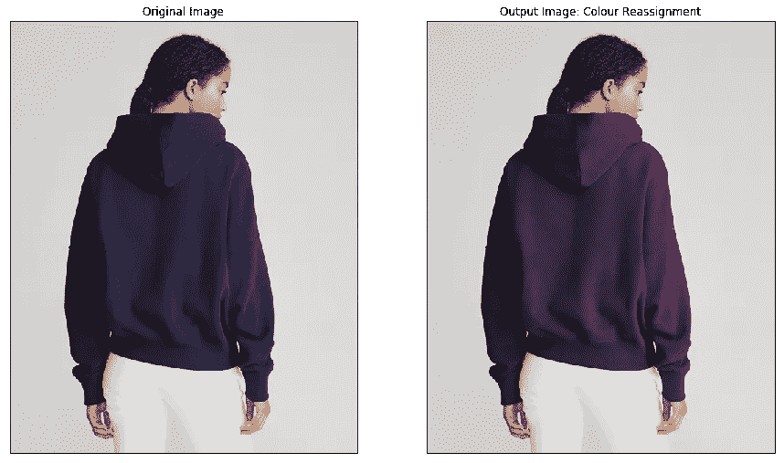****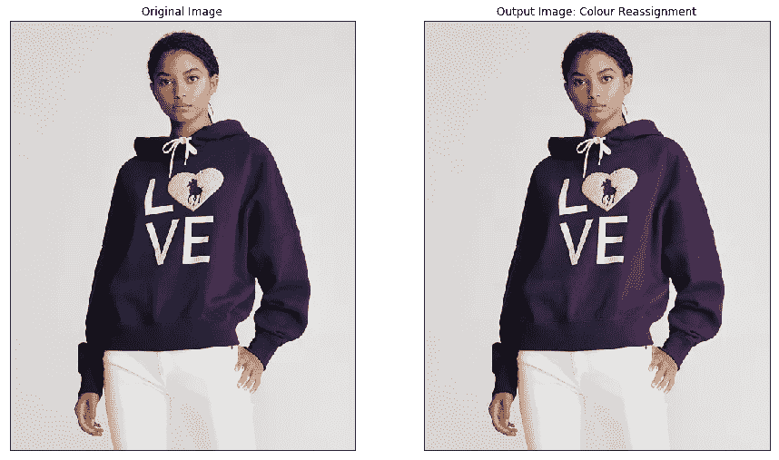****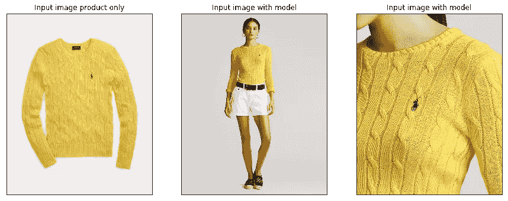****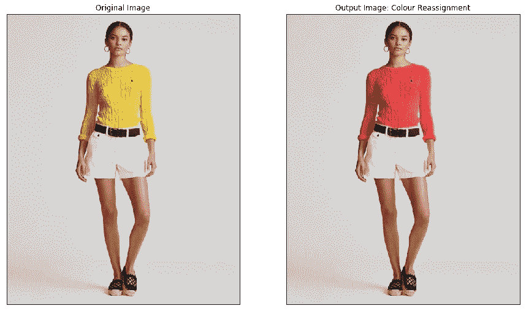****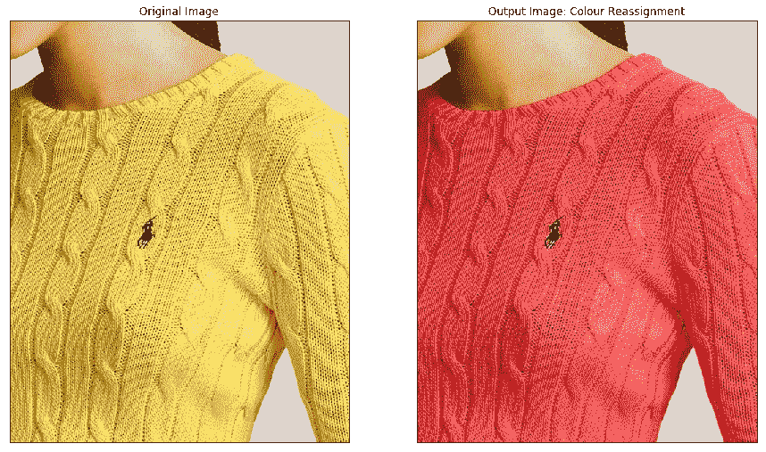****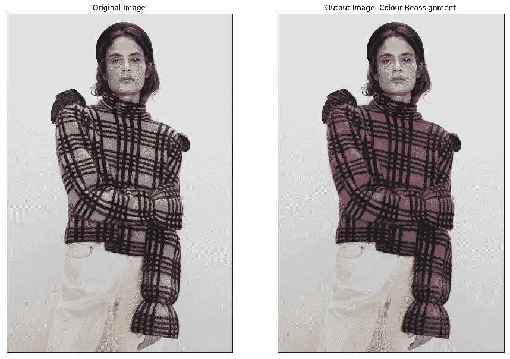****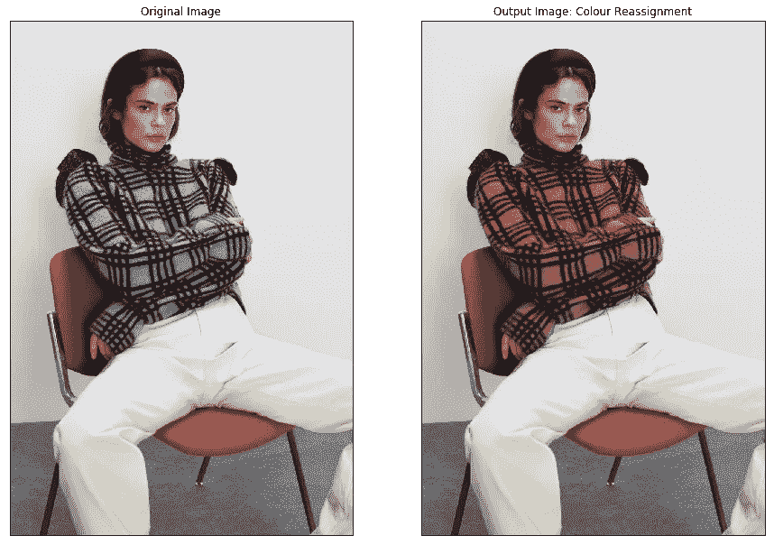**

**图 j:探索性产出**

# **用例**

**这个可以用在哪里？首先，任何服装公司都希望以一种**自动化的方式在他们的产品上探索更多的**颜色选择**。任何想省钱省时的企业(可能是初创企业)都可以雇佣模特来尝试他们为同一件物品提供的所有颜色选项。试衣间外的**智能镜子**的概念，顾客到试衣间后，喜欢上一件衣服就去试穿，然后站在智能镜子前，用户可以**即时改变衣服的颜色**并尝试实体店或网上商店可能没有的多种选择。****

****为什么是服装？由于我是一名时尚相关零售行业的客户分析师，所以我从服装产品和其他时尚相关产品开始了这个项目。话虽如此，但这种算法可以用于任何其他项目或任何其他行业。例如汽车工业，我们可以同样容易地改变汽车的颜色，如下所示。****

********

**图 1:我会让你试着分辨出哪一个是原版，哪一个是数字再分配的输出**

# ****挑战****

**当在 HSV 空间中存在多个在色调标度中彼此非常**接近的对象时，该算法努力识别 moi 中的可区分段。例如，当一个人穿的衣服颜色非常接近他的肤色。由于我们执行的是基于颜色的分割，因此当背景的色调值接近目标对象的色调值时，该算法也会遇到困难。****

# **未来作品**

**这项工作还有很多工作要做，自动选择绑定值的范围，以便在 MOI 中选择对象。使用**机器学习**算法将 TCR 应用于借助**对象检测**算法检测到的特定对象。可以探索替代方法，如**特征映射**将对象从 SOI 映射到 MOI，伴随有**凝聚聚类**来构建用于 MOI 的 TCR 过滤器。**

# ****参考文献****

**OpenCV 中的颜色空间:[https://www . learnopencv . com/color-Spaces-in-OpenCV-CPP-python/](https://www.learnopencv.com/color-spaces-in-opencv-cpp-python/)**