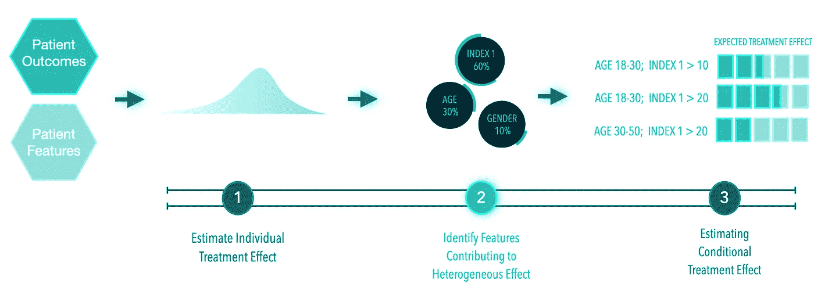
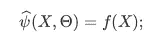
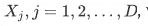
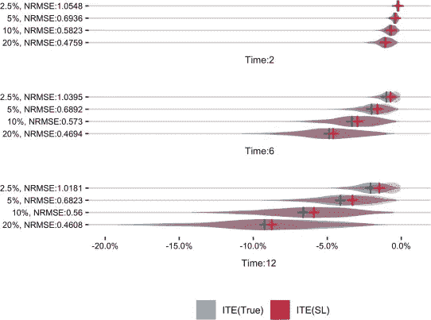
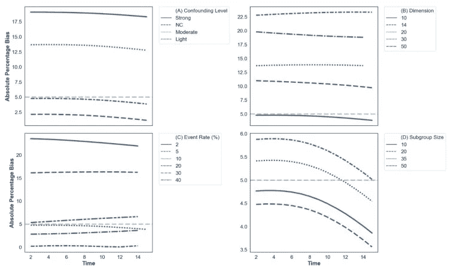

# 观察生存分析中异质治疗效果的目标估计

> 原文：<https://towardsdatascience.com/targeted-estimation-of-heterogeneous-treatment-effect-in-observational-survival-analysis-e61c701c1316?source=collection_archive---------67----------------------->

## 使用电子健康记录进行观察性因果推断

## 临床医生的因果推理

在医学研究中，我们希望使用经验证据来估计治疗的效果:如药物或程序。评价治疗效果的黄金标准是随机对照试验(RCT ),因为它的随机性最大限度地减少了偏倚，最大限度地提高了我们识别因果关系的能力。然而，很明显，不可能依靠随机对照试验获得医学干预有效性所需的所有信息，因为它们并不代表真实世界的人群或环境，而且往往时间太短，无法检测长期效果。此外，RCT 旨在估计干预的平均效果，因此可能无法为临床实践中遇到的个别患者的决策提供信息。

最近，我提出了一个 [**框架**](https://doi.org/10.1016/j.jbi.2020.103474) ，使用来自电子健康记录(EHR)的右删失观察数据，使用数据估计二元治疗方案(治疗与对照)对事件发生时间(存活)结果的异质性治疗效果(HTE)。这些估计说明了随访的损失，并允许测量干预的长期效果。

【https://github.com/EliotZhu/Targeted-Survival】代码可在:

## ****三步模块化设计****

****

****描述异质效应评估框架的图表。**朱杰在[生物医学信息学杂志上的图](https://dx.doi.org/10.1016/j.jbi.2020.103474)**

*****第一步。估计个体治疗效果。*****

**通过拟合治疗样本和对照样本的结果模型来评估个体治疗效果；然后，我们使用这些模型计算潜在的结果。这种双模型方法对治疗和对照结果的不同相关解释变量进行了编码，并已被证明可以提高潜在结果估计的准确性。**

**我们首先将原始的生存数据转换成一个计数过程:一段时间内的二元结果序列。然后，我们使用超级学习器来估计每个时间 *t* 的每个观察值 *i* 的条件风险率:其中是 *i* 的观察事件时间。然后通过*概率链规则 t* 推导出潜在的生存概率，从而得到 *i* 在时间 *t* 的初始治疗效果估计。**

*****第二步。识别导致治疗效果不均匀的特征。*****

**给定估计的 ITE，我们试图确定哪些特征有助于治疗效果的异质性。我们使用机器学习算法对 ITE 进行建模，并将重要特征定义为对减少模型预测误差贡献最大的特征。这里采用的回归方法有:贝叶斯加性回归树(BART)、自适应套索(AL)、弹性网(EN)和因果森林(CF)。先前的研究发现，与标准套索相比，AL 和 EN 给出了一致的协变量选择。或者，我们可以选择在相似倾向得分的阶层中模拟 ITE。然而，由于最近的工作表明倾向评分匹配(PSM)可能会导致观察性研究中协变量不平衡的增加，所以没有选择这种方法。**

**特征识别程序如下:**

1.  **在随访期结束时，使用模型 f()回归协变量的估计 ite:**

****

**2.计算每个特征的可变重要性(VI)分数 S，**

****

**其中 *D* 是特征的数量。如果我们选择使用 CF，VI 分数对应于拆分的比例。在 BART 中，它对应于分裂比例的后验均值。在 AL 和 EN 中，它是正则化权重；**

**4.根据它们的总体重要性分数以降序排列特征，并将等级 R 分配给每个 X；**

**5.使用有序对(S，R)构建重要性分数曲线；**

**6.使用 *Kneedle 算法*识别*拐点[* [1](https://www-sciencedirect-com.simsrad.net.ocs.mq.edu.au/science/article/pii/S1532046420301039?via=ihub#fn1) ]，将总体重要性分数高于*拐点*的特征标注为对异质效果有显著贡献。**

*****第三步。CATE 的目标估计。*****

**基于核的局部平均用于计算与由先前选择的特征定义的参考类相关联的 CATE。假设 x 是一个选定的特征，我们可以根据 x 的值将人群分为 *Q* 个阶层，然后对于每个阶层 *q* ，我们使用一步 TMLE 调整计算其边际条件平均治疗效果(MCATE)。**

## ****实现细节请参考** [**这里**](https://doi.org/10.1016/j.jbi.2020.103474) **。****

**第一张图描述了在不同事件发生率下使用模拟的真实和估计的个体治疗效果:**

****

**真实 ITE 的分布(蓝绿色小提琴图)和超级学习者的估计效果(红色小提琴图)。纵轴显示事件发生率和估计的 NRMSE。横轴表示 ITE 的值。蓝绿色和红色十字标记表示真实的和估计的平均治疗效果。我们在样本大小(N=3000)、低混杂水平和特征维度(D=10)的默认设置下，从 50 个模拟中的一个模拟中描绘了时间 2、6 和 12 的 ite。缩写:ITE:个体治疗效果，NRMSE:标准化均方根误差。朱杰在[生物医学信息学杂志](https://dx.doi.org/10.1016/j.jbi.2020.103474)上的图**

**第二张图描述了 CATE 估计值的偏差:**

****

**默认设置下 CATE 估计的绝对百分比偏差。对于每种情况，通过对 50 次重复的绝对百分比偏差进行平均来进行计算。朱杰在[生物医学信息学杂志](https://dx.doi.org/10.1016/j.jbi.2020.103474)上的图**

**我们提出的框架的一个优点是，它根据治疗和对照条件下的存活概率的差异来报告效应的异质性。与相对指标(如风险比)相比，这种绝对指标为临床决策提供了更多信息。第二，我们为潜在结果建模、重要协变量识别和选择偏差调整提供了选择用户指定方法的灵活性。第三，我们自动化异质性发现过程，以避免特别选择子群。第四，对确定的亚组进行选择偏倚调整，以反映所选亚组内的治疗和筛选机制。**